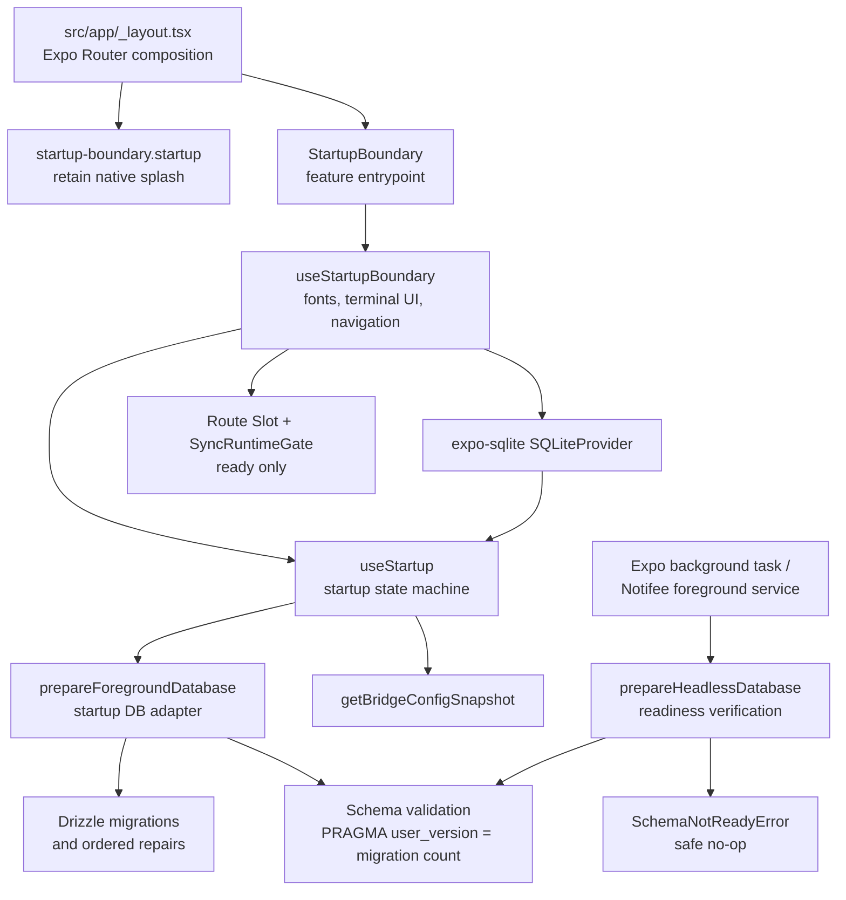
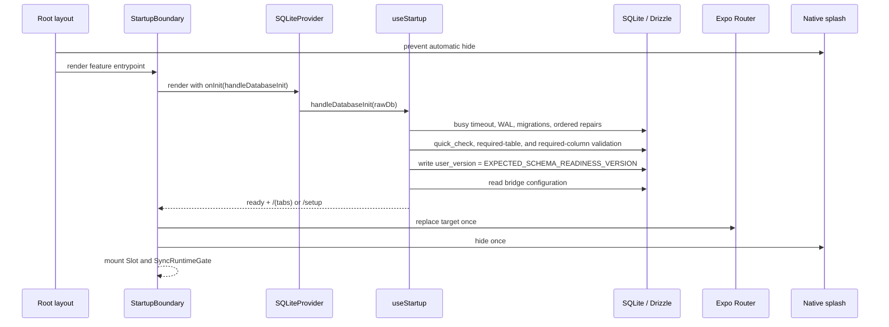
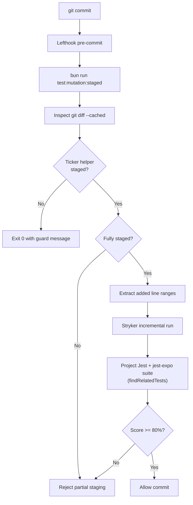
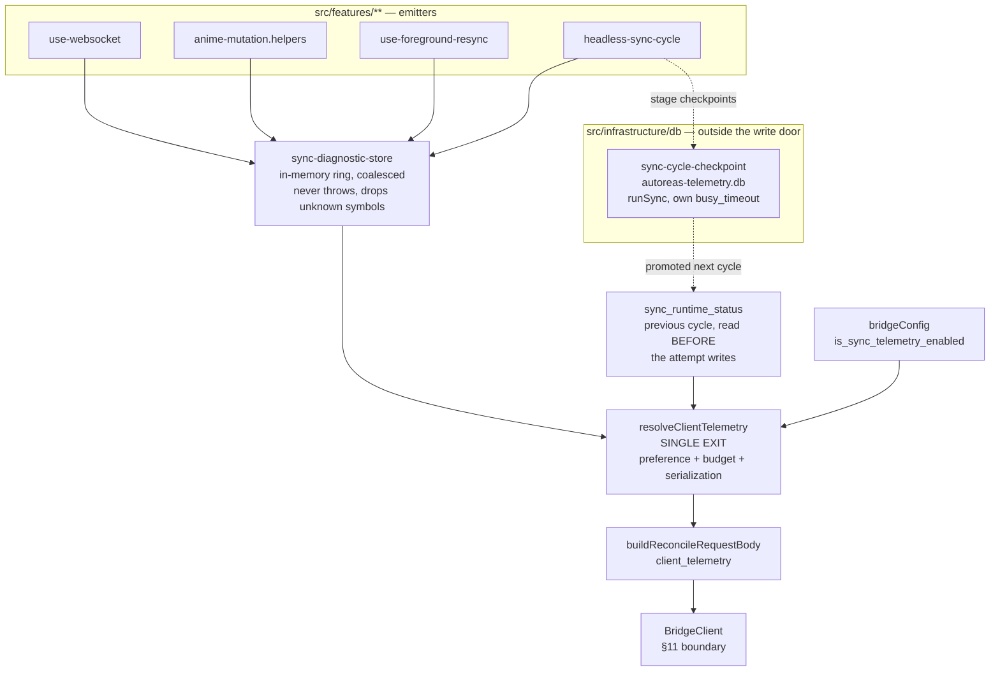

# Architecture & Development Manifesto

## 1. Core Philosophy (CONCEPTS > CODE)

This project follows a strict **Feature-Sliced Design** combined with **Screaming Architecture**. 
* **The UI is an implementation detail:** Business logic lives in hooks and pure functions, ignorant of React Native or Expo.
* **The Database is an implementation detail:** Repositories handle Drizzle/SQLite. Features consume repositories.
* **HeroUI Native is Mandatory:** We build UIs combining HeroUI Native primitives (`Button`, `Card`, `Text`, etc.) with Tailwind classes (`cn()`). `StyleSheet.create()` and bare React Native primitives are strictly prohibited unless absolutely necessary for custom native behavior.

## 2. Directory Structure

```text
src/
├── app/               # 1. DELIVERY (Expo Router)
│   ├── (tabs)/        # Routing and Layouts ONLY.
│   └── _layout.tsx    # ZERO business logic. Consumes Feature entrypoints only.
│
├── components/        # 2. SHARED UI (Design System)
│   ├── ui/            # Base wrappers (ThemeToggle, AppText). Dumb components.
│   └── anime/         # Pure presentational components. Receive props, emit events.
│
├── features/          # 3. THE HEART (Domain-Driven)
│   ├── animes/        # Everything related to Anime.
│   ├── sync/          # Sync logic.
│   └── ws/            # WebSocket logic.
│
├── infrastructure/    # 4. ADAPTERS (The dirty world)
│   ├── db/            # Drizzle client, schemas, migrations, and Repositories.
│   ├── validation/    # Global Zod schemas.
│   └── api/           # BridgeClient adapter — the ONLY owner of bridge HTTP/WS transport.
│
└── helpers/           # 5. UTILITIES
    └── hooks/         # Generic shared hooks.
```

## 3. Strict Colocation (The Component Ecosystem)

Complex features and UI components must follow strict colocation. A component is a self-contained module.

```text
src/features/animes/ui/AnimeForm/
├── index.ts                 # THE CONTRACT: Exports ONLY what the outside world needs.
├── AnimeForm.tsx            # DUMB UI: HeroUI Native + Tailwind only. NO business logic.
├── use-anime-form.ts        # THE BRAIN: Custom hook managing state, queries, formatting.
├── anime-form.types.ts      # Props and internal types.
├── anime-form.schema.ts     # Zod Schemas for local validation.
├── anime-form.constants.ts  # Magic numbers, defaults.
├── anime-form.helpers.ts    # Pure functions for data processing (100% testable).
└── __tests__/               # Tests isolated to this module.
    ├── AnimeForm.test.tsx   
    └── use-anime-form.test.ts 
```

## 4. Delivery Layer Rule (`src/app/**`)

Files under `src/app/**` are **routing/composition only**.

They MUST NOT:
- import custom hooks from `features/` or `helpers/hooks/`
- import infrastructure directly
- use React state/effect hooks (`useState`, `useReducer`, `useEffect`, `useMemo`, `useCallback`, `useRef`)
- contain business logic, derived state, or data orchestration

If a route needs behavior, create a feature entrypoint component and render that from `app/`.

## 5. The 10-Step Hook Anatomy

Every custom hook (`use-*.ts`) MUST follow this strict top-to-bottom order to guarantee readability and prevent spaghetti code:

1. **Imports:** External (React, HeroUI, Zod), then Internal, then Local.
2. **Signature:** `export const useMyHook = (props: MyHookProps) => {`
3. **1º Refs:** `useRef`
4. **2º State:** `useState` or `useReducer`
5. **3º Third-Party/Context Hooks:** `useThemeColor()`, `useForm()`, navigation.
6. **4º Mutations/Queries:** Repository calls, DB queries.
7. **5º Derived State:** `useMemo`
8. **6º Callbacks:** `useCallback` (Event handlers using pure helpers)
9. **7º Effects:** `useEffect` (The necessary evil, keep to a minimum)
10. **Return:** Plain object or tuple.

## 6. Strict Colocation Enforcement Details

Feature `.tsx` and `use-*.ts` files are intentionally constrained.

They MUST NOT contain at the root level:
- `interface` or `type` declarations
- `const` declarations
- helper `function` declarations
- inline Zod schemas

Those constructs belong in:
- `*.types.ts`
- `*.constants.ts`
- `*.helpers.ts`
- `*.schema.ts`

Additionally, the main feature component/hook export MUST be a named `function`, never a root-level arrow function assigned to a `const`.

## 7. Props Contract Rule

Every property in any `*Props` interface inside `*.types.ts` must be declared as `readonly`.

Example:

```ts
export interface AnimeCardProps {
  readonly anime: Anime;
  readonly onCapPlus: () => void;
  readonly onCapMinus: () => void;
}
```

## 8. The 500-Line Protocol (Emergency Refactor)

If ANY file (`.ts` or `.tsx`) exceeds 500 lines, it violates the Single Responsibility Principle (SRP).
* **`.tsx` > 500 lines:** The UI has too many parts. Extract sub-components into a local `components/` folder.
* **`.ts` > 500 lines:** The hook does too much. Apply the **Facade Hook** pattern (split into `useFeatureState`, `useFeatureMutations`, etc., and combine them in the main hook).

## 9. Testing Policy (TDD + SDD)

* **Spec-Driven Development (SDD):** Write specs in `openspec/specs/` before coding.
* **Test-Driven Development (TDD):** Write the test (Red), write the code (Green), refactor.
* **Coverage:**
  * **100%** for `*.helpers.ts` and `*.schema.ts` (Pure logic).
  * **85%+** for `use-*.ts` (Custom hooks/Business logic).
  * **100% Logical branches** for `*.tsx` (Dumb components). Test behavior (`onPress`), not styles.

## 10. LLM Enforcement Barriers

To ensure these rules are respected by all agents and developers:
* **Generators:** Complex features must be scaffolded using `bun run generate:feature <featureName> <ComponentName>`. Manual creation is forbidden.
* **ESLint:** Strict rules enforce `max-lines` (500), delivery-layer purity, strict colocation, Zod placement, readonly props, and helper documentation.
* **Bridge Boundary — ⚠️ NOT CURRENTLY ENFORCED.** The hand-rolled `no-restricted-syntax` selectors this used to be were deleted when `eslint.config.mjs` moved to `dlinter-ts-react`'s `createRecommendedConfig`, and nothing replaced them. Measured 2026-08-12: a file under `src/features/**` calling `fetch('https://…')` and `new WebSocket('wss://…')` lints clean, exit 0. dlinter's `infrastructure` edge cannot cover it — that edge matches **import specifiers**, while `fetch` and `WebSocket` are React Native **globals** nobody imports, so there is no import for it to match. The rule below still stands as a design constraint, but today it is convention only. To make it deterministic again, add a dedicated `no-restricted-syntax` block to `eslint.config.mjs` on the model of the Write Door Boundary directly below.
* **Write Door Boundary:** dlinter's `infrastructure` edge governs *imports*, not *method calls*, so it cannot express "route every SQLite write through the shared door." A dedicated `no-restricted-syntax` rule in `eslint.config.mjs` fills that gap: it forbids calling `runAsync`/`runSync`/`execAsync`/`execSync`/`with*TransactionAsync` directly on `src/features/**`, exempting only a callee literally named `tx` (the write door's own transaction handle). See `src/infrastructure/db/client`'s `withLocalWrite`.
* **AGENTS.md:** AI agents are strictly instructed to follow these rules under the "CRITICAL ARCHITECTURE CONSTRAINTS" section.

## 11. The Bridge Boundary (Single Transport Adapter)

Talking to `autoreas-bridge` is an **adapter concern**, exactly like the database. Just as features consume Repositories instead of touching Drizzle, they consume the **`BridgeClient`** port (`src/infrastructure/api`) instead of touching `fetch`/`WebSocket`.

* **One seam:** `BridgeClient` is the single place that resolves the base URL (`http://ip:port`), builds the websocket URL (`ws://ip:port/ws`), injects the `Authorization` header, normalizes responses to `{ ok, status, data, rawBody, url }`, distinguishes a transient `BridgeUnreachableError` (retry) from an HTTP error (e.g. `4xx` → permanent), and exposes a diagnostic logging seam.
* **Semantic methods:** features call `bridgeClient.pairDevice / listAnimes / getAnime / reconcile / openWebSocket` — never a raw URL.
* **Why this exists:** the connection logic was once duplicated across five feature files with five different error styles, which made a transport bug impossible to localize. Centralizing it — and enforcing the boundary in the linter — is what prevents that regression from returning.

## 12. Startup Readiness Boundary

The startup feature owns the application transition from native launch to locally ready. A ready application has a validated local schema, loaded local bridge configuration, and a safe route target. Sync services activate only after that transition completes.

### Component diagram



### Foreground success sequence



### Failure and headless sequence

```mermaid
sequenceDiagram
  participant H as Headless sync actor
  participant D as SQLite database
  participant S as useStartup
  participant B as StartupBoundary
  participant N as Native splash

  H->>D: apply busy timeout and read user_version
  alt version is exactly ready
    D-->>H: allow application-table access
  else missing or stale readiness
    D-->>H: SchemaNotReadyError
    H-->>H: close connection and return safe no-op
  end

  S->>D: foreground preparation or local config read
  alt preparation/configuration fails
    D-->>S: typed error
    S-->>B: fatal state with redacted diagnostic
    B->>N: hide once
    B-->>B: render controlled failure; keep Slot and SyncRuntimeGate unmounted
  end
```

### Startup invariants

- Foreground startup is the only actor allowed to run migrations and schema repairs.
- `PRAGMA user_version = EXPECTED_SCHEMA_READINESS_VERSION` is written only after migrations and validation finish successfully.
- **`EXPECTED_SCHEMA_READINESS_VERSION` is DERIVED from the migration journal, never written by hand.** It equals `migrationJournal.entries.length`, and a test in `tests/infrastructure/db/startup.helpers.test.ts` fails if the two ever diverge. This is not a style preference — see the defect below.

### Why the readiness version is derived (measured defect, 2026-09-04)

The constant used to be the literal `1`. That turned the readiness check into a **one-shot gate**: `prepareForegroundDatabase` returns early when the stored version already equals the expected one, so a device that had recorded `user_version = 1` on any earlier launch skipped `runMigrations` forever. **Every migration added after a device's first successful startup was silently never applied.**

It surfaced only when an APK carrying new schema code was installed *over an existing install*: the app ran against the old table and failed on the first write to a column that was never created.

```
LocalWriteError: table sync_runtime_status has no column named last_cycle_id
```

Three properties of this defect are worth keeping in mind, because they are what made it survive:

- **The full test suite was green.** 830 tests, typecheck, and lint all passed. Nothing exercised the upgrade path.
- **A clean install would not reproduce it.** A fresh device reads `user_version = 0`, falls through, and migrates correctly. Only an upgrade over an existing install shows it.
- **The tests were complicit.** They asserted the literal `'PRAGMA user_version = 1;'`, so the hardcoded value stayed consistent with itself and the gate looked correct. Those assertions now derive from the constant, and the `newer than expected` case derives as `EXPECTED + 1` — a literal `2` there would have silently become the *stale* case once the version passed 2, and stopped testing what it claims to test.

**Adding a migration therefore requires no manual bump.** Generating one raises the journal length, an installed device reads a lower version, and the migrator runs. Drizzle tracks what it has already applied, so only the new entries execute.
- Headless actors apply connection-local busy policy, verify exact durable readiness, then access application tables.
- Headless actors close their dedicated connection and return a safe no-op while readiness is missing or stale.
- The startup boundary exposes only allowlisted diagnostic fields. It never places raw SQLite errors, SQL, credentials, or bridge details in UI state.
- Route replacement, splash hiding, `Slot`, and `SyncRuntimeGate` are terminal-ready behaviors. A fatal startup state renders its controlled fallback without mounting runtime consumers.

### The migrator's own gate is a second, independent failure mode (measured 2026-09-04)

The readiness-version fix above closes one route to a silently-incomplete schema. Drizzle's own migrator has a second, independent gate, and it decides what to apply with a single scalar comparison, not per-migration tracking:

```js
// node_modules/drizzle-orm/sqlite-core/dialect.cjs:673-679
const dbMigrations = await session.values(sql`SELECT id, hash, created_at FROM __drizzle_migrations ORDER BY created_at DESC LIMIT 1`);
const lastDbMigration = dbMigrations[0] ?? void 0;
for (const migration of migrations) {
  if (!lastDbMigration || Number(lastDbMigration[2]) < migration.folderMillis) { /* apply */ }
}
```

It reads the single MAXIMUM `created_at` already stored **once**, before the loop, and compares every journal entry's `when` against that one value — it does not track applied state per tag or per hash (`node_modules/drizzle-orm/expo-sqlite/migrator.cjs:41` writes `hash: ""` on every recorded migration).

Journal entry `0006` once carried `when = 1789876543210` — 2026-09-20, sixteen days in the future and, at the time, the maximum timestamp in the whole journal. On every device that had already applied it, `lastDbMigration` held that inflated value, so migrations `0007` through `0010` all failed `lastDbMigration < migration.folderMillis` and were skipped **silently** — `migrate()` returned without error. Fresh installs were unaffected: an empty `__drizzle_migrations` table has no `lastDbMigration`, so a first launch applies the whole journal regardless of ordering. The poison only bites on an upgrade over an existing install — the same asymmetry as the readiness-version bug above, from an unrelated cause.

`0007`–`0009` went unnoticed since June because each already has an idempotent `ensure*` twin in `prepareDatabaseSchema` (`src/infrastructure/db/client/client.helpers.ts:294-314`: `ensureAnimesColumns`, `ensurePendingRemoteChangesTable`, `ensureSeasonRatingQueueTable`). `0010` was the first skipped migration whose columns had no twin yet, which is why it was the one that surfaced:

```
LocalWriteError: table sync_runtime_status has no column named last_cycle_id
```

The secondary damage compounded the miss: `migrate()` not throwing meant the readiness check of the time — table names only — passed too, so readiness got stamped over a schema still missing its columns. `startup.helpers.ts:22-27` now names this bug class directly: `validateRequiredColumns` exists because "a table surviving in `sqlite_master` proves nothing about which columns a silently skipped migration would have added." See the DQS finding below for why a table-name-only check could not have caught this on its own.

This is now closed by removing every human-authored single point of failure the gate exposed:

- **Every migration ships with its `ensure*` twin as one inseparable unit.** The twin is what kept `0007`–`0009` silently safe while the gate itself stayed broken.
- **A new journal `when` must be strictly greater than `MIGRATION_0010_TIMESTAMP_MS` (`1788546067501`, `src/infrastructure/db/client/client.constants.ts:139`), and that constant must never be bumped.** `clampPoisonedMigrationTimestamp` (`client.helpers.ts:282-292`) clamps any already-stored poisoned row back down to it before `migrate()` runs; deriving the target from the journal instead would make the clamp poison whichever migration is newest, the moment a migration after `0010` exists.
- **`tests/infrastructure/db/journal-monotonic-timestamps.test.ts`** asserts entry `0011`'s `when` is strictly after that constant, and that the constant itself is unchanged — this is what stops this exact bug class from recurring.

### Why readiness validates columns, not just table names (SQLITE_DQS)

`node_modules/expo-sqlite/vendor/sqlite3/sqlite3.c:186018` defaults `SQLITE_DQS` (double-quoted string literals) to `3` when the build does not define it, and `node_modules/expo-sqlite/android/build.gradle:26-42` (`getSQLiteBuildFlags`) never passes `-DSQLITE_DQS`; the project sets no `expo.sqlite.customBuildFlags`. Drizzle quotes every identifier with double quotes, so under `DQS=3` a missing column degrades to a **string literal** instead of raising `no such column`.

Measured with `bun:sqlite`, which shares this default (`node:sqlite` ships `DQS=0` and cannot reproduce it):

```
SELECT "id","kept","missing_col" FROM t     -- no error; every row returns {"missing_col": "missing_col"}
WHERE "missing_col" = 'missing_col'         -- matches EVERY row
WHERE "missing_col" = 'beta'                -- matches NONE
UPDATE t SET kept='X' WHERE "missing_col" = 'missing_col'  -- changes = 3, ALL rows overwritten
INSERT INTO t ("missing_col") VALUES ('x')  -- THROWS (the only statement shape that does)
```

The `WHERE` case is the dangerous one: it does not filter wrongly, it stops filtering, silently, with nothing to catch. This is exactly why `validateRequiredColumns` (`src/infrastructure/db/startup/startup.helpers.ts:22-46`) checks columns via `PRAGMA table_info`, never via a query that names the column — `PRAGMA` reads catalog metadata rather than referencing an identifier, so it is immune to DQS. Checking only `sqlite_master` table names, as the guard did before this defect, proves nothing about missing columns.

**Audited exposure today:** every Drizzle `.update(...)` call in the codebase filters on a row's `id`, which always exists (`src/features/settings/use-sync-telemetry-preference.ts:56-58`, `src/infrastructure/db/anime-repository/anime-repository.ts:67-69,85-87`, `src/features/animes/anime-mutation.helpers.ts:254-256`, `src/features/sync/reconcile.helpers.ts:195-197,307-309,314-316,321-323,337-339`) — so the mass-overwrite vector above is not currently reachable. It is one skipped migration away: the day an `UPDATE` filters on a newer column, a device that silently missed that column's migration matches every row instead of none.

**Unfixed remediation, recorded as a known gap:** this is a CNG project with no `android/` directory, so the build flag cannot be edited directly. `plugins/withAndroidGradleMemory.js` is the existing precedent for writing Gradle properties from a config plugin (`withGradleProperties` + `AndroidConfig.BuildProperties.updateAndroidBuildProperty`), so `expo.sqlite.customBuildFlags=-DSQLITE_DQS=0` is reachable the same way — but it needs a native rebuild and changes SQLite's parsing behavior app-wide, so it must be measured on a build before being taken, not applied reflexively.

### Repair vs. refuse: why foreground and headless diverge on the same check

Both startup paths run the identical column probe, `validateRequiredColumns`, and reach opposite conclusions on the same failure, deliberately:

- **`prepareForegroundDatabase` (`startup.helpers.ts:77-116`) repairs.** When `user_version` already equals `EXPECTED_SCHEMA_READINESS_VERSION` but a required column is missing, it falls through to `runMigrations` instead of throwing (`startup.helpers.ts:83-102`). Refusing here would turn a silent no-op sync into a hard startup crash on precisely the device the repair exists to rescue. The validation that runs *after* the repair is deliberately left uncaught (`startup.helpers.ts:113`) — one chance, not a retry loop; genuine corruption still fails.
- **`prepareHeadlessDatabase` (`startup.helpers.ts:118-163`) refuses.** It runs the same probe and raises `SchemaNotReadyError('stale')` on a miss (`startup.helpers.ts:137-145`) rather than repairing, because migrations are foreground-owned — two writers racing the schema is exactly the contention the write-door boundary (§11) exists to prevent. `runBackgroundSyncCycle` already absorbs `SchemaNotReadyError` as a clean no-op, and the next foreground start performs the repair.

This asymmetry closed a real device failure: a silently skipped migration left `sync_runtime_status` without `last_cycle_id` while `user_version` still read the expected number, so the headless check returned clean and the cycle died several layers later writing to a column that did not exist (`startup.helpers.ts:128-131`).

## 13. Incremental Mutation-Test Boundary

Stryker drives the project's own Jest + `jest-expo` suite through `@stryker-mutator/jest-runner`. There is no separate mutation suite: mutants are judged by the same tests that guard the code in every other run, so a test that is deleted or weakened is immediately visible to the gate. The automated incremental gate still protects only one pure native-ticker seam, so the manual mutation step in `AGENTS.md` remains mandatory for guards outside that narrow surface.

Until 2026-08-05 this ran through a parallel Vitest island (`tests/mutation/**`) that held a hand-maintained *copy* of the ticker's Jest tests. The copy had already drifted — it carried two scenarios the real Jest suite did not — which is precisely the failure mode a duplicated suite invites: the mutation score measured the copy, not the tests that actually run.



| Boundary | Responsibility |
| --- | --- |
| `scripts/dlinter-mutation-staged.mjs` | Checks staged state, rejects partial staging, extracts added ranges, and invokes Stryker. |
| `stryker.dlinter.json` | Selects the Jest runner, limits mutation to `native-foreground-sync-ticker.helpers.ts`, enforces the 80% breaking threshold, and caps the sandbox copy via `ignorePatterns`. |
| `jest.config.js` | The single suite definition, used unchanged by both `bun run test` and Stryker. |
| `mutation-tdd` skill (installed globally) | Defines the required manual guard-deletion check for code outside the automated mutation surface. |

The mutation temporary directory is `.dlinter-mutation-tmp`; its incremental cache lives under the Git directory at `dlinter/stryker-staged.json`. Both are tooling artifacts and must not affect application behavior.

### Hook installation is host-owned

Every gate above depends on `.git/hooks/` being generated **for the machine that runs `git commit`**. That file is not tracked by Git and is therefore not protected by review.

The EAS build container bind-mounts the project at `- .:/app` (`docker-compose.eas.yml`). A bind mount includes `.git`, and `.dockerignore` cannot prevent it — `.dockerignore` filters the `docker build` context, never a runtime mount. A `bun install` inside that Linux container therefore rewrites the **host's** hooks with container-local binary paths.

The generated hook then resolves lefthook through a long fallback chain, and its final branch is:

```sh
echo "Can't find lefthook in PATH"
```

which **exits 0**. That is the dangerous shape: a clobbered hook does not fail loudly, it stops gating and reports success. Every check in this document silently becomes optional.

Three invariants keep that from happening. They are interlocking — removing any one breaks the gate in a different direction, so none of them can be "cleaned up" in isolation:

| Invariant | Where | Remove it and… |
| --- | --- | --- |
| `CI=true` in the container environment | `docker-compose.eas.yml` | The container rewrites the host's hooks with Linux paths. Lefthook's `postinstall.js` is what reads `CI`. |
| No `prepare: lefthook install` script | `package.json` | `CI` is honoured **only** by lefthook's postinstall, never by the `lefthook install` command. An explicit `prepare` calls the binary directly and bypasses the guard entirely. |
| `trustedDependencies: ["lefthook"]` | `package.json` | Bun blocks dependency lifecycle scripts by default, so lefthook's postinstall never runs and **no hooks are installed at all** — the failure the `prepare` script was originally papering over. |

The second and third invariants exist as a pair. Dropping `prepare` without adding
`trustedDependencies` silently disables hook installation under Bun; adding `prepare` back
"fixes" that while re-opening the container bug. Verified on Bun 1.3.14: `bun install` installs
hooks, `CI=true bun install` does not.

`bun install` only installs hooks when it actually (re)installs packages, so a deleted hook on an
otherwise-current tree is not restored by `bun install`. Repair with `npx lefthook install` on the
host.

## 14. Diagnostic Telemetry Boundary

Sibling rule to §11. Where the Bridge Boundary says *all transport goes through one adapter*, this says **all diagnostic data reaches the wire through one function**. Full contract in `docs/mobile-diagnostic-telemetry.md`.



### Invariants

- **One exit.** User preference, size budget and serialization converge in `resolveClientTelemetry`. Leaving any of the three to the caller makes it a convention a future call site forgets; funnelled into one function they are a property of the system. The kill switch has to be a guarantee, not a habit.
- **Closed vocabularies, always.** The bridge stores request bodies verbatim and unsanitized. Every textual field is an allowlist member or `unknown` — never free text, never a raw `error.message`, which on Android carries database paths, SQL and bound values.
- **Stage vocabulary is derived, never duplicated.** `SYNC_CYCLE_STAGES` is the single source; the union type derives from it and the transport allowlist re-exports it. A second hand-written copy is how a vocabulary drifts from the code it describes.
- **The instrument never shares a failure domain with what it measures.** The event ring is in memory rather than on the shared write door, and stage checkpoints write synchronously to a **separate database file** — the write queue is keyed by file path, so a side file is the only way out of the door.
- **Instrumentation never breaks its subject.** `recordDiagnosticEvent` never throws and drops anything outside the vocabulary.
- **Absence is omission, not null.** With nothing to send, the key is absent from the body. The bridge stores that body raw, so an empty key is permanent noise in its store.

## 15. Device Verification Method: The JobScheduler Timeout Quota

Before drawing any conclusion about background sync from a real device, check whether Android is running the background job **at all**. Measured via `adb shell dumpsys jobscheduler`:

```
com.disble.autoreasmobile::timeout-reg:    countLimit=3   countInWindow=41  windowSizeMs=86400000
com.disble.autoreasmobile::timeout-total:  countLimit=10  countInWindow=41  windowSizeMs=86400000
```

41 job timeouts in a 24-hour window — earned by an earlier build's 600-second hangs — against limits of 3 and 10. While a device holds that count, Android refuses to run the background job at all, so a correct fix and a broken one look identical on that device: both produce zero background activity, for opposite reasons.

**Method consequence:** check the quota *before* concluding anything about background sync behavior on a device. A device over the limit is not running the code under evaluation, and no amount of re-testing the fix changes that until the 24-hour window rolls over.

What does **not** lift it, measured on the same device:
- `adb shell cmd jobscheduler run -f` fails — WorkManager registers its job under the `androidx.work.systemjobscheduler` proxy, which the CLI's job-id addressing cannot reach.
- The app was already in standby bucket 10 (ACTIVE), so bucket demotion was not the constraint.
- `adb shell cmd jobscheduler reset-execution-quota` left `countInWindow` unchanged.
- `run-as` is refused on a release build, closing the direct-inspection route too.

The only observable path left in that window is the foreground.

---
*If in doubt, refer to the `src/features/animes` directory as the Gold Standard for implementation.*
