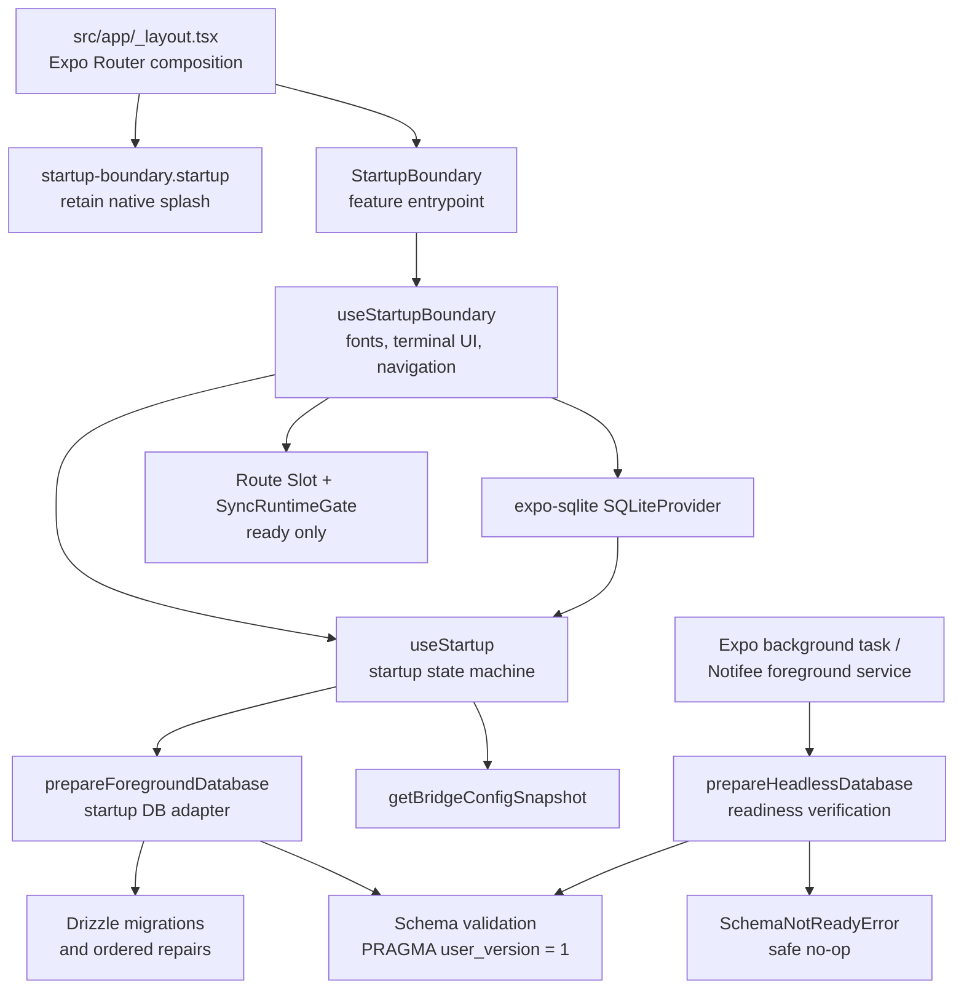
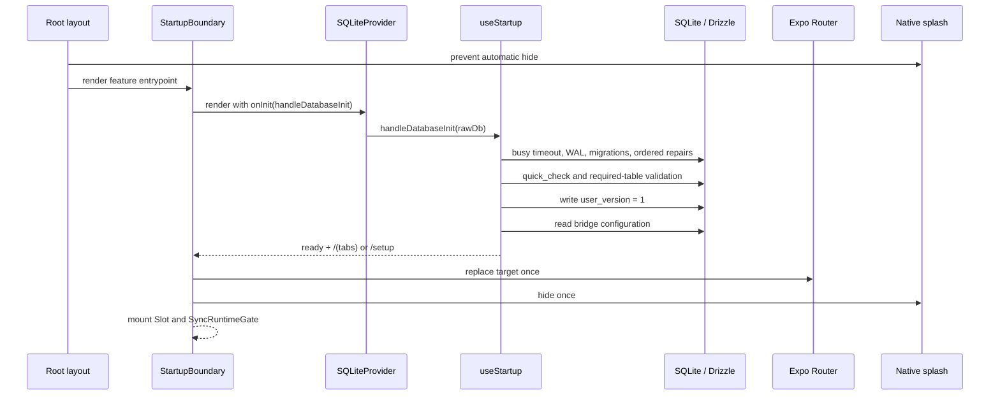
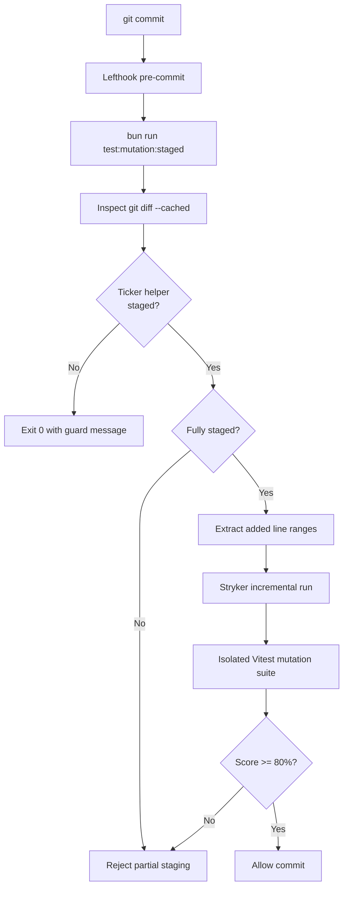

# Architecture & Development Manifesto

## 1. Core Philosophy (CONCEPTS > CODE)

This project follows a strict **Feature-Sliced Design** combined with **Screaming Architecture**. 
* **The UI is an implementation detail:** Business logic lives in hooks and pure functions, ignorant of React Native or Expo.
* **The Database is an implementation detail:** Repositories handle Drizzle/SQLite. Features consume repositories.
* **HeroUI Native is Mandatory:** We build UIs combining HeroUI Native primitives (`Button`, `Card`, `Text`, etc.) with Tailwind classes (`cn()`). `StyleSheet.create()` and bare React Native primitives are strictly prohibited unless absolutely necessary for custom native behavior.

## 2. Directory Structure

```text
src/
├── app/               # 1. DELIVERY (Expo Router)
│   ├── (tabs)/        # Routing and Layouts ONLY.
│   └── _layout.tsx    # ZERO business logic. Consumes Feature entrypoints only.
│
├── components/        # 2. SHARED UI (Design System)
│   ├── ui/            # Base wrappers (ThemeToggle, AppText). Dumb components.
│   └── anime/         # Pure presentational components. Receive props, emit events.
│
├── features/          # 3. THE HEART (Domain-Driven)
│   ├── animes/        # Everything related to Anime.
│   ├── sync/          # Sync logic.
│   └── ws/            # WebSocket logic.
│
├── infrastructure/    # 4. ADAPTERS (The dirty world)
│   ├── db/            # Drizzle client, schemas, migrations, and Repositories.
│   ├── validation/    # Global Zod schemas.
│   └── api/           # BridgeClient adapter — the ONLY owner of bridge HTTP/WS transport.
│
└── helpers/           # 5. UTILITIES
    └── hooks/         # Generic shared hooks.
```

## 3. Strict Colocation (The Component Ecosystem)

Complex features and UI components must follow strict colocation. A component is a self-contained module.

```text
src/features/animes/ui/AnimeForm/
├── index.ts                 # THE CONTRACT: Exports ONLY what the outside world needs.
├── AnimeForm.tsx            # DUMB UI: HeroUI Native + Tailwind only. NO business logic.
├── use-anime-form.ts        # THE BRAIN: Custom hook managing state, queries, formatting.
├── anime-form.types.ts      # Props and internal types.
├── anime-form.schema.ts     # Zod Schemas for local validation.
├── anime-form.constants.ts  # Magic numbers, defaults.
├── anime-form.helpers.ts    # Pure functions for data processing (100% testable).
└── __tests__/               # Tests isolated to this module.
    ├── AnimeForm.test.tsx   
    └── use-anime-form.test.ts 
```

## 4. Delivery Layer Rule (`src/app/**`)

Files under `src/app/**` are **routing/composition only**.

They MUST NOT:
- import custom hooks from `features/` or `helpers/hooks/`
- import infrastructure directly
- use React state/effect hooks (`useState`, `useReducer`, `useEffect`, `useMemo`, `useCallback`, `useRef`)
- contain business logic, derived state, or data orchestration

If a route needs behavior, create a feature entrypoint component and render that from `app/`.

## 5. The 10-Step Hook Anatomy

Every custom hook (`use-*.ts`) MUST follow this strict top-to-bottom order to guarantee readability and prevent spaghetti code:

1. **Imports:** External (React, HeroUI, Zod), then Internal, then Local.
2. **Signature:** `export const useMyHook = (props: MyHookProps) => {`
3. **1º Refs:** `useRef`
4. **2º State:** `useState` or `useReducer`
5. **3º Third-Party/Context Hooks:** `useThemeColor()`, `useForm()`, navigation.
6. **4º Mutations/Queries:** Repository calls, DB queries.
7. **5º Derived State:** `useMemo`
8. **6º Callbacks:** `useCallback` (Event handlers using pure helpers)
9. **7º Effects:** `useEffect` (The necessary evil, keep to a minimum)
10. **Return:** Plain object or tuple.

## 6. Strict Colocation Enforcement Details

Feature `.tsx` and `use-*.ts` files are intentionally constrained.

They MUST NOT contain at the root level:
- `interface` or `type` declarations
- `const` declarations
- helper `function` declarations
- inline Zod schemas

Those constructs belong in:
- `*.types.ts`
- `*.constants.ts`
- `*.helpers.ts`
- `*.schema.ts`

Additionally, the main feature component/hook export MUST be a named `function`, never a root-level arrow function assigned to a `const`.

## 7. Props Contract Rule

Every property in any `*Props` interface inside `*.types.ts` must be declared as `readonly`.

Example:

```ts
export interface AnimeCardProps {
  readonly anime: Anime;
  readonly onCapPlus: () => void;
  readonly onCapMinus: () => void;
}
```

## 8. The 500-Line Protocol (Emergency Refactor)

If ANY file (`.ts` or `.tsx`) exceeds 500 lines, it violates the Single Responsibility Principle (SRP).
* **`.tsx` > 500 lines:** The UI has too many parts. Extract sub-components into a local `components/` folder.
* **`.ts` > 500 lines:** The hook does too much. Apply the **Facade Hook** pattern (split into `useFeatureState`, `useFeatureMutations`, etc., and combine them in the main hook).

## 9. Testing Policy (TDD + SDD)

* **Spec-Driven Development (SDD):** Write specs in `openspec/specs/` before coding.
* **Test-Driven Development (TDD):** Write the test (Red), write the code (Green), refactor.
* **Coverage:**
  * **100%** for `*.helpers.ts` and `*.schema.ts` (Pure logic).
  * **85%+** for `use-*.ts` (Custom hooks/Business logic).
  * **100% Logical branches** for `*.tsx` (Dumb components). Test behavior (`onPress`), not styles.

## 10. LLM Enforcement Barriers

To ensure these rules are respected by all agents and developers:
* **Generators:** Complex features must be scaffolded using `bun run generate:feature <featureName> <ComponentName>`. Manual creation is forbidden.
* **ESLint:** Strict rules enforce `max-lines` (500), delivery-layer purity, strict colocation, Zod placement, readonly props, and helper documentation.
* **Bridge Boundary:** ESLint (`no-restricted-syntax`, the "Bridge Boundary" rules in `eslint.config.js`) forbids `fetch()`, `new WebSocket()`, and raw `http(s)://`/`ws(s)://` URL building anywhere under `src/features/**`. The barrier is deterministic-first: it fails the build, then this doc explains why.
* **AGENTS.md:** AI agents are strictly instructed to follow these rules under the "CRITICAL ARCHITECTURE CONSTRAINTS" section.

## 11. The Bridge Boundary (Single Transport Adapter)

Talking to `autoreas-bridge` is an **adapter concern**, exactly like the database. Just as features consume Repositories instead of touching Drizzle, they consume the **`BridgeClient`** port (`src/infrastructure/api`) instead of touching `fetch`/`WebSocket`.

* **One seam:** `BridgeClient` is the single place that resolves the base URL (`http://ip:port`), builds the websocket URL (`ws://ip:port/ws`), injects the `Authorization` header, normalizes responses to `{ ok, status, data, rawBody, url }`, distinguishes a transient `BridgeUnreachableError` (retry) from an HTTP error (e.g. `4xx` → permanent), and exposes a diagnostic logging seam.
* **Semantic methods:** features call `bridgeClient.pairDevice / listAnimes / getAnime / reconcile / openWebSocket` — never a raw URL.
* **Why this exists:** the connection logic was once duplicated across five feature files with five different error styles, which made a transport bug impossible to localize. Centralizing it — and enforcing the boundary in the linter — is what prevents that regression from returning.

## 12. Startup Readiness Boundary

The startup feature owns the application transition from native launch to locally ready. A ready application has a validated local schema, loaded local bridge configuration, and a safe route target. Sync services activate only after that transition completes.

### Component diagram



### Foreground success sequence



### Failure and headless sequence

```mermaid
sequenceDiagram
  participant H as Headless sync actor
  participant D as SQLite database
  participant S as useStartup
  participant B as StartupBoundary
  participant N as Native splash

  H->>D: apply busy timeout and read user_version
  alt version is exactly ready
    D-->>H: allow application-table access
  else missing or stale readiness
    D-->>H: SchemaNotReadyError
    H-->>H: close connection and return safe no-op
  end

  S->>D: foreground preparation or local config read
  alt preparation/configuration fails
    D-->>S: typed error
    S-->>B: fatal state with redacted diagnostic
    B->>N: hide once
    B-->>B: render controlled failure; keep Slot and SyncRuntimeGate unmounted
  end
```

### Startup invariants

- Foreground startup is the only actor allowed to run migrations and schema repairs.
- `PRAGMA user_version = 1` is written only after migrations and validation finish successfully.
- Headless actors apply connection-local busy policy, verify exact durable readiness, then access application tables.
- Headless actors close their dedicated connection and return a safe no-op while readiness is missing or stale.
- The startup boundary exposes only allowlisted diagnostic fields. It never places raw SQLite errors, SQL, credentials, or bridge details in UI state.
- Route replacement, splash hiding, `Slot`, and `SyncRuntimeGate` are terminal-ready behaviors. A fatal startup state renders its controlled fallback without mounting runtime consumers.

## 13. Incremental Mutation-Test Boundary

The primary Jest + `jest-expo` suite and the Vitest/Stryker mutation island have separate runner boundaries. The automated incremental gate currently protects one pure native-ticker seam. The manual mutation step in `AGENTS.md` remains mandatory for guards outside that narrow surface.



| Boundary | Responsibility |
| --- | --- |
| `scripts/dlinter-mutation-staged.mjs` | Checks staged state, rejects partial staging, extracts added ranges, and invokes Stryker. |
| `stryker.dlinter.json` | Limits mutation to `native-foreground-sync-ticker.helpers.ts` and enforces the 80% breaking threshold. |
| `vitest.dlinter-mutation.mts` | Runs only `tests/mutation/**/*.mutation.test.ts`. |
| `jest.config.js` | Excludes the Vitest-only mutation island from the Jest + `jest-expo` suite. |
| `.agents/skills/mutation-tdd/SKILL.md` | Defines the required manual guard-deletion check for code outside the automated mutation surface. |

The mutation temporary directory is `.dlinter-mutation-tmp`; its incremental cache lives under the Git directory at `dlinter/stryker-staged.json`. Both are tooling artifacts and must not affect application behavior.

---
*If in doubt, refer to the `src/features/animes` directory as the Gold Standard for implementation.*
