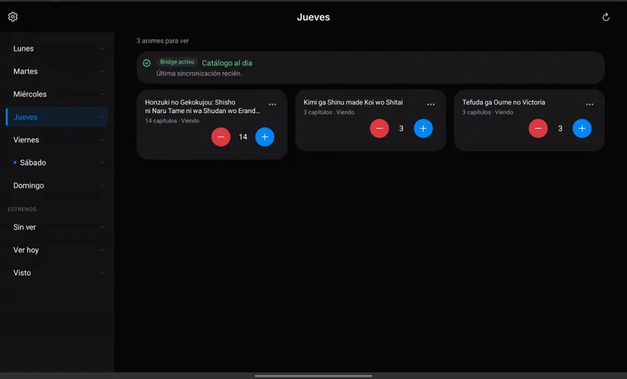
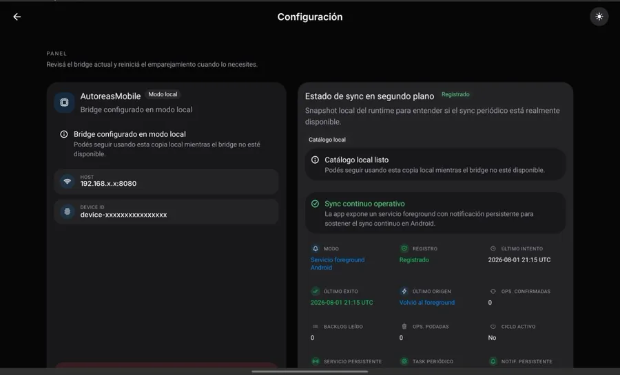
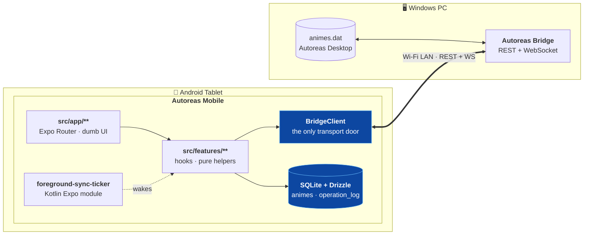

<div align="center">

# Autoreas Mobile

**Track the anime you watch — from the tablet you actually watch it on.**

An offline-first Android companion for Autoreas Desktop, built to sit next to your video player in
split-screen and stay out of your way.

[](https://docs.expo.dev/)
[](https://reactnative.dev/)
[](https://www.typescriptlang.org/)
[](https://orm.drizzle.team/)
[](#requirements)
[](#testing)
[](LICENSE)

[Overview](#overview) · [Features](#features) · [Screenshots](#screenshots) · [Stack](#tech-stack) ·
[Getting started](#getting-started) · [Structure](#project-structure) · [Docs](#documentation)

</div>

---

## Overview

Autoreas Desktop is a Chapter Tracking System (SCC) for anime with 800+ records and years of active
use. It is legacy software — Electron 7, last released in 2020 — and it will not be updated again.
Meanwhile, the way it gets used moved from the desktop to the tablet.

Autoreas Bridge solves half of that: a service on the PC that watches `animes.dat`, exposes a
REST + WebSocket API, and enables bidirectional sync over the local Wi-Fi network.
**Autoreas Mobile is the other half** — the client that makes those records usable from the couch.

The concrete workflow it replaces: watching an episode on the tablet in split-screen, then writing
the chapter number into a scratch note (`AnimeName[DayCode]Chapters`) to transcribe into the desktop
app later. Error-prone, duplicated work.

With Autoreas Mobile, the video player sits on the left and Autoreas on the right (~360–400dp wide).
When an episode ends, you tap **Cap+** without pausing the video. That is the whole interaction.

### Design principles

| Principle | What it means in practice |
| --- | --- |
| **Offline-first** | The catalogue lives in local SQLite. Cap+ works with the Bridge unreachable; changes replay on reconnect. |
| **Invisible sync** | Silent on success, loud only on failure or conflict. |
| **Optimistic ignorance** | A remote WebSocket event never blindly overwrites a pending local mutation. |
| **Split-screen native** | The layout targets ~320dp width. No horizontal scroll, Cap+/Cap- always one tap away. |

> [!NOTE]
> **Scope.** This is not a replacement for Autoreas Desktop. It does not add, edit or delete anime,
> show statistics, or manage backups. It does not display cover art (the desktop stores Windows
> local paths). Sync conflicts are surfaced here but resolved in the Bridge web UI.

---

## Screenshots

<div align="center">

### Daily catalogue — the split-screen surface



*Weekday rail with the Estrenos pseudo-days (Sin ver / Ver hoy / Visto), one-tap chapter controls,
and a live Bridge connection banner.*

### Diagnostics — knowing whether sync is really running



*Pairing details plus a runtime snapshot of background sync — execution mode, last attempt, last
success, backlog read, and whether the persistent foreground service is actually alive.
(Host and device ID are masked in this screenshot.)*

</div>

---

## Features

### Catalogue

- **Weekday-based lists** — Monday through Sunday, matching the desktop broadcast-day model.
- **Estrenos workflow** — move new-season titles across the *Sin ver → Ver hoy → Visto* pseudo-days.
- **One-tap chapter tracking** — Cap+ / Cap- always visible on the card, never behind a submenu.
- **Status machine** — Viendo, Finalizado, No me gustó, En pausa. Reaching the last chapter
  (`nrocapvisto == totalcap`) auto-transitions the anime to *Finalizado* in the same transaction.
- **Season ratings** — rate active-season titles; ratings queue and sync like any other mutation.

### Sync

- **Local operation log** — every mutation writes to `animes` and `operation_log` in one atomic
  SQLite transaction. Both succeed or both fail.
- **REST reconciler** — pending operations batch to `POST /api/sync/reconcile`; only a confirmed
  response marks them `synced` and advances `last_changelog_id`.
- **WebSocket lifecycle** — `WS /ws` is bound to React Native's `AppState`: disconnect on
  background, reconnect on active. Remote events trigger reconciliation instead of blind writes.
- **Continuous background sync** — an Android **foreground service** with a persistent notification,
  backed by a repository-owned Kotlin Expo module (`modules/foreground-sync-ticker`), with Expo
  Background Task as the best-effort fallback.
- **Log retention** — the operation log is pruned automatically once entries are confirmed.

### Device setup

- **Manual pairing** — IP, port and token validated against `POST /api/devices/pair`.
- **QR scan** — `expo-camera` reads the pairing code emitted by the Bridge.
- **Deep link** — `autoreas-mobile://pair?v=1` pre-fills the form with ip, port and token.
- **Instant boot** — `bridge_config` is read synchronously from SQLite in `_layout.tsx`, so a cold
  start goes straight to the list with no white flash and no setup detour.
- **Local mode** — with no Bridge reachable, the app keeps serving the local catalogue copy.

---

## Tech stack

| Layer | Choice | Why |
| --- | --- | --- |
| Runtime | [Expo SDK 55](https://docs.expo.dev/) · React Native 0.83 · React 19 | Reuses the React knowledge behind the Bridge web UI; one toolchain for native builds. |
| Language | TypeScript 5.9 | Contract safety across the sync boundary. |
| Navigation | [Expo Router](https://docs.expo.dev/router/introduction/) | File-based routes; `src/app/**` stays a thin delivery layer. |
| UI | [HeroUI Native](https://github.com/heroui-inc/heroui-native) · Uniwind · Tailwind CSS 4 | Native primitives with design tokens shared with the Bridge web UI. |
| Local database | [Expo SQLite](https://docs.expo.dev/versions/latest/sdk/sqlite/) · [Drizzle ORM](https://orm.drizzle.team/) | Typed schema, generated migrations, live queries. |
| Server state | [TanStack Query](https://tanstack.com/query) | Bridge fetch and cache lifecycle. |
| Client state | [Zustand](https://zustand.docs.pmnd.rs/) | Small in-memory global state with no boot cost. |
| Validation | [Zod 4](https://zod.dev/) | Coerces the legacy `animes.dat` wire format at the boundary. |
| Native | Kotlin Expo module · [react-native-notify-kit](https://www.npmjs.com/package/react-native-notify-kit) | Foreground service and persistent notification for continuous sync. |
| Testing | Jest · jest-expo · Testing Library · [Stryker](https://stryker-mutator.io/) | TDD is mandatory here; mutation testing guards the tests themselves. |
| Quality | ESLint 9 · `dharness` · `dlinter-ts-react` · [fallow](https://www.npmjs.com/package/fallow) · Lefthook | Architecture rules enforced at commit time, not by review etiquette. |
| Package manager | [Bun](https://bun.sh/) | The **only** supported package manager for this repo. |

---

## Architecture

Autoreas Mobile is an **offline-first peer**, not a thin client. It owns a full local copy of the
catalogue plus a log of pending operations, and reconciles with the Bridge when it can.



Two boundaries are load-bearing:

- **Bridge Boundary** — all HTTP and WebSocket traffic goes through `BridgeClient` in
  `src/infrastructure/api`. Feature code never calls `fetch()` or `new WebSocket()`.
- **Write Door** — every SQLite write routes through `withLocalWrite`, so a mutation and its
  operation-log entry stay atomic.

Decisions are recorded as ADRs in [`docs/adr/`](docs/adr/); the full ruleset lives in
[`ARCHITECTURE.md`](ARCHITECTURE.md).

---

## Getting started

### Requirements

- [Bun](https://bun.sh/) — the only supported package manager
- Node.js 22+
- An Android device or emulator
- [EAS CLI](https://docs.expo.dev/eas/) for native builds — `bunx eas-cli --version`
- A logged-in Expo account for remote builds — `bunx eas-cli login`
- A reachable Autoreas Bridge instance on the same Wi-Fi network

> [!IMPORTANT]
> **Expo Go is not enough.** This app uses native `expo-sqlite`, a custom Kotlin module, and
> cleartext HTTP to a LAN address. Plain Expo Go produces the SQLite-unavailable fallback or
> `Cannot find native module 'ExpoSQLite'`. You need a **development build**.

### Install

```bash
git clone git@github.com:Disble/autoreas-mobile.git
cd autoreas-mobile
bun install
```

`bun install` also installs the Git hooks through Lefthook's `postinstall`. If hooks go missing on an
already-installed tree, repair them with `npx lefthook install` — see
[Git hooks](docs/build-and-release.md#git-hooks).

### Build a development client

```bash
bunx eas-cli build --platform android --profile development
```

Install the resulting APK on the device. To build locally with Docker instead, see
[Build and release](docs/build-and-release.md#option-2--local-preview-build-with-docker).

### Run

```bash
bun run start      # Metro bundler (clears cache)
bun run android    # Metro + open Android
bun run ios        # Metro + open iOS
bun run web        # Metro + open Web
```

Open the development build on the device and let it attach to Metro.

### Pair with the Bridge

1. Start the Bridge on your PC and note its LAN IP and port.
2. Open Autoreas Mobile — a fresh install lands on the setup screen.
3. Enter IP, port and token, **or** scan the Bridge QR code, **or** open the
   `autoreas-mobile://pair?v=1` deep link.
4. On success the config is written synchronously to SQLite, and every later launch boots straight
   into your list.

---

## Project structure

```text
autoreas-mobile/
├── src/
│   ├── app/                          # Expo Router routes — delivery layer ONLY
│   │   ├── _layout.tsx               # SQLiteProvider · migrations · boot gate
│   │   ├── (tabs)/                   # index (catalogue) · settings
│   │   └── setup/                    # pairing screen
│   ├── features/                     # all business logic, one folder per domain
│   │   ├── animes/                   # catalogue, Cap+/Cap-, status machine, seasons
│   │   ├── settings/                 # bridge config + background-sync diagnostics
│   │   ├── setup/                    # device pairing (manual · QR · deep link)
│   │   ├── startup/                  # boot readiness gate
│   │   ├── sync/                     # operation log · reconciler · foreground service
│   │   └── ws/                       # WebSocket lifecycle
│   └── infrastructure/
│       ├── api/bridge-client/        # the ONLY transport adapter (HTTP + WS)
│       ├── db/                       # Drizzle schema · migrations · write door
│       ├── store/                    # Zustand stores
│       └── validation/               # Zod schemas for the legacy wire format
├── modules/
│   └── foreground-sync-ticker/       # local Android Expo module (Kotlin)
├── plugins/                          # Expo config plugins (foreground service, Gradle memory)
├── tests/                            # Jest suites — mirrors src/features/**
├── scripts/                          # feature scaffolding, staged mutation runner
├── docs/                             # ADRs · specs · postmortems · images
└── openspec/                         # spec-driven-development artifacts
```

### Feature anatomy

Every non-trivial feature folder is self-contained and follows the same shape:

```text
src/features/<feature>/ui/<Component>/
├── index.ts                    # public contract — the only import surface
├── <Component>.tsx             # JSX only: HeroUI Native primitives + cn()
├── use-<component>.ts          # all logic, in the mandated 10-step hook order
├── <component>.helpers.ts      # pure functions
├── <component>.types.ts
└── <component>.constants.ts
```

Never create these by hand — scaffold them:

```bash
npm run generate:feature <name>
```

---

## Development

### Scripts

| Command | What it does |
| --- | --- |
| `bun run start` | Start Metro with a cleared cache |
| `bun run android` / `ios` / `web` | Start Metro and open the target platform |
| `bun run lint` | ESLint across the repo |
| `bun run typecheck` | `tsc --noEmit` |
| `bun run test` | Jest suite |
| `bun run test:watch` | Jest in watch mode |
| `bun run test:coverage` | Jest with coverage |
| `bun run validate` | lint + typecheck + test |
| `bun run audit` | `fallow` dead-code, complexity and duplication audit |
| `bun run doctor:react` | React Doctor analysis |
| `bun run generate:feature <name>` | Scaffold a new feature folder |
| `bun run test:mutation:staged` | Stryker mutation run over staged files |
| `bun run sqlite:lab` | SQLite concurrency lab harness |

### Testing

Tests are **not** colocated with source. Jest only picks up suites under `tests/`, mirroring the
feature path:

```text
src/features/animes/anime-season.helpers.ts
└── tests/features/animes/__tests__/anime-season.helpers.test.ts
```

The cycle is **RED → GREEN → MUTATE → REFACTOR**. A green test proves nothing until you delete the
guard it claims to cover and watch it fail. See
[ADR 003 — Testing policy](docs/adr/003-testing-policy-tdd.md).

### Database

Drizzle config lives in `drizzle.config.ts`. Migrations are generated into
`src/infrastructure/db/migrations` and applied at runtime from `src/app/_layout.tsx`.

```bash
bunx drizzle-kit generate
```

---

## Contributing

This repository enforces its architecture mechanically. Read [`ARCHITECTURE.md`](ARCHITECTURE.md)
before opening a PR — the short version:

1. **Dumb UI** — `.tsx` files return JSX and nothing else. No `useEffect`, no business logic, no
   database access.
2. **Hook anatomy** — `use-*.ts` files follow a fixed 10-step order: refs → state → context →
   queries → derived → callbacks → effects → return.
3. **Strict colocation** — a feature is a folder with `index.ts`, `.tsx`, `use-*.ts` and
   `*.helpers.ts`. Use `generate:feature`; never hand-roll it.
4. **TDD is mandatory** — no helper or hook change without its test under `tests/` first.
5. **500-line rule** — any file crossing 500 lines gets refactored on the spot.
6. **Bridge Boundary** — transport belongs to `src/infrastructure/api` and nowhere else.
7. **Reference feature** — when in doubt, copy the shape of `src/features/animes`.

The pre-commit hook lints **whole staged files**, not your diff. Touching a file makes its existing
lint findings yours to fix. That is deliberate: it is how the standing debt gets paid down
incrementally instead of never.

---

## Documentation

| Document | Contents |
| --- | --- |
| [`ARCHITECTURE.md`](ARCHITECTURE.md) | The complete, enforced ruleset |
| [`docs/adr/`](docs/adr/) | Architecture decision records |
| [`docs/specs/`](docs/specs/) | Functional specs (SDD-00 → SDD-07) |
| [`docs/build-and-release.md`](docs/build-and-release.md) | EAS and Docker builds, Git hooks, release checklists |
| [`docs/troubleshooting.md`](docs/troubleshooting.md) | Native module, cleartext HTTP and Expo Router issues |
| [`docs/postmortems/`](docs/postmortems/) | Incident write-ups |
| [`docs/Autoreas_mobile_design_doc.md`](docs/Autoreas_mobile_design_doc.md) | The original RFC |

---

## License

Licensed under the **Apache License, Version 2.0**. See [`LICENSE`](LICENSE) for the full text.

```text
Copyright 2026 Disble

Licensed under the Apache License, Version 2.0 (the "License");
you may not use this file except in compliance with the License.
You may obtain a copy of the License at

    http://www.apache.org/licenses/LICENSE-2.0

Unless required by applicable law or agreed to in writing, software
distributed under the License is distributed on an "AS IS" BASIS,
WITHOUT WARRANTIES OR CONDITIONS OF ANY KIND, either express or implied.
See the License for the specific language governing permissions and
limitations under the License.
```

`package.json` still sets `private: true` — that is deliberate. It blocks accidental publication to
the npm registry and has nothing to do with the source license; this is an application, not a
distributable package.

---

<div align="center">

Built by [**Disble**](https://github.com/Disble) · *"apoyando la vagancia desde tiempos inmemoriales"*

</div>
