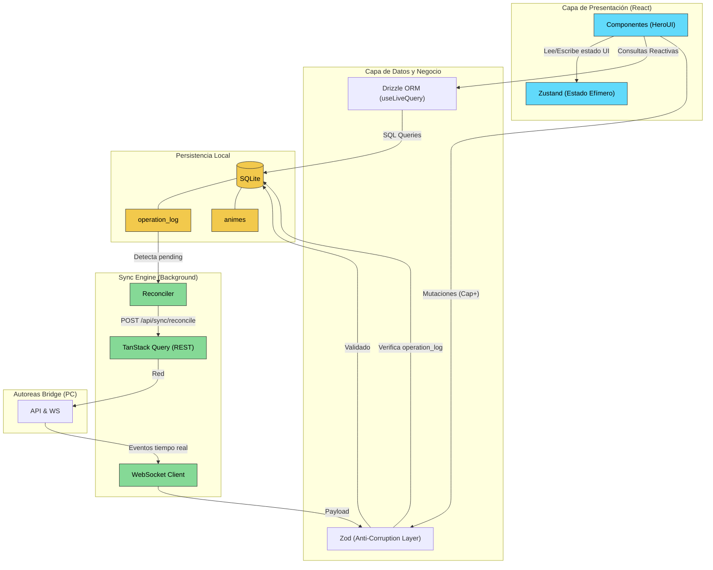
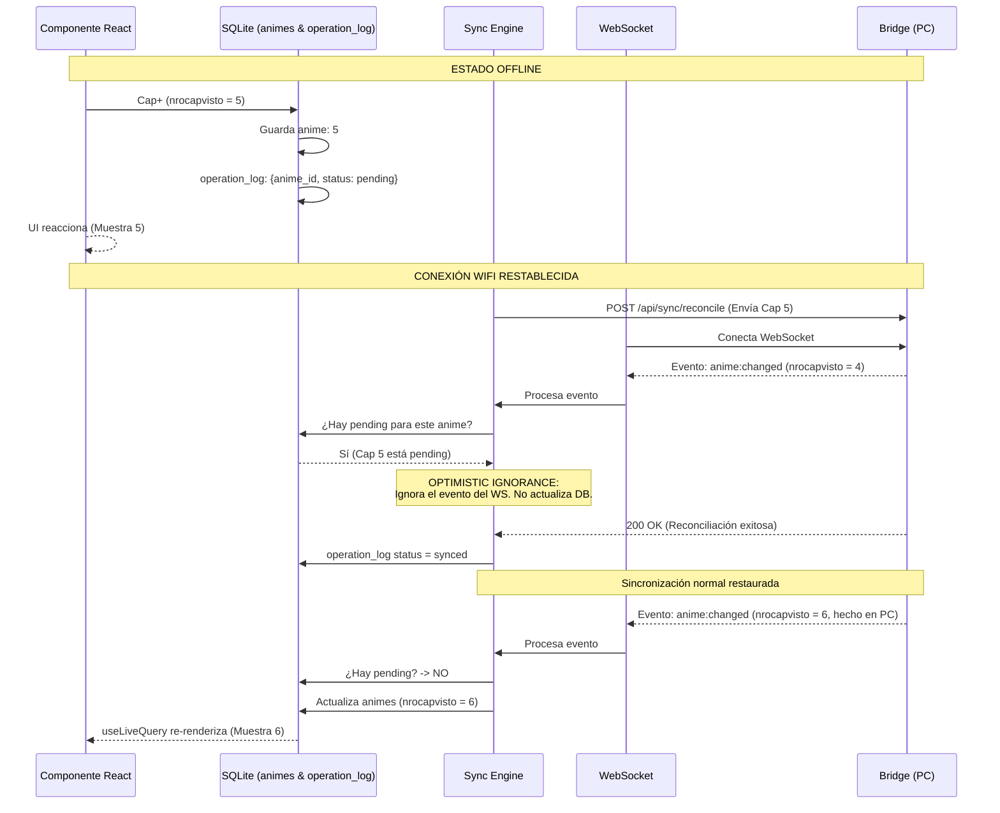

# Arquitectura: Autoreas Mobile

**Estado:** Aprobado
**Fecha:** 2026-04-05

Este documento define los cimientos arquitectónicos de Autoreas Mobile. Las decisiones aquí plasmadas fueron tomadas para garantizar una aplicación offline-first robusta, capaz de sincronizarse en una red inestable sin bloquear la interfaz de usuario ni perder datos provenientes del sistema legacy.

---

## 1. Principios Core

1. **Single Source of Truth (SSOT):** SQLite es la única fuente de verdad para los datos de dominio (Animes, operation_log, config). No se duplica el estado de dominio en memoria.
2. **Anti-Corruption Layer (ACL):** Nunca se confía en los datos provenientes del Bridge (legacy). Todo payload entrante o saliente se valida estrictamente en tiempo de ejecución.
3. **UI Reactiva y No Bloqueante:** La interfaz siempre refleja el estado de SQLite de forma reactiva. Los procesos de sincronización ocurren en background sin interrumpir la interacción del usuario.
4. **Optimistic Ignorance:** Los cambios locales pendientes tienen prioridad absoluta sobre los eventos en tiempo real (WebSocket) hasta que sean reconciliados por el servidor.

---

## 2. Stack Tecnológico

| Capa | Tecnología | Justificación |
|---|---|---|
| **Framework Base** | Expo + React Native | Ecosistema maduro, toolchain simplificada (Expo Go/EAS). |
| **Navegación** | Expo Router | File-based routing, soporte nativo para Deep Linking (Pairing). |
| **Base de Datos** | SQLite (`expo-sqlite`) | Almacenamiento offline robusto. |
| **ORM / Acceso a Datos**| Drizzle ORM | Tipado estricto, migraciones nativas, hooks reactivos (`useLiveQuery`). |
| **Validación (ACL)** | Zod | Validación en runtime para payloads de red y DB. |
| **Estado UI (Efímero)**| Zustand | Store ultraligero exclusivo para estado de interfaz (filtros, theme, red). |
| **UI Library** | HeroUI Native v3 | Componentes nativos alineados visualmente con el Bridge Web UI. |
| **Networking (REST)** | TanStack Query | Caching, retries automáticos, deduplicación de requests. |
| **Networking (Realtime)**| Native WebSocket | Conexión persistente para eventos del Bridge. |
| **Testing** | Jest + RNTL | Tests de integración rápidos con mock in-memory de SQLite. |

---

## 3. Arquitectura de Componentes

El siguiente diagrama ilustra cómo fluyen los datos a través de las capas de la aplicación.



---

## 4. Estructura del Proyecto (Feature-First)

El proyecto se organiza aislando la lógica por caso de uso (feature) para maximizar la escalabilidad.

```text
/
├── app/                    # Expo Router (Rutas de la aplicación)
│   ├── _layout.tsx
│   ├── index.tsx           # Lista principal
│   └── setup.tsx           # Pantalla de pairing
├── src/
│   ├── features/
│   │   ├── animes/         # Lógica de dominio de animes
│   │   │   ├── components/
│   │   │   ├── hooks/
│   │   │   └── schema.ts   # Zod schemas específicos
│   │   ├── sync/           # Sync Engine y reconciliación
│   │   └── pairing/        # Lógica de emparejamiento QR/Manual
│   ├── infrastructure/     # Código técnico transversal
│   │   ├── db/             # Drizzle setup, migraciones, schemas
│   │   ├── api/            # Configuración Axios/Fetch
│   │   └── store/          # Zustand UI store
│   └── shared/             # Componentes UI reutilizables
└── tests/                  # Configuración de Jest y suites
```

---

## 5. Estrategia de Sincronización: Optimistic Ignorance

El mayor desafío de un sistema distribuido P2P offline-first es la condición de carrera al reconectar. Si el usuario realiza un cambio offline (ej: `Cap 5`) y al conectar a WiFi recibe un evento WebSocket del PC con estado antiguo (`Cap 4`) antes de que su sincronización REST finalice, la UI sufriría regresiones visuales y pérdida de datos.

Se implementa el patrón **Optimistic Ignorance**:

1. Toda mutación local se guarda inmediatamente en `animes` y deja un registro en `operation_log` con estado `pending`.
2. Cuando el WebSocket recibe un evento (`anime:changed`), el Sync Engine consulta SQLite.
3. Si existe una operación `pending` para ese anime específico, **se ignora silenciosamente** el evento del WebSocket.
4. Una vez que el POST de reconciliación finaliza con éxito, los registros locales pasan a `synced` y se vuelven a aceptar eventos del WebSocket.



---

## 6. Pairing y Seguridad

- El emparejamiento genera un `Token` y `Device ID` que otorga acceso a la API del Bridge.
- Por tratarse de una aplicación para red local doméstica sin datos críticos, **la configuración se almacena en texto plano en la tabla `bridge_config` de SQLite**.
- Esto evita la asincronía obligatoria de `Expo SecureStore` en el arranque de la app, permitiendo inicializar los stores de UI y las queries de base de datos de manera inmediata y síncrona en el primer render de React.