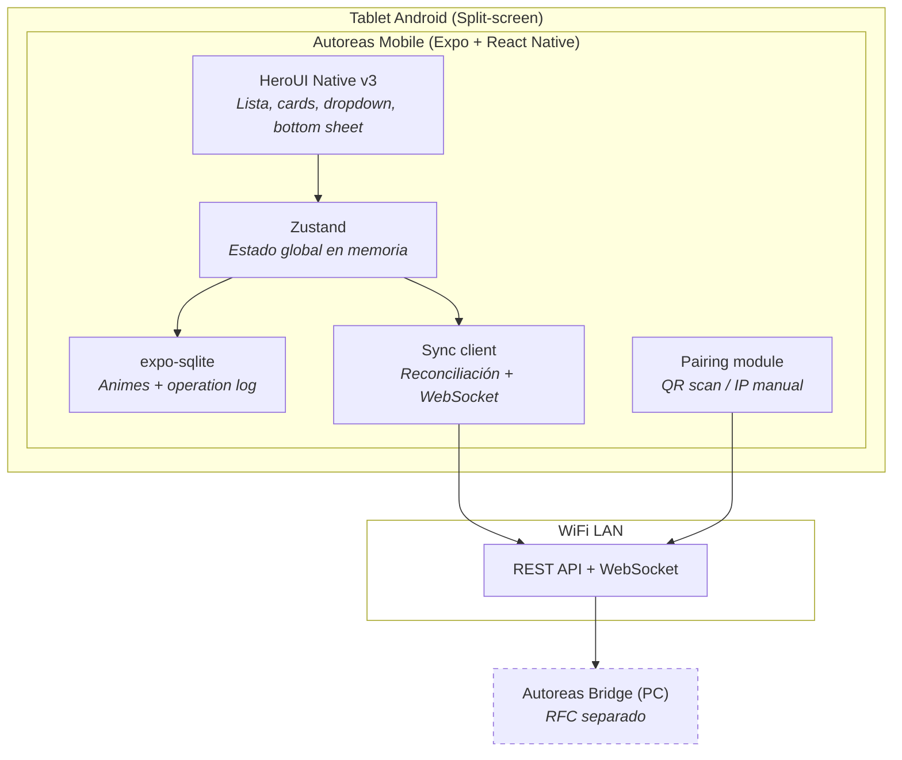
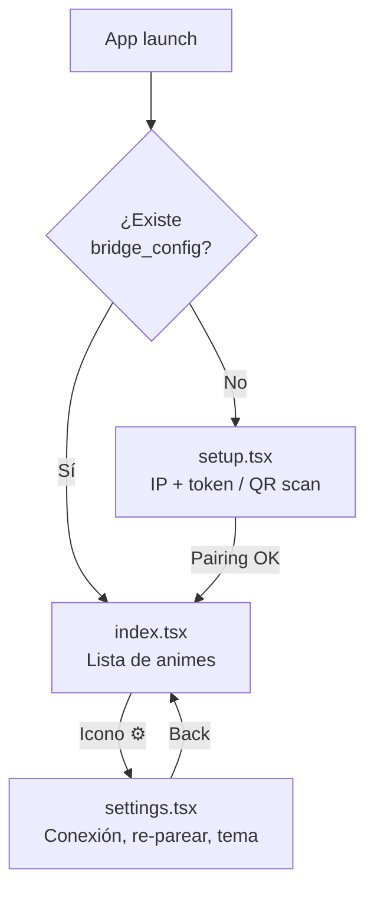
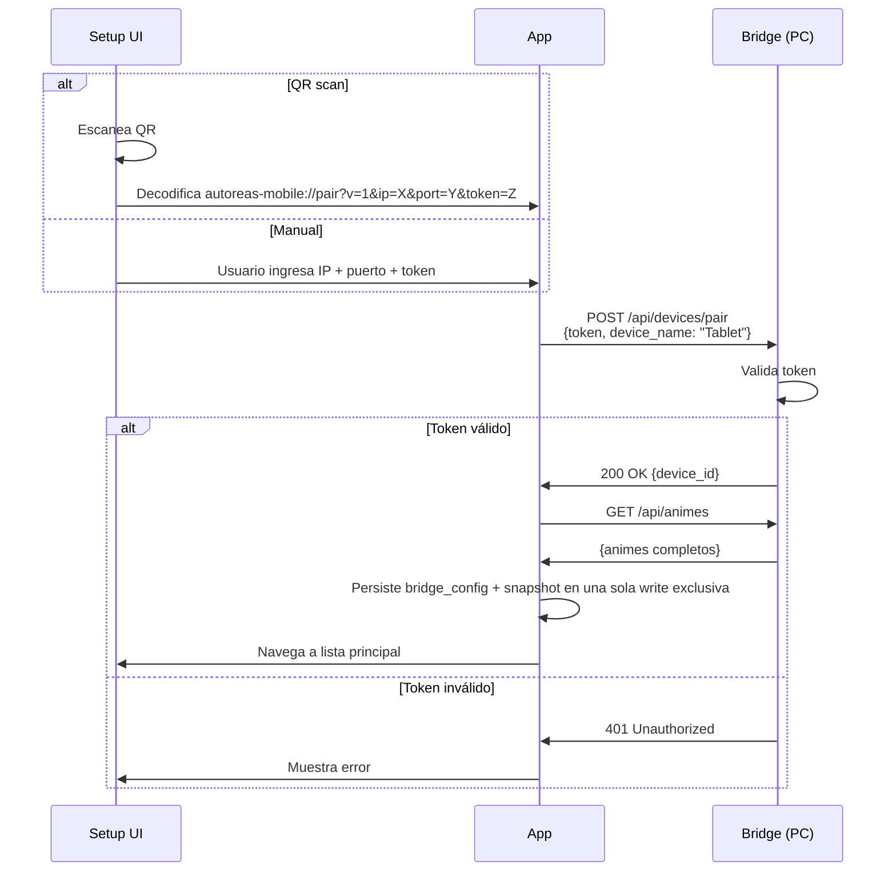
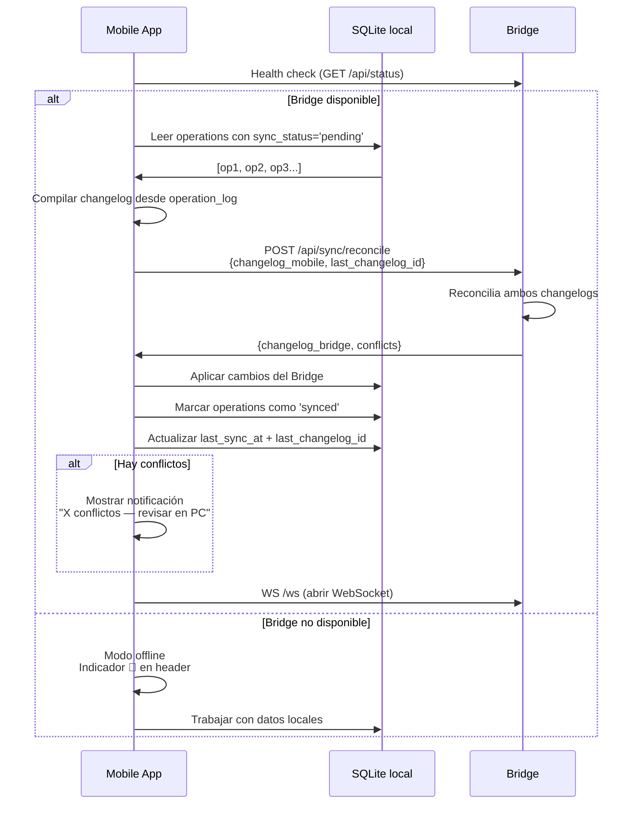
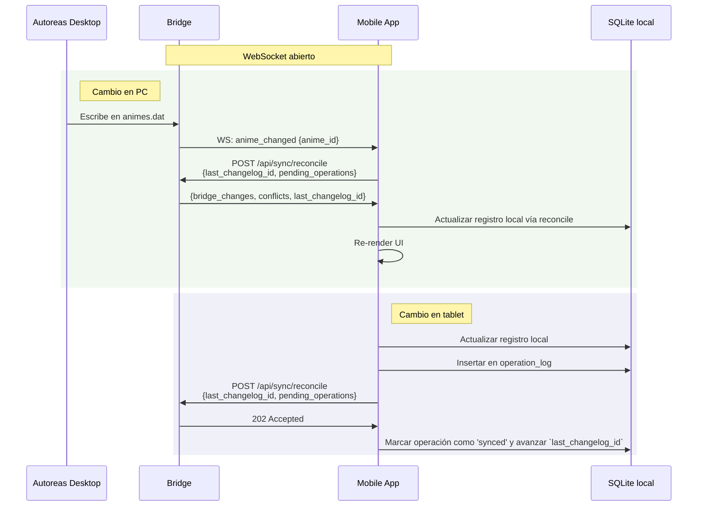

# RFC: Autoreas Mobile

**Autor:** Disble
**Fecha:** 2026-04-05
**Estado:** En revisión
**Depende de:** [RFC: Autoreas Bridge](./Autoreas_bridge_design_doc.md)

---

## 1. Contexto y problema

Autoreas Desktop es un Sistema de Control de Capítulos (SCC) de anime con más de 800 registros y años de uso activo. Es software legacy (Electron 7, última versión v2.2.0, mayo 2020) y no recibirá más actualizaciones.

El patrón de consumo migró del escritorio a la tablet. El RFC de Autoreas Bridge resuelve la mitad del problema: un servicio en el PC que observa `animes.dat`, expone una API REST + WebSocket, y permite sincronización bidireccional por WiFi LAN. Pero el Bridge es solo la infraestructura — sin un cliente móvil, no hay forma de interactuar con los datos desde la tablet.

Actualmente, el usuario resuelve esto con una **nota de texto manual** donde apunta los animes y capítulos vistos, usando un formato improvisado (`AnimeName[DíaCódigo]Capítulos`), para después transcribir los cambios a Autoreas Desktop. Este flujo es propenso a errores, duplica trabajo, y rompe la filosofía original de Autoreas: "apoyando la vagancia desde tiempos inmemoriales".

El caso de uso concreto es: el usuario ve anime en la tablet en **split-screen** — reproductor de video a la izquierda, Autoreas Mobile a la derecha (~360-400dp de ancho). Al terminar un capítulo, toca Cap+ sin pausar el video. Eso es todo.

## 2. Objetivos

- Permitir ver la lista de animes en seguimiento desde la tablet Android, filtrada por día de emisión y por grupo de Estrenos.
- Permitir incrementar y decrementar capítulos vistos (Cap+/Cap-) desde la tablet.
- Permitir cambiar el estado de un anime (Viendo, Finalizado, No me gustó, En pausa) desde la tablet.
- Soportar el workflow de Estrenos/temporada: mover animes entre los pseudo-días Sin ver, Ver hoy y Visto.
- Funcionar offline: el usuario puede ver su lista y hacer Cap+ sin que el Bridge esté disponible. Los cambios se sincronizan automáticamente al reconectar.
- Funcionar correctamente en split-screen (~360-400dp de ancho) con controles táctiles cómodos para una mano.
- Sincronización invisible: silencio en éxito, alerta en fallo o conflicto.

> Limitación operativa actual: el background sync implementado con Expo Background Task es **best-effort**. Si el usuario mata explícitamente la app, la sincronización deja de estar garantizada hasta el próximo launch. Para garantía fuerte tras cierre manual se necesitaría un enfoque distinto (por ejemplo, foreground service Android con notificación persistente).

### No-objetivos

- **No es un reemplazo de Autoreas Desktop.** No implementa funciones de gestión: agregar, editar metadata, eliminar animes, estadísticas, gráficos, gestión de pendientes, ni respaldos.
- **No muestra portadas.** Las portadas en Autoreas Desktop son rutas locales de Windows (`portada.path`), inaccesibles desde Android.
- **No resuelve conflictos.** Si ocurre un conflicto de sincronización, se notifica al usuario pero la resolución se hace en el Web UI del Bridge en el PC.
- **No descubre el Bridge automáticamente (MVP).** El descubrimiento por mDNS queda para post-MVP. El MVP usa IP manual o QR de pairing.
- **No soporta múltiples bridges.** Un dispositivo, un bridge, un PC.

## 3. Alternativas evaluadas

### 3.1 Flutter

**Pros:** UI fluida, buen rendimiento, comunidad activa.

**Contras:** Requiere aprender Dart — un lenguaje sin relación con el stack actual (JavaScript/TypeScript/Go). El ecosistema de plugins para mDNS (`nsd_flutter`) es menos maduro. No reutiliza conocimiento de React del Bridge.

**Decisión:** Descartado. Curva de aprendizaje alta sin beneficio proporcional.

### 3.2 Kotlin nativo (Jetpack Compose)

**Pros:** Máximo rendimiento. Acceso directo a Android NSD para mDNS. Ecosistema de primera clase para Android.

**Contras:** Ecosistema completamente nuevo para el desarrollador. Requiere Android Studio, Gradle, y conocimiento profundo del ciclo de vida de Android. El mayor salto de stack de todas las opciones.

**Decisión:** Descartado. El costo de aprendizaje no se justifica para una app de scope acotado.

### 3.3 PWA empaquetada (Capacitor / Tauri Mobile)

**Pros:** Máxima reutilización de skills web. HTML/CSS/JS puro.

**Contras:** mDNS desde webview es inviable. Acceso limitado a APIs nativas (file system, background sync, NSD). El rendimiento de listas con scroll en webview es inferior. Capacitor añade una capa de abstracción que no siempre funciona bien con bibliotecas nativas.

**Decisión:** Descartado. Las limitaciones nativas son un blocker para el MVP y un techo para la evolución.

### 3.4 React Native + Expo + HeroUI Native v3 (elegido)

**Pros:** Reutiliza conocimiento de React del frontend del Bridge. Expo simplifica la toolchain (sin Android Studio para el desarrollo inicial via Expo Go). HeroUI Native v3 (lanzado marzo 2026, 37+ componentes) ofrece componentes nativos con design tokens compartidos con la versión web — potencial de consistencia visual con el Web UI del Bridge. SQLite disponible via `expo-sqlite`. Distribución simple: Expo Go para desarrollo, APK sideload para producción.

**Contras:** Requiere módulo nativo para mDNS (diferido a post-MVP). HeroUI Native v3 es reciente (v1.x) y podría tener rough edges. El bundle de React Native es más pesado que nativo.

**Decisión:** Elegido. Mejor ratio valor/esfuerzo, menor curva de aprendizaje, ecosistema alineado con el stack existente.

## 4. Diseño propuesto

### 4.1 Arquitectura general

La app móvil es un **peer offline-first** que consume la API del Bridge. Mantiene una copia local de los datos en SQLite y un log de operaciones pendientes. La sincronización sigue el protocolo definido en el RFC del Bridge: reconciliación de changelogs al reconectar + notificaciones WebSocket en tiempo real mientras están conectados.

> Runtime truth note (SDD-52): el seam de transporte actual es `BridgeClient`. La superficie activa consumida por móvil es `POST /api/devices/pair`, `GET /api/animes`, `POST /api/sync/reconcile`, `GET /api/status`, `GET /api/seasons/active`, `POST /api/seasons/active/ratings` y `WS /ws`. Los eventos activos son `sync_required`, `anime_changed`, `anime_created`, `anime_deleted`, `preferences_changed` y `season_changed`. Los campos legacy del wire siguen intactos, incluyendo `nrocapvisto`, `totalcap` y `grade_source`.



### 4.2 Stack tecnológico

| Componente | Tecnología | Justificación |
|---|---|---|
| Framework | Expo (SDK 55+) | Toolchain simplificada, Expo Go para desarrollo rápido |
| Routing | Expo Router | File-based routing, estándar del ecosistema Expo |
| UI | HeroUI Native v3 | 37+ componentes nativos, design tokens, dark/light theme |
| State management | Zustand | Ligero (~1KB), API simple, sin boilerplate |
| DB local | expo-sqlite | SQLite nativo, sin bridges JS, API síncrona disponible |
| Animaciones | react-native-reanimated v4 | Requerido por HeroUI Native |
| Gestos | react-native-gesture-handler | Requerido por HeroUI Native |
| QR scan | expo-camera | Escaneo del QR de pairing |
| Distribución dev | Expo Go | Sin compilar durante desarrollo |
| Distribución prod | APK sideload | Build local con `eas build` o `expo run:android` |

### 4.3 Modelo de datos

#### 4.3.1 SQLite local: tabla `animes`

Espejo parcial de los registros de `animes.dat`, con solo los campos necesarios para la UI y la sincronización.

```sql
CREATE TABLE animes (
    _id           TEXT PRIMARY KEY,   -- ID original de NeDB (alfanumérico, 16 chars)
    nombre        TEXT NOT NULL,
    nrocapvisto   REAL NOT NULL,      -- REAL para soportar 0.5 (edge case Desktop)
    totalcap      INTEGER,            -- NULL si desconocido
    estado        INTEGER NOT NULL,   -- 0=Viendo, 1=Finalizado, 2=No me gusto, 3=En pausa
    dias          TEXT NOT NULL,       -- JSON array: [{"dia":"Lunes","orden":1}]
    activo        INTEGER NOT NULL,    -- 0 o 1 (boolean)
    primeravez    INTEGER NOT NULL,    -- 0 o 1 (boolean)
    fecha_ult_cap INTEGER,             -- Unix ms, última vez que se vio un capítulo
    fecha_estreno INTEGER,             -- Unix ms, NULL si no aplica
    updated_at    INTEGER NOT NULL     -- Unix ms, para diffing
);
```

#### 4.3.2 SQLite local: tabla `operation_log`

Log de operaciones realizadas offline, pendientes de sincronización con el Bridge.

```sql
CREATE TABLE operation_log (
    id            INTEGER PRIMARY KEY AUTOINCREMENT,
    record_id     TEXT NOT NULL,        -- _id del anime
    operation     TEXT NOT NULL,        -- 'update_cap' | 'update_estado' | 'update_dias'
    field         TEXT NOT NULL,        -- campo modificado
    old_value     TEXT,                 -- valor anterior (JSON)
    new_value     TEXT NOT NULL,        -- valor nuevo (JSON)
    timestamp     INTEGER NOT NULL,    -- Unix ms
    sync_status   TEXT NOT NULL DEFAULT 'pending'  -- 'pending' | 'synced'
);

CREATE INDEX idx_oplog_sync ON operation_log(sync_status);
CREATE INDEX idx_oplog_record ON operation_log(record_id);
```

#### 4.3.3 SQLite local: tabla `bridge_config`

Configuración de conexión con el Bridge, persistida entre sesiones.

```sql
CREATE TABLE bridge_config (
    id            INTEGER PRIMARY KEY CHECK (id = 1),  -- Singleton
    bridge_ip     TEXT NOT NULL,
    bridge_port   INTEGER NOT NULL,
    token         TEXT NOT NULL,
    device_id     TEXT,                 -- Asignado por el Bridge tras pairing
    last_sync_at  INTEGER,             -- Unix ms
    last_changelog_id INTEGER          -- Último ID de changelog procesado del Bridge
);
```

#### 4.3.4 Referencia: constantes de dominio

```typescript
// Mapeo directo del legacy
export const ESTADOS = {
    VIENDO: 0,
    FINALIZADO: 1,
    NO_ME_GUSTO: 2,
    EN_PAUSA: 3,
} as const;

export const ESTADOS_LABEL: Record<number, string> = {
    0: 'Viendo',
    1: 'Finalizado',
    2: 'No me gustó',
    3: 'En pausa',
};

export const DIAS_GROUPS = [
    {
        title: 'Día',
        data: ['Lunes', 'Martes', 'Miércoles', 'Jueves', 'Viernes', 'Sábado', 'Domingo'],
    },
    {
        title: 'Estrenos',
        data: ['Sin ver', 'Ver hoy', 'Visto'],
    },
];
```

### 4.4 Pantallas y navegación

Expo Router con tres rutas principales:

```
app/
├── _layout.tsx          # Root layout (HeroUIProvider, theme, Zustand)
├── index.tsx            # Lista principal de animes
├── setup.tsx            # Pairing (primera ejecución)
└── settings.tsx         # Configuración
```



#### 4.4.1 Pantalla principal: Lista de animes (`index.tsx`)

```
┌─────────────────────────────┐
│ Autoreas          🔴  ⚙️    │  ← Header: logo, indicador conexión, settings
│ ┌─────────────────────────┐ │
│ │ Domingo              ▼  │ │  ← Dropdown: Día + Estrenos
│ └─────────────────────────┘ │
│ ┌─────────────────────────┐ │
│ │ 🔍 Buscar anime...      │ │  ← Búsqueda por nombre
│ └─────────────────────────┘ │
│                             │
│ ┌─────────────────────────┐ │
│ │ Jujutsu Kaisen Shi...   │ │
│ │ 11/24 • Viendo    ⋮     │ │  ← Progreso, estado, menú
│ │              [ - ] [ + ] │ │  ← Cap-/Cap+ siempre visibles
│ └─────────────────────────┘ │
│ ┌─────────────────────────┐ │
│ │ Enen no Shouboutai...   │ │
│ │ 11/? • Viendo     ⋮     │ │  ← totalCap desconocido = "?"
│ │              [ - ] [ + ] │ │
│ └─────────────────────────┘ │
│ ┌─────────────────────────┐ │
│ │ Frieren 2nd Season      │ │
│ │ 10/22 • Viendo    ⋮     │ │
│ │              [ - ] [ + ] │ │
│ └─────────────────────────┘ │
│                             │
└─────────────────────────────┘
```

**Comportamiento del dropdown:**

- Por defecto selecciona el día actual (Lunes-Domingo) al abrir la app.
- Si el modo temporada estuviera activo (futuro), seleccionaría "Ver hoy".
- Solo muestra animes con `estado == 0` (Viendo) y `activo == true`.
- Los contadores por día se muestran en el dropdown (como en Desktop).

**Comportamiento de Cap+/Cap-:**

- Cap+ incrementa `nrocapvisto` en 1, actualiza `fechaUltCapVisto` a `Date.now()`.
- Cap- decrementa `nrocapvisto` en 1 (mínimo 0).
- Si `totalcap` es conocido y `nrocapvisto` alcanza `totalcap` tras Cap+: auto-cambiar `estado` a 1 (Finalizado). El anime desaparece de la lista (ya no es "Viendo").
- Si el anime está en Estrenos y `primeravez == true` y `nrocapvisto` pasa de 0 a 1: asignar `fechaEstreno = Date.now()` y marcar `primeravez = false`.
- Cada operación se registra en `operation_log` con `sync_status = 'pending'`.

**Menú ⋮ (bottom sheet):**

Al tocar ⋮ se abre un bottom sheet (HeroUI Native `BottomSheet`) con las opciones:

- **Cambiar estado:** Viendo, Finalizado, No me gustó, En pausa (radio buttons, selección actual resaltada).
- **Mover a (solo si el anime está en Estrenos):** Sin ver, Ver hoy, Visto (radio buttons).

Cambiar estado o mover de pseudo-día registra la operación en `operation_log`.

#### 4.4.2 Pantalla de setup (`setup.tsx`)

Se muestra solo en la primera ejecución (no existe `bridge_config` en SQLite).

```
┌─────────────────────────────┐
│                             │
│       📡 Autoreas           │
│                             │
│   Conecta con tu PC         │
│                             │
│ ┌─────────────────────────┐ │
│ │ 📷 Escanear QR          │ │  ← Abre cámara, decodifica URI
│ └─────────────────────────┘ │
│                             │
│   ── o ingresa manualmente ─│
│                             │
│ ┌─────────────────────────┐ │
│ │ IP: 192.168.1.___       │ │
│ └─────────────────────────┘ │
│ ┌─────────────────────────┐ │
│ │ Puerto: 8080            │ │
│ └─────────────────────────┘ │
│ ┌─────────────────────────┐ │
│ │ Token: ________________ │ │
│ └─────────────────────────┘ │
│                             │
│ ┌─────────────────────────┐ │
│ │      [ Conectar ]       │ │
│ └─────────────────────────┘ │
│                             │
└─────────────────────────────┘
```

**Flujo de pairing:**



**Formato del QR (generado por el Bridge):**

```
autoreas-mobile://pair?v=1&ip=192.168.1.5&port=8080&token=abc123def456
```

> Nota: el scanner QR usa `expo-camera`, así que cualquier verificación manual requiere rebuild del dev client para incorporar el plugin nativo.

#### 4.4.3 Pantalla de settings (`settings.tsx`)

```
┌─────────────────────────────┐
│ ← Configuración             │
│                             │
│ CONEXIÓN                    │
│ Bridge: 192.168.1.5:8080   │
│ Estado: 🟢 Conectado        │
│ Último sync: hace 2 min     │
│                             │
│ ┌─────────────────────────┐ │
│ │ [ Re-parear ]           │ │
│ └─────────────────────────┘ │
│                             │
│ APARIENCIA                  │
│ Tema: [🌙 Oscuro     ▼]    │
│                             │
│ DATOS                       │
│ Animes locales: 47          │
│ Cambios pendientes: 3      │
│ ┌─────────────────────────┐ │
│ │ [ Forzar sync ahora ]   │ │
│ └─────────────────────────┘ │
│                             │
│ ACERCA DE                   │
│ Autoreas Mobile v1.0.0     │
│ Bridge: Autoreas Bridge    │
│  v1.0.0                    │
│                             │
└─────────────────────────────┘
```

### 4.5 Protocolo de sincronización (lado móvil)

La app implementa el lado cliente del protocolo definido en el RFC del Bridge. El modelo es **state-based sync con operation log para reconciliación**.

#### 4.5.1 Al abrir la app (o al reconectar)



#### 4.5.2 Mientras están conectados (tiempo real)



#### 4.5.3 En modo offline

Si el Bridge no está disponible:

1. Cap+/Cap- y cambios de estado se aplican **inmediatamente** al SQLite local.
2. Se registra cada operación en `operation_log` con `sync_status = 'pending'`.
3. La UI funciona con normalidad contra los datos locales.
4. Un background timer intenta reconectar cada 30 segundos.
5. Al reconectar, se ejecuta el flujo de reconciliación (4.5.1).

### 4.6 Current bridge contract snapshot

La app móvil actual NO expande el transporte desde features. Todo HTTP y WebSocket pasa por `BridgeClient`, que conserva los paths y campos legacy ya publicados por el Bridge.

| Surface | Runtime truth |
|---|---|
| Pairing | `POST /api/devices/pair` |
| Snapshot list | `GET /api/animes` |
| Reconcile | `POST /api/sync/reconcile` |
| Status | `GET /api/status` |
| Active season | `GET /api/seasons/active` |
| Season ratings | `POST /api/seasons/active/ratings` |
| Realtime | `WS /ws` |

Campos del wire preservados por compatibilidad, separados por protocolo:

- **Snapshot/lista de anime compat (`GET /api/animes`):** `_id`, `nombre`, `estado`, `nrocapvisto`, `totalcap`, `primeravez`.
- **Reconcile + season protocol:** `season_mode`, `season_id`, `anime_id`, `grade`, `grade_source`, `rated_at`, `last_changelog_id`, `pending_operations`.

El flujo realtime actual es reconcile-first: `anime_changed`, `anime_created`, `anime_deleted` y `sync_required` disparan reconciliación en lugar de introducir un contrato feature-owned de `GET /api/animes/{id}` o `PATCH /api/animes/{id}`.

### 4.7 Gestión de estado (Zustand)

```typescript
interface AutoreasStore {
    // Estado de datos
    animes: Anime[];
    selectedDay: string;           // 'Lunes' | ... | 'Sin ver' | 'Ver hoy' | 'Visto'
    searchQuery: string;

    // Estado de conexión
    connectionStatus: 'connected' | 'disconnected' | 'connecting';
    pendingOpsCount: number;

    // Acciones
    loadAnimes: (day: string) => Promise<void>;
    incrementCap: (id: string) => Promise<void>;
    decrementCap: (id: string) => Promise<void>;
    updateEstado: (id: string, estado: number) => Promise<void>;
    moveToDia: (id: string, dia: string) => Promise<void>;
    syncWithBridge: () => Promise<void>;
    setDay: (day: string) => void;
    setSearch: (query: string) => void;
}
```

**Flujo de datos:** UI → Zustand action → SQLite (write-through) → operation_log → sync con Bridge (cuando disponible).

### 4.8 Tema y apariencia

La app soporta tema claro y oscuro con toggle en Settings. HeroUI Native v3 usa design tokens con CSS variables (OKLCH) y `HeroUIProvider` para theming.

- **Tema por defecto:** seguir la preferencia del sistema Android.
- **Override manual:** persistido en SQLite (`bridge_config` o tabla `preferences` separada).
- **Colores de acento:** alineados con Autoreas Desktop (azul para Cap+, rojo para Cap-).

## 5. Impacto

### 5.1 Riesgos

| Riesgo | Probabilidad | Impacto | Mitigación |
|---|---|---|---|
| HeroUI Native v3 tiene bugs (es v1.x, marzo 2026) | Media | Medio | Componentes críticos (lista, botones) son simples. Fallback a componentes RN base si es necesario. Monitorear releases |
| expo-sqlite no soporta alguna operación necesaria | Baja | Medio | expo-sqlite está maduro y soporta WAL mode. Alternativa: `op-sqlite` o `drizzle-expo` |
| Split-screen causa problemas de layout | Media | Bajo | Diseñar mobile-first (~360dp). Probar en split-screen desde el día uno |
| Pérdida de datos por operation_log corrupto | Muy baja | Alto | Write-ahead logging en SQLite. Backup del operation_log antes de reconciliación |
| Bridge cambia la API y rompe el móvil | Baja | Medio | Versionado de API (`/api/v1/`). El Bridge y Mobile se desarrollan en paralelo por el mismo dev |
| QR scan no funciona en condiciones de baja luz | Baja | Bajo | Fallback manual siempre disponible (IP + token) |
| Reanimated v4 incompatible con alguna versión de Expo | Baja | Alto | Usar versiones pinned que HeroUI Native documenta como compatibles |

### 5.2 Costes

- **Desarrollo:** Equipo de agentes de IA. Sin costo monetario directo.
- **Infraestructura:** Cero. La app es local, sin backend cloud.
- **Distribución:** APK sideload. Sin costo de Play Store ($25 one-time si se publica en el futuro).
- **Dependencias de pago:** Ninguna. HeroUI Native es MIT. Expo Go es gratuito.
- **Mantenimiento:** Actualizaciones de Expo SDK (~2 veces al año). HeroUI Native updates.

### 5.3 Migraciones

**Primera instalación:** No hay migración. Al hacer pairing, la app descarga todos los animes del Bridge (`GET /api/animes`) y pobla el SQLite local desde cero.

**Desinstalación:** Se pierde el SQLite local. Los datos en `animes.dat` (fuente de verdad) no se ven afectados. El Bridge mantiene el dispositivo como pareado hasta revocación manual.

**Actualización de versión:** Si el schema de SQLite cambia entre versiones, se usa el mecanismo de migraciones de `expo-sqlite` (`db.execAsync('ALTER TABLE...')` en el hook de apertura).

## 6. Plan de implementación

El desarrollo se organiza en fases con entregables funcionales. Cada fase asume que la fase anterior del Bridge ya está completada (el Bridge se desarrolla en paralelo según su propio RFC).

### Fase 1 — Scaffold + pairing

**Objetivo:** Validar que la app puede conectarse al Bridge en la red local y recibir datos.

**Entregable:** App Expo con pantalla de setup. El usuario ingresa IP + token (sin QR aún), la app se parea con el Bridge, descarga la lista de animes, y la muestra en una lista plana sin estilos.

**Criterios de salida:**

| Métrica | Objetivo | Cómo se valida |
|---|---|---|
| Pairing exitoso | Token validado por Bridge | Test: ingresar token válido, verificar `device_id` recibido |
| Descarga de animes | 100% de registros | Comparar count local vs count del Bridge |
| Persistencia de config | Sobrevive restart | Cerrar y reabrir app, verificar que no pide pairing |
| SQLite funcional | Animes persistidos | Cerrar app, reabrir sin red, verificar que la lista se muestra |

### Fase 2 — Lista principal + Cap+/Cap-

**Objetivo:** Implementar la UI principal con HeroUI Native y la lógica de Cap+/Cap-.

**Entregable:** Lista de animes filtrada por día (dropdown), cards con Cap+/Cap- funcionales, búsqueda por nombre. Cambios se escriben en SQLite local y se envían al Bridge si está disponible.

**Criterios de salida:**

| Métrica | Objetivo | Cómo se valida |
|---|---|---|
| Dropdown con días + Estrenos | Estructura correcta con contadores | Comparar contra datos del Bridge |
| Cap+ actualiza SQLite y Bridge | Consistencia bidireccional | Cap+ en tablet → verificar en Bridge API → verificar en `animes.dat` |
| Cap- funcional | Mínimo 0 | Test: Cap- en anime con 0 caps, verificar que no baja |
| Búsqueda por nombre | Resultados en <100ms | Test con ~800 registros |
| Split-screen | UI funcional a ~360dp | Test manual en split-screen con reproductor de video |

### Fase 3 — Offline + operation log

**Objetivo:** La app funciona sin el Bridge y sincroniza al reconectar.

**Entregable:** Operation log funcional. Cap+/Cap- offline se acumulan y se sincronizan vía `POST /api/sync/reconcile` al reconectar. Indicador de conexión en header.

**Criterios de salida:**

| Métrica | Objetivo | Cómo se valida |
|---|---|---|
| Cap+ offline | Cambio aplicado localmente de inmediato | Desconectar Bridge, Cap+, verificar UI actualizada |
| Reconciliación al reconectar | 100% de operaciones pendientes sincronizadas | Acumular 10 operaciones offline, reconectar, verificar todas en Bridge |
| Indicador de conexión | Refleja estado real en <5s | Apagar Bridge, verificar indicador rojo en <5s |
| No pérdida de datos | 0 operaciones perdidas tras crash | Kill app con operaciones pendientes, reabrir, verificar que siguen en operation_log |
| Notificación de conflictos | Alerta visible al usuario | Generar conflicto (cambio en PC + cambio offline), verificar notificación |

### Fase 4 — Estado + Estrenos

**Objetivo:** Implementar el cambio de estado y el workflow de Estrenos.

**Entregable:** Menú ⋮ con bottom sheet para cambio de estado y movimiento entre pseudo-días de Estrenos. Auto-finalización cuando `nrocapvisto == totalcap`. Lógica de `fechaEstreno` en primer Cap+.

**Criterios de salida:**

| Métrica | Objetivo | Cómo se valida |
|---|---|---|
| Cambio de estado | Se refleja en Bridge y Desktop | Cambiar estado en tablet → verificar en `animes.dat` |
| Auto-finalización | Anime desaparece de lista "Viendo" | Cap+ hasta `totalcap`, verificar estado=1, verificar que no aparece en lista |
| Auto-finalización (totalcap null) | Cap+ sin límite | Cap+ en anime sin totalcap, verificar que no se auto-finaliza |
| Mover en Estrenos | Anime cambia de pseudo-día | Mover de "Sin ver" a "Ver hoy", verificar en dropdown correcto |
| fechaEstreno | Se asigna en primer Cap+ | Anime en Estrenos con primeravez=true, Cap+, verificar fechaEstreno asignada |
| Offline | Cambios de estado y Estrenos funcionan offline | Repetir tests sin Bridge, reconciliar después |

### Fase 5 — WebSocket + sync en tiempo real

**Objetivo:** Recibir cambios del PC en tiempo real sin polling.

**Entregable:** Conexión WebSocket al Bridge. Cambios en `animes.dat` (vía Desktop) se reflejan en la UI móvil en tiempo real. Reconexión automática del WebSocket.

**Criterios de salida:**

| Métrica | Objetivo | Cómo se valida |
|---|---|---|
| Evento WS recibido | <1s desde cambio en Desktop | Cap+ en Desktop → medir tiempo hasta UI update en tablet |
| Reconexión WS | Automática en <10s | Desconectar/reconectar WiFi, verificar que el WS se restablece |
| Reconciliación post-reconexión | Estado consistente | Desconectar, generar cambios en ambos lados, reconectar, verificar |
| No re-notificación | Cambio propio no genera evento WS de vuelta | PATCH desde tablet, verificar que no se recibe WS de ese cambio |

### Fase 6 — QR scan + polish

**Objetivo:** Completar la experiencia de pairing y pulir la app para uso diario.

**Entregable:** Escaneo de QR para pairing. Toggle de tema claro/oscuro. Settings completo. Ajustes de UI para uso confortable en split-screen.

**Criterios de salida:**

| Métrica | Objetivo | Cómo se valida |
|---|---|---|
| QR scan | Pairing completo desde QR en <10s | Generar QR en Bridge, escanear, verificar pairing |
| Toggle de tema | Persiste entre sesiones | Cambiar tema, cerrar app, reabrir, verificar tema |
| Settings funcional | Todas las secciones muestran datos correctos | Verificar IP, estado, último sync, contadores |
| Forzar sync | Reconcilia bajo demanda | Botón "Forzar sync" → verificar reconciliación |
| Re-parear | Funciona sin reinstalar | Re-parear desde settings con nuevo token, verificar conexión |

## 7. Métricas y criterios de éxito globales

### Fiabilidad

- **Cero pérdida de datos** en 30 días de uso real.
- **Cero operaciones pendientes huérfanas** — todo lo que se registra en `operation_log` eventualmente se sincroniza o se notifica como conflicto.
- 100% de consistencia entre SQLite local y `animes.dat` tras cada reconciliación exitosa.

### Rendimiento

| Métrica | Objetivo |
|---|---|
| Tiempo de apertura (con datos locales) | <1s hasta lista visible |
| Render de lista (~50 animes en un día) | 60fps scroll, sin jank |
| Respuesta de Cap+ (local) | <50ms hasta UI update |
| Sincronización con Bridge (50 operaciones) | <2s reconciliación completa |
| Búsqueda por nombre (~800 registros) | <100ms |
| RAM en uso normal | <80MB |
| Tamaño del APK | <30MB |

### Experiencia de usuario

- El usuario puede hacer Cap+ en **dos toques** desde que abre la app (abrir → Cap+). El día actual está preseleccionado.
- En split-screen, ningún elemento de la UI requiere scroll horizontal ni queda cortado.
- La app es usable sin conexión al Bridge desde el primer segundo (datos locales).
- El usuario nunca ve un spinner de sync bloqueante — los datos locales se muestran inmediatamente, el sync ocurre en background.
