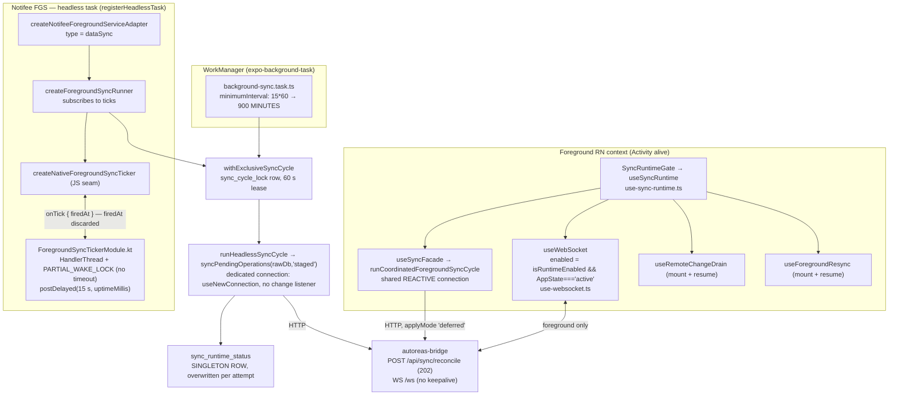
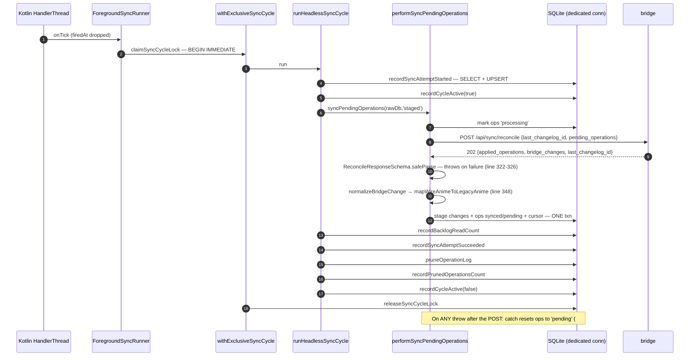
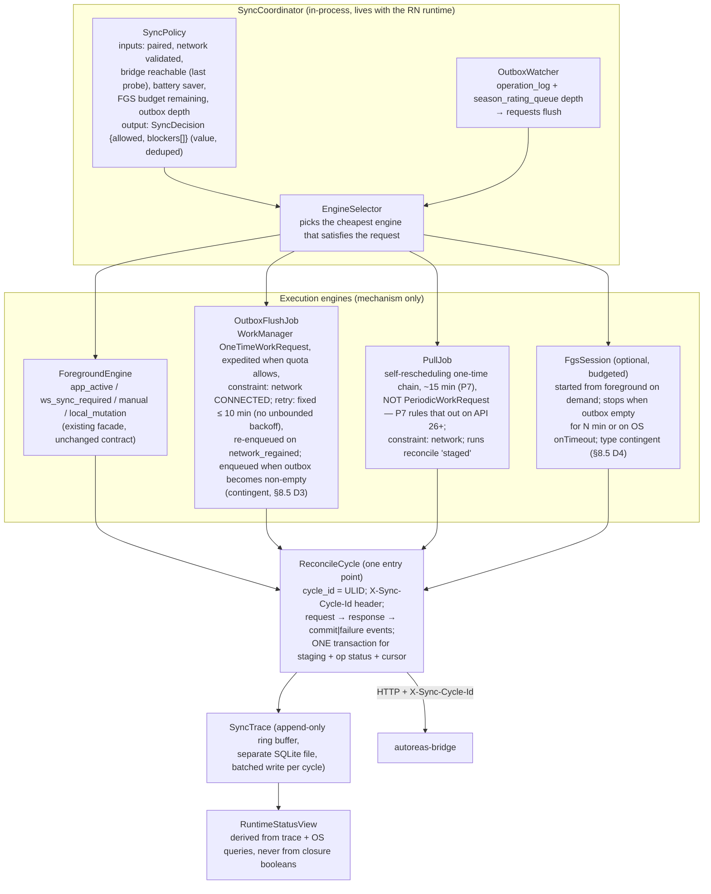
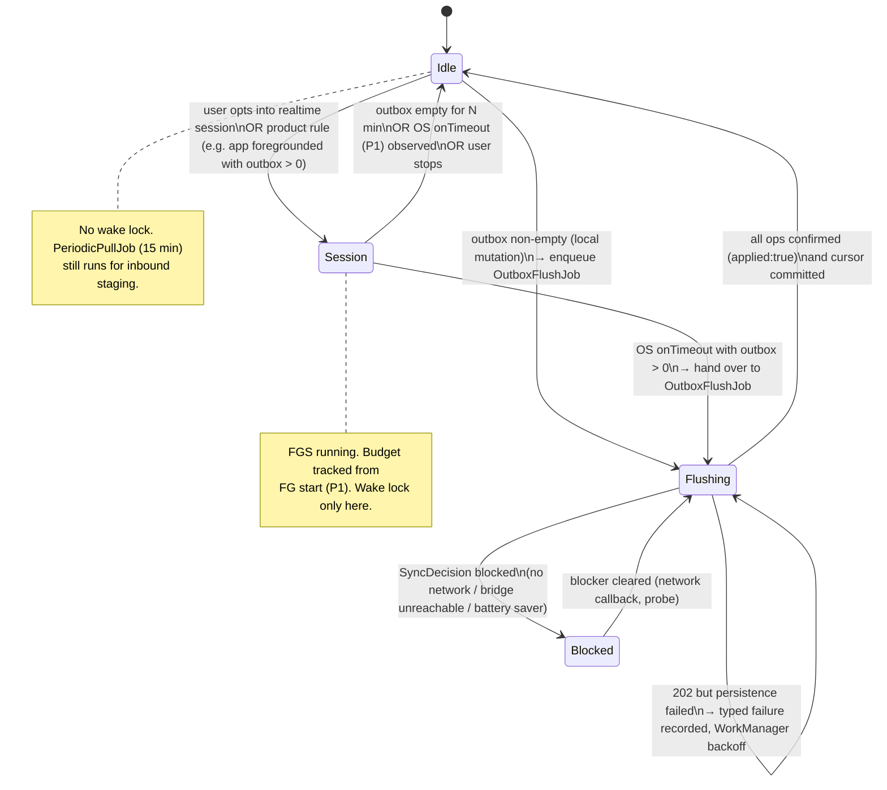
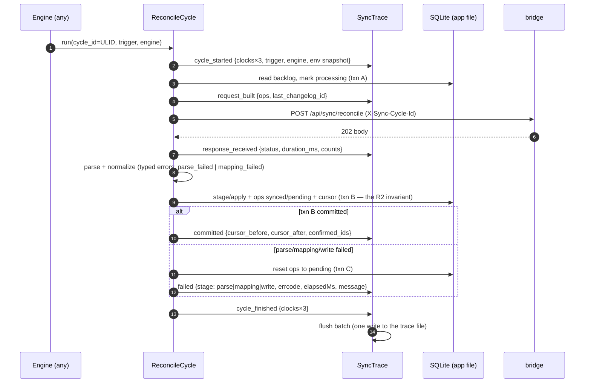

# Mobile ↔ Bridge Background Sync — Measured Redesign

**Status:** Reviewed — design only, no implementation, no production code touched. Four independent lenses plus an author adversarial pass over the sections they did not reach; **60 findings recorded and applied** (§15). One evidence-class distinction survives and is stated there: §0–§8.5, §9, §10 and Appendix A were read by an independent lens; §8.6 and §11–§14 were read adversarially by the author only. **Nothing here has been measured on a device** — every §7 verdict carries its evidence class and none is `(device)` (§0). Next gate is §10, starting with a17 and the four free operator readings in §10.4.
**Date:** 2026-09-03
**Owner:** team-mobile. Bridge-side facts contributed by team-bridge (`D:\dev\disble\autoreas-sp\autoreas-bridge`).
**Supersedes the assumptions of:** `docs/specs/changes/2026-04-10-complete-mobile-background-sync/`, `docs/specs/changes/2026-04-10-android-foreground-sync-service/`, engram `sdd/2026-07-16-fix-background-sync-execution/*`.
**Related:** ADR 007 (`docs/adr/007-measurement-gated-background-sync.md`), `docs/reports/syncthing-android-background-arquitectura.md`, `openspec/specs/local-write-serialization/spec.md`, `openspec/specs/write-failure-diagnostics/spec.md`.

---

## 0. How to read this document

Every factual claim carries an evidence tag. A claim without a tag is an opinion and is labelled as such.

| Tag | Meaning |
|---|---|
| `[CODE path:line]` | Verified in this repository at the commit this document was written against (`26f2cb6` + working tree). |
| `[SRC pkg path:line]` | Verified in third-party source installed under `node_modules/` or in the syncthing-android checkout at `D:\dev\random\syncthing-android`. |
| `[DOC url]` | Verified against the official Android developer documentation on 2026-09-03. |
| `[BRIDGE]` | Reported by team-bridge from bridge source or the `request_captures` table. Not independently re-verified by mobile; file paths are theirs. |
| `[UNMEASURED]` | Not yet observed on a real device. Must not be treated as true. |
| `[FALSIFIED]` | Tested and found false. Recorded on purpose: a falsified hypothesis is a result, not a failure (same rule as `tests/sqlite-lab/run.mjs`). |

The single most important constraint of this redesign: **no keep-alive mechanism is chosen by preference.** Each candidate is a hypothesis in §7 with a discriminating test in §10, and §8.5 states which architectural decision depends on which measured outcome.

---

## 1. Problem statement (measured)

### 1.1 What the user experiences

Changes made on the phone reach the bridge with hours of delay when the phone has been locked (screen off, PIN/fingerprint). With the app open, sync works.

### 1.2 What the bridge actually observed `[BRIDGE]`

Device `device-e5816acbff24b3f1`, 2026-09-03 UTC, from `request_captures`:

```
00:15:30  ws_connect + reconcile 202   ← flushes 5 pending ops; one was created 2026-09-01 05:17:47 (≈43 h queued), another ≈17.8 h
00:15:53  ws_disconnect (23 s session)
00:15:56  ws_connect ×2, 180 ms apart  ← two sockets from the same phone
00:16:45  ws_disconnect
00:17:51  ws_connect
00:17:53  ws_disconnect (2.2 s)
00:43:49  ws_connect
00:43:56  ws_disconnect (7.5 s)
          --- no ws_connect for the next 15 h ---
03:00:58  reconcile 202 (isolated)
          --- 12 h 21 min of total silence: no HTTP, no WS ---
15:22:06  reconcile 202
15:32:08  reconcile 202  (+602 s)
15:42:16  reconcile 202  (+608 s)
15:52:16  reconcile 202  (+600 s)
16:02:20  reconcile 202  (+604 s)
          --- zero WebSocket during that window ---
```

In the five 15:22–16:02 reconciles the phone sent `last_changelog_id: 2249` **every time**, received `202` with `last_changelog_id: 2254`, five `bridge_changes`, and `applied_operations: [{anime_id: "OmEvgfkup1huYcDa", operation: "update", applied: true}]` — and on the next cycle sent 2249 and the same pending operation again. Request and response bodies at 15:22 and 15:32 were byte-identical.

Across six weeks of `reconcile` rows (499 rows, since 2026-07-25) the inter-arrival histogram shows **44 gaps at exactly 600 s** with a clean decay (599 s: 8, 601 s: 6, 602 s: 5 …). Excluding the 560–660 s band, residues modulo 15 s are flat — there is no signal of a 15-second tick. Background-only days (2026-08-10, 2026-08-23) contain **zero** gaps ≤ 30 s and are entirely 600 s cadence; a foreground day (2026-08-12) is the opposite (53 of 58 gaps ≤ 30 s, none at 600 s).

**The 600 s cadence arrived with a build.** The `User-Agent` of reconcile requests changed on **2026-08-01** from `okhttp/4.12.0` (62 requests, 2026-07-25 → 07-31) to `okhttp/4.9.2` (430 requests, 08-01 → 09-03) — a *downgrade*, i.e. a toolchain change rather than a deliberate dependency bump, and one that moves opposite to the React Native upgrade in the same commit. (62 + 430 + 7 requests with no `User-Agent` = the 499 total `[BRIDGE]`.) 22 % of the new build's gaps fall in the 600 s band versus 3 % of the old build's (2 of 62; n is small, but the rate differs 7× and the cut coincides with the UA change). Repository history for that window: `1e16ef7 2026-07-31 fix(build): harden local APK builds`, then `f881e02`/`e650861` (startup database bootstrap) on 08-01 `[CODE git log]`. The OkHttp `User-Agent` is today the **only** build identifier in the captures, and it discriminates by accident.

**The 600 s path never commits; the foreground path does.** Grouping every reconcile by inter-arrival band `[BRIDGE]`:

```
group                          n    cursor advanced   repeated   rewound   with pending_operations
600 s band                     97          0             97         0             75 (77 %)
gaps ≤ 30 s (foreground)      222         80            142         0             70
other (> 30 s, off-band)      176         30            146         0             96
```

Zero cursor advances in the 600 s band across **all four devices**; `avances_en_600s = 0` for each. Two devices have not advanced their cursor since 2026-07-30 and 2026-08-01 respectively. 77 % of the 600 s reconciles carry a non-empty `pending_operations` — the path believes it has work and keeps believing it. Nobody ever rewound to 0 (the monotonic guard holds in the field). The shape of the 600 s band: mean 601.9 s, mean absolute deviation 2.98 s, 52 of 97 within ±1 s, reproduced on **three devices** — a timer, not a physical cycle. Only 1 of 97 band reconciles has a `ws_connect` within 60 s (versus 301 of 398 off-band); note that this WS-proximity test is **inconclusive for the background case on mobile**, because the WebSocket is only enabled while `AppState === 'active'` `[CODE use-sync-runtime.ts:56-59]`, so any background trigger — including a network regain — would show no socket activity. The dispersion argument is the one that weakens H06a.

**The 600 s path never carries fresh work, and it starts at 600 s.** Age of each pending operation on arrival (`captured_at_ms − created_at`) `[BRIDGE]`:

```
band          ops    min       mean     max
600 s band    235    8.3 h     15.3 h   36.1 h     ← never a recent operation
gaps ≤ 30 s    98   −1.2 s      8.9 h   38.6 h     ← fresh work travels here
```

The negative minimum is clock skew: the phone's wall clock runs ≈ 1 s ahead of the PC's (relevant to §9.3). Defining a background session as a run of reconciles separated by a gap > 660 s, the first four intervals of the six clean sessions are 606.5/600.4/600.2, 600.4/600.1/600.1/605.5, 600.8/600.1/600.0/602.0, 600.4/605.6/600.0/603.5, 605.1/607.7/599.9/601.0, 602.5/607.6/600.1/604.2 — **no session starts near 300 s**, so a Doze-light ramp (5 min doubling to an OEM maximum) is not what the data show. Whatever wakes this path arrives at its final period from the first cycle: indistinguishable from a fixed software timer with bridge data alone. Server-side `duration_ms` is uninformative for this question (it starts after TCP and body arrival, so radio wake-up cost is invisible to it): the 600 s band is even *faster* (mean 19.0 ms vs 22.1 ms) while carrying 5× more operations.

**The same device committed a 1-change batch and failed a 5-change batch.** `device-e5816acbff24b3f1` sent `2248` at 03:00:58, received `2249` with one `bridge_changes` entry, and adopted it (it sent `2249` at 15:22). At 15:22 it received `2254` with five entries and never adopted them. The transaction is not broken in general; the failure depends on the batch. The bridge also emits `change_type: "update"` for a record that is new to the device (`0Z3g0FpDeZEv0Gsl`, 11 `changed_fields`), which mobile applies as `UPDATE … WHERE _id = ?` → 0 rows, silently (Appendix A10).

### 1.3 What this tells us before any redesign

1. **Sync is not "not happening": the requests arrive and the bridge accepts them.** That much is measured `(bridge)`. What happens next on the phone is an **inference, not a measurement**: the same input produced the same output five times, so *something* between the bridge's `202` and the local `COMMIT` fails deterministically — but `request_captures` records the bridge **writing** the response, never the phone **reading** it. Two families remain open and produce identical bridge-side symptoms: the response was received and its persistence failed (H01c), or the response was never received or read (H01g). One operator reading of `last_failure_message` (O1) separates them.
2. **The 15-second native tick — the whole point of the July 2026 fix — is not what reaches the bridge in the background.** Something with a 10-minute period is, and that scheduler exists nowhere in this repository's code or history (§7 H06).
3. **The "15-minute WorkManager floor" every prior design relied on has never existed in production.** It runs every 15 hours (§7 H02, `[SRC]` confirmed).
4. **Nobody can currently say which code is running on the phone.** No build identifier is captured anywhere in the sync telemetry (§10.1).
5. **The observability that exists on the phone is a single overwritten row** (`sync_runtime_status`, `[CODE src/infrastructure/db/schema/database.schema.ts:113-143]`), while the bridge already keeps four weeks of per-request history. The two are not correlated by any key.

---

## 2. Requirements

These replace the implicit "continuous sync" goal of the April designs with what the measured problem actually needs. Each is testable.

| ID | Requirement | Rationale | Acceptance (measurable) |
|---|---|---|---|
| R1 | **Outbox delivery latency is bounded while the device is locked.** A local mutation whose first delivery attempt fails MUST reach the bridge within a bounded time after the bridge becomes reachable again, without the user reopening the app. The phone cannot observe "bridge reachable" directly (the bridge is a desktop app that is not always-on, §5; a `CONNECTED`/`VALIDATED` network only proves the LAN is up), so the bound is expressed in terms the phone controls: **while the outbox is non-empty, a delivery attempt MUST be scheduled at most every T_retry, with T_retry ≤ 10 min, and re-scheduled immediately on `network_regained`.** | The 43 h and 17.8 h queue times in §1.2 are the user-visible defect. The first attempt already fires in the foreground at tap time, **fire-and-forget** (`void syncPendingOperations(rawDb)`, not awaited) `[CODE anime-mutation.helpers.ts:225,259-262]`; the R1 case is therefore precisely "the bridge was down (or unreachable) when the user tapped, and the phone was then locked". | p95 ≤ 15 min, p100 ≤ 60 min from the first bridge capture of *any* request from this device after an outage to `202` with `applied: true` for the queued operation, measured from bridge captures + mobile trace over ≥ 3 nights; and the trace shows attempt spacing ≤ T_retry while the outbox was non-empty (a12). Doze maintenance cadence may stretch attempts beyond T_retry — that stretch is what a12 measures and what D4 escalates on. |
| R2 | **A `202` MUST leave a durable local footprint.** Either the cursor advances and confirmed ops become `synced` in the same transaction, or a typed failure with `errcode`/`stage`/message is recorded and visible. | §1.2 shows five accepted reconciles with no local effect and no visible diagnosis. | Zero cycles in the trace with `response=202` and no `commit` or `failure` event. |
| R3 | **Inbound freshness on unlock/foreground is immediate.** Bridge-side changes made while the phone was locked MUST be visible within one reconcile after the app becomes active. | The user is not looking at a locked phone; pull freshness matters when they look. Already largely satisfied by `useForegroundResync` + `sync_required` on WS connect `[CODE src/features/sync/use-sync-runtime.ts:130-139]`. | One reconcile on `app_active` converges; verified by trace + captures. |
| R4 | **Status shown to the user MUST come from measured runtime truth, not from JS closure booleans.** | `isForegroundServiceRunning` stays `true` after the OS stops the service `[CODE notifee-foreground-service-adapter.helpers.ts:34-35,189-201]`. | Settings tile disagrees with `dumpsys activity services` in 0 of N sampled states. |
| R5 | **Battery cost is bounded and proportional to work.** No wake lock is held while the outbox is empty and no user-initiated session is active. | Today a `PARTIAL_WAKE_LOCK` is held for the whole ticking lifetime with no timeout `[CODE modules/foreground-sync-ticker/.../ForegroundSyncTickerModule.kt:57-60,84,95]` and ~9 write transactions run every 15 s (§3.3). | `dumpsys batterystats` wake-lock time for `ForegroundSyncTicker:ticking` ≈ 0 when outbox is empty. |
| R6 | **Every sync attempt is traceable end to end and correlatable with the bridge.** | Bridge keeps `request_headers` verbatim `[BRIDGE telemetry.go:57]`; mobile keeps nothing per attempt. | Every mobile trace cycle joins to exactly one bridge capture by `X-Sync-Cycle-Id`. |

| R8 | **No cycle can hang.** Every await inside a reconcile cycle MUST be bounded: the HTTP request by an `AbortSignal` timeout, the whole cycle by a deadline shorter than the host job's runtime limit, and the write-door chain by a settle guarantee (every queued write resolves or rejects, never neither). A cycle that exceeds its deadline MUST terminate itself with a typed `transport`/`write` failure and signal completion to its host. | H06h: today nothing is bounded — `BridgeClient` has no timeout and no `AbortSignal` `[CODE grep over src/infrastructure/api/bridge-client/]`, and `expo-background-task` awaits a `CompletableDeferred` that an un-signalled JS task never completes `[SRC BackgroundTaskScheduler.kt:230-245]`. The consequence is not a slow cycle but a **permanently suspended job**, killed at the host's 10-minute limit and re-enqueued forever. This is the single defect that most plausibly produces both the 600 s cadence and the never-advancing cursor. | Cycle deadline < host limit, enforced in a test; zero cycles in the trace with `cycle_started` and no terminal event other than a recorded process kill; a17 shows no 10-minute job timeout in `logcat`. |

**Non-goals (explicit):** realtime push to a locked phone over the LAN (Doze suspends listening sockets and the bridge is not always-on `[BRIDGE]`, `[DOC doze-standby]`); iOS; changing the merge/conflict semantics; discovery (mDNS); replacing `BridgeClient` as the single transport owner.

**Optional product decision (R7, not a requirement):** "realtime while locked" as an opt-in *session* with a visible notification and a known battery cost. The architecture in §8 makes this possible as a budgeted FGS session; it does not depend on it.

---

## 3. Current architecture, as built

### 3.1 Component map



Evidence: `[CODE use-sync-runtime.ts:56-59,60-86,123-139,173-188]`, `[CODE notifee-foreground-service-adapter.helpers.ts:55-105,142-172]`, `[CODE foreground-sync-runner.helpers.ts:13-60]`, `[CODE native-foreground-sync-ticker.helpers.ts:51-105]`, `[CODE modules/foreground-sync-ticker/android/src/main/java/expo/modules/foregroundsyncticker/ForegroundSyncTickerModule.kt]`, `[CODE background-sync.task.ts]`, `[CODE background-sync.constants.ts]`, `[CODE headless-sync-cycle.helpers.ts:22-79]`, `[CODE sync-cycle-lock.helpers.ts]`, `[SRC react-native-notify-kit dist/NotifeeApiModule.js:36 — registerHeadlessTask]`.

### 3.2 Execution paths and who is alive when

There are **nine** trigger sources, not eight `[CODE sync-runtime-status.types.ts:7-19]`: `bootstrap`, `manual`, `app_active`, `network_regained`, `local_mutation`, `local_mutation_write`, `ws_sync_required`, `foreground_service`, `background_task`.

| Path | Trigger source | Connection | Apply mode | Alive when |
|---|---|---|---|---|
| Foreground facade | `bootstrap`, `app_active`, `network_regained`, `ws_sync_required`, `manual`, `local_mutation` | shared reactive | `deferred` (writes `animes`) | Activity alive; JS listeners fire whenever the RN context is alive |
| FGS tick | `foreground_service` | dedicated (`useNewConnection`) | `staged` (writes `pending_remote_changes`) | While the Kotlin ticker fires **and** the native module is compiled into the installed build — otherwise the ticker is a silent no-op `[CODE native-foreground-sync-ticker.helpers.ts:45-49,66-69]` |
| WorkManager | `background_task` | dedicated | `staged` | Every **900 minutes** (see H02), or 60 min after a foreground session `[SRC expo-background-task BackgroundTaskScheduler.kt:222-227]` |
| WebSocket | `ws_sync_required` | — | — | `AppState === 'active'` only `[CODE use-sync-runtime.ts:56-59]` |

### 3.3 Anatomy of one FGS tick (every 15 s, forever, wake lock held)



**Counted, not estimated:** the success path opens **11 `BEGIN IMMEDIATE` transactions when the outbox is non-empty and 10 when it is empty** (the "mark processing" write at `reconcile.helpers.ts:296-302` is conditional), all through the file-keyed write door `[CODE client.helpers.ts:276-329]`. It can exceed 11: `syncPendingOperations` runs `performSyncPendingOperations` in a `do…while (rerunRequested)` loop `[CODE reconcile.helpers.ts:235-242]`, so a trigger arriving mid-cycle adds a whole batch again.

Two details make this worse than a count suggests, and both were understated in an earlier draft:

- **The six status writes are read-then-write *across* a transaction boundary, not inside one.** `persistSyncRuntimeStatusPatch` calls `getSyncRuntimeStatusSnapshot` at line 141 — a plain SELECT on the shared connection — and only then opens `withLocalWrite` at line 164 `[CODE sync-runtime-status.helpers.ts:141,164]`. The value read is therefore never protected by the transaction that writes it. That is precisely the deferred read-then-write shape that produced `SQLITE_BUSY_SNAPSHOT` in August (`openspec/changes/archive/2026-08-12-sqlite-write-lock-contention/`), and it is still in the hot path, executed six times per tick.
- **Ten of the eleven transactions are pure observability.** Only the post-response transaction carries sync truth; the cycle-lock pair and the six status writes exist to record that work happened. The current design spends ~90 % of its write budget describing itself, every 15 seconds, while holding a wake lock — which is the strongest single argument for R5 and for moving diagnostics off the application database entirely (§9.2).

### 3.4 Status and diagnostics today

- `sync_runtime_status` is one row, id = 1, `onConflictDoUpdate` `[CODE sync-runtime-status.helpers.ts:164-200]`. The table declares 17 columns but only **13 are ever written**: `lastNoOpReason`, `foregroundServiceCallbackStartedAt` and `lastPendingOperationsCountAtStart` exist in the schema `[CODE database.schema.ts:134-136]` and are omitted by `persistSyncRuntimeStatusPatch`, which enumerates every column explicitly `[CODE sync-runtime-status.helpers.ts:142-200]` — they are permanently NULL and nothing reads them. So the diagnostics surface is not merely overwritten, it is **narrower than the schema suggests**: three of the fields a reader would reach for first do not exist in practice. And it keeps **no history**: with the screen off for 8 h at a 15 s cadence, ~1 920 attempts overwrite each other and Settings shows the last one. (`lastFailureMessage` and `lastTriggerSource` *are* written and do reach Settings, so O1/O2 stand.)
- `isForegroundServiceRunning` and `canShowPersistentNotification` are JS closure booleans set by the adapter, not read from the OS `[CODE notifee-foreground-service-adapter.helpers.ts:34-35,174,185,197]`.
- The Kotlin module emits `firedAt = SystemClock.elapsedRealtime()` on every tick `[CODE ForegroundSyncTickerModule.kt:45]`; the JS listener type is `() => void` and discards it `[CODE native-foreground-sync-ticker.types.ts:18-21; .helpers.ts:74-76]`.
- No request carries a client-generated correlation id; `BridgeClient` sends `Content-Type` and `Authorization` only `[CODE bridge-url.helpers.ts:41-56]`.
- No build identifier (git sha / runtime version) is recorded with any attempt.

---

## 4. Platform facts (verified against official documentation)

| # | Fact | Evidence |
|---|---|---|
| P1 | Apps targeting Android 15+ may run `dataSync` foreground services for **6 hours total per 24 h** while in the background; the system then calls `Service.onTimeout(int,int)`, the service has "a few seconds" to `stopSelf()`, otherwise `RemoteServiceException`. Starting another `dataSync` FGS afterwards throws `ForegroundServiceStartNotAllowedException` until the user brings the app to the foreground, which resets the timer. The limit is shared across all `dataSync` services of the app. | `[DOC https://developer.android.com/develop/background-work/services/fgs/timeout]` |
| P2 | This app targets SDK 35 and declares its FGS as `dataSync`. **P1 applies.** | `[CODE app.json expo-build-properties.android.targetSdkVersion: 35]`, `[CODE plugins/withAndroidForegroundSync.js:12]`, `[CODE notifee-foreground-service-adapter.helpers.ts:161]` |
| P3 | `react-native-notify-kit` implements `onTimeout(int,int)` → `handleTimeout` → `stopForegroundCompat(); stopSelf(startId)` and posts native event `TYPE_FG_TIMEOUT = 9`. The mobile adapter's `onBackgroundEvent` handles only `pressAction.id === 'stop-sync'`. Whether type 9 reaches JS is unverified; either way it is ignored. | `[SRC react-native-notify-kit android/.../ForegroundService.java:345,543-571; event/NotificationEvent.java:42]`, `[CODE notifee-foreground-service-adapter.helpers.ts:130-140]` |
| P4 | `dataSync` FGS **cannot be started from `BOOT_COMPLETED`** on Android 15+. `connectedDevice`, `specialUse`, `remoteMessaging`, `shortService`, `systemExempted` can. `specialUse` requires `PROPERTY_SPECIAL_USE_FGS_SUBTYPE` reviewed by Google Play (not applicable: this app is sideloaded, see memory "Delivery model: local merge"). `connectedDevice` requires one of `CHANGE_NETWORK_STATE`/`CHANGE_WIFI_STATE`/`CHANGE_WIFI_MULTICAST_STATE`/NFC/IR or a Bluetooth/UWB/USB grant and is intended for "interactions with external devices … requiring a network connection". | `[DOC https://developer.android.com/develop/background-work/services/fgs/service-types]` |
| P5 | In Doze the system **suspends network access, ignores wake locks, defers standard alarms, does not run JobScheduler/WorkManager**, except during maintenance windows whose frequency decreases with idle time. Apps on the battery-optimization exemption list "can use the network and hold partial wake locks during Doze and App Standby". **A foreground service does not exempt an app from Doze**; it only prevents App Standby from marking the app idle. | `[DOC https://developer.android.com/training/monitoring-device-state/doze-standby]` |
| P6 | The exemption is requested via `ACTION_REQUEST_IGNORE_BATTERY_OPTIMIZATIONS` (direct add) or `ACTION_IGNORE_BATTERY_OPTIMIZATION_SETTINGS` (settings screen). Google Play policy restricts the former; this app is not distributed through Play. This app declares neither permission nor flow today. | `[DOC doze-standby]`, `[CODE plugins/withAndroidForegroundSync.js:13-18]` |
| P7 | `expo-background-task` interprets `minimumInterval` in **minutes**. On Android 8+ it does **not** use `PeriodicWorkRequest`: it enqueues a `OneTimeWorkRequest` with `setInitialDelay(Duration.ofMinutes(interval))` and, after each run, re-enqueues the next one with `ExistingWorkPolicy.APPEND` (a self-rescheduling chain; `PeriodicWorkRequest` is the pre-Oreo path only). If the worker fires while the app is in the foreground it runs nothing and reschedules at `min(60, interval)` minutes. The worker returns `Result.failure` on exception — never `retry` — so there is no backoff loop. | `[SRC expo-background-task android/.../BackgroundTaskConsumer.kt:49-52; BackgroundTaskScheduler.kt:76-166,205-240; BackgroundTaskWork.kt]` |
| P8a | `react-native-notify-kit` runs the foreground-service runner through `AppRegistry.registerHeadlessTask`, and that task is started with `taskTimeout = 0` (no timeout), unlike notification-event tasks which use 60 000 ms. | **Verified** `[SRC react-native-notify-kit dist/NotifeeApiModule.js:36; NotifeeEventSubscriber.kt:63,116-121; HeadlessTask.kt:229,238]` |
| P8b | Therefore React Native does not pause JS timers while that task is active — which would contradict the root-cause statement of the July 2026 fix ("Notifee's callback runs in the main RN context, not as a headless task") for the installed version `^10.5.0`. | **`[UNMEASURED]` — this is H09, not a verified fact.** P8a proves a headless task is registered; it does not prove timer behaviour. a13 is the test. An earlier draft asserted this and the ADR declared the July premise superseded on its strength; both are now hedged. |
| P9 | AOSP `PowerManagerService.setWakeLockDisabledStateLocked()` disables a `PARTIAL_WAKE_LOCK` in device-idle when the uid is off both allowlists **and** its process state is worse than `PROCESS_STATE_BOUND_FOREGROUND_SERVICE` (5). Only `PROCESS_STATE_FOREGROUND_SERVICE` (4) or better survives Doze. An earlier draft of this row named `PROCESS_STATE_RECEIVER` (11) — that is the threshold of the separate `NO_CACHED_WAKE_LOCKS` branch, and using it implied, wrongly, that a receiver- or headless-hosted process keeps its lock. **Corollary:** `NetworkPolicyManager.isProcStateAllowedWhileIdleOrPowerSaveMode` uses the same bound, so a process with a *live* foreground service keeps **network** in Doze — P5's blanket "suspends network access" is coarser than the implementation. This makes H05b (module absent from the installed build) a better bet than H04, and argues for running a09 before a03. | `[UNMEASURED]` — corrected by the Android reviewer from AOSP knowledge; the reviewer could **not** fetch the method (googlesource returned a truncated page) and said so. a03 is the arbiter; do not treat this row as settled. |

---

## 5. Bridge-side facts `[BRIDGE]`

Reported by team-bridge on 2026-09-03; file paths refer to the bridge repository.

**Observability.** `request_captures` (`internal/observability/requestcapture/store.go`) records every HTTP request and WS lifecycle event per device (`ws_connect`, `ws_disconnect`, `ws_broadcast`, `ws_reconcile`, `reconcile`) with `request_id`, `captured_at_ms`, `duration_ms`, `outcome`, `http_status`, sanitized headers and bodies (64 KB cap), and correlations. Retention 5 000 rows shared across kinds (≈ 4 weeks for `reconcile`, ≈ 10 days for WS). Queryable through MCP server `autoreas-request-mcp` (`search_requests`, `summary_requests`, `get_correlation_timeline`, `search_events`). **Custom headers pass through verbatim** (`telemetry.go:57`, allowlist retained for API compatibility only) — including, today, `Authorization: Bearer <token>` in cleartext.

**Wire shape of `bridge_changes[].snapshot`** (`internal/api/contracts/contracts.go:26-69`): optional fields are **absent, not `null`** (`omitempty` on pointers: `totalEpisodes`, `kind`, `lastWatchedAt`, `premieredAt`, `createdAt`, `deletedAt`, `cover`, `sourceUrl`, `folder`, `studios`, `origin`, `durationMinutes`; `snapshot` itself is `omitempty`); always present: `id`, `name`, `status`, `episodesWatched` (**float64**), `active`, `firstCycle` (**int** in responses, while mobile sends a boolean in requests), `days`, `genres`, `modified_at`. The same `record_id` can appear more than once in one array (changelog 2250 and 2251 both touch `qGTEJ5g3UnW4Dvfm`; order matters, the later wins). **`AnimeChange.ID` is `json:"-"`** (`contracts.go:63`): individual changes carry no changelog id, so the cursor can only advance to the response's global `last_changelog_id` after *all* entries are consumed — partial progress is impossible by contract. Mobile's `WireAnimeSchema` `[CODE anime.schema.ts:100-121]` already uses `.optional()` for the omitted fields, `z.number()` for `episodesWatched`, and an int 0/1 for `firstCycle`, which is why T1 passes.

**HTTP contract.** Reconcile returns **202**, never 200. **No `409` is emitted anywhere**; conflicts arrive as `conflicts: []` in the 202 body. `applied_operations` is always present, one entry per submitted operation, in order; `applied: false` only for unsupported operations or `AnimePatchOutcomeConflict` (`internal/api/contracts/contracts.go:292`). `404` on `GET /api/seasons/active` is the normal "no open season" answer (152 occurrences). `GET /api/animes/changes?since=<id>` → `{changes, last_changelog_id}` exists. **The bridge echoes the device's own just-applied write back inside `bridge_changes`** (ack persists the cursor before listing; the device's patch creates rows above it). **Contract trap:** after `PruneAcknowledgedChangelog` empties the table, `SELECT MAX(id)` is NULL and the response carries `last_changelog_id: 0` (`internal/sync/changelog_store.go:81,162`) — seen twice in captures. `device_sync_state.last_seen_at_ms` is written only by reconcile ack: it means "last reconcile", not "last seen".

**WebSocket.** No ping/pong, no read deadline, no idle timeout, no close codes in production Go; `http.Server{Handler}` without timeouts (`internal/api/server.go:145`). The bridge cannot detect a dead phone: 188 `ws_connect` vs 121 `ws_disconnect` = 67 zombie hub registrations. Two sockets from the same device both stay registered (`Hub.Register` dedupes by `<deviceID>-<seq>`, `websocket_handler.go:249`; `TestWebSocketReconnectDoesNotLeakClients` tests sequential reconnect only). `sync_required {reason: "connection_gap_assumed"}` is sent on every connect. Incoming `reconcile`/`season_rating` frames are fire-and-forget. `hub_capture.go:29` records `outcome: "closed"` with no code or reason, so an orderly close and a Doze death are indistinguishable.

**Deployment.** Not always-on: a Wails desktop app, alive while the app runs; optional `HKCU\...\Run` autostart at login. Binds `0.0.0.0:9876` (was 8080 until 2026-08-28). No mDNS/discovery; LAN IP from DHCP via `preferredOutboundIP` (`server.go:239`); no stable hostname. Windows primary. No rate limiting, no WS connection cap.

---

## 6. What we take from syncthing-android, and what we deliberately do not

Source: `docs/reports/syncthing-android-background-arquitectura.md`, cross-checked against `D:\dev\random\syncthing-android` with CodeGraph.

| Lesson | Verified in syncthing source | Adopt? | Adaptation for mobile-bridge |
|---|---|---|---|
| Policy vs mechanism: `RunConditionMonitor` answers only "should we run?" and returns a value with reasons; the service acts on it. | `[SRC RunConditionMonitor.java:75-104,168]` | **Yes** | `SyncPolicy` (§8.2) evaluates paired / network validated / bridge reachable / battery saver / FGS budget remaining and yields `SyncDecision {allowed, blockers[]}`; engines never decide. |
| The decision is a value with `equals()` → dedupes broadcast storms and gives honest UI copy. | `RunConditionCheckResult` | **Yes** | `SyncDecision` compared structurally; Settings shows blockers by name. |
| The service lives always; the work toggles. | `SyncthingService` state `DISABLED` = alive, binary off | **Adapted, not copied** | On Android 15 a `dataSync` FGS *cannot* live always (P1). What lives is the in-process **runtime coordinator**; the FGS is a **budgeted session** started from the foreground and stopped when idle (§8.3). |
| `START_STICKY` + `BootReceiver` restart the engine after kill/boot. | `[SRC SyncthingService.java:245,273]`, `BootReceiver` | **Not available to us at all** (H20) | Not a design choice: our FGS is `react-native-notify-kit`'s, which returns `START_NOT_STICKY` `[SRC ForegroundService.java:308,317]`, and `dataSync` cannot start from `BOOT_COMPLETED` or `MY_PACKAGE_REPLACED` on targetSdk 35 (P4). Syncthing's restart property simply does not transfer. Re-arming after a kill, a reboot or a local rebuild is WorkManager's job alone, and the RN runtime's cold start becomes a latency term in R1. |
| Persist the continuation point every cycle (`lastEventId`). | `EventProcessor` | **Already done** | `bridge_config.lastChangelogId` with a monotonic guard `[CODE last-changelog.helpers.ts:21-26]`. R2 adds the invariant that the *whole* post-202 footprint is one transaction with a visible failure path. |
| Poll with `Handler.postDelayed`; do not wake the device; let events accumulate. | `[SRC EventProcessor]` | **Yes, for pulls** | Inbound changes accumulate on the bridge; pull on wake/foreground (R3). No 15 s poll while locked. |
| Wake lock is opt-in and off by default; rely on FGS + battery-exemption dialog. | `[SRC SyncthingRunnable.java:127-132,215-217]` | **Measure first** | Whether the exemption is needed is H04/H05. If confirmed, request it explicitly (sideloaded app, no Play policy constraint, P6). |
| Shutdown defensively before start; two-phase stop with wait. | `SyncthingService.shutdown()` | **Yes** | FGS session stop: stop ticker → flush in-flight cycle (bounded) → `stopForegroundService`; recorded in trace. |
| **User-Initiated Data Transfer job** (`setUserInitiated(true)`, API 34+): no 6 h cap, must originate in a user action, shows progress. | Report §6.3 options table | **Rejected for R1, kept for R7** | It is the mechanism Android designed for user-visible transfers, and it is the right answer for the optional "sync now, intensively" session (R7) — but by definition it cannot start while the phone is locked and unattended, which is R1's entire scenario. Recording the rejection reason matters because the source report lists it and silence would look like an oversight. |
| `BootReceiver` also handling `MY_PACKAGE_REPLACED`, not just `BOOT_COMPLETED`. | `[SRC syncthing BootReceiver.java]`; report §4 | **Yes, and it matters more here than there** | This APK is replaced by every local build (`1e16ef7` moved to `bunx eas-cli build --local`), so package-replacement is a routine event, not a rare one. Whatever re-arms background work must re-arm on `MY_PACKAGE_REPLACED`; `dataSync` cannot start from either broadcast on targetSdk 35 (P4), so what re-arms is the WorkManager enqueue, not an FGS. |
| **Not applicable:** the sync engine is a separate OS process (Go binary) with its own TCP connections. | §0 of the report | **No** | Our engine is JS inside the RN runtime; it dies with the process and its network access is the app's. Every keep-alive assumption from syncthing that depends on the Go daemon owning connections does not transfer. |
| **Not applicable:** `specialUse`/`connectedDevice` FGS types as an always-on escape hatch. | Report §6.3 | **Not now** | `connectedDevice` is defensible ("network connection to an external device on the LAN") and has no 6 h cap, but choosing it *before* measuring H03/H04 would be choosing by preference. It is a §8.5 contingency. |

---

## 7. Falsifiable hypotheses

**Verdict vocabulary, and the evidence class it is spent on.** An earlier draft used CONFIRMED to mean "measured true" and then spent it on a grep. In a document whose standard is *measured, not assumed*, that is the exact failure it exists to prevent, so a verdict is now always **two things**: a claim about truth, and the class of evidence that bought it. **Nothing in §7 has yet been measured on a device.**

| Evidence class | Meaning |
|---|---|
| `(device)` | Observed on the actual phone under the §10 protocol. **No row carries this yet.** |
| `(source)` | Read from code in this repository or in `node_modules` — decisive about what the code *says*, silent about what the device *does*. |
| `(bridge)` | Reported by team-bridge from `request_captures`. Strong, independent of the phone, and **not verifiable by mobile** — it is testimony, not our own measurement. |
| `(docs)` | Official Android documentation, fetched and quoted. |

| Verdict | Meaning |
|---|---|
| **CONFIRMED** | True at the stated evidence class. `CONFIRMED (source)` never implies device behaviour. |
| **FALSIFIED** | False at the stated evidence class. |
| **SUPPORTED** | Consistent with the evidence, mechanism not yet closed. |
| **WEAKENED** | Evidence pushes against it without settling it. |
| **UNMEASURED** | No evidence either way. |

Two rules follow, and both were violated by the earlier draft: a **conditional** hypothesis ("while X holds, Y happens") cannot be falsified by observing `¬Y` while X is unknown — if X is false the conditional is vacuously true; and a verdict resting on `(bridge)` testimony must say so, because mobile cannot re-derive it. The ADR's separate `CONFIRMED | FALSIFIED | NOT_FALSIFIABLE` wording is aligned to this table.

### 7.1 Summary table

Ids are stable once assigned, so the sequence has two deliberate gaps: **H14 was never assigned**, and **R7 is prose-only** (§2), because it is an optional product decision rather than a requirement. Sub-lettered ids (`H01a–g`, `H05b–c`, `H06a–h`) are refinements of their parent, not independent hypotheses.

| ID | Statement | Status | Decides |
|---|---|---|---|
| H01 | The post-`202` local persistence fails deterministically on the phone; cursor and outbox status never commit. | **SUPPORTED** `[BRIDGE]` 5/5 identical cycles; root cause H01a/b/c pending | R2 design; Phase 0 priority |
| H01a | …because `ReconcileResponseSchema`/`WireAnimeSchema` rejects the response body. | **FALSIFIED** 2026-09-03 — T1 (§10.3) ran the byte-exact 15:22:06 body (3 269 bytes, `hex()`-extracted by team-bridge) through `ReconcileResponseSchema.safeParse` under Bun 1.4.0: `success: true`, 5 changes, `applied: true`, `last_changelog_id: 2254` | |
| H01b | …because `mapWireAnimeToLegacyAnime`/`normalizeBridgeChange` throws on a snapshot. | **FALSIFIED** 2026-09-03 — T2: all five snapshots map without throwing; `changed_fields` normalize to local names | |
| H01c | …because the post-response **transaction itself** fails deterministically for this input: in `'deferred'` mode `applyRemoteChanges → applyAnimePartial/upsertAnime` on one of the five changes (e.g. `0Z3g0FpDeZEv0Gsl`, created on the PC at 03:03 UTC, absent locally, 11 changed fields; `nIyLhm1n2woMj5Bl` with `deletedAt`), or in `'staged'` mode a write failure. | **SUPPORTED by elimination** (H01a/b/d/e falsified; same input → same outcome five times ⇒ deterministic, input-dependent). Root cause pending: `last_failure_message` (§10.4 O1) names the stage; a device-free replay of `applyRemoteChanges` over `bun:sqlite` is the next test (§10.3 T5) | Which apply mode the 600 s path uses (O2) |
| H01d | …because `pending_remote_changes` has a UNIQUE constraint violated by re-staging. | **FALSIFIED** `[CODE client.helpers.ts:191-201]` — no constraint | |
| H01e | …because the bridge does not acknowledge the operation in `applied_operations`. | **FALSIFIED** `[BRIDGE]` — `applied: true` in all five | |
| H01f | …because the staging (`pending_remote_changes`) or lock (`sync_cycle_lock`) table is missing on a device whose DB was marked ready before those tables existed (migrations are skipped once `user_version = 1`). | **FALSIFIED** `[CODE startup.constants.ts REQUIRED_SCHEMA_TABLES]` — both tables are in the required list; `validatePreparedSchema` would fail foreground startup, and `prepareHeadlessDatabase` would return `SchemaNotReadyError` → no POST at all | |
| H01g | **…or the phone never received or read the `202` at all** — the request left, the response was lost (Doze suspending the socket after send, radio drop, the process killed between send and read). `request_captures` records the bridge's **write** of the response, never the phone's **read** of it. | UNMEASURED — **and it fits every `[BRIDGE]` symptom exactly as well as H01c**: identical repeated requests, cursor stuck at 2249, the operation re-sent. This alternative was missing from the analysis, which is why §1.3 now states the discarded-response reading as an inference rather than a measurement. O1 discriminates it in one reading: a transport read failure populates `last_failure_message` with a network error, not a write or parse error. H06h also predicts it (the process is killed mid-cycle). | Whether the defect is in our persistence or in the transport; changes nothing about R8, which bounds both |
| H02 | The WorkManager floor runs every ≈ 15 h, not 15 min. | **CONFIRMED for the completing path** `[SRC P7]` + `[CODE background-sync.constants.ts]`; consistent with the 12 h 21 min gap `[BRIDGE]`. **Re-scoped by H06h:** a job that never completes never reaches the "schedule next task" call at the end of `runTasks`, so the 900-minute delay is never re-applied and the interrupted path re-runs every ~10 min instead. Both behaviours are real and they explain different bands of the same histogram. | Phase 0 fix; every prior design's fallback assumption |
| H03 | On Android 15+ the `dataSync` FGS is stopped by the OS after 6 h cumulative background time; JS state keeps reporting it running. | Mechanism **CONFIRMED** `[DOC P1][SRC P3]`; occurrence on the user's device **UNMEASURED** (needs API level) | §8.3 budgeted-session model; R4 |
| H04 | Without FGS process state, Doze disables the partial wake lock; `postDelayed` (uptime clock) freezes; ticks fire only when something else wakes the CPU. | UNMEASURED; docs (P5) and AOSP memory (P9) disagree in granularity | Whether any timer-based engine can work while locked; whether the battery exemption is required |
| H05 | While the FGS is alive and its lock honoured, the 15 s tick reaches the bridge every 15 s. | **UNMEASURED — antecedent unverified.** An earlier draft labelled this FALSIFIED, which was a logic error: H05 is a *conditional*, both of its antecedents are unmeasured (H03's occurrence, H04), and H05b proposes the ticker module may be absent from the installed build — which would make H05 **vacuously true**, not false. What `[BRIDGE]` actually falsifies is the weaker, unconditional claim below (H05c). | Nothing until a09/a03 establish the antecedent |
| H05b | …because the installed build does not contain the compiled `ForegroundSyncTicker` module, so the JS seam is a silent no-op while the FGS notification still shows. | UNMEASURED; July verify report left the rebuild pending (engram #5463) | Build identification requirement (§10.1) |
| H05c | **Unconditional form:** on 2026-08-10 and 2026-08-23 the 15 s tick did not reach the bridge. | **FALSIFIED (bridge)** — zero gaps ≤ 30 s in those windows `[BRIDGE]`. This is the claim the data supports; it says the tick did not arrive, not why. | Motivates a09 (is the module even compiled in?) before a03 |
| H06 | A scheduler with an exact 600 s period exists in the mobile stack and is the only background path reaching the bridge. | **CONFIRMED as a phenomenon** `[BRIDGE]` 44 gaps at exactly 600 s; source identified as H06h below | Nothing may be designed on top of an unexplained scheduler |
| H06a | …it is `network_regained` (`Network.addNetworkStateListener`) firing on a periodic Wi-Fi reconnect while the screen is off. | **WEAKENED** `[BRIDGE]` — 600 s band has mean 601.9 s, MAD 2.98 s, 52/97 within ±1 s, on three devices: a timer, not a radio cycle. NOT falsified by the "no `ws_connect` within 60 s" test, which is inconclusive here (WS is foreground-only). Further weakened at source: `expo-network` registers an unrestricted `NetworkRequest` with only `onAvailable`/`onLost` `[SRC expo-network NetworkModule.kt:36-57]`, so capability/validation flips never reach JS at all — the listener fires on interface up/down, a narrower event than assumed. Discriminator remains O2 (`last_trigger_source`) and the trace | |
| H06b | …it is a `react-native-notify-kit` headless-task timeout/restart cycle. | **FALSIFIED** `[SRC react-native-notify-kit NotifeeEventSubscriber.kt onForegroundServiceEvent → startHeadlessTask(FOREGROUND_NOTIFICATION_TASK_KEY, …, taskTimeout = 0)]` — the FGS task has **no** timeout; notification-event tasks use 60 000 ms (`:63`); no 600 000 ms value exists in the library | Strengthens P8: the FGS runner is a headless task that never times out, so RN keeps JS timers alive while it runs |
| H06c | …it is a Doze-light maintenance window on this OEM. | **WEAKENED (bridge)** — six clean background sessions start at 600.4–606.5 s from the first interval, where a light-idle schedule doubling from ~5 min would show a ~300 s first gap. An earlier draft called this "near-falsified", which **overstated its own §7.2**: that section concedes the data equally fits an external wake source *already at its maximum period from the first cycle*, so the first-gap test does not discriminate between "not Doze-light" and "Doze-light already saturated". Settled only by `dumpsys deviceidle` constants (a03/a08) | |
| H06d | …it is an OEM wake-lock or Wi-Fi power policy. | UNMEASURED | |
| H06e | …it entered with the **2026-08-01 build**, not with any `src/` change. `1e16ef7` (2026-07-31) moved the build to `bunx eas-cli build --local` inside Docker, bumped `react-native 0.83.6 → 0.83.10` (an **upgrade**, verified `[CODE git show 1e16ef7 -- package.json]`), and added `plugins/withAndroidGradleMemory.js`; no scheduler constant changed in any commit `[CODE git show 1e16ef7]`. Note the two versions move in **opposite** directions — OkHttp went *down* 4.12.0 → 4.9.2 while RN went *up* — which is itself evidence the OkHttp change came from the toolchain rather than from a deliberate dependency edit. | **WEAKENED, not supported.** The `[BRIDGE]` split is 22 % vs 3 % of gaps in the 600 s band, but the control arm is **2 events out of 62 across 7 days** against 430 across 34 days, with device usage uncontrolled — far too little to support a causal claim, and an earlier draft's "SUPPORTED" overstated it. The OkHttp downgrade is also **inferred from the User-Agent, never checked against a lockfile**. | Build identity is mandatory (§10.1) regardless of this hypothesis's fate |
| H06f | …the 600 s path and the foreground path are **disjoint code paths**: the 600 s path never commits (0/97 cursor advances, all devices), the foreground path does (80/222). Whatever runs every 600 s either uses a connection/mode whose post-`202` transaction always fails for multi-change batches, or never reaches transaction B. | **CONFIRMED as a phenomenon** `[BRIDGE]`; mechanism UNMEASURED | R2 design; T5; O1/O2 |
| H06g | …the period is the **OS's**: Doze disables the ticker's wake lock (H04), the 15 s uptime-clock timer completes only during CPU wake-ups, and an exact 600 s external wake source (OEM light-idle or vendor power timer) paces the ticks. | UNMEASURED — signature in the three-clock trace: `elapsed_ms` Δ ≈ 600 s with `uptime_ms` Δ ≈ 15 s; `dumpsys deviceidle` constants; `dumpsys alarm` for a 600 s-period alarm | H04; whether any timer-based engine can deliver while locked |
| **H06h** | **The 600 s period is JobScheduler's 10-minute runtime limit killing a WorkManager job that can never finish, re-enqueued without backoff.** `BackgroundTaskWork.doWork()` returns `Result.success()` only after `runTasks` returns; `runTasks` awaits one `CompletableDeferred` per consumer that is completed **only** by the `executeTask` completion callback — and when `executeTask` throws, the catch merely logs while the **un-completed** deferred is still returned into the list and still passed to `awaitAll()`. Either a throw in `executeTask` or a JS cycle that never signals therefore suspends `doWork` **forever**. JobScheduler stops the job at its 10-minute guarantee, WorkManager's interruption path re-enqueues with no backoff, and the next run time (`lastEnqueueTime + initialDelay`) is already in the past → immediate re-run. Period = 600 s + time-to-POST, which is exactly the measured mean of 601.9 s with small positive bias, on three phones, with no `600` constant anywhere. | **SUPPORTED (source + bridge), leading candidate.** Mechanism verified end to end `[SRC BackgroundTaskWork.kt:19-42; BackgroundTaskScheduler.kt:230-247]` — including `tasks.awaitAll()` at **:247**, which the reviewer flagged as unread and which closes the chain. Two independent shape checks corroborate it and were not used before: the arrivals are **not wall-clock aligned** (15:22:06, 15:32:08, 15:42:16), which rules out an OEM ten-minute batch window; and the mean of 601.9 s implies ~+1.9 s of drift per cycle, the signature of a **delay-after-completion** loop rather than a fixed-rate alarm — exactly what "job killed, immediately re-enqueued, next POST after startup cost" produces. Device confirmation pending (a17). Enabling condition also verified: `BridgeClient` has **no timeout and no `AbortSignal`** anywhere `[CODE grep over src/infrastructure/api/bridge-client/]`, so a POST or a write door chain that never settles hangs the cycle with nothing to time it out. | Unifies H06 with H01/H06f; re-scopes H02; adds a hard requirement for cycle-level timeouts (R8) |
| H07 | With the screen off, Wi-Fi enters power save or disconnects, so LAN requests fail with `BridgeUnreachableError` even when the CPU is awake. | UNMEASURED | Whether a `WifiManager.WifiLock` is needed |
| H08 | The bridge's DHCP address rotates and the phone keeps a stale IP. | UNMEASURED; low prior; zero diagnostics today | Whether reachability probing/re-pairing UX is needed |
| H09 | JS `setInterval`/`setTimeout` keep firing in the background while the FGS headless task is active (P8), so the July "timers freeze" premise does not hold for notify-kit 10.x. | UNMEASURED; **SRC-supported** | Whether the native ticker is necessary at all |
| H10 | Mobile opens two WebSockets within < 500 ms because the `useWebSocket` effect re-runs (`[enabled, rawDb]`) and `close()` is not awaited. | Phenomenon **CONFIRMED** `[BRIDGE]`; mobile cause UNMEASURED | Single-owner socket (§8.6) |
| H11 | Neither side has WS keepalive, so both hold dead sockets. | **CONFIRMED** `[BRIDGE]` + `[CODE use-websocket.ts]` | Bilateral contract (§11) |
| H12 | Bridge's `last_changelog_id: 0` after prune rewinds the mobile cursor. | **FALSIFIED for mobile** `[CODE last-changelog.helpers.ts:21-26]` (monotonic guard) — remains a bridge contract defect | §11 |
| H13 | The `409 → conflict` branch in `resolveSeasonRatingDelivery` is reachable. | **FALSIFIED** `[BRIDGE]` — bridge never emits 409 | Cleanup item |

| H15 | **Coherent chain:** screen off → OEM Wi-Fi sleep policy drops Wi-Fi → Wi-Fi reconnects every 10 min → `Network.addNetworkStateListener` sees `false→true` → `network_regained` → *foreground facade* reconcile on the shared connection (JS alive because the FGS headless task keeps the runtime up, P8) → `202` → `'deferred'` apply throws on one of the five changes → rollback → cursor stays 2249. | **SUPERSEDED in practice by H06h**, which explains the same observations with a source-verified mechanism, predicts the 601.9 s mean directly, and does not require an OEM Wi-Fi cycle to be exactly periodic on three different phones. Retained as the fallback explanation if a17 falsifies H06h. Individually testable links: O2, O1, a06, a08, T5. | If it were confirmed, today's "background sync" would be an accident of Wi-Fi power management and R1 must not depend on it |
| H16 | **App Standby bucket demotion.** A locked, unused phone is demoted overnight to RARE or RESTRICTED, where **network access for background work is disabled** and regular jobs get ~10 min per rolling 24 h (RESTRICTED: once per day). R1's `p100 ≤ 60 min` is unachievable by D3 alone in those buckets, and deep-Doze maintenance alone (60 min, doubling toward a 6 h cap) already breaks it. | UNMEASURED — **the document had no hypothesis for this at all**; test: `adb shell am set-standby-bucket <pkg> rare` / `restricted`, then a12; read back with `am get-standby-bucket`, `dumpsys usagestats <pkg>`, `dumpsys netpolicy`, `cmd appops get <pkg> RUN_ANY_IN_BACKGROUND` | **R1's feasibility.** If confirmed, D3 alone cannot satisfy R1 and D4's escalation is not optional but required |
| H17 | **OEM adaptive battery / task killer** (MIUI, One UI, EMUI) suspends or kills the app independently of AOSP rules. | UNMEASURED; environment capture (§10.1) records manufacturer and the OEM battery setting | Whether any AOSP-level design can satisfy R1 on this device |
| H18 | Android 15 rejects network requests issued outside a valid process lifecycle state (surfacing as `UnknownHostException` / socket `IOException`) rather than queuing them. | UNMEASURED — reviewer-supplied, not independently fetched | How transport failures must be classified in the trace `phase` |
| H19 | **The expedited-job grant D3 relies on is honoured on this device.** "Expedited when quota allows" is load-bearing for R1's immediacy, yet Android 12+ meters expedited jobs by a per-app quota that a background app can exhaust, after which the request is downgraded to a regular job — subject to H16's bucket limits. | UNMEASURED — this was a §13 risk with **no hypothesis and no scenario**, violating §8.1 rule 7 for the design's own default engine; test a19 | D3's immediacy claim; if downgraded, R1 rests entirely on T_retry and D4 |
| H20 | **After any kill, the foreground service never comes back until the user opens the app.** `react-native-notify-kit`'s `ForegroundService` returns `START_NOT_STICKY` on its normal paths `[SRC ForegroundService.java:308,317]`, so the OS does not restart it — and `dataSync` cannot be started from `BOOT_COMPLETED` or `MY_PACKAGE_REPLACED` on targetSdk 35 either (P4). Whatever re-arms background work after a kill, a reboot or a local rebuild must therefore be the WorkManager enqueue, never the FGS. | **CONFIRMED (source)**; device behaviour after an OEM kill UNMEASURED | Makes §6's `START_STICKY` row moot; makes WorkManager the only re-arming path; adds RN-runtime cold start as a latency term in R1 |

### 7.2 Details for the load-bearing hypotheses

**H01 — the discarded `202`.** Mechanism: `performSyncPendingOperations` `[CODE reconcile.helpers.ts:274-420]` marks ops `processing` (line 296-302), POSTs (313), and then has three deterministic failure points before or inside the single post-response transaction: Zod parse (322-326, throws `Invalid reconcile response: …`), wire→legacy mapping (348), and the staging transaction (361-399). Any throw lands in the catch (408-418), which in a *separate* transaction sets the ops to **`dead_letter` on a permanent 4xx and `pending` otherwise** — not unconditionally to `pending` `[CODE reconcile.helpers.ts:413]` — then rethrows; `runHeadlessSyncCycle` writes `last_failure_message` `[CODE headless-sync-cycle.helpers.ts:62-66]`. Note that an **operation-level `dead_letter` already exists**: §8.4's quarantine is a *change*-level counterpart for inbound bridge changes, which have no such state today, and the two must not be conflated — outbound operations already have somewhere to go, inbound changes do not. Prediction if true: `sync_runtime_status.last_failure_message` is non-null right now on the device and names one of the three points; the bridge sees identical requests. Prediction if false: the message is null and the cursor advances locally but a later write reverts it (no mechanism found for this). Both predictions are testable today (§10.3 T1, §10.4 O1).

**H02 — the 15-hour floor.** `BACKGROUND_SYNC_TASK_OPTIONS = { minimumInterval: 15 * 60 }` `[CODE background-sync.constants.ts]` was written for a seconds-based API; `expo-background-task` uses minutes (P7). Consequence: the "WorkManager floor" that the 2026-04-10 and 2026-07-16 designs relied on as the always-present fallback fires every 15 hours (or 60 min after a foreground session). The fix is a one-token change, but the design consequence is larger: **a 15-minute periodic job is still deferred to Doze maintenance windows (P5)**, so even a correct floor gives no latency guarantee while locked — which is why R1 is satisfied by an outbox-driven one-time request, not by the periodic floor (§8.3).

**H03/H04 — FGS budget and wake-lock semantics.** These are the two hypotheses whose outcome selects the keep-alive mechanism (§8.5). They must be measured on the actual device with the actual build, under forced Doze (§10.2 a03–a05). Designing around either outcome in advance is exactly the "chosen by taste" failure the goal forbids.

**H06 — the 600-second unknown.** What is now excluded as the *source of the period*: every constant in `src/` and `modules/` and their git history (`[CODE]` grep: no `600`, `10 * 60`, `600_000`; FGS interval 15 000 ms since 2026-04-11; Kotlin default 15 000 L since 2026-07-16); `expo-background-task` (900-minute one-time chain, P7); `react-native-notify-kit` headless-task timeout (60 000 ms, `[SRC HeadlessTask.kt:238; NotifeeEventSubscriber.kt:63]`); the foreground hooks (`useForegroundResync`, `useSeasonSync`, `useRemoteChangeDrain` contain no timers `[CODE grep]`). What is fixed by construction: the request body is built only by `buildReconcileRequestBody` `[CODE reconcile.helpers.ts:53-68]`, so the 600 s POST enters through one of exactly nine trigger sources `[CODE sync-runtime-status.types.ts:7-19]`; with the screen off and the WebSocket closed, only `network_regained`, `foreground_service` and `background_task` are viable. `sync_runtime_status.last_trigger_source` therefore identifies the path **today** (O2). The remaining explanation class is that the *period is the OS's, not ours*: if Doze disables the ticker's wake lock (H04), the 15 s `postDelayed` on the uptime clock only completes during CPU wake-ups, and an external exact 600 s wake source (OEM light-idle constant, vendor power-management timer) would make our tick ride it — signature: `elapsed_ms` deltas ≈ 600 s with `uptime_ms` deltas ≈ 15 s (H06g). With the Doze-light ramp absent (§1.2), the leading reading is a **fixed 600 s software timer** that entered with the 2026-08-01 build and is not in this repository — or an external wake source that is already at its maximum period from the first cycle. The honest position: mobile has a background scheduler it cannot name. What is certain is that this path is **pure cost today**: it never commits, never carries work younger than 8 hours, and holds the bridge's attention every ten minutes on three phones. The target architecture removes it by construction (R5: no engine runs while the outbox is empty and no session is active), whatever its source turns out to be. Until it is named, no latency claim about background sync is credible, because the path that actually delivers today is the one we do not understand. The three-clock trace (§9.2) discriminates all four sub-branches in one night: if `uptimeMillis` advances 15 s per 600 s of `elapsedRealtime`, the CPU is asleep and something external wakes it (H06c/d, check `dumpsys alarm`/`deviceidle`); if all clocks advance together and `trigger_source` is `network_regained`, it is H06a; if the trace shows a headless-task restart boundary, H06b.

---

## 8. Target architecture

### 8.1 Principles

1. **Outbox-first.** The background obligation is to *deliver local intent* (R1) and to *not lose the bridge's answer* (R2). Inbound freshness is a foreground obligation (R3). This reframing removes the need for a perpetual 15 s poll.
2. **Policy is separate from mechanism** (syncthing lesson 1). One `SyncPolicy` yields a `SyncDecision`; engines (`FgsSession`, `OutboxFlushJob`, `PeriodicPullJob`, foreground triggers) only execute.
3. **The FGS is a budgeted resource, not a keep-alive.** It is started only from the foreground (which resets the 6 h budget, P1), for a session with an explicit stop condition, and its stop — by us or by the OS — is observed, not assumed (R4).
4. **Persistence of the sync result is an invariant with a visible failure path** (R2). Trace `request → response → commit | failure` as three events.
5. **Measure with the bridge, not against it.** `X-Sync-Cycle-Id` joins mobile trace to bridge captures (R6); the bridge already stores four weeks of history.
6. **Zero wake lock when idle** (R5).
7. **Every decision below that depends on a hypothesis is marked contingent** (§8.5). The non-contingent parts can be built before measurement; the contingent parts cannot.

### 8.2 Components



**What is retired, and how.** "The singleton-only diagnostics go" cannot mean dropping the table: `sync_runtime_status` is listed in `REQUIRED_SCHEMA_TABLES` `[CODE startup.constants.ts]`, so removing it would fail `validatePreparedSchema` and every headless readiness check, and O1/O2 read from it during the measurement phase. The table is **retained for readiness and kept written** while consumers are repointed to `RuntimeStatusView`; what is retired is its role as the *only* diagnostic surface, not its existence. Phase 5 states this explicitly; no migration drops a required table.

**What stays:** `BridgeClient` as the **only** transport owner `[CODE src/infrastructure/api]`; the merge boundary and staged/deferred apply modes; `withLocalWrite` and the file-keyed write door (`local-write-serialization` spec); `withExclusiveSyncCycle`; the 10-step hook anatomy and feature colocation.

**What changes inside the transport port (and only there).** `X-Sync-Cycle-Id` cannot be attached by a feature: `BridgeRequestSpec` is `{method, path, token?, body?}` and `buildBridgeHeaders({token, hasBody})` is the single header builder `[CODE bridge-client.types.ts:42-47; bridge-url.helpers.ts:41-56]`. R6 is therefore **not** buildable without extending the port's own contract. The change is explicit and confined to `src/infrastructure/api/**`: `BridgeRequestSpec` gains `correlationId?: string`, `buildBridgeHeaders` emits `X-Sync-Cycle-Id` when present, and every semantic method (`reconcile`, `listAnimes`, `getActiveSeason`, `postActiveSeasonRating`, `pairDevice`) accepts and forwards it. Feature code still never builds a header — it passes an id. The Bridge Boundary rule is preserved by the change, not bypassed by it. **What goes:** the perpetual 15 s tick as the default background engine; JS-owned FGS status; the singleton-only diagnostics; the dead `409` branch.

### 8.3 Runtime model: outbox-driven, FGS as a session



Why this satisfies R1 without depending on the FGS: a one-time WorkManager request with a network constraint is the mechanism Android provides for "run when conditions are met", it is not subject to the `dataSync` 6 h budget (P1 applies to foreground services, not to jobs), and WorkManager persists its queue across process death and reboot `[UNTAGGED — WorkManager persistence is documented behaviour but is not one of P1–P9; verify and tag before Phase 2, or treat as an assumption]`. Its behaviour **under Doze is not a guarantee**: P5 states that Doze does not let `JobScheduler` run outside maintenance windows, so the honest claim is that the job runs *at maintenance cadence*, not that it "survives Doze". Its latency while locked is bounded by the maintenance-window cadence, which is what §10 measures. If measurement shows that cadence exceeds R1's bound on the user's device, D4 in §8.5 selects the escalation.

**Retry policy (explicit, because WorkManager's default grows without bound for our purpose).** WorkManager's default backoff is exponential starting at 30 s `[UNTAGGED — the 30 s floor and the documented ceiling must be tagged from `WorkRequest` documentation before Phase 2; the argument below needs only that it *grows*, which is not in dispute]`; on a growing curve the gap alone exceeds R1's p95 within a handful of attempts. `OutboxFlushJob` therefore never relies on `Result.retry()` growth: on a failed attempt with a non-empty outbox it returns `Result.success()` after **re-enqueuing itself with a fixed initial delay `T_retry` (10 min)** — the same self-rescheduling shape `expo-background-task` uses (P7) — so the attempt spacing while the bridge is down is constant and known, not growing. `network_regained` while backgrounded (the existing `expo-network` listener `[CODE use-sync-runtime.ts:226-244]`, lifted into `SyncPolicy`) cancels the pending delay and enqueues an immediate attempt. A cheap reachability probe is **not** added as a separate request: the flush attempt itself is the probe, and its typed outcome (`BridgeUnreachableError` vs HTTP status) feeds `SyncPolicy`'s `bridge reachable (last probe)` input and the Settings blocker copy ("Bridge unreachable since HH:MM"). Retry ceiling: none while the outbox is non-empty (the work is the user's data); the trace records every attempt so the cost is visible.

### 8.4 One reconcile cycle (target)



The `failed` event carries **two independent fields, not one**. `openspec/specs/write-failure-diagnostics/spec.md` requires that `stage` identify which phase of the *transaction* failed, and `LocalWriteFailureStage` is typed exactly `'begin' | 'task' | 'commit' | 'rollback'` `[CODE client.types.ts:7]`. Collapsing those four into a cycle-level `parse|mapping|write` would narrow a shipped contract without a delta spec. So the trace records:

- **`phase`** (new, cycle-level): `parse | mapping | transport | write` — where in the reconcile cycle the failure occurred.
- **`stage`** (existing, unchanged semantics): present only when `phase = write` and the cause is a `LocalWriteError`, copied verbatim from it along with `errcode` and `elapsedMs` `[CODE client.helpers.ts:66-78]`.

For `phase = write` the event additionally records the index and `record_id` of the change being applied when the statement failed. Because the bridge does not number individual changes (`AnimeChange.ID` is `json:"-"`, §5), transaction B is all-or-nothing by contract: a single poisonous change blocks the cursor for every later cycle until it is either applied or explicitly quarantined. The design therefore requires a **quarantine path**. This is not a theoretical guard: `[BRIDGE]` shows two devices whose cursor has not advanced since 2026-07-30 and 2026-08-01, and zero advances in the 600 s band on all four devices (§1.2). But quarantine trades one failure mode for another, and the trade is only safe under conditions that must be stated:

**The cursor may not advance past a change that exists nowhere else.** The bridge prunes acknowledged changelog entries (`PruneAcknowledgedChangelog`, §5), so once mobile advances past entry *n*, entry *n* is gone from the server. Deferring recovery to "the next foreground resync" is not sound either: R1 exists precisely because a foreground launch may not happen for days, and the design cannot assume the event whose absence defines the problem.

The rule is therefore **capture before advance**:

1. A change that fails to apply N times on the same `(response body hash, record_id)` is written — **with its full snapshot and its retry counter** — to a durable `sync_quarantine` table in the **application** database (`autoreas.db`), inside the same transaction B that applies the rest and advances the cursor. The snapshot is already in hand: it arrived in the `202` body.
2. Only that durable capture licenses the cursor to advance. If the quarantine insert fails, transaction B fails as a whole and the cursor does not move — the pre-existing freeze behaviour, which is the correct fallback.
3. `sync_quarantine` is a real application table: it joins `REQUIRED_SCHEMA_TABLES`, is created by foreground migrations, and is subject to the readiness contract like every other. It is the durable home for the retry counter, which therefore does **not** live in the trace ring buffer.
4. A non-empty `sync_quarantine` is a **blocker in `SyncPolicy`**, surfaced in Settings with the record and its error, and it schedules a snapshot-authoritative resync (`GET /api/animes`, the path `useForegroundResync` already uses) as work in its own right — driven by the outbox engine, not by a foreground event. A quarantined row clears when that resync reconciles the record.
5. The merge boundary is unchanged: a quarantined change is never applied to `animes` behind the outbox guard, and re-application after resync goes through `applyRemoteChanges` like any other.

Related contract asymmetry: the bridge emits `change_type: "update"` for records the device has never seen (creations on the PC while the phone was offline). Mobile's `applyAcceptedChange` reaches `upsertAnime` only when `changed_fields` is empty; with fields present it issues a partial `UPDATE` that affects 0 rows and reports success (Appendix A10). Transaction B must treat "update for an unknown `_id`" as an upsert (mobile-side fix, no contract change), or the bridge must emit `create` (B8 in §11, not proposed now).

### 8.5 Decisions, alternatives, and what they are contingent on

| ID | Decision | Alternatives considered | Why | Contingent on |
|---|---|---|---|---|
| D1 | Make the post-`202` footprint one transaction with a typed, traced failure path (R2). | Keep as is and add logging; split into smaller txns. | The bug class in §1.2 is invisible today; splitting txns reintroduces drift between cursor and op status. | None — build first. |
| D2 | Add `SyncTrace` (§9) and `X-Sync-Cycle-Id`, capture build id and three clocks. | Upload trace to bridge first; keep singleton. | Bridge already has 80 % of the timeline; correlation is cheaper than ingestion (team-bridge's advice). Singleton cannot express sequence. | None — build first. |
| D3 | Deliver the outbox with a WorkManager **one-time, network-constrained** request enqueued on mutation (expedited when quota allows), with the fixed-interval retry policy of §8.3. **Mechanism:** a local Expo module that implements `expo-modules-core`'s `TaskConsumerInterface` and registers through `TaskManagerInterface.registerTask`, so the job reaches JavaScript through **expo-task-manager's existing headless executor** (`TaskManagerUtilsInterface.executeTask`) and runs the already-`defineTask`'d cycle — no new JS entry point, no hand-rolled Worker→JS path. | (a) keep the 15 s FGS poll; (b) periodic 15-min job only; (c) fork `expo-background-task` (its `scheduleWorker` is `private`, so a one-time flush cannot be requested from outside without a fork); (d) `react-native-notify-kit` `TimestampTrigger` with `alarmManager.allowWhileIdle` firing `onBackgroundEvent` (already installed, no native code, but no network constraint and an allow-while-idle throttle of roughly nine minutes per app in Doze `[DOC doze-standby — P5 states `setAndAllowWhileIdle`/`setExactAndAllowWhileIdle` fire "limited to once per 9 minutes per app"]`); (e) raw `AlarmManager.setAndAllowWhileIdle`. | (a) has the 6 h cap and holds a wake lock 24/7; (b) has no immediacy; (c) couples us to a package internals fork we would have to maintain; (d)/(e) cannot express "only when connected" and are throttled to ≥ 9 min in idle, i.e. no better than T_retry with worse semantics. The chosen mechanism reuses the seam this app already depends on (the same `TaskConsumer` → headless-JS path `expo-background-task` itself uses, P7) instead of inventing a second Worker→JS bridge. | **H04 outcome on maintenance-window network access** (P5 says allowed). If the measured flush latency violates R1 → D4. |
| D4 | Escalation path if D3's measured latency violates R1: request the battery-optimization exemption (P6, sideloaded app) **before** changing FGS type; only if still insufficient, evaluate `connectedDevice` FGS (no 6 h cap, defensible for LAN device sync, P4). **The two steps buy different things and are not interchangeable:** the exemption is the *only* one that changes Doze semantics (network + partial wake locks, P5/P9); changing the FGS type buys **uptime only** — `connectedDevice` removes the 6 h cap and grants no Doze relief whatsoever. Its runtime prerequisite is satisfiable declaratively via `CHANGE_WIFI_STATE` (P4), and "interactions with external devices requiring a network connection" does fit LAN sync to the user's own PC. If H16 (bucket demotion) is confirmed, the exemption stops being optional. | `specialUse` (needs Play review — n/a); keep `dataSync` and re-foreground periodically (impossible while locked). | Exemption is the smallest change that restores the capability actually missing; syncthing relies on it. Changing FGS type is a semantic claim to the OS and should be the last resort. | **H03, H04, H05, H16 measured.** |
| D5 | FGS becomes an explicit, budgeted **session**: started only from foreground interaction, stopped when idle, its OS stop observed via notify-kit `FG_TIMEOUT` (if surfaced) *and* by polling `ActivityManager` state from the native module. | Keep always-on FGS; remove FGS entirely. | P1 makes always-on impossible on the target SDK; removing it forfeits R7 and the fastest delivery when the user is active. | H03 (if device API < 35, budget logic is inert but harmless). |
| D6 | `SyncPolicy` with `SyncDecision` value and blocker reasons; engines never decide. | Ad-hoc `if`s in hooks (today). | Syncthing lesson 1; gives dedupe + honest copy; required for R4. | None. |
| D7 | Keep the native ticker module **only** inside `FgsSession`; do not use it as the default engine. Re-evaluate its necessity after H09. | Delete it now. | H09 may show JS timers suffice inside the headless task; deleting before measuring is premature; keeping it as default is the current failure. | H09. |
| D8 | Fix H02 (`minimumInterval: 15`) as part of Phase 0. | Leave until redesign. | One token; restores the fallback every prior design assumed; needed for the baseline measurement to mean anything. | None. |
| D9 | WebSocket stays foreground-only, single-owner with a generation token (§8.6), and gains a bilateral keepalive contract (§11). **Serves R3** (a `sync_required` on connect is the fastest inbound-freshness trigger once the user is looking) **and R4** (a socket whose liveness is unknown cannot be reported honestly). The duplicate-socket fix is hygiene: it removes a defect, it does not satisfy a requirement on its own. | Move WS into the FGS session; leave duplicates alone. | WS in the background is fan-out we cannot act on while locked; keepalive is needed regardless for measurement validity (H11), and duplicate sockets corrupt any connection-count metric (§5: 67 zombies). | None for mobile side; bridge side is a contract change. |
| D10 | `RuntimeStatusView` derives every user-visible flag from trace + OS queries. | Keep closure booleans. | R4. | None. |

**Branches when a load-bearing hypothesis is falsified.** A contingency that only names the confirming branch is not a contingency. If H03 or H04 comes back FALSIFIED the design is *over-built*, not merely unaffected, and the honest response is to remove machinery rather than keep it:

| If | Then |
|---|---|
| **H03 FALSIFIED** — the device runs API < 35, so P1's 6 h cap and P4's boot restriction do not bind | An always-on `dataSync` FGS plus a boot receiver becomes viable again, and D5's budgeted-session model and part of D3's justification lose their basis. Re-evaluate D3 and D5 against that simpler option before building either; keep the session model only if a12/a11 show it wins on battery. Note the design still targets SDK 35, so this branch is about *the user's current device*, not about what the app may target later — record it as a device-scoped finding, never as a licence to drop the cap handling. |
| **H04 FALSIFIED** — the partial wake lock is honoured in Doze and the existing ticker does fire while locked | The 15 s tick is not the broken part; D3's new Expo module and D7's retention of the ticker collapse into "keep the ticker, fix the transaction (D1) and the budget (D5)". Do not build `OutboxFlushJob`; re-run a12 with the existing engine and only escalate if it violates R1. This is the cheapest possible outcome and the design must be able to reach it. |
| **H05 CONFIRMED instead** (ticks do reach the bridge every 15 s once the module is compiled — i.e. H05b was the whole story) | The July 2026 fix was correct and simply never shipped in the installed build. Phase 2 shrinks to D1 + D5 + a rebuild; §12 Phase 2 must be re-scoped, not executed as written. |
| **H15 CONFIRMED** — the working background path is an accident of Wi-Fi power management | R1 must not be satisfied by it under any circumstances: the trigger is outside our control and disappears with a router or OEM change. It strengthens D3 rather than weakening it, and the 600 s path is removed regardless (§7.2). |

### 8.6 WebSocket single ownership (mobile side)

- One `SocketOwner` per runtime with a monotonic `generation`. `connect()` captures `gen = ++generation`; **every** callback of that socket (`onopen`, `onmessage`, `onclose`, `onerror`) first checks `gen === generation` and, if not, closes itself with code `4000` (`superseded_locally`) and returns without touching shared state. A superseded socket therefore cannot register itself, cannot deliver a message, and cannot schedule a reconnect.
- **The cleanup does not — and cannot — await anything.** React effect cleanup is synchronous (`[CODE use-websocket.ts:184-188]` returns a plain `() => { … }`), so an earlier draft's "`disconnect()` awaits `onclose` before the effect cleanup returns" was not implementable. It is also unnecessary: the generation check is what closes the H10 race, precisely *because* it does not depend on the old socket having finished closing. The cleanup increments `generation`, calls `close()` on the current socket, clears the reconnect timer, and returns immediately; the outgoing socket tidies itself up whenever its own callbacks fire. This ordering is the reason the scheme works with an asynchronous close, and it must not be "improved" into an awaited teardown.
- **Liveness is the bridge's to own** (§11 B0): mobile does not ping. It keeps a **read-idle timeout of 90 s** — deliberately longer than the bridge's 30 s ping cadence so it never races the server's verdict — and on expiry closes `4002` (`pong_timeout`, kept as the code name for continuity) → existing backoff (2^n ≤ 30 s `[CODE use-websocket.ts:67-80]`), which is preserved unchanged; only its *guard* moves behind the generation check so a superseded socket can no longer schedule a reconnect (today `onclose` calls `scheduleReconnect()` whenever `isMounted && enabled` `[CODE use-websocket.ts:162-168]`, with no notion of which socket it belonged to — that is the second half of the duplicate-socket defect).
- Close codes live in the application range 4000–4999 and are partitioned by owner to stay unambiguous in the bridge's `ws_disconnect` capture: **mobile** emits `4000` (superseded locally) and `4002` (pong timeout); **bridge** emits `4001` (superseded by a newer socket from the same device, B2). No code is emitted by both sides.
- Every open, close and ping timeout is a trace event carrying `generation` and the close code.

---

## 9. Observability subsystem (`SyncTrace`)

### 9.1 Why it is a precondition, not a feature

§7 has eleven UNMEASURED cells. The bridge can see arrivals; only the phone can see *why an attempt did not arrive*. Without the trace, every result of §10 is a guess about the phone's side.

### 9.2 Event model

One append-only table `sync_trace_event` in a **separate SQLite file** (`autoreas-trace.db`).

**Ownership and readiness — stated, not implied.** `ARCHITECTURE.md`'s invariant "foreground startup is the only actor allowed to run migrations and schema repairs" governs the **application** database: headless actors verify `PRAGMA user_version` and no-op on a stale schema `[CODE startup.helpers.ts:70-91]`. The trace file cannot inherit that contract, because the nights it must record (a05, a08, post-reboot) are exactly the nights foreground never runs — a trace that only a foreground launch can create is useless for its own purpose. The trace file is therefore **explicitly outside the application-schema contract**, under a deliberately minimal one of its own:

- **One table, forever.** A single idempotent `CREATE TABLE IF NOT EXISTS sync_trace_event (…)` plus `PRAGMA busy_timeout` and `journal_mode = WAL`, executed by whichever actor opens the file first — foreground or headless, no ordering requirement.
- **No migration chain, no `user_version`, no readiness gate.** If the event schema ever changes, the file is **deleted and recreated**. This is legitimate only because the trace holds diagnostic data the user never sees and no other feature reads; losing it costs a measurement window, never user data. That is precisely the property the application database does not have, and the reason the two contracts must stay separate.
- **The application database keeps its invariant unchanged.** No trace concern is added to `REQUIRED_SCHEMA_TABLES` or to `runMigrations`, so `validatePreparedSchema` and `prepareHeadlessDatabase` are untouched `[CODE startup.constants.ts; startup.helpers.ts:41-91]`.
- **Isolation is real but partial, and the limit is stated.** A separate file means separate SQLite locks, so a trace write can never queue behind `WRITE_QUEUE_BY_DATABASE` (keyed by `rawDb.databasePath` `[CODE client.helpers.ts:276-290]`) nor take the app database's write lock. It does **not** isolate disk I/O, page cache, or flash contention; those are shared and bounded instead by the write budget below. `ARCHITECTURE.md` gains one sentence recording this second file and its contract, so the exception is visible where the invariant is stated (Phase 0).

**Durability policy — what is flushed immediately versus batched.** Buffering the whole cycle in memory would destroy the exact evidence the trace exists to capture: if the process is killed after the POST, an in-memory buffer loses `request_sent`, `response_received` and `failed`, leaving only `cycle_started` — which on the phone is byte-identical to the §1.2 defect (bridge saw a `202`, phone shows nothing). A two-valued signal cannot distinguish "killed before sending", "killed after the answer arrived", and "answered but never committed", and the `logcat` mirror does not survive an unattended night. Therefore:

| Event | Write |
|---|---|
| `cycle_started`, `request_sent`, `response_received`, `committed`, `failed` | **flushed immediately**, one write each |
| everything else (`decision`, `request_built`, `cycle_finished`, lifecycle events) | buffered, one batch at `cycle_finished` |

That is at most five small single-row inserts per cycle on a file nothing else contends for — against the eleven `BEGIN IMMEDIATE` transactions the current tick already runs on the application database (§3.3). The observer effect is bounded and, unlike today, it is bounded on a file whose failure cannot block sync.

| Field | Type | Notes |
|---|---|---|
| `cycle_id` | TEXT (ULID) | Also sent as `X-Sync-Cycle-Id`; joins to bridge `request_headers`. |
| `seq` | INTEGER | Order within cycle. |
| `event` | TEXT | `cycle_started`, `decision`, `request_built`, `request_sent`, `response_received`, `committed`, `failed`, `cycle_finished`, `fgs_started`, `fgs_stopped_by_us`, `fgs_stopped_by_os`, `ws_open`, `ws_close`, `wifi_state`, `job_scheduled`, `job_ran`. |
| `wall_ms` | INTEGER | `Date.now()`. |
| `elapsed_ms` | INTEGER | `SystemClock.elapsedRealtime()` — advances during deep sleep. |
| `uptime_ms` | INTEGER | `SystemClock.uptimeMillis()` — **does not** advance during deep sleep. `elapsed − uptime` deltas between events measure CPU suspension directly. |
| `trigger_source` | TEXT | Reuse `SyncRuntimeTriggerSource` `[CODE sync-runtime-status.types.ts:7-19]`; do not invent a parallel taxonomy. |
| `engine` | TEXT | `foreground`, `outbox_flush`, `periodic_pull`, `fgs_session`. |
| `phase` | TEXT | On `failed` only: `parse \| mapping \| transport \| write` — where in the cycle it failed. Distinct from `stage` (§8.4). |
| `payload` | TEXT (JSON) | Event-specific: counts, cursor before/after, `status`, `duration_ms`, `stage`/`errcode`/`elapsedMs` (verbatim from `LocalWriteError` when `phase = write`), failing change index + `record_id`, message (redacted), close code, generation. |

**Connection policy and platform scope.** The trace connection applies the same open-time policy the `local-write-serialization` spec requires of every write-capable connection — `PRAGMA busy_timeout` and WAL at open — even though it is a different file: the spec's Open-Time Connection Policy is about *every* connection, not only the app database's. Because the write door keys on `rawDb.databasePath ?? DATABASE_NAME` `[CODE client.helpers.ts:282]`, the trace file gets its **own** queue key and is therefore never serialized against application writes — which is the intended isolation, and also means the trace has no protection from the app's queue and must not be assumed to have any. Its residual costs are `-wal`/`-shm` I/O and disk-full exposure, both bounded by the ring buffer. On **iOS** the three-clock model degrades: `elapsedRealtime`/`uptimeMillis` are Android APIs, so an iOS build records wall time only and omits the suspension delta. iOS background execution is a stated non-goal (§2), but the app ships cross-platform, so the trace degrades explicitly rather than crashing or silently recording zeros.

An `environment` row per process start: `build_sha`, `runtime_version`, `android_api`, `manufacturer`, `model`, `is_ignoring_battery_optimizations`, `is_device_idle_mode` (`PowerManager.isDeviceIdleMode()` is available to apps), `fgs_type_declared`, `target_sdk`.

Retention: ring buffer by max rows + TTL, reusing the `pruneOperationLog` shape `[CODE operation-log-retention.helpers.ts:124-156]`. Export: Settings → "Share diagnostics" produces the trace as JSON lines; `logcat` mirror with a stable tag (`AutoreasSync`) for live capture that survives process death. Upload to bridge: deferred (team-bridge's recommendation) until §10 shows which questions the bridge timeline cannot answer.

### 9.3 Correlation with bridge

Join key: `X-Sync-Cycle-Id` ↔ `request_captures.request_headers` (verbatim passthrough `[BRIDGE]`). Never put anything sensitive in a header (captures are cleartext and include `Authorization` today — a bridge-side security note in §11).

**What only the phone can measure.** The bridge's `duration_ms` starts after the TCP connection and the request body have arrived, so radio wake-up, interface bring-up and connection establishment are invisible to it `[BRIDGE]`. The trace therefore records, per cycle, `request_sent` (three clocks) in addition to `cycle_started`; `request_sent − cycle_started` on the phone plus `captured_at_ms − request_sent(wall)` across the join gives the two halves the bridge cannot see. Wall-clock skew phone→PC is ≈ +1 s `[BRIDGE]` (operation `created_at` observed 1.2 s in the PC's future), so cross-side comparisons are reliable at the seconds scale and meaningless below it; same-side comparisons use `elapsed_ms`, never wall time.

---

## 10. Measurement protocol — the Android lab

Modelled on `tests/sqlite-lab/` (`run.mjs`, scenarios `h01…h14`, verdicts `CONFIRMED | FALSIFIED | NOT_FALSIFIABLE`, exit 0 either way). Proposed location `tests/android-lab/` (outside Jest; requires `adb` and a connected device). Each scenario names the hypothesis it decides.

### 10.1 Environment record (mandatory before any scenario)

Without these, no result is attributable.

- Device: `adb shell getprop ro.product.manufacturer ro.product.model ro.build.version.sdk ro.build.version.release`.
- Installed build: package version + **git sha** embedded at build time (`expo-constants` `extra.buildSha`, to be added — nothing identifies the running code today), `expo-updates` runtime version.
- Manifest truth on device: **`dumpsys package` does not print foreground-service types.** Read the declared type from the built APK with `aapt2 dump xmltree <apk> --file AndroidManifest.xml | grep -A3 foregroundServiceType`, and the *effective* type at runtime with `adb shell dumpsys activity services com.disble.autoreasmobile` while the service is up.
- Battery exemption: `adb shell dumpsys deviceidle whitelist | grep autoreas`.
- OEM battery/app-sleep setting (screenshot; manufacturer-specific).
- Bridge: version, `EffectiveAddress()`, capture retention window.

### 10.2 Device scenarios

| ID | Decides | Procedure (adb unless noted) | CONFIRMED if |
|---|---|---|---|
| a01 | P2 on device | `dumpsys package` FGS type + `getprop ro.build.version.sdk` | API ≥ 35 and type `dataSync` → H03 applicable |
| a02 | H03 | Start session from foreground, background the app, screen off; sample `dumpsys activity services com.disble.autoreasmobile` every 30 min for 7 h; `logcat -s notifee` for "timed out"; Settings tile at each sample | FGS absent after ≤ 6 h while Settings says running |
| a03 | H04 | With FGS running. **`force-idle` fails on a plugged device**, so the sequence is `adb shell dumpsys battery unplug` → `dumpsys deviceidle enable deep` → `dumpsys deviceidle force-idle deep` (use `light` for the light-idle arm); read with `adb shell dumpsys power \| sed -n '/Wake Locks/,/^ *$/p'`; restore with `dumpsys deviceidle unforce` + `dumpsys battery reset` | wake lock listed with the ` DISABLED` suffix → CONFIRMED; enabled → FALSIFIED |
| a04 | H04/P5 | Same forced idle; trace shows a tick and a `response_received` from within idle | network reachable in idle → FALSIFIED for network branch |
| a05 | H04 | Forced idle → `dumpsys deviceidle step` → trace `uptime_ms` vs `elapsed_ms` deltas | `elapsed − uptime` grows while idle |
| a06 | H07 | Screen off 30 min; `dumpsys wifi \| grep -i "mScreenOn\|Wi-Fi is\|power save"`; trace `wifi_state` + `BridgeUnreachableError` count | unreachable while CPU awake and Wi-Fi in power save/disconnected |
| a07 | H02 | `dumpsys jobscheduler \| grep -A30 autoreas` | period = 900 min before fix; 15 min after |
| a08 | H06a–d **and H06g** | One night with trace on; compute inter-arrival of `cycle_started` and the `trigger_source` distribution; `dumpsys alarm \| grep -i autoreas`; `dumpsys deviceidle` state and constants. The three-clock signature (`elapsed_ms` Δ ≈ 600 s with `uptime_ms` Δ ≈ 15 s) is **H06g's** discriminator specifically — an earlier draft scoped this scenario to H06a–d while describing H06g's test | see §7.2 discriminators |
| a09 | H05/H05b | Trace shows `fgs_started` and **any** tick within 60 s | no tick with FGS running → H05b (module absent) or ticker dead |
| a10 | H10 | Trace `ws_open` pairs with generations; bridge `ws_connect` pairs | pairs < 500 ms with distinct generations |
| a11 | R5 | `adb shell dumpsys batterystats --reset`; 8 h idle; then **scope the dump to the package**: `adb shell dumpsys batterystats --charged com.disble.autoreasmobile` and read the wake-lock section for `ForegroundSyncTicker:ticking` (an unscoped `dumpsys batterystats \| grep` mixes every app's data) | wake time ≈ 0 with empty outbox |
| a12 | R1 (after D3) | Create mutation with bridge stopped; lock phone; start bridge; measure time to `202 applied:true` from bridge captures | p95 ≤ 15 min over ≥ 3 nights |
| a13 | H09 | Inside FGS headless task, a 20 s JS `setInterval` writing trace events; screen off 10 min | events every 20 s → CONFIRMED |
| a14 | **R2** | Over the whole campaign, join trace to bridge captures and count cycles with `response_received.status = 202` that have neither a `committed` nor a `failed` event; separately count `failed` events by `phase` | zero 202-with-no-footprint cycles; every failure carries a `phase` (and a `stage` when `phase = write`) |
| a15 | **R3** | With the phone locked, make a change on the PC; unlock and foreground the app; measure from `app_active` to the row being visible | one reconcile converges; delay from foreground to visible ≤ 5 s |
| a16 | **R6** | Join rate: of the cycles whose trace contains `request_sent`, how many match exactly one bridge capture by `X-Sync-Cycle-Id`? Cycles that never reached the network are excluded by construction and counted separately | 100 % of network-reaching cycles join to exactly one capture; the non-reaching count is itself a reported metric, not a join failure |
| a17 | **H06h** (highest priority) | With the app backgrounded and screen off: `adb logcat -s BackgroundTaskWork:V BackgroundTaskScheduler:V JobServiceContext:V WM-WorkerWrapper:V`, plus `adb shell dumpsys jobscheduler \| grep -A30 autoreas` sampled every 2 min | "doWork: Running worker" every ~600 s **and** a job-timeout / "Work interrupted" line, and a running job reaching `Running for: 9m+` → CONFIRMED. O2 must read `background_task`. |
| a18 | **H16** | `adb shell am set-standby-bucket <pkg> rare`, then `restricted`; re-run a12 in each; read back with `am get-standby-bucket <pkg>`, `dumpsys usagestats <pkg>`, `dumpsys netpolicy`, `cmd appops get <pkg> RUN_ANY_IN_BACKGROUND` | Flush latency per bucket; network-disabled buckets identified. If R1's bound is unreachable in RARE/RESTRICTED, D4 is mandatory, not contingent. |
| a19 | **H19** | `adb shell dumpsys jobscheduler \| grep -i "expedited\|quota"` after enqueuing a flush from the background, in each standby bucket | whether the expedited grant is honoured or downgraded. Expedited quota is **per bucket** (ACTIVE ~30 min/24 h down to RESTRICTED ~5 min/24 h) and expedited work is only *less likely* to be deferred by Doze, never exempt — so `OutOfQuotaPolicy.RUN_AS_NON_EXPEDITED_WORK_REQUEST` must be set explicitly and no immediacy may be claimed under Doze |
| a20 | **H20** | Force-stop the app (`adb shell am force-stop <pkg>`), leave the phone locked, and watch for any further arrival at the bridge | zero arrivals until the app is opened → CONFIRMED that nothing re-arms; any arrival identifies what did |
| a21 | **H08** | With the phone locked, change the bridge's LAN address (DHCP lease or static reassignment); observe whether mobile's trace shows `BridgeUnreachableError` against the stale IP and whether anything recovers it | stale-IP failure is visible and named in Settings, or it is silent — which decides whether reachability/re-pair UX is needed |
| a22 | **H06d** | `adb shell dumpsys power \| grep -i "wifi\|WIFI_"`, `dumpsys wifi \| grep -i "power save\|DTIM\|screen"`, and the OEM battery screen, correlated with the trace's `wifi_state` events over one night | an OEM Wi-Fi or wake-lock policy with a ~600 s period is identified, or excluded |

Acceleration note `[UNMEASURED]`: Android 15 exposes `device_config` flags for FGS timeouts under `activity_manager`; check `adb shell device_config list activity_manager | grep -i fgs` on the device before assuming a 6 h wait is required for a02.

### 10.3 Device-free tests

T1/T2 were executed on 2026-09-03 from a scratchpad Bun script importing the project's schema and helpers directly (no repository change, design-first mandate). Phase 0 pins them as Jest fixture tests under `tests/features/sync/__tests__/` so the contract cannot drift silently.

| ID | Decides | Test | Result |
|---|---|---|---|
| T1 | H01a | Feed the verbatim 15:22:06 response body to `ReconcileResponseSchema.safeParse`; assert success. | **PASS** 2026-09-03 (Bun 1.4.0, scratchpad script over the 3 269-byte file) → H01a FALSIFIED. Pin the body as a fixture test in Phase 0 so the contract cannot drift silently. |
| T2 | H01b | Feed the same `bridge_changes` through `normalizeWireAnimeChangedFields` + `mapWireAnimeToLegacyAnime`; assert no throw. | **PASS** 2026-09-03 → H01b FALSIFIED. |
| T3 | H06b | Inspect `HeadlessJsTaskConfig(taskName, params, taskTimeout, true)` in `react-native-notify-kit` `HeadlessTask.kt:229`; record the FGS task timeout value. | **DONE** 2026-09-03 — FGS task timeout is `0` (none) in `NotifeeEventSubscriber.kt onForegroundServiceEvent`; notification-event tasks 60 000 ms; block-state tasks 0. No 600 000 ms anywhere → H06b FALSIFIED. |
| T4 | H02 | Assert `BACKGROUND_SYNC_TASK_OPTIONS.minimumInterval === 15` after D8 (guards the unit, not the number). | Pending Phase 0. |
| T5 | H01c | Replay the five parsed changes through `applyRemoteChanges` in both apply modes against an in-memory `bun:sqlite` database built from the project's Drizzle migrations, with a local `animes` table that lacks `0Z3g0FpDeZEv0Gsl` and has `OmEvgfkup1huYcDa` in `processing`. Assert commit; a throw names the change and the statement. | Pending — next device-free step. |

### 10.4 Operator observations available today (no build required)

| ID | Decides | Ask the operator to read on the phone |
|---|---|---|
| O1 | H01c vs H01a/b | Settings → sync diagnostics → last failure message. `Invalid reconcile response: …` → H01a; a mapping error → H01b; `database is locked`/`SQLITE_*` → H01c; empty → H01 needs a different mechanism. |
| O2 | H06a | Settings → last trigger source. `network_regained` → H06a; `foreground_service` → ticker path alive; `background_task` → WorkManager. |
| O3 | a01 | Android version and manufacturer of the phone. |
| O4 | H05b | Whether the currently installed APK was built after 2026-07-16 with `expo prebuild` (native module present). |

### 10.5 Verdict rules

- A scenario yields exactly one verdict and records the environment (§10.1) with it.
- A FALSIFIED hypothesis is deleted from the design's dependency chain, not argued around.
- A decision marked contingent in §8.5 is not implemented until its hypothesis has a verdict.

---

## 11. Bridge contract proposals (undecided; for team-bridge review)

| # | Proposal | Motivation | Side |
|---|---|---|---|
**Rollout rule for every proposal below.** Each row states who changes, what an unchanged peer sees, and whether order matters — because §11 previously proposed contract changes without saying any of that, which is not a proposal a maintainer can act on. The general rule here: mobile's WebSocket is **foreground-only and short-lived**, so no bridge-side socket change can strand a background phone; and mobile's cursor guard is already monotonic, so no cursor-side change can rewind it. Those two properties are what make the order free in most rows, and where they do not hold the row says so.

| # | Proposal | Motivation | Side |
|---|---|---|---|
| B0 | **Decide who owns liveness detection before B1 ships.** As written, B1 gives the *bridge* a 30 s ping with a 10 s pong deadline while §8.6 gives *mobile* the same 30 s / 10 s — two independent keepalives on one socket, doubling control traffic and letting each side independently declare the other dead on the same timer. Proposed split: **the bridge pings and owns declaring a peer dead** (it is the side that cannot otherwise tell, §5: 188 connects vs 121 disconnects); **mobile only answers pongs and keeps a read-idle timeout** at a deliberately longer 90 s, so it reconnects if the bridge stops pinging without ever racing the bridge's own verdict. Mobile's own 30 s ping in §8.6 is then dropped. | Prevents the two proposals from colliding at implementation time; without it both sides ship a keepalive and neither owns the decision. | **both — settle before B1** |
| B1 | WS keepalive: server ping every 30 s, pong deadline 10 s, `SetReadDeadline`; close with a code. | H11; bridge cannot detect dead phones; measurement validity. | bridge. **Order-free**: an unchanged mobile answers protocol-level pongs automatically (RN/browser WebSocket replies to a ping frame without app code), so the bridge can ship first and gain liveness immediately. Depends on B0 only to avoid a duplicate mobile ping. |
| B2 | Dedupe WS by `device_id`, newest wins; close the superseded socket with `4001 superseded`; record close code and reason in `ws_disconnect.outcome`. **"Newest wins" needs a tiebreak**: a zombie that reconnects is *newer* than a healthy socket, so newest-wins alone can evict the live one. Bind the rule to the mobile generation token — the socket carrying the highest `X-Sync-Generation` for that device wins, falling back to arrival order when the header is absent (an unchanged mobile). | H10; 67 zombies; today an orderly close and a Doze death are indistinguishable (`hub_capture.go:29`). Implementation touches `Register`, `Unregister`, `deviceIDFromClientID`. | bridge. **Order-free but degraded alone**: shipped before mobile's §8.6 change it evicts duplicates by arrival order, which is already better than today; shipped after, the generation header makes the choice correct rather than merely recent. |
| B3 | When the changelog table is empty after prune, return the device's acknowledged cursor instead of `MAX(id)=0`. Mobile keeps its monotonic guard as defense. | H12; the field is a cursor, not a table statistic. | bridge. **Order-free and safe in both directions**: mobile's `shouldPersistLastChangelogId` already refuses any non-advancing value `[CODE last-changelog.helpers.ts:21-26]`, so an unchanged mobile ignores today's `0` exactly as it would ignore it after the fix; the change protects *future* clients that lack the guard. No consumer breaks in either order. |
| B4 | Document `applied_operations` semantics (always present, one per op, in order; `applied: false` = unsupported or conflict) in `docs/openapi.yaml`. | Mobile's confirmation rule depends on it. | bridge docs |
| B5 | Do not echo the requesting device's own just-applied changes in `bridge_changes` (or flag them). | Wasted bandwidth every cycle; mobile currently relies on the outbox guard to ignore them. Low priority. | bridge |
| B6 | Stop persisting `Authorization` in `request_captures.request_headers` (redact bearer tokens). | Cleartext token at rest in the capture DB. | bridge (security) |
| B7 | Add a device heartbeat timestamp independent of reconcile ack (`last_heartbeat_at`), fed by `X-Sync-Cycle-Id`-bearing requests of any kind. | Distinguish "alive, nothing to send" from "dead". | bridge |
| B8 | Emit `change_type: "create"` for records that did not exist at the device's cursor (or add a `known_to_device: false` flag). | Today an `update` for an unseen record is silently dropped by a partial `UPDATE` on mobile (A10). | **Deliberately not proposed.** Listed for the record only, because mobile must fix A10 on its own side regardless — an upsert-on-unknown-`_id` in transaction B — and once it does, B8 buys honesty on the wire but no behaviour. Raising it as a live proposal would ask the bridge to change a contract to compensate for a mobile defect. If it is ever taken up it is order-free: mobile's upsert handles both `create` and `update` for an unknown record. |

Mobile-side counterparts: send `X-Sync-Cycle-Id` (D2); treat `202` explicitly as the success status; delete the dead `409` branch (H13); single-owner socket (§8.6) and, under B0, a read-idle timeout instead of a client ping; and **upsert on an `update` for an unknown `_id`** (A10), which is mobile's own fix and not contingent on B8.

---

## 12. Phased plan (each phase is a future SDD change; nothing here is implemented yet)

| Phase | Scope | Depends on | Exit criterion |
|---|---|---|---|
| **0 — Make the failure legible** | **R8 first: bound every await** — an `AbortSignal` timeout on every `BridgeClient` request, a cycle deadline shorter than the host job's runtime limit, and a settle guarantee on the write-door chain. H06h makes this the highest-value change in the plan and it is independent of every measurement. Then D1 (one txn + typed `phase`/`stage` failure), D2 (`SyncTrace` with its own file contract and the immediate-flush policy, three clocks, build sha), the `correlationId` extension of `BridgeRequestSpec`/`buildBridgeHeaders` inside `src/infrastructure/api/**`, the `sync_quarantine` table (schema + `REQUIRED_SCHEMA_TABLES` + migration) **without** yet enabling cursor advance on quarantine, D8 (`minimumInterval: 15`), notify-kit `FG_TIMEOUT` handling, T1/T2/T4/T5 tests, remove dead `409` branch, one `ARCHITECTURE.md` sentence recording the second database file. | Verbatim response body from bridge (T1) — received. **O1/O2 should be read before this phase is scoped, not after it ships**: they cost one look at Settings and can retire H01c or H06a outright, which would shrink Phase 0. An earlier draft had this backwards, listing "O1/O2 no longer needed" as an exit criterion — that treated a free measurement as something to be replaced by a build. | T1/T2 pass or name the H01 cause; a14 measurable; trace visible in the Settings export; every cycle in the trace reaches a terminal event (R8 holds). |
| **1 — Measure** | `tests/android-lab/` harness + scenarios **a01–a22**, ordered by yield-per-cost: **a17 first** (H06h, ten minutes of `logcat`), then a18 (H16 buckets, which decides whether R1 is reachable at all), then the rest; one campaign on the user's device; bridge histogram re-run after Phase 0. | Phase 0 build installed; device connected. **O1–O4 answered first** — they are free and can retire hypotheses before anything is built. | Every §7 row has a verdict; §8.5 contingencies resolved. |
| **2 — Outbox-first runtime** | D3 (`OutboxFlushJob` local module), D5 (`FgsSession` budgeted), D6 (`SyncPolicy`), D7, D10 (`RuntimeStatusView`). **Test strategy is part of the slice, not a follow-up:** each new unit is scaffolded with `npm run generate:feature` where applicable and lands with tests under `tests/features/sync/__tests__/` mirroring the feature path — pure helpers (`sync-policy.helpers`, `engine-selector.helpers`, `sync-trace.helpers`) at 100 % per the testing policy, hooks at 85 %+, with the mutation step of constraint 9 applied to every guard (deadline expiry, quarantine threshold, generation-token rejection). `SyncCoordinator`/`SyncPolicy`/`ReconcileCycle`/`SyncTrace`/`RuntimeStatusView`/`SocketOwner` each follow strict colocation (`index.ts` + `.tsx`/`use-*.ts` + `*.helpers.ts` + `*.types.ts` + `*.constants.ts`) and the 500-line rule; any unit approaching it splits by the Facade Hook pattern before merge. | Phase 1 verdicts for H03/H04/H05/H09/H06h/H16. | a11 (R5) and a12 (R1) pass; coverage thresholds met. |
| **3 — Realtime hygiene** | D9 mobile socket owner (generation token on every callback) and the read-idle timeout; bridge B0/B1/B2 after their own review. | **Nothing in Phase 0 functionally** — the generation token stands alone; Phase 0 only supplies the trace that *evidences* the fix. An earlier draft listed "Phase 0" as a hard dependency, which overstated it. B0 must be settled with team-bridge before B1 ships. | a10 pairs disappear; bridge `ws_connect ≈ ws_disconnect`; no socket is evicted while a live one exists. |
| **4 — Escalation (only if a12 fails)** | D4: battery-optimization exemption flow; if still failing, `connectedDevice` evaluation with its own measurement. | Phase 2 + a12 result + **a18** (H16), which determines whether escalation is even sufficient. | a12 passes **or** the phase terminates with an explicit product decision. There is a real branch where a12 cannot pass: if H16 is confirmed and the device sits in RESTRICTED with background network disabled, no FGS type and no exemption restores it, and R1 is unachievable while locked. That outcome is not a failure of the phase — it is the measurement telling us the guarantee must be re-scoped (for example to "delivers on unlock" plus an honest Settings statement). An exit criterion that only admits success would hide it. |
| **5 — Retire and document** | Remove the perpetual ticker as default; **repoint every `sync_runtime_status` consumer to `RuntimeStatusView` while retaining the table and its writes** (it is in `REQUIRED_SCHEMA_TABLES`; dropping it would break readiness validation for every actor); update `ARCHITECTURE.md`, ADR 007 status → Accepted; archive the April/July designs' superseded assumptions. | Phases 2–3. | Docs match code; no required table removed. |

**Rollback, per phase — all six, because the two hardest to reverse had none stated.**

| Phase | Rollback |
|---|---|
| 0 | Additive throughout (new file, new table, new header field, changed constant). Reverting restores current behaviour; the `sync_quarantine` table is left in place empty, since dropping a `REQUIRED_SCHEMA_TABLES` entry is the more dangerous operation. |
| 1 | Measurement only, no production change. Nothing to roll back. |
| 2 | The current adapter stays behind the `FgsSession` seam until a12 passes; reverting re-selects the old engine without schema change. |
| 3 | **Asymmetric and the reason it needs stating.** Mobile's generation token is unilateral and revertible at will. The bridge's B1/B2 are not: once the bridge closes superseded sockets, an older mobile that reconnects in a loop would be evicted repeatedly. Roll back **bridge first, mobile second**, and never revert mobile's socket owner while B2 is live. |
| 4 | The battery-optimization exemption is user-granted state, not code — revoking it is the user's action, so a revert must also stop *asking* and remove the Settings affordance. An FGS type change requires a rebuild and a manifest revert; treat it as a one-way door within a release. |
| 5 | Removal phase. Reverting reinstates the ticker as default; the retained `sync_runtime_status` writes make that safe, which is why Phase 5 keeps the table rather than dropping it. |

---

## 13. Risks

| Risk | Likelihood | Impact | Mitigation |
|---|---|---|---|
These were rewritten after the review: the earlier table predated H06h, R8, H16 and the quarantine design, and so listed none of the risks those introduced.

| **R8 is implemented as a timeout only, and the cycle still cannot report.** Bounding the `fetch` is the easy half; if the write-door chain can still leave an unsettled promise, or the JS task can still fail to signal its host, H06h's loop survives with a shorter first leg. | Medium | **High** — it would look fixed while reproducing | R8's acceptance is not "a timeout exists" but "every `cycle_started` reaches a terminal event" (a14/Phase 0 exit). Add the settle guarantee and the host-signal path in the same slice, never as a follow-up. |
| **H16 confirmed: the device sits in RARE/RESTRICTED with background network disabled**, and no engine choice can satisfy R1 while locked. | Medium | **High** — invalidates R1 as written | a18 measures it before Phase 2 is built. The response is to re-scope the guarantee honestly (deliver on unlock, state it in Settings), not to add engines that cannot help. Phase 4's exit now admits this branch explicitly. |
| **The quarantine advances the cursor past a change and the durable capture is later lost** (table dropped by a migration, or a device restored from a backup without it). The bridge has pruned the entry, so it exists nowhere. | Low | **High** — silent data loss | Capture-before-advance is transactional (§8.4); `sync_quarantine` is in `REQUIRED_SCHEMA_TABLES` so a missing table fails readiness loudly instead of silently; and a non-empty quarantine forces a snapshot resync, which reconstructs the record from the bridge's current state rather than from the changelog. |
| **The total-clobber lost update (A19) corrupts diagnostics during the very measurement campaign that depends on them** — two racing cycles each write all 13 columns from a value read outside the transaction. | Medium | Medium — it would corrupt the evidence, not the data | The trace (§9) is append-only in a separate file and does not share this pattern, so measurement does not depend on the clobbering row. Fixing A19 itself is not in Phase 0 scope; it is recorded so it is not mistaken for trace unreliability. |
| The H06 scheduler is never identified and keeps delivering "by accident", masking regressions. | **Low now** (H06h names a source-verified mechanism; a17 confirms in ten minutes) | High | a17 first in Phase 1; do not ship Phase 2 until named. |
| WorkManager expedited quota on the user's OEM is throttled harder than AOSP. | Medium | Medium (latency) | a12 measures it; D4 escalation exists. |
| The battery exemption dialog is refused by the user or reset by the OEM. | Low | Medium | Policy reports it as a blocker (R4); the flush job still works in maintenance windows. |
| Trace writes add I/O on a battery-constrained device. | Low | Low | Separate file, one batch per cycle, ring buffer. |
| Bridge contract changes land out of step with mobile. | Medium | Medium | **True for B3 only**, where mobile's monotonic guard genuinely tolerates both states. B1 and B2 change socket *lifecycle*, which no existing guard covers — an earlier draft claimed otherwise. Each row in §11 now carries its own order-dependence, and B0 must be settled before B1 so the two sides do not both ship a keepalive. |
| The installed build is not what the repo says (H05b). | High today | High | §10.1 makes build identity mandatory; Phase 0 embeds the sha. |

---

## 14. Open questions requiring device or operator facts

1. Android API level, manufacturer and model of the phone (a01/O3).
2. Current `sync_runtime_status.last_failure_message` and `last_trigger_source` as shown in Settings (O1/O2).
3. Was the installed APK built after 2026-07-16 with a prebuild that includes `modules/foreground-sync-ticker` (O4)?
4. ~~Verbatim `bridge_changes` array~~ — received 2026-09-03; T1/T2 done (§10.3).
5. Result of `adb shell device_config list activity_manager | grep -i fgs` (acceleration for a02).
6. Which device is the operator's primary phone (`device-bec22284d59a0d1f` has the most rows; `device-e5816acbff24b3f1` produced the 2026-09-03 timeline), and which APK (build date, local vs EAS) is installed on it.
7. ~~In the 600 s band: does `last_changelog_id` ever advance?~~ — **answered** 2026-09-03 by team-bridge: never, 0 of 97 across all four devices, with 77 % carrying a non-empty `pending_operations` (§1.2).
8. Which **App Standby bucket** the device is in overnight (`adb shell am get-standby-bucket`, `dumpsys usagestats`) — this is now the question that decides whether R1 is achievable at all (H16), and it was not asked before the review.
9. The **a17 logcat result**: does `doWork: Running worker` appear every ~600 s alongside a job-timeout line? One reading confirms or kills H06h, the leading root cause.
10. Whether the OEM battery screen shows the app as restricted/optimised, and the manufacturer's own background policy (H17).

---

## 15. Independent review log

To be filled by fresh-context reviewers before this document leaves Draft. Each finding records: reviewer lens, claim challenged, evidence, disposition (accepted → change made / rejected → reason).

Reviewers ran as fresh-context agents on 2026-09-03 with read-only access to this repository, `node_modules`, and the syncthing-android checkout; none had access to the bridge repository or a device. Findings are recorded verbatim in substance; dispositions are the author's.

> **Review status: ALL THREE LENSES REPORTED. Forty findings, all accepted and applied. One bounded re-audit is outstanding before Draft → Reviewed.**
>
> Round 1 (2026-09-03, ~16:50 UTC): all three lenses terminated on an account session limit. Architecture delivered F1–F2 and was cut off mid-sentence in its third finding; evidence and Android delivered nothing. The author then performed the mechanical half of the evidence lens himself — a citation audit of every `[CODE]` tag, which found and corrected three errors (F3–F5) — and had already verified P1/P4/P5 against the official Android documentation by direct fetch.
>
> Round 2 (2026-09-03, ~21:40 UTC, after the limit reset): all three lenses relaunched with an output budget to prevent truncation, the architecture lens pointed first at the finding that had been cut off. **Architecture reported F6–F18** (four blockers, nine majors/minors). **Android reported F19–F23** (three blockers, two majors) and stated its own boundary: it verified P1, P4, P5's exemption wording, the App Standby quotas, the WorkManager expedited quota, the Android 15 background-network change, and the local Kotlin/Java of `expo-background-task`, `expo-network` and `react-native-notify-kit`; it did **not** re-check P2, P3, P6, P7, P8, could **not** fetch the AOSP method behind P9, and did **not** review §8.6, §9, §11–§15 or the appendices. All twenty-three findings are accepted and applied.
>
> **Evidence reported F24–F33** (three blockers, three majors, five citation defects) and stated its boundary precisely: it verified the cited lines across ~30 project files plus the `[SRC]` tags in notify-kit, expo-background-task and syncthing, and did **not** reach `foreground-sync-runner.helpers.ts`, `sync-cycle-lock.helpers.ts`, `background-sync.task.ts`, parts of `notifee-…helpers.ts` and `use-sync-runtime.ts`, `use-websocket.ts` as a whole, the sqlite-lab parallel, the syncthing report, or any `[DOC]`/`[BRIDGE]` tag. F34–F40 are the tails of the Android and architecture lenses.
>
> **Two findings define the outcome of this review.** F19 names a source-verified mechanism that explains the 600 s cadence, the never-advancing cursor and the bypassed 900-minute delay at once, and produced requirement R8. F26 is the harder one: the document was spending `CONFIRMED` on greps while claiming to be *measured, not assumed*. Nothing in §7 has been measured on a device, and §0 now says so in the vocabulary itself.
>
> **A fourth lens** was pointed at the current text with a deliberately bounded scope — the eighteen load-bearing citations — because the evidence lens's own boundary left part of the list unopened and because that lens had audited the *pre-edit* document (F47). It completed all eighteen: **17 SUPPORTED at the exact cited lines, 1 OVERSTATED** (F49), plus five places where the code is worse than the document said (F50) and one amplification it explicitly declined to claim as its own catch (F51).
>
> **Review closed here by the project owner**, who stopped the running lenses. The state at close is: four lenses reported, 52 findings recorded and applied, and one scope gap never covered end to end by any lens — **§8.6, §11–§14 and the appendices**. Android excluded them explicitly, architecture covered §9 only, and evidence checked the citations inside them but not their reasoning. A fifth lens had been dispatched at exactly that gap and was stopped before reporting; the author's own pass over §8.6 in the meantime found and fixed a design error there (F48), which is evidence the gap was real rather than theoretical.
>
> **The gap was then closed by hand, not left open.** With the lenses stopped, the author applied the same adversarial reading to §8.6 and §11–§14 and found **nine further defects** (F48, F53–F60), several of them the kind that only surface under that treatment: a WebSocket cleanup specified to `await` inside a synchronous React callback; two independent keepalives with no owner of liveness detection; a "newest wins" dedupe rule that evicts the healthy socket rather than the zombie; an exit criterion that retired a free measurement in favour of a build; rollback stated for two phases out of six, omitting the one bilateral change; an escalation phase whose only admitted outcome was success; and a risk table predating the review's own biggest findings.
>
> **Standing of each section, stated plainly.** §0–§8.5, §9, §10 and Appendix A: reviewed by at least one independent lens, findings applied. §8.6 and §11–§14: reviewed by the **author**, adversarially and with real findings, but **not by an independent agent** — the fifth lens was dispatched at exactly this scope and stopped before reporting. That distinction is the honest one and it should survive into implementation: an author pass catches what the author can see, which is demonstrably not nothing, but it is not the same evidence class as an independent read. Anyone resuming this work should point one fresh lens at §8.6 and §11–§14 before those sections drive code.

| # | Lens | Finding | Disposition |
|---|---|---|---|
| F1 | Architecture (blocker) | R1's acceptance clock started at "once the bridge is reachable", an event the phone cannot observe; D3 specified "backoff exponential" with no cap or ceiling — WorkManager's default (30 s doubling, 5 h cap) exceeds p95 by the 6th attempt; no `network_regained` re-enqueue rule. First delivery already fires in the foreground at tap time (`anime-mutation.helpers.ts:259-287`). | **Accepted.** R1 restated in phone-observable terms (attempt spacing ≤ T_retry = 10 min while outbox non-empty; immediate re-enqueue on `network_regained`; acceptance measured from the first post-outage capture). §8.3 gained an explicit retry policy (fixed-delay self-rescheduling, no `Result.retry()` growth; the attempt is the probe). §8.2 node updated. |
| F2 | Architecture (blocker) | D3 and the ADR rested on "`expo-background-task` exposes periodic work only / uses `PeriodicWorkRequest`"; on API ≥ 26 it builds a one-time chain (`BackgroundTaskScheduler.kt:103-140`), `scheduleWorker` is `private`, and its JS bridge is `expo-task-manager`'s `TaskConsumer`/`executeTask` seam. The design never said how a Kotlin `Worker` would reach JS. | **Accepted.** P7 had already been corrected from source; D3 rewritten to implement `TaskConsumerInterface` + `registerTask` and reuse the headless executor; alternatives expanded to fork / notify-kit `TimestampTrigger` / raw alarm with reasons; ADR consequence corrected. |
| F3 | Author self-audit (citation) | `[CODE ForegroundSyncTickerModule.kt:44]` for the `firedAt` emission pointed at a blank line. | **Accepted** — corrected to `:45`. |
| F4 | Author self-audit (citation) | `[CODE ForegroundSyncTickerModule.kt:57-66]` for "wake lock held for the whole ticking lifetime, no timeout" spanned the acquire helper into the release helper. | **Accepted** — corrected to `:57-60,84,95` (acquire + "No timeout" comment + `lock.acquire()`, plus the call sites in `startTicking`/`stopTicking`). |
| F5 | Author self-audit (finding) | The reviewer's citation `anime-mutation.helpers.ts:259-287` is correct in substance, and reading it surfaced something the design had not stated: the tap-time delivery is `void syncPendingOperations(rawDb)` — **fire-and-forget, never awaited**. A failure there cannot propagate to the mutation, only to the connection store. | **Accepted** — R1's rationale now records it; it is the reason the outbox retry path is the only thing standing between a failed first attempt and the 43-hour queue. |
| F6 | Architecture R2 (blocker) | §9.2 left `autoreas-trace.db` **unowned**: creating its table is a migration, and `ARCHITECTURE.md:223` says foreground startup is the only actor allowed to migrate while headless actors no-op — yet the trace is needed exactly on background-only nights and after reboot, when foreground never runs. Circular. | **Accepted.** §9.2 now states an explicit, separate contract: one table, idempotent `CREATE TABLE IF NOT EXISTS` by whichever actor opens it first, no migration chain, no `user_version`, drop-and-recreate if the schema ever changes (legitimate only because it is diagnostic data). The application invariant is untouched; `ARCHITECTURE.md` gains one sentence in Phase 0. Isolation is now stated honestly: separate locks, shared disk I/O. |
| F7 | Architecture R2 (blocker) | In-memory buffering destroys the evidence the trace exists for: a kill after the POST leaves only `cycle_started`, which is byte-identical to the §1.2 defect. "That asymmetry *is* the signal" was false — the signal was 2-valued. | **Accepted.** `cycle_started`, `request_sent`, `response_received`, `committed`, `failed` are now flushed immediately (≤ 5 single-row inserts/cycle on an uncontended file); only the rest is batched. |
| F8 | Architecture R2 (blocker) | §8.4's `stage: parse\|mapping\|write` **narrowed** a shipped contract: `write-failure-diagnostics` requires `stage` to identify the transaction phase, and `LocalWriteFailureStage` is typed `'begin'\|'task'\|'commit'\|'rollback'` `[CODE client.types.ts:7]`. No delta spec was written. | **Accepted.** Split into two fields: new cycle-level `phase` (`parse\|mapping\|transport\|write`) plus the spec's unchanged `stage`, copied verbatim from `LocalWriteError` when `phase = write`. No contract narrowed, no delta spec needed. |
| F9 | Architecture R2 (blocker) | Quarantine advanced the cursor past a change whose only recovery was `useForegroundResync` — an event R1 itself says may not happen for days — while the bridge prunes the acknowledged changelog, so the entry is gone. The retry counter had no durable home. "Therefore heals it" carried no evidence tag. | **Accepted, with the stronger option.** Rule is now **capture before advance**: the failing change is persisted with its full snapshot and counter into a durable `sync_quarantine` table in `autoreas.db`, inside the same transaction that advances the cursor; if that insert fails, the cursor does not move. A non-empty quarantine is a `SyncPolicy` blocker that schedules a snapshot resync as work in its own right, not a hoped-for foreground event. |
| F10 | Architecture R2 (major) | `X-Sync-Cycle-Id` had **no seam**: `BridgeRequestSpec` and `buildBridgeHeaders` carry no header input, yet §8.2 claimed `BridgeClient` stays with an "unchanged contract". R6 was unbuildable as written. | **Accepted.** §8.2 now states the port change explicitly and confines it to `src/infrastructure/api/**`: `correlationId?` on `BridgeRequestSpec`, emitted by `buildBridgeHeaders`, forwarded by every semantic method. Feature code passes an id, never a header. |
| F11 | Architecture R2 (major) | R2, R3 and R6 had **no §10 scenario**, and R6's "joins to exactly one capture" was unmeasurable for cycles that never reached the network. D9 satisfied no requirement. | **Accepted.** Added a14 (R2: count of 202-with-no-footprint cycles), a15 (R3), a16 (R6, scoped to network-reaching cycles with the non-reaching count reported separately). D9 now states that it serves R3 and R4, with the duplicate-socket fix labelled hygiene. |
| F12 | Architecture R2 (major) | §8.5 had no branch for a falsified H03 or H04; "inert but harmless" was wrong — a falsified H03 or H04 makes the design *over-built*, not unaffected. | **Accepted.** Added an explicit falsified-branch table: H03 falsified → re-evaluate D3/D5 against the simpler always-on option (device-scoped, not a licence to drop cap handling); H04 falsified → do not build `OutboxFlushJob`, keep the ticker and fix only the transaction and budget; plus branches for H05 confirmed and H15 confirmed. |
| F13 | Architecture R2 (major) | "Expedited when quota allows" is load-bearing for R1 yet had no hypothesis and no scenario — it appeared only as a §13 risk, violating §8.1 rule 7 for the design's own default engine. | **Accepted.** Added H19 (expedited grant honoured on this device) and scenario a19. |
| F14 | Architecture R2 (major) | **User-Initiated Data Transfer job** (API 34+, no 6 h cap) is in the source report's options table and appeared nowhere in §6, D3 or D4; `MY_PACKAGE_REPLACED` was likewise unaddressed. | **Accepted.** §6 gains both rows: UIDT rejected for R1 with a stated reason (cannot start on a locked unattended phone) and kept for R7; `MY_PACKAGE_REPLACED` adopted with the note that this APK is replaced by every local build, so it is routine here, and that what re-arms is the WorkManager enqueue since `dataSync` cannot start from either broadcast (P4). |
| F15 | Architecture R2 (major) | "What goes: the singleton-only diagnostics" ignored that `sync_runtime_status` is in `REQUIRED_SCHEMA_TABLES`: removing it fails `validatePreparedSchema` and every headless readiness check, and O1/O2 read from it. | **Accepted.** §8.2 and Phase 5 now state the table is retained and kept written while consumers are repointed to `RuntimeStatusView`; what retires is its role as the only diagnostic surface. |
| F16 | Architecture R2 (minor) | The trace connection needed its own open-time `busy_timeout`/WAL under the Open-Time Connection Policy, and a second file takes a separate write-door key, so nothing serializes it. | **Accepted.** §9.2 states the open-time policy applies to every connection including this one, that the separate queue key is the intended isolation and equally means no protection from the app queue, and names the residual costs (`-wal`/`-shm` I/O, disk-full). |
| F17 | Architecture R2 (minor) | No per-component test strategy, 500-line statement, or colocation shape for the new units under the TDD mandate. | **Accepted.** Phase 2 now carries the test strategy inline: generator scaffolding, tests mirroring the feature path, 100 % on pure helpers and 85 %+ on hooks, the mutation step applied to each new guard, strict colocation and the 500-line rule with the Facade Hook split named. |
| F18 | Architecture R2 (minor) | The three-clock trace is Android-only with no iOS degradation statement, though the app ships cross-platform. | **Accepted.** §9.2 states iOS records wall time only and omits the suspension delta, degrading explicitly rather than recording zeros. |
| F19 | **Android R2 (blocker)** | **The 600 s source is nameable from the repository, and it unifies the two central mysteries.** `BackgroundTaskWork.doWork()` returns only after `runTasks` returns; `runTasks` awaits a `CompletableDeferred` completed solely by the `executeTask` completion callback, and on a throw it logs while still awaiting the un-completed deferred. Either way `doWork` suspends forever → JobScheduler stops the job at its 10-minute guarantee → WorkManager re-enqueues with no backoff and a next-run-time already in the past → immediate re-run. Period = 600 s + time-to-POST, matching the measured 601.9 s mean with positive bias on three phones with no `600` constant. | **Accepted; verified in source line by line before acceptance** `[SRC BackgroundTaskWork.kt:19-42; BackgroundTaskScheduler.kt:230-245]`, together with the enabling condition the reviewer did not check: `BridgeClient` has **no timeout and no `AbortSignal`** anywhere. Added as **H06h, leading candidate**; H15 marked superseded in practice; H02 re-scoped (the 900-minute delay is bypassed on the interrupted path); new requirement **R8 (no cycle can hang)** promoted to the head of Phase 0; scenario a17 added and made the first measurement to run. |
| F20 | **Android R2 (blocker)** | P9's threshold was wrong: `PowerManagerService.setWakeLockDisabledStateLocked()` disables a partial lock in device-idle above `PROCESS_STATE_BOUND_FOREGROUND_SERVICE` (5); `PROCESS_STATE_RECEIVER` (11) belongs to the separate `NO_CACHED_WAKE_LOCKS` branch, so as written P9 implied a receiver-hosted process keeps its lock. Corollary: `NetworkPolicyManager` uses the same bound, so a *live* FGS keeps network in Doze and P5 is coarser than the implementation. | **Accepted, with the reviewer's own caveat preserved.** P9 rewritten; the reviewer stated they could **not** fetch the AOSP method (truncated page) and the correction is from knowledge, so the row stays `[UNMEASURED]` with a03 named as arbiter. The corollary makes H05b more likely than H04 and reorders the lab: a09 before a03. |
| F21 | **Android R2 (blocker)** | **App Standby buckets were absent from the entire document.** RARE and RESTRICTED disable background network and cap regular jobs at ~10 min per rolling 24 h (RESTRICTED: once/day) — exactly the state a locked, unused phone reaches overnight, which is R1's scenario. R1's `p100 ≤ 60 min` is unachievable by D3 alone there. | **Accepted.** Added H16 (bucket demotion) and H17 (OEM killer / adaptive battery), scenario a18 with the bucket and netpolicy commands, and a note in D4 that a confirmed H16 makes the exemption mandatory rather than contingent. |
| F22 | Android R2 (major) | D4's escalation order was right but its last resort was mis-sold: `connectedDevice` removes the 6 h cap and grants **no** Doze network or wake-lock relief — only the allowlist changes Doze semantics. | **Accepted.** D4 now states that the exemption changes capability while an FGS-type change buys uptime only, and records that `connectedDevice`'s prerequisite is satisfiable declaratively via `CHANGE_WIFI_STATE` and that its documented purpose does fit LAN sync. |
| F23 | Android R2 (major) | Missing hypothesis: Android 15 rejects network requests issued outside a valid process lifecycle state instead of queuing them. | **Accepted** as H18, marked `[UNMEASURED]` and attributed to the reviewer rather than to a fetched source. |
| F24 | **Evidence R2 (blocker)** | **H05 was labelled FALSIFIED by a logic error.** H05 is a conditional — "*while the FGS is alive and its lock honoured*, the tick reaches the bridge every 15 s" — and both antecedents are unmeasured, while H05b proposes the module may be absent from the build, which would make H05 **vacuously true**. A conditional cannot be falsified by observing the consequent false with the antecedent unknown. | **Accepted.** H05 relabelled UNMEASURED (antecedent unverified); the claim the data actually supports is split out as **H05c**, "on 08-10 and 08-23 the tick did not reach the bridge", FALSIFIED (bridge). §0 now carries the rule as a general constraint on conditional hypotheses. |
| F25 | **Evidence R2 (blocker)** | **An alternative to H01 was never named: the phone may never have received or read the `202`.** `request_captures` records the bridge's *write* of the response, not the phone's *read*. Doze suspending the socket after send, a radio drop, or a process kill mid-cycle produce **every** observed bridge-side symptom identically. Yet §1.3 and the ADR both stated "accepted reconciles are being discarded on the phone" as fact. | **Accepted — this is the most important epistemic correction in the review.** Added **H01g**; §1.3 #1 rewritten to separate what is measured (the bridge accepted the requests) from what is inferred (what happened next on the phone); ADR Context rewritten to the same standard. O1 discriminates the two families in a single reading, and H06h predicts H01g directly. |
| F26 | **Evidence R2 (blocker)** | **The verdict vocabulary spent CONFIRMED on a grep.** §7's header defined CONFIRMED as "measured true", yet nothing in §7 was measured on a device: H02 CONFIRMED came from source reading, H01d/H01f/H06b FALSIFIED from code reading, H01e/H12/H13 from bridge testimony mobile cannot verify. The ADR declared a *third* vocabulary the document never used, while §7 improvised hedges ("SUPPORTED by elimination", "CONFIRMED as a phenomenon", "WEAKENED to near-falsified"). | **Accepted.** §0 now separates **evidence class** — `(device)` / `(source)` / `(bridge)` / `(docs)` — from **verdict**, states plainly that **no row carries `(device)` yet**, and requires bridge-derived verdicts to be marked as testimony. The ADR is aligned to the same table. |
| F27 | Evidence R2 (major) | P8 asserted "React Native does not pause JS timers while a headless task is active" under a heading claiming verification against official documentation; the cited source proves only that a headless task is registered. | **Accepted.** Split into **P8a** (verified: headless task registered, `taskTimeout = 0`) and **P8b** (`[UNMEASURED]`, identical to H09, tested by a13). The ADR's "superseded assumptions" line is hedged accordingly. |
| F28 | Evidence R2 (major) | "17 useful columns" in `sync_runtime_status` — three of them (`lastNoOpReason`, `foregroundServiceCallbackStartedAt`, `lastPendingOperationsCountAtStart`) exist only in the schema; `persistSyncRuntimeStatusPatch` enumerates every column and omits all three, so they are permanently NULL and unread. | **Accepted, and it strengthens §9.1.** §3.4 now says 13 written columns and 3 dead ones, and notes that `lastFailureMessage`/`lastTriggerSource` *are* written, so O1/O2 stand. |
| F29 | Evidence R2 (major) | §8.2 described `PeriodicPullJob` as a WorkManager **Periodic** request citing P7 — but P7 says the opposite: on API ≥ 26 `expo-background-task` uses a one-time chain and `PeriodicWorkRequest` is the pre-Oreo branch. The design cited a fact to justify a mechanism that fact rules out. | **Accepted.** Renamed to `PullJob`, described as a self-rescheduling one-time chain, with the contradiction called out in the node itself. |
| F30 | Evidence R2 (citation) | Appendix A10 claimed "`upsertAnime` is only reached when `changed_fields` is empty" — contradicted by `apply-remote-changes.helpers.ts:17-20`, where `changeType === 'create'` reaches it directly. Stated twice. | **Accepted, verified in source before applying.** A10 rewritten to enumerate all three paths precisely and to name the silent-no-op case exactly: an `update` with non-empty `changed_fields` for an absent row. |
| F31 | Evidence R2 (citation) | Appendix A3 still cited `ForegroundSyncTickerModule.kt:44` (a blank line) after §15 F3 claimed the correction was made — the author's own self-audit fixed §3.4 and missed its own appendix. | **Accepted.** A3 corrected to `:45` plus the two JS-side citations. A self-audit that does not audit its own corrections is worth recording as a failure mode. |
| F32 | Evidence R2 (citation) | "The catch resets the ops to `pending`" is conditional: `reconcile.helpers.ts:413` sets `dead_letter` on a permanent 4xx. More importantly, an **operation-level `dead_letter` already exists**, which §8.4's quarantine proposal never acknowledged. | **Accepted.** §7.2 corrected, and §8.4 now states explicitly that quarantine is the *change*-level counterpart for inbound bridge changes — which have no such state — and must not be conflated with the outbound operation state that already exists. |
| F33 | Evidence R2 (citation) | "Exactly eight trigger sources" — there are nine (`local_mutation_write`). | **Accepted.** Corrected in §3.2 and §7.2, with the full list enumerated once. |
| F34 | Android R2 (major) | Missing H20: notify-kit's FGS returns `START_NOT_STICKY`, so after any kill it never returns until the app is foregrounded; §6's "START_STICKY partially adopted" row was moot. | **Accepted, verified in source** `[SRC ForegroundService.java:308,317]`. Added H20 and scenario a20; §6's row rewritten from "partially adopted" to "not available to us at all", since this is not a design choice but a property of the library plus P4. |
| F35 | Android R2 (major) | `dumpsys deviceidle force-idle` fails on a plugged device; a03 would silently produce nothing. | **Accepted.** a03 now runs `dumpsys battery unplug` → `deviceidle enable deep` → `force-idle deep`, reads with `sed -n '/Wake Locks/,/^ *$/p'`, and restores with `unforce` + `battery reset`. |
| F36 | Android R2 (major) | `dumpsys package \| grep foregroundServiceType` prints nothing, and `dumpsys batterystats \| grep` is unscoped. | **Accepted.** §10.1 now reads the declared type with `aapt2 dump xmltree` and the effective type with `dumpsys activity services`; a11 uses `dumpsys batterystats --charged <pkg>`. |
| F37 | Android R2 (minor) | D3's "expedited when quota allows" was underspecified: quota is per standby bucket (ACTIVE ~30 min/24 h → RESTRICTED ~5 min/24 h) and expedited work is only *less likely* to be deferred by Doze, never exempt. | **Accepted.** a19 now tests per bucket and requires `OutOfQuotaPolicy.RUN_AS_NON_EXPEDITED_WORK_REQUEST` to be set explicitly, with no immediacy claimed under Doze. |
| F38 | Android R2 (minor) | Two unused discriminators in the existing data: the 600 s arrivals are **not wall-clock aligned** (rules out OEM ten-minute batch windows), and the 601.9 s mean implies ~+1.9 s drift per cycle — the signature of a delay-after-completion loop, not a fixed-rate alarm. Separately, `expo-network` registers only `onAvailable`/`onLost`, so validation flips never reach JS. | **Accepted.** Both folded into H06h as independent corroboration (they point at exactly the "killed then immediately re-enqueued" shape), and the `expo-network` fact folded into H06a as a further weakening. |
| F39 | Android R2 (caveat) | The reviewer flagged that it had not read past `BackgroundTaskScheduler.kt:245` and could not confirm the `awaitAll()` that consumes the deferred list, so H06h should not be treated as certain. | **Resolved by the author, not waved away.** `tasks.awaitAll()` is at **:247** and does consume the list; H06h's citation extended to `:230-247`. The reviewer was right to flag it — the chain would have been unproven without that line. |
| F40 | Architecture R2 (repo-level) | ADR 003 still specifies tests colocated under `src/`, contradicting CLAUDE.md constraint 3 and `scripts/generate-feature.js`, which place them under `tests/`. | **Noted, out of scope for this document.** Phase 2's test strategy follows CLAUDE.md and the generator (`tests/features/<feature>/__tests__/`). Reconciling ADR 003 is a separate change and is recorded here so it is not lost. |
| F41 | Author self-audit, prompted by the bounded re-audit brief (major) | While specifying the fourth lens's claim #1, the author actually **counted** the per-tick transactions instead of asserting them, and found the document understated the problem twice: "eleven per tick" is unconditional in the text but the count is 11 only with a non-empty outbox (10 otherwise, and unbounded above because `syncPendingOperations` loops on `rerunRequested`); and the six status writes perform their SELECT **outside** the transaction that writes — the exact deferred read-then-write shape behind the August `SQLITE_BUSY_SNAPSHOT` incident, still in the hot path. Also newly stated: **ten of the eleven transactions are pure observability**. | **Accepted.** §3.3 rewritten with the counted figures and both aggravating details; Appendix A4 corrected and **A14** added. Writing a falsifiable brief for a reviewer turned out to falsify the author's own claim first — recorded because it is the mechanism, not the luck, that matters. |
| F42 | Evidence R2, second delivery (major) | H06c's "WEAKENED to near-falsified" **overstated the document's own §7.2**, which concedes the data equally fits an external wake source already at its maximum period — so the ~300 s first-gap test does not discriminate between "not Doze-light" and "Doze-light already saturated". | **Accepted.** Relabelled `WEAKENED (bridge)` with the non-discrimination stated in the row itself; settled only by `dumpsys deviceidle` constants. |
| F43 | Evidence R2, second delivery (major) | H06e's "SUPPORTED" rested on a control arm of **2 events out of 62 across 7 days** against 430 across 34 days, with device usage uncontrolled — far too little for a causal claim; and the OkHttp downgrade is inferred from the User-Agent, never checked against a lockfile. The reviewer also verified that `react-native 0.83.6 → 0.83.10` is an **upgrade**. | **Accepted.** Relabelled **WEAKENED**, with the sample sizes, the uncontrolled usage and the inference-not-measurement caveat stated in the row. The opposite direction of the two version moves is now used as what it actually is — evidence the OkHttp change came from the toolchain — rather than as support for the causal claim. `[CODE git show 1e16ef7 -- package.json]` confirms the RN direction. |
| F44 | Evidence R2, second delivery (major) | Four load-bearing claims carried **no evidence tag at all**, which §0 defines as opinion: WorkManager's "exponential from 30 s with a 5 h ceiling"; "survives process death **and reboot** (P5)" — P5 says neither; D3(d)'s "9-minute allow-while-idle throttle"; and `connectedDevice` "has no 6 h cap". | **Accepted.** The backoff and WorkManager-persistence claims are now marked `[UNTAGGED]` inline with what must be tagged before Phase 2, and the §8.3 argument restated so it needs only that the backoff *grows*. The Doze claim is corrected: the job runs at maintenance cadence, it does not "survive Doze". The 9-minute throttle is tagged to P5. The `connectedDevice` cap claim is carried by P4 and by the Android lens's fetch of the timeout page, which lists only `dataSync`/`mediaProcessing`. |
| F45 | Evidence R2, second delivery (major) | **H08 and H06d had no test in §10**, and a08 was scoped "H06a–d" while the three-clock signature it describes belongs to H06g. | **Accepted.** a08 re-scoped to "H06a–d and H06g" with the ownership of the signature stated; new scenarios **a21** (H08, stale bridge address) and **a22** (H06d, OEM Wi-Fi/wake-lock policy) added. |
| F46 | Evidence R2, second delivery (minor) | §15's findings were numbered A1–A5, colliding with Appendix A's defect rows A1–A11. | **Already fixed** before this delivery arrived — review-log findings renumbered to the `F` series. Recorded because the collision was real when the reviewer read the document. |
| F47 | Evidence R2 (boundary) | The reviewer's audit was run against the **pre-edit** document (HEAD `26f2cb6`, before H06h, H16–H20 and the §2/§4/§6/§8/§9.2/§10.2/§12/§15 edits), and it said so unprompted. | **Recorded as a limit on the review, not a defect in it.** Its code-side citation findings and its §1/§3/§7.1 status-label findings are unaffected by the edits and were applied; findings against sections since rewritten were re-scoped against current text before acceptance. A reviewer that declares which version it read is more useful than one that does not — this is why the fourth lens was pointed at the current text. |
| F48 | Author self-audit, prompted by scoping the fifth lens (major) | §8.6 specified that "`disconnect()` awaits `onclose` (bounded) before the effect cleanup returns". **React effect cleanup is synchronous** — `use-websocket.ts:184-188` returns a plain `() => { … }` — so this was not implementable, and anyone trying would have discovered it only at implementation time. | **Accepted.** §8.6 rewritten: the generation check is what closes the H10 race, and it works *because* it does not depend on the old socket having finished closing. The cleanup now explicitly increments the generation, closes, clears the timer and returns immediately, with a note that this must not be "improved" into an awaited teardown. Also added: every callback (not just `onopen`) checks the generation — otherwise a superseded socket's `onclose` still calls `scheduleReconnect()` (`use-websocket.ts:162-168`), which is the second half of the duplicate-socket defect; and close codes are partitioned by owner (mobile 4000/4002, bridge 4001) so the bridge's capture stays unambiguous. |
| F49 | Bounded citation re-audit (result) | **18 load-bearing claims audited: 17 SUPPORTED at the exact cited lines, 1 OVERSTATED** (the eleven-transactions count, which the author had already corrected as F41). Two cosmetic line drifts, neither changing a claim: the H06h citation stopped short of `awaitAll` at `:247`, and `BridgeRequestSpec` is at `:41-46` not `:42-47`. | **Accepted.** Both drifts corrected. This lens is the document's strongest evidence that the citation layer holds: an independent reader opened every load-bearing line and could not break sixteen of eighteen. |
| F50 | Bounded citation re-audit (major, "worse than documented") | Five places where the **code is more alarming than the document said**: the notification's `open-settings` press action has no handler anywhere; there is no *seam* through which a request timeout could be added (`BridgeRequestSpec` has no field for a `signal`, and the socket path is equally unbounded); a `SchemaNotReadyError` tick returns with **no telemetry write** at all; `pending_remote_changes` has no index whatsoever; and the un-awaited tap-time sync is the concrete mechanism that sets `rerunRequested` and drives the unbounded transaction tail. | **Accepted.** Added as **A15–A18**. The timeout finding is the most consequential: it raises R8 from "add a timeout" to a public-type change in the transport port, which is why it heads Phase 0. |
| F51 | Bounded citation re-audit (major, amplification) | The status write is not merely a deferred read-then-write (F41): `onConflictDoUpdate` writes **all 13 columns** from a value read outside the transaction, so two racing cycles lose the **entire row**, not one field — on six of the eleven doors per tick. | **Accepted.** Added as **A19**. The reviewer explicitly declined to claim this as an independent sighting, stating it had read those lines without flagging them and asking that it be logged as confirmation rather than a second catch. Recorded that way. A reviewer that refuses credit it did not earn is worth more than one that accepts it. |
| F52 | Review process (recorded, not a document defect) | The bounded re-audit **revised its own grade downward**: it had marked the eleven-transactions claim SUPPORTED while its own evidence row read "failure path = 10; empty-backlog = 10", and said plainly that it had held disconfirming evidence without letting it move the verdict. | **Recorded as the review's own quality signal.** It is the same failure mode F26 found in the document — a verdict outrunning its evidence — caught by the reviewer in itself. Noted here because a review log that only records findings *about* the document hides whether the review itself was rigorous. |
| F53 | Author adversarial pass over the gap (§11, major) | Every bridge proposal was stated **without a rollout story** — who changes, what an unchanged peer sees, whether order matters — although the table itself labelled B3 "contract change; has consumers". Worse, B1 gave the *bridge* a 30 s ping with a 10 s deadline while §8.6 gave *mobile* the same 30 s / 10 s: two independent keepalives on one socket, doubling control traffic and letting each side declare the other dead on its own timer, with **no owner of liveness detection**. | **Accepted.** Added **B0**: the bridge pings and owns the verdict; mobile drops its ping and keeps a deliberately longer 90 s read-idle timeout so it can never race the server. §8.6 updated to match. Every row B1–B8 now states its order-dependence, and the two properties that make most of them order-free (foreground-only socket, monotonic cursor guard) are stated once at the top. |
| F54 | Author adversarial pass over the gap (§11, major) | B2's "newest wins" is wrong for the case it exists to fix: a **zombie that reconnects is newer** than a healthy socket, so the rule can evict the live one. | **Accepted.** B2 now binds the tiebreak to mobile's generation token (`X-Sync-Generation`), falling back to arrival order for an unchanged client — which is still better than today. |
| F55 | Author adversarial pass over the gap (§11, minor) | B8 was listed as a proposal while its own text read "Not proposed now" — a contradiction that would waste a maintainer's time. | **Accepted.** B8 restated as deliberately *not* proposed, with the reason: mobile must fix A10 on its own side regardless, and asking the bridge to change a contract to compensate for a mobile defect is the wrong direction. |
| F56 | Author adversarial pass over the gap (§12, major) | Phase 0's exit criterion read "O1/O2 no longer needed" — **backwards**. O1/O2 are free operator readings that can retire H01c or H06a outright and therefore *shrink* Phase 0; treating them as something a build replaces inverts cost and value. Phase 1 also still listed "a01–a19" after the review had added a20–a22. | **Accepted.** O1–O4 moved to a dependency of Phase 1 and named as pre-scoping input for Phase 0; scenario range corrected to a01–a22 and ordered by yield-per-cost (a17, then a18). |
| F57 | Author adversarial pass over the gap (§12, major) | **Rollback was stated for Phases 0 and 2 only.** Phase 3 — the one bilateral, hardest-to-reverse change — had none, and Phase 4 involves user-granted state that code cannot revert. | **Accepted.** A per-phase rollback table replaces the single sentence, including Phase 3's asymmetry (roll back bridge first; never revert mobile's socket owner while B2 is live) and Phase 4's note that a granted exemption is user state, so a revert must also stop asking. |
| F58 | Author adversarial pass over the gap (§12, major) | Phase 4's exit criterion was "a12 passes", with **no branch for a12 being unable to pass**. If H16 is confirmed in RESTRICTED with background network disabled, no FGS type and no exemption restores it — an exit that admits only success would hide the one outcome that changes the product. | **Accepted.** Phase 4 now exits on "a12 passes **or** the phase terminates with an explicit product decision", and names the re-scoping (deliver on unlock, state it honestly in Settings) as a legitimate outcome rather than a failure. Phase 3's dependency on Phase 0 was also corrected from a hard dependency to an evidential one. |
| F59 | Author adversarial pass over the gap (§13, major) | The risk table **predated the review's own biggest findings** and listed none of them: no risk for R8 being implemented as a timeout only (leaving H06h's loop alive with a shorter first leg), none for H16 invalidating R1, none for the quarantine's data-loss surface, none for A19 corrupting diagnostics during the measurement campaign. Its "mobile's guards already tolerate both states" mitigation also overclaimed — true for B3, not for B1/B2. | **Accepted.** Four new risks added with mitigations tied to acceptance criteria rather than intentions; the H06 risk downgraded to Low now that H06h names a mechanism; the contract-drift mitigation corrected to say which proposal it actually covers. |
| F60 | Author adversarial pass over the gap (§14, minor) | Open question 7 had been **answered** by team-bridge and was still listed as open, while the three questions the review itself generated — standby bucket, a17 result, OEM battery policy — were absent. | **Accepted.** Question 7 struck through with its answer; questions 8–10 added, with the standby bucket flagged as the one that now decides whether R1 is achievable at all. |

---

## Appendix A — Verified defects found during this design (not fixed here; design-first mandate)

| # | Defect | Evidence |
|---|---|---|
| A1 | WorkManager floor runs every 900 minutes (unit mismatch). | `[CODE background-sync.constants.ts]`, `[SRC P7]` |
| A2 | `dataSync` FGS on targetSdk 35 is subject to the 6 h/24 h cap; OS stop is not observed; JS status lies afterwards. | P1–P3 |
| A3 | Native tick timestamp `firedAt` is emitted and discarded. | `[CODE ForegroundSyncTickerModule.kt:45; native-foreground-sync-ticker.types.ts:18-21; .helpers.ts:74-76]` |
| A4 | **11** write transactions per 15 s tick with a non-empty outbox (10 when empty, more if a trigger arrives mid-cycle), of which **10 are pure observability**; wake lock held 24/7 without timeout. | §3.3 (counted) |
| A5 | `useWebSocket` can open two sockets within < 500 ms (phenomenon confirmed by bridge; mobile cause pending). | `[BRIDGE]`, `[CODE use-websocket.ts:47-188]` |
| A6 | No client-side WS keepalive. | `[CODE use-websocket.ts]` |
| A7 | `409 → conflict` branch unreachable. | `[CODE season-rating-queue.helpers.ts:118-126]`, `[BRIDGE]` |
| A8 | The July 2026 fix's root-cause statement ("not a headless task; JS timers freeze") does not hold for `react-native-notify-kit ^10.5.0`. | P8 |
| A9 | No build identifier is recorded with any sync attempt. | §3.4 |
| A10 | A `bridge_changes` entry of `change_type: "update"` for a record that does not exist locally (e.g. `0Z3g0FpDeZEv0Gsl`, created on the PC while the phone was locked) is applied with `applyAnimePartial` → `UPDATE … WHERE _id = ?` on a missing row → **0 rows, no error, anime never appears** until a snapshot resync heals it. Precisely: `upsertAnime` is reached on `changeType === 'create'` (`apply-remote-changes.helpers.ts:17-20`) **and** on an `update` whose `changed_fields` is empty and whose row is absent (`:23-33`); the silent-no-op path is the remaining case — an `update` with non-empty `changed_fields` for an absent row, which is exactly the shape the bridge sends for a record new to this device (§5). An earlier draft said `upsertAnime` is "only reached when `changed_fields` is empty", which is false. | `[CODE apply-remote-changes.helpers.ts:17-40; anime-repository.ts:54-64]`, `[BRIDGE]` 15:22 body |
| A11 | Reading the merge path finds **no deterministic throw** for the five 15:22 changes in either apply mode (`decideMerge` never throws; `buildPartialUpdate` skips unknown fields with a warning; `applyAnimePartial` is a plain UPDATE; `stagePendingRemoteChanges` has no constraints). H01c therefore still lacks a named mechanism; T5 (replay) and O1 (`last_failure_message`) are the discriminators. | `[CODE field-merge.helpers.ts:88-108; merge-decision.helpers.ts:12-28]` |
| A12 | **No request in the app can time out.** `BridgeClient` passes no `AbortSignal` and sets no timeout on any `fetch`; there is no `AbortController` anywhere under `src/infrastructure/api/`. A POST to a blackholed host hangs until the OS gives up, with nothing above it to intervene. | `[CODE grep for AbortController\|AbortSignal\|signal\|timeout over src/infrastructure/api/bridge-client/]` — only match is the word "timeout" in a comment |
| A13 | **A throwing background task becomes a permanent suspension, not a failure.** `expo-background-task`'s `runTasks` creates one `CompletableDeferred` per consumer, and if `executeTask` throws, the `catch` logs the error while the **un-completed** deferred is still returned into the list and still passed to `awaitAll()`. `doWork` therefore never returns, and its `catch (e: Exception) → Result.failure` is unreachable for that class of error. Combined with A12 this is the mechanism behind H06h. | `[SRC expo-background-task BackgroundTaskScheduler.kt:230-245; BackgroundTaskWork.kt:19-42]` |
| A14 | The six per-tick status writes read the current row **outside** the transaction that then writes it (`getSyncRuntimeStatusSnapshot` at `:141`, `withLocalWrite` at `:164`) — the same deferred read-then-write shape that caused the August `SQLITE_BUSY_SNAPSHOT` incident, still in the hot path. | `[CODE sync-runtime-status.helpers.ts:141,164]`; `openspec/changes/archive/2026-08-12-sqlite-write-lock-contention/` |
| A15 | **The persistent notification's body tap is dead.** The notification declares `pressAction: { id: 'open-settings' }`, and the only handler branch anywhere is `event.detail.pressAction?.id === 'stop-sync'` inside `onBackgroundEvent`; there is no `onForegroundEvent` at all. Tapping the notification does nothing, leaving "Detener" as the only working control on a service that holds an untimed wake lock. | `[CODE notifee-foreground-service-adapter.helpers.ts:130-140,162-170]` |
| A16 | **There is no seam through which a request timeout could be added.** Not merely absent: `BridgeRequestSpec` has no field that could carry a `signal` `[CODE bridge-client.types.ts:41-46]` and `init` is a literal `{method, headers}` `[CODE bridge-client.helpers.ts:64-67,75]`. The socket path is equally unbounded — `defaultCreateWebSocket` sets no connect deadline and no heartbeat `[CODE bridge-client.helpers.ts:36-44]`. Fixing this is a public-type change, which is why R8 lands in Phase 0 rather than being treated as a one-line patch. | `[CODE bridge-client.types.ts:41-46; bridge-client.helpers.ts:36-44,64-67,75]` |
| A17 | **A schema-not-ready tick fails invisibly.** The FGS adapter catches `SchemaNotReadyError` and returns **without any telemetry write**, so `recordSyncAttemptFailed` is never reached for this class and nothing lands in `sync_runtime_status`. Every tick then no-ops silently until a foreground launch migrates the schema. | `[CODE notifee-foreground-service-adapter.helpers.ts:95-103]` |
| A18 | **`pending_remote_changes` has no index at all**, not merely no unique constraint — unlike `season_rating_queue`, which gets one in the adjacent helper. The drain's per-record lookups are full scans that grow with the staging table. | `[CODE client.helpers.ts:191-201]` vs `[CODE client.helpers.ts:204-222]` |
| A19 | **The status write is a read-modify-write with a total clobber, not a narrow one.** `next` merges the patch over the value read at `:141`, and `onConflictDoUpdate` writes **all 13 columns** from `next`. Two cycles racing on the singleton row — FGS tick and WorkManager task, separate connections and separate JS runtimes — each read at `:141`, and the later commit silently reverts every field the other wrote. This runs on six of the eleven doors per tick. | `[CODE sync-runtime-status.helpers.ts:141,142-162,164,183-198]` |

## Appendix B — Glossary

- **FGS** — Android foreground service. **Doze** — device-idle power state (P5). **Maintenance window** — periodic Doze exit. **Outbox** — `operation_log` rows in `pending`/`processing` plus `season_rating_queue`. **Cursor** — `bridge_config.lastChangelogId`. **Three clocks** — wall (`Date.now`), `elapsedRealtime`, `uptimeMillis`. **Staged apply** — background writes to `pending_remote_changes`, drained on the foreground reactive connection.

---

## Appendix C — §8.6 review, closing the declared gap (2026-09-04)

§15 declared that §8.6 and §11–§14 were never covered end to end by an independent lens. This appendix closes the §8.6 half. It was performed against the code rather than the prose, evidence class `(source)`, and it found the section's existing claims correct but its **justification incomplete** — the design argues for the generation token from a race it never names.

### Existing claims, verified

| Claim | Verdict |
|---|---|
| React effect cleanup is synchronous, so an awaited teardown was never implementable | **CONFIRMED** — `use-websocket.ts:184-187` returns a plain `() => { isMounted = false; disconnect(); }` |
| `onclose` schedules a reconnect whenever `isMounted && enabled`, with no notion of which socket it belonged to | **CONFIRMED** — `:162-168` |
| Backoff is `2^n` capped at 30 s and should be preserved | **CONFIRMED** — `:72`, `Math.min(Math.pow(2, reconnectAttemptRef.current), 30)` |

### C1 (MAJOR) — the concrete duplication mechanism the design never names

`connect()` guards against opening a second socket by reading `wsRef.current?.readyState` (`:83-89`). But `ws.onclose` nulls that same ref unconditionally (`:163`).

So when an **old** socket's `onclose` fires *after* a **new** socket has been assigned at `:104`, the old handler sets `wsRef.current = null` — erasing the pointer to the live socket. The next `connect()` reads `null`, passes the guard, and opens a second socket while the first is still open. Neither socket is closed by this path.

This matters because it is a device-free, fully-explained mechanism for the bridge's measured 188 connects against 121 disconnects and its 67 zombies. The design argued for the generation token on general grounds; this is the specific defect it repairs, and MB-3's tests should reproduce exactly this ordering.

### C2 (MAJOR) — the duplicate guard is not a mutex and cannot become one

`connect()` awaits `getBridgeConfigSnapshot(rawDb)` at `:92`, an async gap between the guard at `:83-89` and the socket creation at `:98`. Two concurrent entries — the mount call at `:182` and a backoff timer firing at `:77` — can both pass the guard, both await, and both construct a socket. The second overwrites `wsRef.current`, orphaning the first with its handlers still attached.

No readyState check can close this, because the object being checked does not exist yet during the gap. Only a token captured *before* the await and re-checked after it can. This is an independent argument for §8.6's generation scheme and should be stated as such rather than left implicit.

### C3 (MAJOR) — socket churn is driven by app state, which multiplies C1 and C2

The effect's dependency array is `[enabled, rawDb]` (`:188`), and `enabled` is `isWebSocketEnabled` — `isRuntimeEnabled && currentAppState === 'active'` (`use-sync-runtime.ts:56-59`). Every foreground/background transition therefore tears the socket down and builds a new one.

That makes C1 and C2 fire on ordinary app usage, not on rare conditions. The corollary is worth stating plainly because it revises an assumption the design carried: **the zombie sockets are adequately explained by app-state churn plus the ref race, without invoking Doze at all.** §5 treated the 67 zombies as evidence about background death; a large share of them are more simply explained by foregrounding and backgrounding the app. This does not weaken B2 on the bridge side — dedupe is still correct — but it removes those counts as evidence for any Doze hypothesis.

### C4 (MINOR) — `reconnectAttemptRef` is shared across sockets

It resets only in `onopen` (`:107`), so failures that never reach an open socket accumulate backoff. Harmless alone; under C1/C2 several concurrently-live sockets share one counter, making the backoff sequence meaningless as a diagnostic. The generation scheme should scope it per owner.

### Consequence for MB-3

MB-3's scope is unchanged, but its justification is now `(source)`-grounded rather than general, and its test plan gains three concrete orderings to reproduce: late `onclose` nulling a live ref (C1), concurrent entry across the config await (C2), and repeated app-state toggling (C3). All three are device-free and unit-testable with fake timers.
