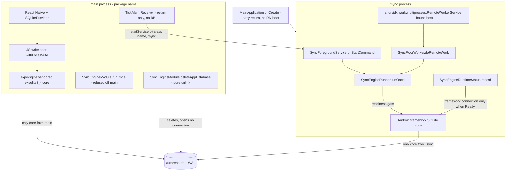
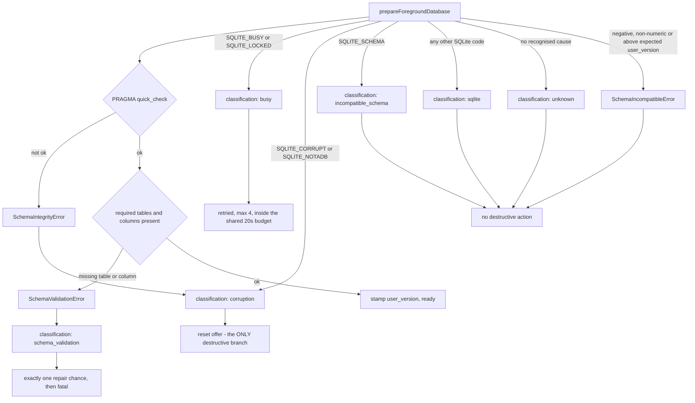
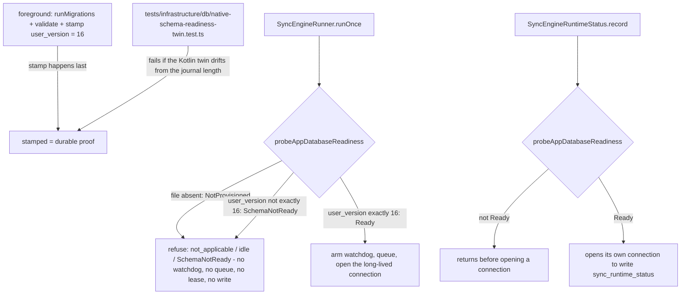

# Mobile database recovery and process split (current v1.7)

Companion to [the Mobile sync engine workflow map](./mobile-sync-engine-workflow.md). This document
covers one concern the workflow map now only summarises: **who owns `autoreas.db` in which Android
process, how startup classifies a database failure, and how a confirmed-corrupt database is
replaced.** It is the reference for the ODD `mobile-database-recovery` work (T2–T5).

Authority is current source. Read the workflow map for the sync cycle itself — startup, triggers,
native cycle, foreground drain — and read this file for the ownership split, the reset boundary and
the schema-window gate.

## How to read this document

- **[Implemented]** — verified by reading current source on this branch. File links point at the
  owner of the behavior.
- **[Observed]** — repository or device facts, not code behavior.
- **[Controlled Linux lab]** — a generic offline experiment, **not** the tablet incident.
- **[Hypothesis]** — an unproven cause; never read it as established.
- Android runtime checks on real hardware were **not run**; section 6 lists exactly what is not
  proven. The diagrams were checked by inspection (balanced fences, valid Mermaid syntax) and were
  **not rendered** — no local Mermaid renderer is available in this repository.

## 1. Two processes, two SQLite cores

The root fix is a process boundary, not a shared library. `plugins/withAndroidForegroundSync.js`
generates both declarations (the `android/` tree is generated by `expo prebuild` and is excluded
from git), `MainApplication.onCreate` is guarded so React Native is not booted in an Android
application secondary process, and `SyncEngineProcess` fails closed for the one JS-callable entry
point that would otherwise open the framework core wherever it was called.

| Process | Component | SQLite core | Opens `autoreas.db`? |
|---------|-----------|-------------|----------------------|
| main (`<package>`) | React Native, `SQLiteProvider`, JS write door | Expo's vendored `exsqlite3_*` (`node_modules/expo-sqlite/android/CMakeLists.txt`) | **Yes** — the only core that opens it from this process [Implemented] |
| main (`<package>`) | `TickAlarmReceiver` | none | No. It only re-arms the alarm from the persisted ticking flag, whose only writer is main [Implemented] |
| main (`<package>`) | `SyncEngineModule.runOnce` (JS-callable) | Android framework SQLite, through `SyncEngineRunner` | Refused **before** touching the runner or the database when the calling process is not main [Implemented] |
| main (`<package>`) | `SyncEngineModule.deleteAppDatabase` | none — pure unlink | Deletes the file and sidecars without opening any connection [Implemented] |
| `:sync` | `SyncForegroundService` (`android:process=":sync"`) | Android framework SQLite, through `SyncEngineRunner` | **Yes** — the only core that opens it from this process [Implemented] |
| `:sync` | `androidx.work.multiprocess.RemoteWorkerService`, hosting `SyncFloorWorker.doRemoteWork()` | Android framework SQLite, through `SyncEngineRunner` | **Yes**, on a floor tick [Implemented] |
| `:sync` | `SyncEngineRuntimeStatus.record` | Android framework SQLite | Only when the readiness probe reports `Ready`; it never creates the file [Implemented] |
| `:sync` | `MainApplication.onCreate` | none | Returns early, before `DefaultNewArchitectureEntryPoint` / `loadReactNative` [Implemented] |

**The consequence, stated precisely.** The main process now keeps only Expo's vendored
`exsqlite3_*` core for `autoreas.db`, and `:sync` keeps only the Android framework SQLite core.
That separation is the mechanism that removes the two-independently-linked-cores-on-one-file
hazard: no two separately linked SQLite libraries open the same database file from one process
anymore. [Implemented] in current source:

- [`plugins/withAndroidForegroundSync.js`](../plugins/withAndroidForegroundSync.js) —
  `SYNC_PROCESS_NAME = ':sync'`, `ensureSyncForegroundService`, `ensureRemoteWorkerService`,
  `withMainApplicationProcessGuard`.
- [`SyncEngineProcess.kt`](../modules/sync-engine/android/src/main/java/expo/modules/syncengine/SyncEngineProcess.kt)
  — `isMainProcess` / `refusalCodeFor`, and the fail-closed rule that an unreadable process name is
  treated as "not main".
- [`SyncFloorWorker.kt`](../modules/sync-engine/android/src/main/java/expo/modules/syncengine/SyncFloorWorker.kt)
  extends `RemoteCoroutineWorker` with no local in-process shortcut;
  [`SyncFloorScheduler.kt`](../modules/sync-engine/android/src/main/java/expo/modules/syncengine/SyncFloorScheduler.kt)
  stamps the request with `ARGUMENT_PACKAGE_NAME` and the `RemoteWorkerService` class name.



Notes on the diagram:

- The ticker alarm stays in the main process; only the service it starts runs in `:sync`. This is
  deliberate: the receiver's re-arm decision depends on the persisted ticking flag, and its single
  writer stays in main, so moving the receiver would give that state a second reader for no benefit.
- `SyncEngineModule.runOnce` is refused outside main by `SyncEngineProcess.refusalCodeFor`. There is
  **no live JS caller** of `runOnce` in `src/` on this branch; the guard exists so a future caller
  cannot silently recreate the second core.
- `deleteAppDatabase` is deliberately **not** covered by the main-process refusal: it calls
  `SQLiteDatabase.deleteDatabase(File)`, which opens no connection and therefore cannot put a second
  core in touch with the file. It is the one destructive entry point that may run from main.
- The WorkManager floor's `RemoteWorkerService` binding is what actually decides the process for a
  `doRemoteWork()` tick. [Implemented] in the scheduler's request data; the binding itself is an
  Android runtime behavior and remains in section 6.

### Storage ownership and contended files

| File | Process | Producer(s) today | Consumer(s) | Ownership rule |
|------|---------|-------------------|-------------|----------------|
| `autoreas.db` | `main` and `:sync` | JS foreground write door (`main`); Kotlin engine and Kotlin runtime status (`:sync`) | both processes | Schema owned by the foreground migration/repair pipeline; **two writers, two mechanisms, two processes** |
| `sync-journal.db` | `:sync` | Kotlin `SyncEngineJournal` | `SyncEngineRecovery` read-back, JS seam when called | Schema owned by `modules/sync-journal`; writers must stay byte-identical (250 ms budget, 500-row cap) |
| `autoreas-telemetry.db` | `main` and `:sync` | JS `syncDiagnosticsOutboxStore` (rows and schema, `main`) | JS `flushSyncDiagnosticsOutbox`; Kotlin `SyncEngineDiagnosticsOutbox`, drained by `SyncEngineDiagnosticsCourier` (`:sync`) | Schema JS-owned; the Kotlin owner never creates the file or its DDL, and only reads, removes, and writes the not-before gate |

**[Observed]** `modules/sync-journal`'s `SyncJournalModule` still declares the same journal schema,
but no live JS caller of it was found in `src/`; the live journal writer on the current branch is
the Kotlin `SyncEngineJournal`.

## 2. Startup classification and the resulting action

`createStartupDiagnostic` (`src/features/startup/startup.helpers.ts`) reduces a preparation failure
to one of `corruption`, `schema_validation`, `incompatible_schema`, `busy`, `sqlite`, `unknown`,
never carrying raw SQL, values or connection details across the boundary. Since T2 the two schema
errors are distinct on purpose: `SchemaIntegrityError` is physical damage, `SchemaValidationError`
is a repairable logical mismatch.



| Classification | Reached when | Retried? | Destructive action offered? |
|----------------|--------------|----------|-----------------------------|
| `corruption` | `PRAGMA quick_check` is not `ok`, or a `SQLITE_CORRUPT` / `SQLITE_NOTADB` result code | **Never** | **Yes** — the only classification that authorizes a reset, through `decideDatabaseReset` [Implemented] |
| `schema_validation` | A required table or column is missing on a stamped schema | No | No — the repair path gets exactly one chance [Implemented] |
| `incompatible_schema` | `user_version` negative, non-numeric, above expected, or `SQLITE_SCHEMA` | No | No; the copy states the data stays intact [Implemented] |
| `busy` | `SQLITE_BUSY` or `SQLITE_LOCKED` | Yes, `busy` only, max 4 attempts inside one shared 20 s budget | No; it offers "close and reopen the app" guidance [Implemented] |
| `sqlite` | Any other SQLite result code | No | No [Implemented] |
| `unknown` | No recognized error shape | No | No [Implemented] |

`PRAGMA quick_check` failing is *not* cosmetic: it is the same predicate `validatePreparedSchema`
uses as the readiness gate. What changed in T2 is what happens next — previously a malformed but
stamped database fell through to `runMigrations` and a repair attempt on every foreground start;
now anything that is not a `SchemaValidationError` is rethrown before the write path, so a
confirmed-damage file never reaches migrations and never gets re-stamped.

## 3. The reset flow

The domain module is
[`src/infrastructure/db/recovery/`](../src/infrastructure/db/recovery/index.ts). It is deliberately
split: `createDatabaseResetOrchestrator` owns ordering and resume, adapters own the real APIs, and
`decideDatabaseReset` owns authorization. Authorization is corruption-only: the decision reads
exactly `classification` and has no parameter that can override a refusal into a reset.

```mermaid
sequenceDiagram
  autonumber
  participant U as User
  participant V as StartupBoundary recovery card
  participant O as createDatabaseResetOrchestrator
  participant P as recovery adapters (ports)
  participant N as SyncEngine.deleteAppDatabase
  participant D as "autoreas.db + sidecars"
  U->>V: confirm reset after one warning (unsent changes may be lost)
  V->>O: run({ classification: 'corruption' })
  O->>P: readResetIntent
  O->>P: writeResetIntent - durable BEFORE any destruction
  O->>P: stopNativeWriters - unregister foreground ticker and background floor
  O->>P: closeDatabaseConnections - await closeAsync on the live connection
  O->>P: isDatabasePresent
  P->>N: deleteAppDatabase
  N->>D: SQLiteDatabase.deleteDatabase(File) - main file, -journal, -shm, -wal, wipe-check, -mj*
  O->>P: openAndPrepare - openDatabaseAsync + prepareForegroundDatabase, then close
  O->>P: clearResetIntent - ONLY after preparation succeeds
  O-->>V: completed
  V->>V: remount a fresh provider - normal first-run path
  V->>U: setup and pairing; Bridge off stays in setup
```

Ordering is the contract, and every step is source-observable:

1. **Corruption-only authorization.** `decideDatabaseReset` returns `reset` only for
   `classification === 'corruption'`; everything else returns `refuse` with that classification as
   the reason [Implemented].
2. **One explicit confirmation.** The copy warns that local changes that have not reached the
   Bridge may be lost and that the Bridge does not have them; it never asserts the Bridge has them
   (`STARTUP_RECOVERY_RESET_CONFIRM_DESCRIPTION` in
   [`recovery.constants.ts`](../src/features/startup/recovery/recovery.constants.ts)) [Implemented].
3. **Durable intent first.** `writeResetIntent` runs before any destructive step, and the intent is
   cleared only after preparation succeeds. Process death anywhere in the destructive window leaves
   durable evidence that the next launch resumes instead of diagnosing a half-deleted database.
4. **Stop native writers, then close.** The foreground ticker is unregistered first (it is the
   writer that can be running now), then the background floor; the live connection is closed with
   `closeAsync` and awaited. A genuine close failure aborts the run and never reaches deletion.
5. **Delete through the framework API.** Deletion goes through `SyncEngine.deleteAppDatabase`,
   which calls `SQLiteDatabase.deleteDatabase(File)` — a pure unlink of the main file, `-journal`,
   `-shm`, `-wal`, the wipe-check file and every `-mj*` sibling, opening no connection. This
   replaced `expo-sqlite`'s `deleteDatabaseAsync`, which ends in `File(dbFile).delete()` and leaves
   the sidecars behind; a stale WAL beside a freshly created database can have its frames applied to
   the new file, which is the corruption class this reset exists to remove.
6. **Prepare.** `openAndPrepare` opens a fresh connection, runs `prepareForegroundDatabase`
   (migrate, validate, stamp), and closes it so the module's connection cache is free for the next
   provider open.
7. **Return to the normal first-run path.** The provider is remounted and startup resolves `/setup`
   when no `deviceId` is configured. Pairing fetches the initial bridge snapshot and persists the
   configuration with it (`use-pair-device.ts` calls `fetchInitialSyncSnapshot` and then
   `persistPairedBridgeConfiguration`), which is the "snapshot before catalog" ordering. With the
   Bridge off, the device stays in setup.
8. **Failed reset.** A failed stage presents a retry and a last-resort action that opens the Android
   app settings; its copy warns that clearing storage deletes **all** local data and settings, and
   that clearing the cache is not a repair.

Non-destructive states never offer a reset: `busy` explains closing and reopening the app;
`unknown`, `sqlite`, `incompatible_schema`, `schema_validation` and a Bridge-off start each get an
explanatory state with no destructive action. The presentation mapping is
[`createStartupRecoveryState`](../src/features/startup/recovery/recovery.helpers.ts), and the
double-press guard is the hook's single-flight ref in
[`use-startup-recovery.ts`](../src/features/startup/recovery/use-startup-recovery.ts). The reset UI
is [`StartupDatabaseResetDialog.tsx`](../src/features/startup/ui/StartupBoundary/StartupDatabaseResetDialog.tsx)
plus the recovery card in `StartupBoundaryFallback.tsx`.

## 4. The readiness gate over the migration window

The foreground is the only schema writer. During its migration/repair window the file exists but
the readiness stamp is not yet written, so the native owners must refuse rather than open it. T3
added a Kotlin twin of the readiness stamp and a probe that never creates the file:



- [`SyncEngineDatabases.kt`](../modules/sync-engine/android/src/main/java/expo/modules/syncengine/SyncEngineDatabases.kt)
  owns `EXPECTED_SCHEMA_READINESS_VERSION` (16), the pure `resolveAppDatabaseReadiness` decision, a
  read-only `user_version` reader and `probeAppDatabaseReadiness`. Only an exact match is `Ready`;
  `null` and every other number are `SchemaNotReady`.
- [`SyncEngineRunner.runOnce`](../modules/sync-engine/android/src/main/java/expo/modules/syncengine/SyncEngineRunner.kt)
  refuses **before** arming its watchdog, before queueing, and therefore before any lease claim or
  write.
- [`SyncEngineRuntimeStatus.record`](../modules/sync-engine/android/src/main/java/expo/modules/syncengine/SyncEngineRuntimeStatus.kt)
  returns quietly unless the probe is ready, so it can no longer create an unprepared database.
- The JS twin guard
  ([`native-schema-readiness-twin.test.ts`](../tests/infrastructure/db/native-schema-readiness-twin.test.ts))
  fails when a new migration raises the journal length without bumping the Kotlin constant.
- Honest limit: the stamp is trusted. A database stamped ready but missing a table is not refused
  early; the write fails and the runner's never-throws catch swallows it. That is why the foreground
  validates every required table and column before stamping.

## 5. Evidence: tablet damage, Linux lab, and unproven mechanism

These three are separate and must never be merged into one causal story.

- **[Observed] Tablet damage.** The v1.7.0 device database has a malformed main file,
  `user_version = 16`, the required tables and columns present, and an empty current WAL. Its
  specific damage event is **unknown**; no repository or device evidence attributes it to a
  particular writer.
- **[Controlled Linux lab; Android unverified]** A corrected offline harness counted only INSERT
  `DONE` + `changes() == 1` + successful COMMIT. Mixed-instance same-process runs persisted fewer
  rows than committed (recorded runs include 93/160 and 87/160 rows; a second instance of the same
  vendored version persisted 40/80), while same-library and separate-process controls kept every
  row and reported lock contention. All structural checks returned `ok`. This reproduces **silent
  committed-write loss**, a structural hazard class — it does not reproduce the tablet's malformed
  main file.
- **[Hypothesis], origin unproven.** Selecting one SQLite core per process removes the
  same-process two-cores hazard as a *mechanism* (SQLite's [corruption guide, section
  2.3](https://www.sqlite.org/howtocorrupt.html) documents how separate library copies fail to
  share the process-global open-file registry). Because the tablet's damage event was never
  attributed, this split is the correct structural hardening, **not** proof that the same-process
  hazard caused that tablet's corruption. The lab result supports the mechanism's plausibility; it
  does not close the attribution.
- **[Observed] Forensics.** The preserved historical main DB passes `quick_check` without its
  paired WAL, but that WAL's only valid frame makes the main copy malformed. That triplet is not
  proven to be an atomic snapshot, so it does not demonstrate a bad SQLite writer. No tracked app
  code copies, renames or deletes the app DB, or creates a `.corrupt` suffix. The native
  `openOrCreateDatabase(file, null)` supplies no custom corruption handler, and [AOSP's default
  handler](https://android.googlesource.com/platform/frameworks/base/+/master/core/java/android/database/DefaultDatabaseErrorHandler.java)
  closes and **deletes** DB files when it detects corruption. The installed framework's behavior
  remains unverified.

## 6. What remains unverified on hardware

Nothing in this document was executed on a device. The following are obligations, not results:

- That WorkManager actually binds `RemoteWorkerService` in `:sync`, so a floor tick opens
  `autoreas.db` from `:sync` and not from the calling process.
- That a `:sync` tick does not boot React Native / SoLoader on every supported API level, i.e. that
  the `MainApplication` guard is reached before those calls on each supported release.
- That the main process opens **no** framework connection to `autoreas.db` at runtime.
- That `SyncEngineProcess.runOnce` fails closed on API 24–27, where the process name cannot be read
  by `Application.getProcessName()`.
- That WorkManager's own initializer running inside `:sync` stays harmless (it writes a separate
  database file, outside this hazard).
- The full reset on a device: awaited close, sidecar-free deletion, preparation, and completion of
  setup and pairing back to a synced catalog.
- Healthy-path startup timing before and after, which needs an authorized lab build.
- Mermaid rendering of the diagrams above. Fences were checked for balance and the syntax by
  inspection only.

The needed device evidence is specific: install an authorized lab APK over the existing install
(`adb install -r`, never uninstall), inject a malformed database on a disposable build or device,
confirm the corruption card, run the reset, and confirm setup/pairing/snapshot complete. That
requires its own explicit authorization (an EAS lab build contacts Expo for signing credentials).

## Keeping this current

Any change to the process declarations, the readiness stamp, the startup classification split or the
reset ordering must update this file and the summary in
[the workflow map](./mobile-sync-engine-workflow.md) in the same work unit. The
programmatic source of the process split is
[`plugins/withAndroidForegroundSync.js`](../plugins/withAndroidForegroundSync.js): review the
plugin, not the generated `android/` tree.
