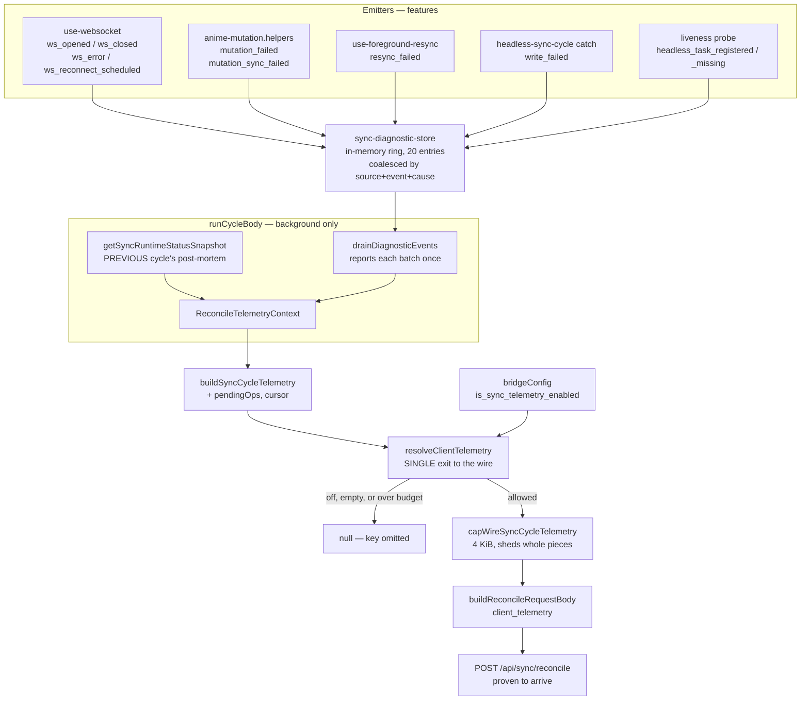
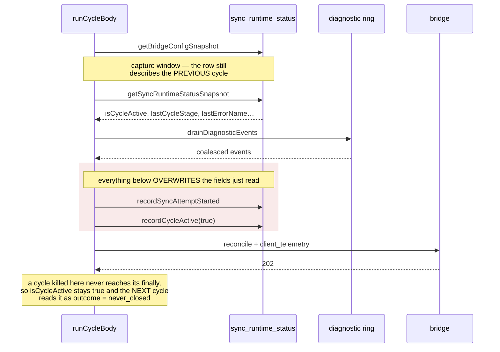

# Mobile → Bridge Diagnostic Telemetry

Status: implemented, 2026-09-04. Contract agreed with `autoreas-bridge` against its source, not its documentation.

## Why this exists

Diagnosing background-sync failures required a USB cable. Every question worth asking — did the job die, where, was it background or foreground, is this one incident or forty-eight — could only be answered with `adb logcat` against a device in hand. In production there is no cable, and by the time anyone notices, the evidence has rolled out of the log buffer.

The bar this feature is held to comes from the request that prompted it: **a good metric is one that helps you make a specific decision.** Every field below names the decision it enables. A field that names none does not belong here.

## The design constraint that shapes everything

**A cycle killed by the host cannot report its own death.** The process is gone before any reporting code runs. Telemetry sent "at the end of the cycle" is precisely the telemetry that is never seen.

So the report travels at the **start of the next cycle**, describing the previous one from what it managed to persist. The signal that a cycle was killed is an `isCycleActive` flag that was never released, because `recordCycleActive(false)` lives in a `finally` that never executed.

This is also why the snapshot is captured in `runCycleBody` *before* `recordSyncAttemptStarted` and `recordCycleActive(true)`: those two writes overwrite the exact fields the post-mortem reads. A snapshot taken one line later would describe the current cycle and report every previous one as `never_closed`.

## Transport: piggyback, not a new endpoint

The payload rides in the existing `POST /api/sync/reconcile` body as an optional `client_telemetry` field.

The decisive argument came from team-bridge, and it is better than the bandwidth and auth-surface reasons that motivated the original proposal: **a separate endpoint has the same failure mode the telemetry is meant to eliminate.** Telemetry about a dying job, sent as an independent request, can fail independently. Piggybacking binds delivery to a request that is *proven* to arrive — measured across five cycles that reached the bridge and hung only afterwards.

Verified on the bridge side before building: `sync_handler.go:91` decodes without `DisallowUnknownFields()`, and reconcile is the only body-bearing endpoint that tolerates unknown fields. The capture middleware already stores the raw body, so the field lands intact with no bridge change.

## The privacy boundary

**The bridge does not sanitize request bodies.** Headers are scrubbed and response bodies are scrubbed; request bodies are stored verbatim, persist at rest, are copied with backups, and are readable through MCP.

On Android a raw `error.message` carries the database path, SQL fragments, and bound values — and in this app the bound values are anime titles. So every textual field is a **closed vocabulary**, and anything outside it collapses to `unknown` rather than being forwarded on the chance it is harmless.

Three consequences worth stating explicitly:

- **`native_errcode_byte` is a bounded integer, not a string.** The runtime's `errcode` is the char code of a control byte parsed out of the native message, so it is named for what it is. Calling it `error_code` would mislead: `SQLITE_BUSY` is 5, and a reader would take a `5` here as lock contention when it only means the control byte was `0x05`. A bounded integer also cannot encode PII under any interpretation, which makes it a stronger guarantee than any string pattern.
- **`error_cause` is derived at serialization time from the persisted message, and no column stores it.** That makes the scrub unbypassable by construction: there is no raw version of the field for a future writer to send by accident.
- **`error_fingerprint` hashes only values matching `/^[A-Za-z_$][A-Za-z0-9_$]{0,63}$/`.** Hashing a message would let a candidate list confirm its contents by dictionary. A message, a path, or a title cannot satisfy that shape; a class name can.

## Pipeline



The checkpoint store is deliberately **outside** this picture: it writes synchronously to a separate database file (`autoreas-telemetry.db`), never through `withLocalWrite`, so the instrument does not share a failure domain with the write door it reports on.

## Why the snapshot is captured where it is



Reading the snapshot one line later would describe the cycle that is starting, and every previous cycle would be reported as `never_closed`.

## Payload

```
client_telemetry: {
  cycle_id,                    // random UUID (expo-crypto). Correlates with the captured request.
  trigger_source,              // background_task | foreground_service | manual | ...
  app_state,                   // foreground | background
  previous_cycle: {
    cycle_id, trigger_source,
    outcome,                   // completed | failed | never_closed
    last_stage,                // open | config | attempt_started | cycle_activated |
                               // backlog_read | claim_ops | http | parse_response |
                               // apply_write | prune | closed
    started_at, elapsed_ms,
    error_name, native_errcode_byte, error_stage,
    error_cause,               // closed_resource | lock_contention | disk_full |
                               // io_error | timeout | unreachable | unknown
    error_fingerprint
  } | null,
  counters: { consecutive_unclosed_cycles, pending_ops_count, cursor },
  recent_events: [             // coalesced ring, app-wide
    { source, event, cause, first_at, last_at, count }
  ]
}
```

### The decision each field enables

| Field | Decision it enables |
|---|---|
| `outcome: never_closed` + `last_stage` | Did the job die, and in which step. The single datum that used to require a cable. |
| `trigger_source` | Background cycle or manual refresh — indistinguishable from the bridge otherwise. |
| `consecutive_unclosed_cycles` | An isolated failure or an ongoing quota bleed. |
| `error_cause` | Which fix applies. A closed handle and lock contention both surface as `LocalWriteError` with a null code at stage `begin`; only this separates them. |
| `error_fingerprint` | Groups novelty. Without it every unrecognized class collapses into one `unknown` bucket and "the same unknown 48 times" reads identically to "48 different unknowns". |
| `elapsed_ms` | How long the cycle ran before it stopped progressing — measured between recorded instants, never inferred from `now`. |
| `recent_events` | What else is happening: WebSocket, mutations, foreground resync, host task registration. None of these live inside a cycle, so the post-mortem cannot see them. |

### `last_stage` is derived, not hand-written

`SYNC_CYCLE_STAGES` lives in `sync-runtime-status.constants.ts` and is the single source; the union type derives from it and the telemetry allowlist re-exports it. Two hand-maintained copies of the same vocabulary is how one drifts from the code it claims to describe.

Two members exist because folding them into `config` would blame a read that completed: `attempt_started` and `cycle_activated` are both awaited writes through the shared door, and a jammed door kills the cycle on one of *them*. `parse_response` is the one member that is not an awaited step — `safeParse` is synchronous and cannot hang — and earns its place only by separating "the HTTP call returned" from "the post-HTTP write began".

## The event ring

Bounded at 20 distinct entries, in **memory**. Persisting each observation would put instrumentation on the shared write door — the component whose jamming this feed exists to report — which is how a measuring device becomes the fault it measures.

Entries **coalesce** by `(source, event, cause)` with a count and two timestamps. Without coalescing, a fault repeating 48 times fills the ring with copies of itself and evicts every other signal, burying the pattern under its own repetition. A coalesced entry moves to the end of the ring, so an ongoing incident is never evicted for being old: age has to mean "last seen", not "first seen".

`cause` participates in the identity deliberately. A write that failed on a closed handle and one that failed on contention are different incidents with different fixes.

The ring is **drained** at cycle start, so each batch of trouble is reported once. Without draining, a fault from hours ago would ride along on every reconcile for the rest of the process and turn the feed into permanent noise.

`recordDiagnosticEvent` never throws and drops observations outside the vocabulary. Instrumentation that can break the code it observes is worse than none.

## Size budget

Hard cap of **4 KiB**, agreed with team-bridge, and the reason is a silent failure: `MaxBytesReader` rejects a body over 1 MiB outright, but `MaxCapturedBodyBytes` (64 KiB) merely **stops capturing** while the reconcile still answers 202. Crossing it would make this telemetry vanish without a trace *and* take the reconcile payload capture — which the team already relies on — down with it.

Degradation sheds whole pieces rather than truncating, because truncated JSON is unparseable:

1. `recent_events` — the only variable-size part; under pressure the specific diagnosis beats the surrounding pattern
2. the previous cycle's error detail
3. the previous cycle entirely
4. nothing at all — `null` rather than an over-budget payload

`outcome` and `last_stage` survive longest, because they answer the question this exists for.

Measured sizes: full ~474 B, without error detail ~436 B, without the previous cycle ~185 B. The cap is defence in depth, not a routine trim.

## The kill switch

`resolveClientTelemetry` is the single exit to the wire. User preference, size budget and serialization converge there on purpose: leaving any of the three to the caller would make it a convention some future call site forgets. Funnelled into one function they are a property of the system, because no path to the wire bypasses it.

The switch lives in Settings and defaults **on**. A device that hits the failure before anyone opens Settings must still be able to report it — a default-off switch reproduces the blindness this feature removes. The payload is PII-free by construction and travels to the user's own bridge on their own LAN.

When there is nothing to send the key is **omitted**, never emitted as null: the bridge stores this body raw, so an empty key is permanent noise in its store rather than a serialization detail.

## What this does not cover

- **Foreground reconciles carry no telemetry.** Only `runHeadlessSyncCycle` supplies the context, because only it can capture the snapshot before the status writes. A device whose background task never runs sends nothing.
- **`recent_events` is lost if the process dies.** That is the accepted cost of keeping the ring off the write door; the persisted cycle checkpoint covers the death itself.
- **The classification of `error_cause` matches message patterns** and will break silently if Expo changes its wording. No independent cross-check exists: `errcode` is not reliable for this, being a char code parsed out of the same message with several paths to null.

## Bridge-side work still pending

Agreed in design, not implemented, awaiting that repo's own approval:

- Project `cycle_id` and `outcome` into filterable columns. Today the field lands raw inside `request_body`, which is readable but not queryable. `search_requests` filters are fixed.
- Use a **dedicated column**, not the capture's `error_code`: that column is reserved for bridge-side failures and is only ever set alongside `rejected`/`malformed` outcomes. This telemetry rides on *successful* reconciles reporting a previous cycle's death, so projecting onto it would mark a request that succeeded as failed.
- Announce `client_telemetry` in `docs/openapi.yaml` as an optional field, accepted and stored raw but not yet interpreted.
