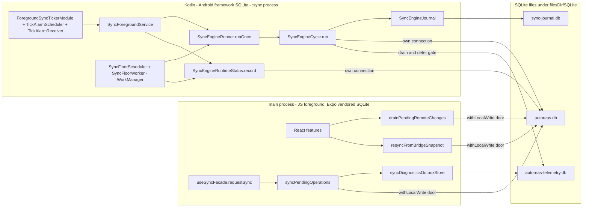
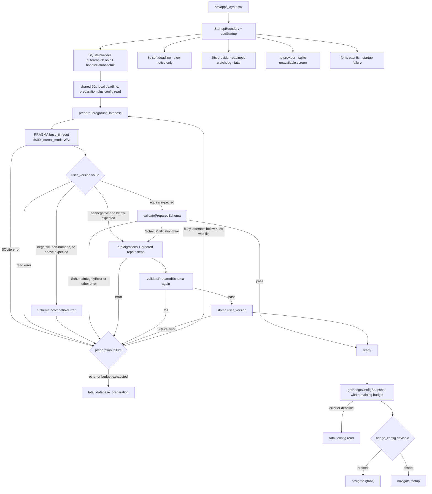
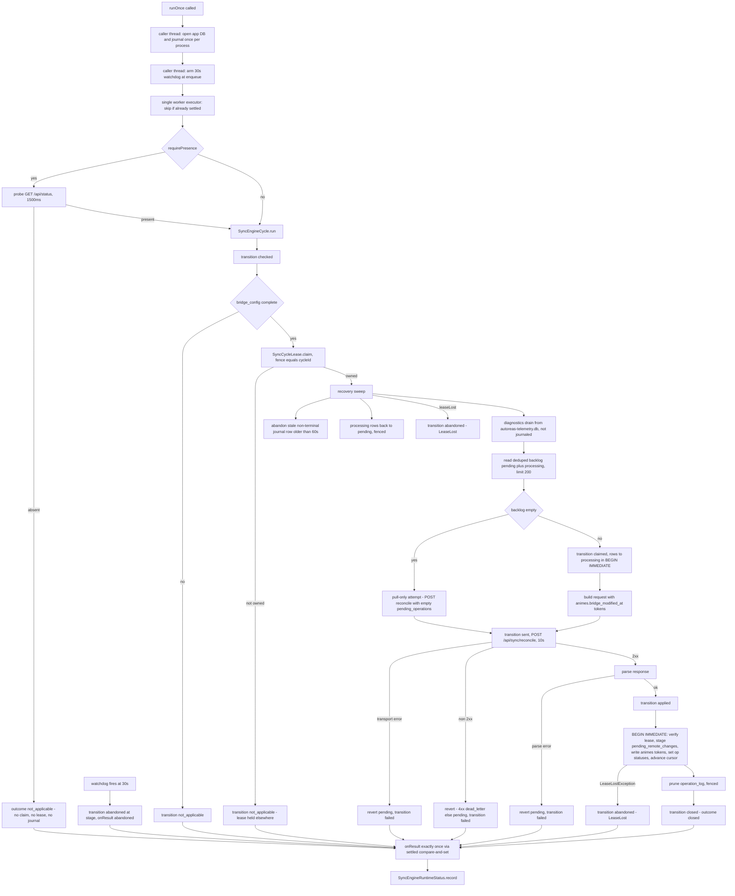
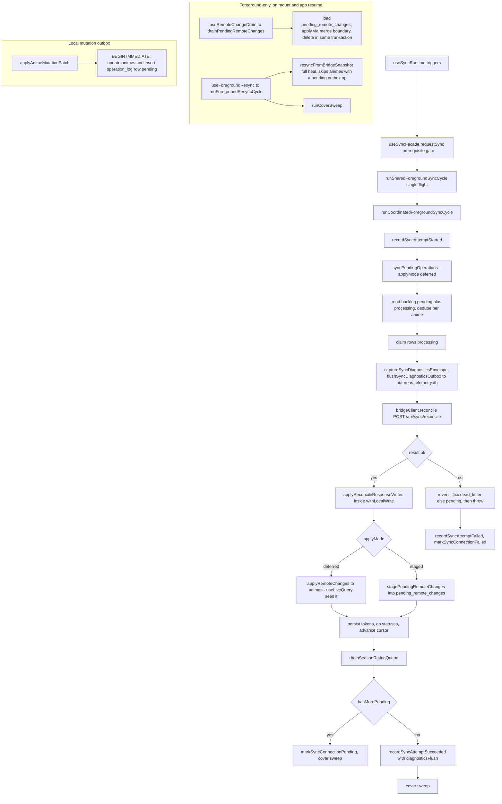

# Mobile sync engine workflow (current v1.7)

This is the current, source-verified map of the Mobile sync engine in `app.json` version
`1.7.0`. It exists so a future architectural corruption fix can be reasoned about from what the
code does **today**, not from what a plan once proposed. Read the Quick path first; the diagrams
and the branch matrix are the reference an implementer works from.

## How to read this map

- **Authority is current source.** Every edge below is traced to a symbol on the current branch.
  Named links in the sections point at the file that owns the behavior.
- **Historical documents are background only.** `docs/mobile-sync-architecture.md`,
  `docs/sdd-plan-background-sync-redesign.md`, `docs/mobile-background-sync-investigation-log.md`,
  and any `.git/gentle-ai` candidate view describe an earlier (v1.3-shaped) design. They must NOT
  drive topology: the JS background cycle, the `expo-background-task` floor, and the Notifee-owned
  foreground service are all retired here.
- **[Observed]** marks repository/device facts; **[Controlled Linux lab]** marks a generic
  experiment, not the tablet incident; **[Hypothesis]** marks an unproven cause.
- Diagrams are deliberately split by concern (topology, startup, triggers, native cycle, JS
  foreground) so no single graph has to carry the whole system.
- **Process topology, startup classification and the corruption reset live in
  [mobile-database-recovery.md](./mobile-database-recovery.md).** This map summarises them and links
  there instead of repeating them.

## Quick path — the current v1.7 flow

1. **Foreground start.** `src/app/_layout.tsx` renders `StartupBoundary`, which opens
   `autoreas.db` through `SQLiteProvider` and runs the foreground-owned migration/repair pipeline.
2. **Readiness plus pairing gate the runtime.** `SyncRuntimeGate` mounts only when `isBootstrapped`
   is true, and `useSyncRuntime` registers strategies and requests the bootstrap sync only when
   `isRuntimeEnabled = isBootstrapped && isConfigured` holds (`use-sync-runtime.ts:59`).
3. **Two background trigger owners exist.** A user-enabled AlarmManager ticker plus native
   foreground service, and a WorkManager periodic floor. Both call the *same* Kotlin attempt
   runner, `SyncEngineRunner`, and both run it in the dedicated `:sync` Android process (see
   [mobile-database-recovery.md](./mobile-database-recovery.md)).
4. **An eligible native attempt reconciles.** After the presence/config and lease gates, it sweeps
   stale state, drains diagnostics, posts `POST /api/sync/reconcile` (even with an empty outbox, to
   pull), then stages pulled changes and advances the cursor. Refused attempts never reach HTTP.
5. **JS foreground converges the device.** Foreground triggers run the JS reconcile in `deferred`
   mode, drain background-staged rows into `animes`, and heal from the bridge snapshot.
6. **Three SQLite files.** `autoreas.db` (two owners, now in two separate processes),
   `sync-journal.db` (attempt journal), and `autoreas-telemetry.db` (diagnostics outbox) are
   separate files with separate owners.

## 1. Runtime topology and storage ownership

Ownership in words:

| Process | Owner | Connection style | Writes |
|---------|-------|------------------|--------|
| `main` | JS foreground (`expo-sqlite` + drizzle) | vendored `exsqlite3_*` library, one reactive connection serialized by the file-keyed `withLocalWrite` door in [`client.helpers.ts`](../src/infrastructure/db/client/client.helpers.ts) | `animes`, `operation_log`, `pending_remote_changes`, `bridge_config`, `sync_runtime_status`, `sync_cycle_lock` |
| `:sync` | Kotlin engine (`SyncEngineRunner.openAppDatabase`) | Android framework SQLite library, its own long-lived connection, `BEGIN IMMEDIATE`, `busy_timeout 5000` | `operation_log`, `pending_remote_changes`, `animes.bridge_modified_at`, `bridge_config.last_changelog_id`, `sync_cycle_lock` |
| `:sync` | Kotlin status (`SyncEngineRuntimeStatus`) | opens/closes its own connection per attempt, only when the readiness probe is `Ready` | `sync_runtime_status` |
| `:sync` | Kotlin journal (`SyncEngineJournal`) | its own file and connection, `busy_timeout 250` | `sync-journal.db.journal` |
| `main` | JS `syncDiagnosticsOutboxStore` (schema owner) | its own connection to `autoreas-telemetry.db` | inserts `sync_diagnostics_outbox` rows and reads candidates |
| `:sync` | Kotlin `SyncEngineDiagnosticsOutbox`, drained by `SyncEngineDiagnosticsCourier` | opens read/write only if the file already exists; never creates it or its DDL | reads candidates, removes delivered rows, and writes the not-before gate on `503` |

**[Implemented] The contended file is `autoreas.db`, and the two cores no longer share a process.**
Two language runtimes write it through two different mechanisms: the JS write door (a per-file
promise queue, see
[`withQueuedWrite`](../src/infrastructure/db/client/client.helpers.ts)) and the Kotlin engine's own
`openOrCreateDatabase` + `BEGIN IMMEDIATE`. Expo compiles a vendored `sqlite3.c` with `exsqlite3_*`
symbols (`node_modules/expo-sqlite/android/CMakeLists.txt`), while
[`openAppDatabase`](../modules/sync-engine/android/src/main/java/expo/modules/syncengine/SyncEngineDatabases.kt)
uses Android's `SQLiteDatabase`. As of the ODD `mobile-database-recovery` root fix, the native
engine, the runtime-status projection and the WorkManager floor all run their work in a dedicated
`:sync` Android process declared by
[`plugins/withAndroidForegroundSync.js`](../plugins/withAndroidForegroundSync.js), so the main
process keeps only the Expo vendored core for this file and `:sync` keeps only the framework core.
The process boundary, the per-process ownership table and the evidence behind the split — including
SQLite's [corruption guide, section 2.3](https://www.sqlite.org/howtocorrupt.html) warning about
separate library copies — are documented in
[mobile-database-recovery.md](./mobile-database-recovery.md).

## 2. Startup and database readiness

[`prepareForegroundDatabase`](../src/infrastructure/db/startup/startup.helpers.ts) is the only
writer of the schema, and it is foreground-owned. `EXPECTED_SCHEMA_READINESS_VERSION` is derived
from the migration journal length, so adding a migration raises the expected value automatically
([`startup.constants.ts`](../src/infrastructure/db/startup/startup.constants.ts)).

**The `user_version` gate is not one branch.** A negative, non-numeric, or above-expected value
throws `SchemaIncompatibleError` *before* any migration runs; only `0` or another nonnegative
value below expected enters the migrator plus the ordered repair steps. `validatePreparedSchema` is the readiness proof:
`PRAGMA quick_check` returns `ok`, every `REQUIRED_SCHEMA_TABLES` entry exists, and every
`REQUIRED_SCHEMA_COLUMNS` entry exists. A stamped `user_version` is **not** treated as proof — a
`SchemaValidationError` (a short table count or a missing column) falls through to re-run the
migrator and repairs, then re-validate, and the *second* validation is uncaught, so a repair that
cannot converge is fatal and gets exactly one chance. A failed `PRAGMA quick_check` is different:
it throws `SchemaIntegrityError`, which is rethrown before the write path, classified `corruption`,
and answered with the corruption-only reset offered by
[mobile-database-recovery.md](./mobile-database-recovery.md) — it never reaches `runMigrations`.
The local config read that follows is fatal on failure under the same shared budget.

**Startup budgets are ordered, not stacked.**
[`createStartupDatabaseInitializer`](../src/features/startup/startup.helpers.ts) retries database
preparation only for `busy`/`locked` outcomes, at most `STARTUP_DATABASE_PREPARATION_MAX_ATTEMPTS`
(4) times, and only while another full `SQLITE_BUSY_TIMEOUT_MS` wait still fits inside one shared
`STARTUP_LOCAL_OPERATION_DEADLINE_MS` (20 s) budget that also covers the config read.
`STARTUP_PROVIDER_READINESS_DEADLINE_MS` (25 s) envelops that whole sequence as a watchdog;
`STARTUP_SOFT_DEADLINE_MS` (8 s) only swaps in a slow notice and never selects the failure card; a
missing provider renders the `sqlite-unavailable` screen; fonts have their own 5 s deadline.
Headless actors call
[`prepareHeadlessDatabase`](../src/infrastructure/db/startup/startup.helpers.ts), which is
read-only — it refuses with `SchemaNotReadyError` instead of repairing, so two writers never race
the schema.

**The runtime starts on pairing too.** `useSyncRuntime` registers strategies only when
`isRuntimeEnabled = isBootstrapped && isConfigured` holds
([`use-sync-runtime.ts`](../src/features/sync/use-sync-runtime.ts)); a bootstrapped but unconfigured
app mounts the gate, registers nothing, and requests no bootstrap sync.

## 3. Trigger routes into the native attempt

```mermaid
flowchart TD
  subgraph FGS["FGS ticker route - user enabled"]
    R1["adapter register to ticker.start 60000ms"] --> P1["persist isTicking true"]
    P1 --> A1["scheduleNextTick setAndAllowWhileIdle"]
    A1 --> S1["startSyncForegroundServiceSafely"]
    A1 --> RC["TickAlarmReceiver.onReceive"]
    RC --> RC1["re-arm next alarm first"]
    RC1 --> S1
    S1 --> SV["SyncForegroundService.onStartCommand"]
    SV --> SV1["postForegroundNotification"]
    SV1 --> SV2{"attemptInFlight"}
    SV2 -->|yes| SK["coalesced - no new attempt"]
    SV2 -->|no| AT["runOnce requirePresence true, trigger native_fgs_tick"]
  end
  subgraph FLOOR["WorkManager floor route"]
    W0["registerBackgroundSyncFloor"] --> W1["enqueueUniquePeriodicWork 15 min policy UPDATE"]
    W1 --> W2["SyncFloorWorker.doWork"]
    W2 --> W3{"SyncTickerOwnership.ownsBackground"}
    W3 -->|yes| W4["Result.success - no attempt"]
    W3 -->|no| AT2["runOnce requirePresence true, trigger background_task"]
  end
  subgraph JSPATH["JS foreground triggers"]
    J0["bootstrap | app_active | network_regained | ws_sync_required | manual"] --> J1["useSyncFacade.requestSync"]
    J1 --> J2["runSharedForegroundSyncCycle single flight"]
    J2 --> J3["runCoordinatedForegroundSyncCycle"]
    J3 --> J4["syncPendingOperations default applyMode deferred"]
  end
```

- Ticker: [`ForegroundSyncTickerModule`](../modules/foreground-sync-ticker/android/src/main/java/expo/modules/foregroundsyncticker/ForegroundSyncTickerModule.kt)
  persists ticking state and arms `setAndAllowWhileIdle`; [`TickAlarmReceiver`](../modules/foreground-sync-ticker/android/src/main/java/expo/modules/foregroundsyncticker/TickAlarmReceiver.kt)
  re-arms then starts the service by class-name intent. The service is owned by
  [`SyncForegroundService`](../modules/sync-engine/android/src/main/java/expo/modules/syncengine/SyncForegroundService.kt),
  started across a Gradle-module boundary by name, never imported.
- Floor: the JS strategy
  [`createNativeBackgroundFloorStrategy`](../src/features/sync/native-background-floor/native-background-floor.helpers.ts)
  forwards to `registerBackgroundSyncFloor`, which blocks on WorkManager confirmation before it
  cancels the legacy `EXPO_BACKGROUND_WORKER` request. [`SyncFloorWorker`](../modules/sync-engine/android/src/main/java/expo/modules/syncengine/SyncFloorWorker.kt)
  extends `RemoteCoroutineWorker` — so the tick runs in `:sync` — and skips its tick while the
  ticker owns the background, via `SyncTickerOwnership.ownsBackground`.
- Both native routes converge on
  [`SyncEngineRunner.runOnce`](../modules/sync-engine/android/src/main/java/expo/modules/syncengine/SyncEngineRunner.kt)
  with `requirePresence = true`. **[Observed] No live JS caller of `runOnce` exists in `src/`:**
  `SyncEngineModule.kt` still declares the `runOnce` AsyncFunction, but the retired JS background
  cycle, `attempt-policy`, and headless cycle files are absent from the tree.

## 4. Native attempt cycle

Reading the cycle:

- **Lease and fences.** [`SyncCycleLease`](../modules/sync-engine/android/src/main/java/expo/modules/syncengine/SyncCycleLease.kt)
  claims the singleton `sync_cycle_lock` row (owner `native_engine`, fence = cycle id, 60 s) and
  verifies by reading the row back. Fencing is layered rather than uniform:
  `LEASE_OWNERSHIP_GUARD_SQL` sits inside the statement for the `operation_log` status writes
  (`updateOperationStatus`) and the recovery sweep's orphan return, while the staging inserts,
  `animes.bridge_modified_at` token writes, the cursor advance, and the prune depend on
  `requireLeaseOwnership` at `BEGIN IMMEDIATE` transaction entry (and, for the prune, inside its own
  transaction). The transaction-entry check is not an unfenced write: the write lock it takes pins
  the fence for the whole transaction, because a reclaim is itself a write. **No live JS claimant
  of this row exists on the current branch** — `claimSyncCycleLock` appears nowhere in `src/`, so
  the JS cycle that used it is retired.
- **Watchdog = the hard bound.** `runOnce` resolves exactly once within `ENGINE_BUDGET_MS` (30 s)
  of wall clock; the watchdog lives on its own handler thread and writes the `abandoned` journal
  row itself, because the worker may be parked in a native call. It is armed at enqueue, so it can
  also fire while a presence probe's HTTP call is still in flight and journal `abandoned` for that
  attempt: a refused probe writes no journal row of its own, but the attempt is not guaranteed
  write-free.
- **Empty outbox still pulls.** `runPullOnlyAttempt` issues the same reconcile request with an
  empty `pending_operations` array, so remote changes land even with nothing to push.
- **Recovery before the backlog read.** [`SyncEngineRecovery`](../modules/sync-engine/android/src/main/java/expo/modules/syncengine/SyncEngineRecovery.kt)
  compensates a previous attempt's orphaned `processing` rows and stale non-terminal journal
  state, fenced under the current lease.
- **Diagnostics are outside the journal and outside the outcome.**
  [`SyncEngineDiagnosticsCourier`](../modules/sync-engine/android/src/main/java/expo/modules/syncengine/SyncEngineDiagnosticsCourier.kt)
  drains stored envelopes to `POST /api/sync/diagnostics`; a delivery failure never fails the cycle.
- **Apply.** [`SyncEngineResponseApplier`](../modules/sync-engine/android/src/main/java/expo/modules/syncengine/SyncEngineResponseApplier.kt)
  stages `pending_remote_changes`, writes `animes.bridge_modified_at` from `applied_operations`
  only (never from `bridge_changes[].snapshot.modified_at`, which the bridge hardcodes to 0), sets
  operation statuses, and advances the cursor. **Deferred, not silently skipped:** conflict
  exhaustion and the full `client_telemetry` envelope are not implemented here — conflicts fall
  back to the generic "reset to pending" retry.
- **Prune.** [`OperationLogPruner`](../modules/sync-engine/android/src/main/java/expo/modules/syncengine/OperationLogPruner.kt)
  runs fenced; a prune failure is swallowed, but a lease loss during the prune is rethrown and
  classified `abandoned`.

**[Observed] The native engine never writes domain anime snapshot fields.** It writes only
`animes.bridge_modified_at`, the OCC token, at [`SyncEngineResponseApplier.kt:57-63`](../modules/sync-engine/android/src/main/java/expo/modules/syncengine/SyncEngineResponseApplier.kt),
plus staging rows, operation statuses, and the cursor; pulled `bridge_changes` land in
`pending_remote_changes`, and the JS foreground drain performs the real domain apply. That is the
seam that makes the native engine and the JS foreground cycle complementary instead of conflicting.

## 5. JS foreground cycle: snapshot, staging drain, local outbox

- **Foreground reconcile applies in `deferred` mode.** [`syncPendingOperations`](../src/features/sync/reconcile.helpers.ts)
  defaults `applyMode` to `'deferred'` and the foreground path relies on that default: pulled
  changes are written to `animes` directly, so `useLiveQuery` consumers refresh immediately.
  `'staged'` writes `pending_remote_changes` instead and is the background/headless mode; the JS
  background cycle that used it is retired, so today the only producer of staged rows is the
  native engine.
- **Staging drain is the only path background data reaches `animes`.**
  [`drainPendingRemoteChanges`](../src/features/sync/remote-change-drain.helpers.ts) applies and
  deletes staged rows in one deferred transaction, on the reactive connection.
- **Snapshot heal.** [`resyncFromBridgeSnapshot`](../src/features/sync/full-resync.helpers.ts)
  pulls the full bridge list on mount and app resume and diffs it into local rows, skipping any
  anime with a pending/processing outbox op so un-acked local intent is never clobbered.
- **Diagnostics outbox is its own file.** [`autoreas-telemetry.db`](../src/infrastructure/db/sync-diagnostics-outbox/sync-diagnostics-outbox.constants.ts)
  is separate on purpose: a row written through the `autoreas.db` door would queue behind the very
  hang the outbox exists to survive. The outbox is capped at 100 rows by an `AFTER INSERT` trigger
  that sheds the **tail**, so the retained prefix is the oldest rows a drain reads first.
- **Local mutation outbox.** User mutations write through
  [`applyAnimeMutationPatch`](../src/features/animes/anime-mutation.helpers.ts), which updates
  `animes` and inserts an `operation_log` row with status `pending` in one transaction. That table
  is the outbox both the JS and the native reconcile read.

## Branch and fallback matrix

These branches are real and current but would clutter the diagrams above.

Startup and readiness branches first, then native-cycle, then JS and diagnostics.

| # | Branch | Trigger | Behavior | Source |
|---|--------|---------|----------|--------|
| 1 | Invalid `user_version` | negative, non-numeric, or above expected | `SchemaIncompatibleError`, fatal before any migration | `prepareForegroundDatabase` |
| 2 | Stale `user_version` | `0` or below expected | migrator plus ordered repair steps, then stamp | `prepareForegroundDatabase` |
| 3 | Preparation hit `busy`/`locked` | transient lock from a concurrent writer | retried, max 4 attempts, only `busy`, inside the shared 20 s budget | `createStartupDatabaseInitializer` |
| 4 | Second `validatePreparedSchema` fails | repair could not converge | fatal; repair gets exactly one chance | `prepareForegroundDatabase` |
| 5 | Local config read fails | `getBridgeConfigSnapshot` throws or times out | fatal with the config diagnostic | `createStartupDatabaseInitializer` |
| 6 | Provider never reaches `onInit` | 25 s provider-readiness watchdog | provider-readiness failure screen | `createProviderReadinessStartupFailure` |
| 7 | No `SQLiteProvider` | host lacks expo-sqlite | `sqlite-unavailable` screen | `resolveStartupBoundaryScreen` |
| 8 | Startup exceeds 8 s soft deadline | normal slowness, no failure | slow notice only; never selects the failure card | `useStartupSlowNotice` |
| 9 | Runtime not enabled | `isBootstrapped && isConfigured` false | no strategy registration, no bootstrap sync; status forced `unregistered` | `use-sync-runtime.ts` |
| 10 | Missing/incomplete bridge config | `bridge_config` absent, blank, or unreadable | journals `checked` then `not_applicable`; no lease, no HTTP | `SyncEngineCycle.runCycle` |
| 11 | Lease held elsewhere | live row owned by another attempt | `not_applicable`; no HTTP | `SyncCycleLease.claim` |
| 12 | Presence refused | `requirePresence` and `GET /api/status` fails in 1500 ms | `not_applicable` with `BridgePresenceRefused`; no claim and no journal write of its own | `SyncEngineBridgePresence.probe` |
| 13 | Watchdog fires mid-probe | 30 s wall clock elapse before the probe returns | journals `abandoned` at the current stage, settles the attempt | `SyncEngineRunner.runOnce` |
| 14 | Attempt abandoned while queued | watchdog fired before the worker closure ran | neither probe nor cycle runs; no second journal row | `SyncEngineRunner.runOnce` |
| 15 | Watchdog unarmable | watchdog thread has no looper | attempt refused and journaled immediately | `SyncEngineRunner.runOnce` |
| 16 | Lease lost mid-cycle | fenced write affects zero rows | `abandoned` with `LeaseLost`; stops writing | `SyncEngineCycle.run` |
| 17 | Recovery finds a lease already lost | fence check inside sweep fails | `abandoned` before the backlog read | `SyncEngineRecovery.sweep` |
| 18 | HTTP 4xx | bridge rejected batch content | claimed rows → `dead_letter`, `failed` with `ReconcileHttpError` | `SyncEngineCycle.runCycle` |
| 19 | HTTP 5xx / transport / parse | retryable failure | claimed rows → `pending`, `failed` | `SyncEngineCycle.runCycle` |
| 20 | Empty backlog | no pending/processing rows | pull-only reconcile still issued | `runPullOnlyAttempt` |
| 21 | Stage table missing | engine holds lease, staging table absent | `ensureStagingTable` creates the app's own DDL, idempotent | `SyncEngineCycle.ensureStagingTable` |
| 22 | Prune failure | DELETE throws for a non-lease reason | logged and swallowed; attempt stays `closed` | `OperationLogPruner.pruneSafely` |
| 23 | Status projection failure | `sync_runtime_status` write throws | logged; wake lock still released, in-flight flag reset | `SyncEngineRuntimeStatus.record` |
| 24 | Floor tick skipped | ticker owns the background | `Result.success`, nothing written | `SyncFloorWorker.doWork` |
| 25 | Floor attempt never settles or throws | no outcome within 40 s, or the runner throws | `Result.retry()`, not `failure()` | `SyncFloorWorker.doWork` |
| 26 | FGS start refused | platform denies background FGS start | logged and swallowed; alarm stays armed | `startSyncForegroundServiceSafely` |
| 27 | FGS start command coalesced | an attempt is already in flight | notification posted, no second attempt | `SyncForegroundService.onStartCommand` |
| 28 | JS prerequisite `unknown` | bridge config query unanswered | request resolves 0, no sync, no local-mode publish | `sync-facade.helpers.ts` |
| 29 | JS in-flight reconcile | a reconcile is already running on the connection | `rerunRequested` set; caller receives the in-flight promise | `syncPendingOperations` |
| 30 | Diagnostics payload unclassified | `kind` unknown, non-string, JSON `null`, or unparseable | parked, never posted, reaped only after 7 days | `classifyDiagnosticsPayload` |
| 31 | Diagnostics oversize / coded 400 | bridge declares permanence | body discarded, counted as `discarded` | `isPermanentDiagnosticsRejection` |
| 32 | Diagnostics retryable refusal | 401/404/405/408/422/429/5xx or transport | kept pending; no clock may destroy it | `isParkedDiagnosticsRow` |
| 33 | Headless schema stale | `user_version` stale or a required column missing | `SchemaNotReadyError` no-op; foreground repairs next start | `prepareHeadlessDatabase` |

## Storage ownership and contended files

Per-file producers, consumers, the process each owner runs in, and the constraints that keep the
writers compatible are tabulated in
[mobile-database-recovery.md](./mobile-database-recovery.md#storage-ownership-and-contended-files).

## Corruption: evidence vs hypothesis

**[Observed]** On the currently stamped device database, `PRAGMA quick_check` does not return
`ok`, while the required tables and required columns are present — the same predicate
`validatePreparedSchema` uses as its readiness gate. Since T2 that failure throws
`SchemaIntegrityError`, is classified `corruption`, and is the only classification that offers a
reset; the classification table and the reset sequence are in
[mobile-database-recovery.md](./mobile-database-recovery.md).

**[Observed]** No repository or device evidence shows that the bridge being offline directly
corrupts SQLite. The bridge-off path is write-free before the lease: a refused presence probe
returns `not_applicable` without claiming operations, taking the lease, or writing a journal row of
its own (the watchdog can still append `abandoned` to the separate journal file if it fires
mid-probe).

**[Hypothesis], origin unproven — candidates to investigate, not conclusions.** Before the root
fix, `autoreas.db` had two independent SQLite library copies in one process; the JS door serialized
only JS writes and could not coordinate a native close/write or the other library's lock registry.
The `:sync` split now removes that coexistence, but whether it was this tablet's origin stays
unproven. The engine and the runtime-status projection each open their own connections (both now in
`:sync`), and a failed `quick_check` used to trigger a repair attempt on every foreground start
until T2 replaced that with the corruption classification. The `sync-journal.db` and
`autoreas-telemetry.db` files are independent and must not be assumed to share `autoreas.db`'s
failure mode.

**[Observed] forensics and the [Controlled Linux lab; Android unverified] result** are documented in
full, split by evidence kind, in
[mobile-database-recovery.md](./mobile-database-recovery.md). In short: the preserved historical
main DB's WAL triplet is not a proven atomic snapshot and its producer is unidentified; no tracked
code copies, renames or deletes the app DB or creates a `.corrupt` suffix; AOSP's default corruption
handler closes and **deletes** DB files and the installed framework's behavior is unverified; and
the corrected Linux harness reproduced silent committed-write loss (93/160, 87/160 and 40/80 rows on
dual-copy or second-instance runs) while every structural check returned `ok` — a hazard class,
**not** the tablet's malformed main file.

## Omitted and deferred edges

Named so a reader does not mistake absence for behavior:

- **Conflict-exhaustion policy** (`conflict_attempt_count` caps and the token re-base) is deferred
  in the native cycle; the JS cycle implements it.
- **`client_telemetry`** is minimal (`cycle_id`, `trigger_source`, counters) natively.
- The retired JS background cycle, `expo-background-task` floor, and Notifee-owned foreground service are intentionally absent; they are not current paths.

## Next step

Use section 4 (native cycle) together with
[mobile-database-recovery.md](./mobile-database-recovery.md) (process topology, startup
classification, reset flow) when reasoning about the database. The native cycle's fencing is
layered — statement-level guards plus transaction-entry lease checks — and is only as strong as the
single shared `sync_cycle_lock` row it depends on. The same-process two-cores hazard is addressed by
the implemented `:sync` split, but it is **not device-verified**: the outstanding hardware checks
are listed in the companion. The tablet's corruption origin remains unproven; do not read this map
as establishing it.
