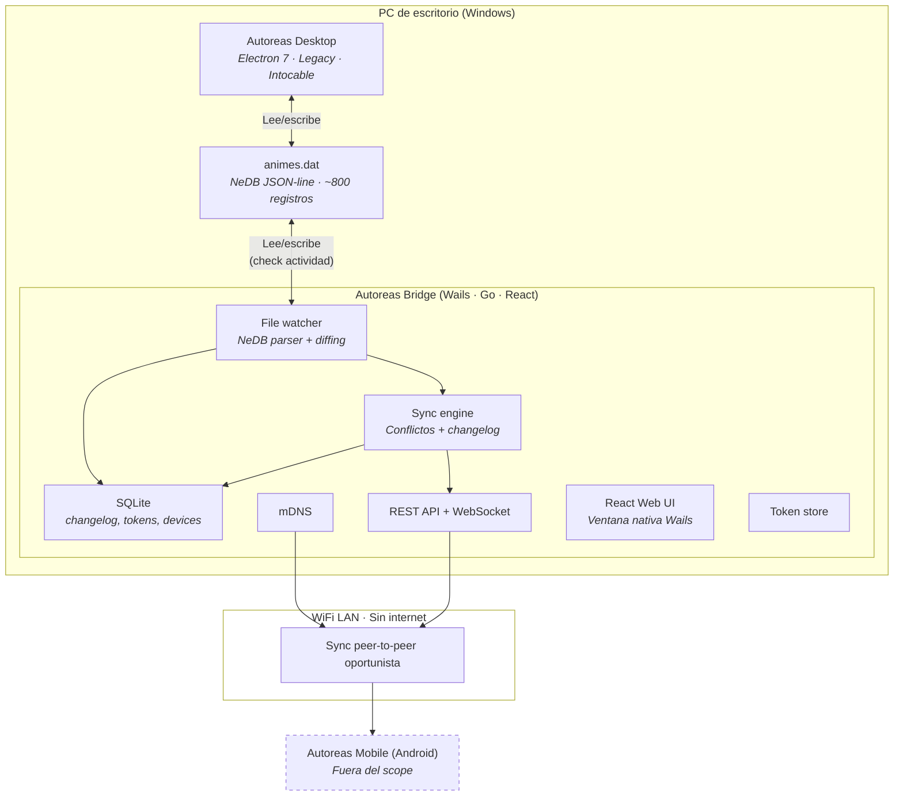
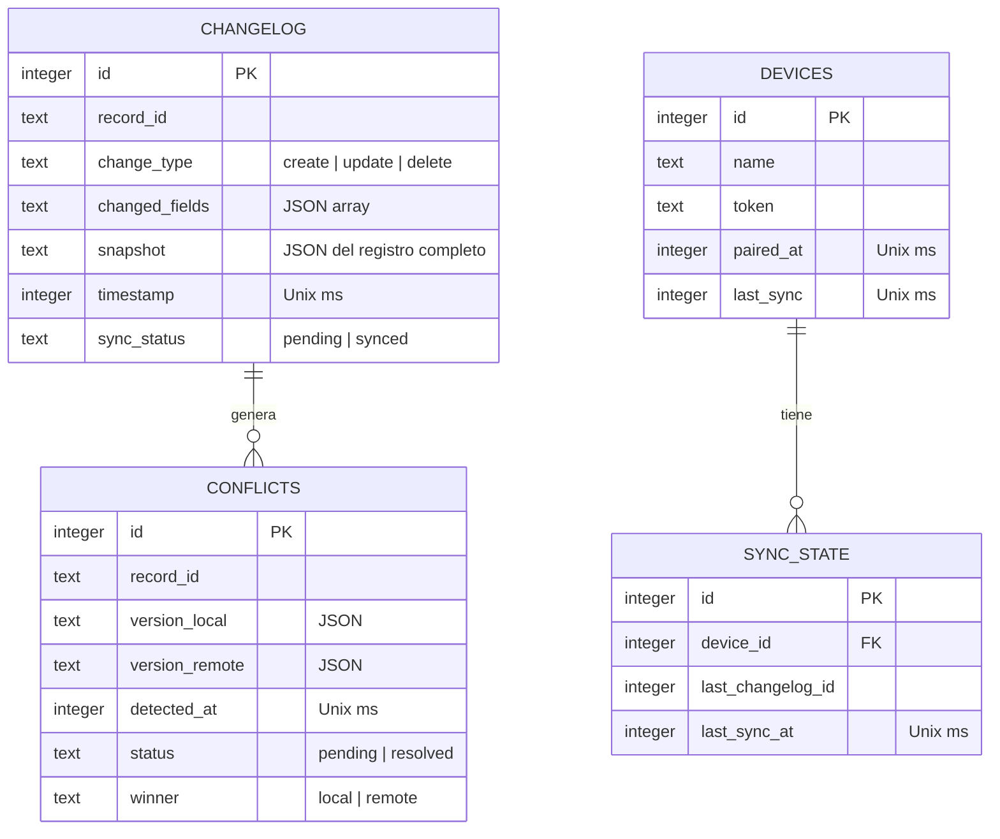
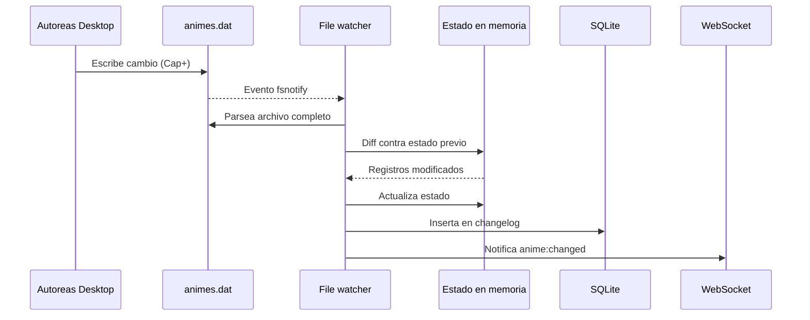
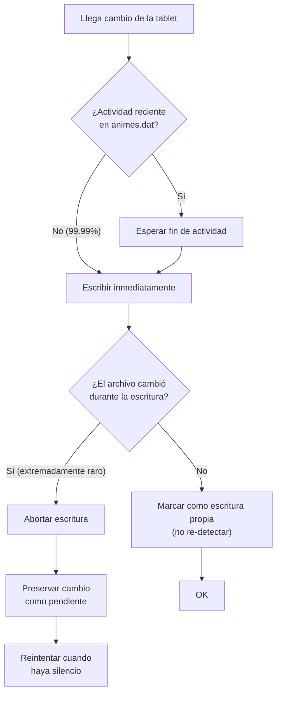
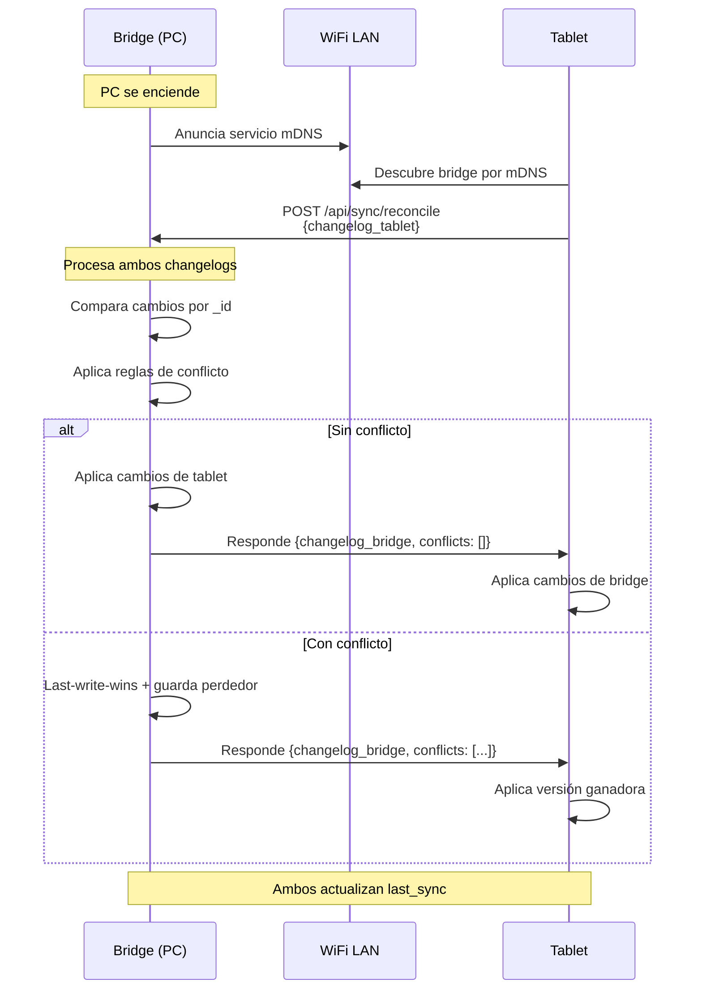
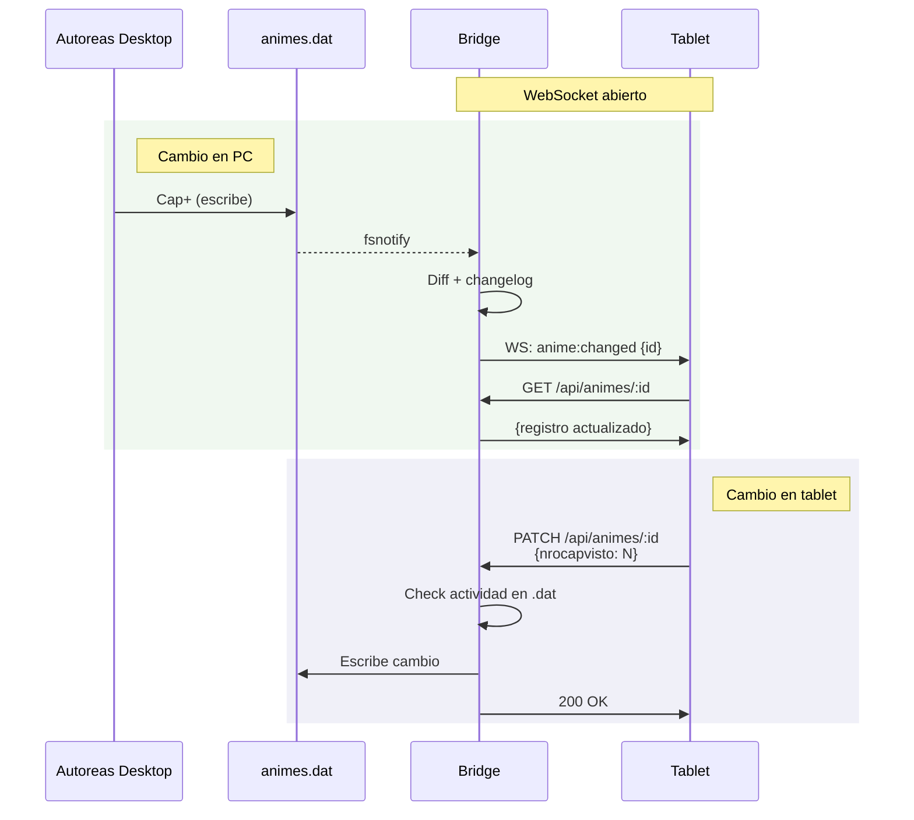
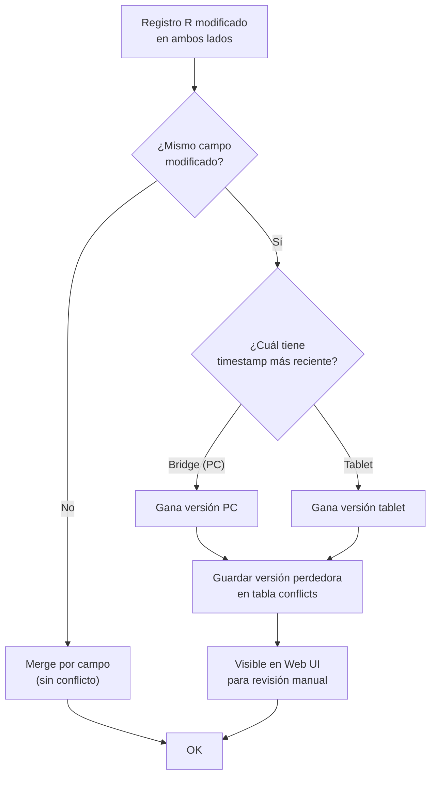
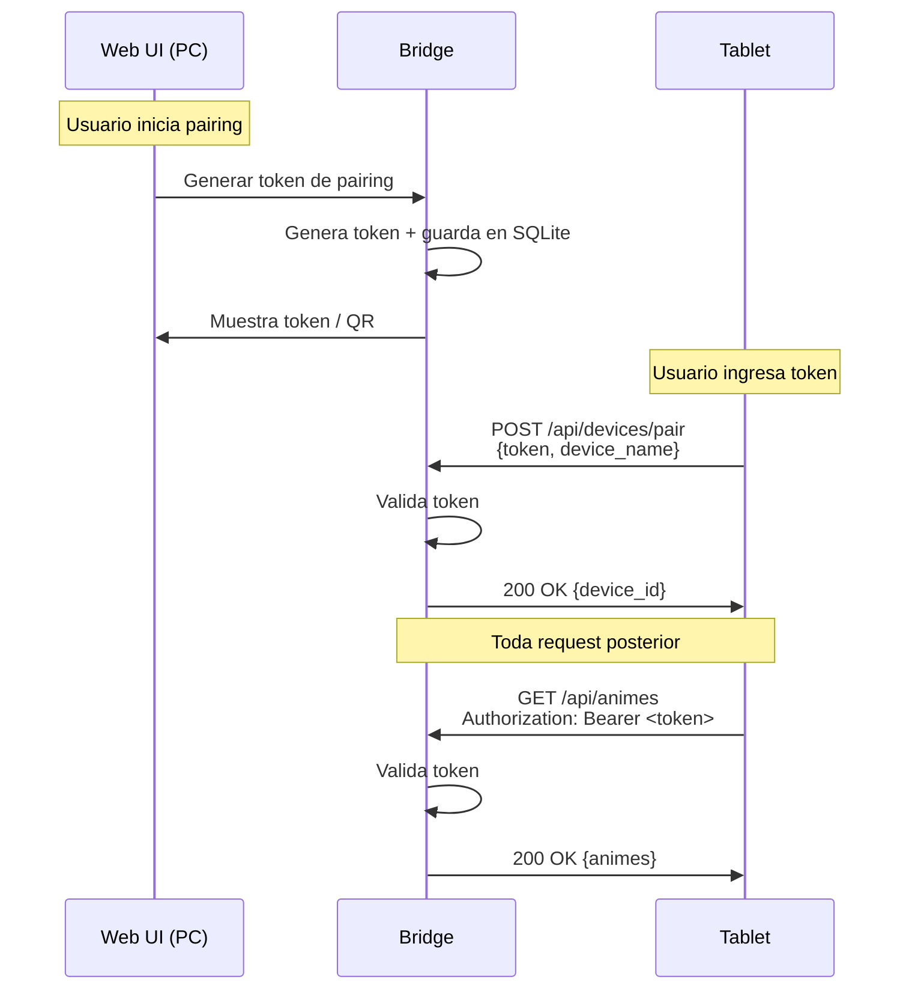
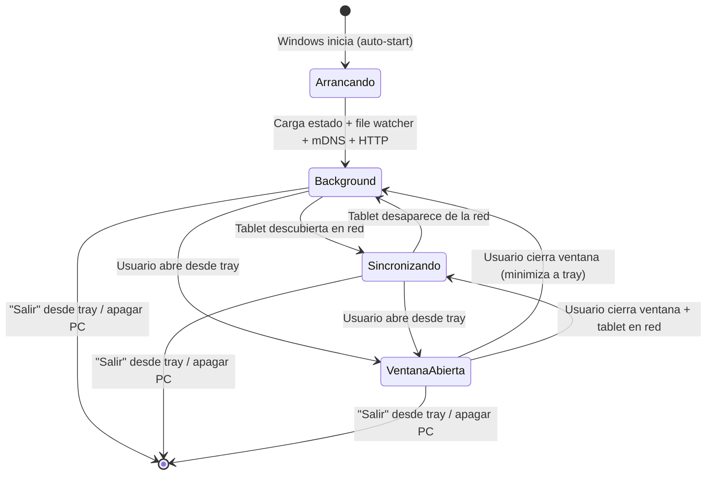

# RFC: Autoreas Bridge

**Autor:** Disble
**Fecha:** 2026-04-05
**Estado:** En revisión

> Historical reference only: this file preserves an early bridge narrative. Current mobile runtime truth is owned by bridge code/tests plus mobile `BridgeClient`. The active mobile surface today is `POST /api/devices/pair`, `GET /api/animes`, `POST /api/sync/reconcile`, `GET /api/status`, `GET /api/seasons/active`, `POST /api/seasons/active/ratings`, and `WS /ws` with events `sync_required`, `anime_changed`, `anime_created`, `anime_deleted`, `preferences_changed`, and `season_changed`. Legacy wire keys such as `nrocapvisto`, `totalcap`, and `grade_source` stay unchanged on the wire.

---

## 1. Contexto y problema

Autoreas Desktop es una aplicación Electron 7 que funciona como Sistema de Control de Capítulos (SCC) de anime. Tiene más de 800 registros, está en uso activo desde hace años, y es completamente funcional. Su última versión (v2.2.0) fue publicada en mayo de 2020. Es software legacy y no recibirá más actualizaciones.

El problema: el patrón de consumo de anime migró del escritorio a la tablet. Autoreas Desktop no funciona en Android, y no existe forma de registrar un capítulo visto desde la tablet.

Crear una app mobile independiente fragmentaría los datos. Reescribir autoreas desktop no es viable ni deseable — funciona bien. Sincronizar directamente entre la app legacy y una app mobile es inviable porque autoreas desktop no expone ninguna API ni protocolo de comunicación.

Se necesita un servicio intermediario que actúe como puente de sincronización entre ambos dispositivos, sin modificar la aplicación legacy.

## 2. Objetivos

- Sincronizar el estado de seguimiento de anime entre el PC de escritorio y una tablet Android a través de la red WiFi local, sin requerir internet.
- Permitir al usuario actualizar capítulos vistos desde la tablet y que el cambio se refleje en `animes.dat` del PC.
- Funcionar de forma transparente: el usuario no debería tener que intervenir para que la sincronización ocurra. Cuando ambos dispositivos están encendidos en la misma red, el sync es automático.
- No modificar ni un solo byte del código de Autoreas Desktop.
- Nunca perder datos del usuario.

### No-objetivos

- **No es un reemplazo de Autoreas Desktop.** El bridge no implementa funciones de gestión de anime (agregar, editar, eliminar, estadísticas). Eso podría suceder en el futuro, pero no es parte de este diseño.
- **No es una app mobile.** La app Android queda fuera del scope. Este documento cubre solo el bridge que corre en el PC.
- **No es un servicio cloud.** No hay servidores, no hay cuentas, no hay internet. Todo es local.
- **No sincroniza `pendientes.dat`.** Solo `animes.dat`.
- **No soporta múltiples usuarios.** Es un sistema personal, un PC, una tablet.

## 3. Alternativas evaluadas

### 3.1 Syncthing directo

Usar Syncthing para sincronizar la carpeta `data` de Autoreas entre el PC y la tablet.

**Pros:** Zero desarrollo. Syncthing ya existe y resuelve sincronización de archivos en LAN.

**Contras:** Syncthing sincroniza archivos, no registros. Un conflicto en `animes.dat` resulta en dos copias del archivo completo (800+ registros) que habría que reconciliar manualmente. Además, la tablet necesitaría una app que entienda el formato NeDB para mostrar y editar los datos, así que de todos modos hay que construir algo.

**Decisión:** Descartado. La granularidad de sincronización necesaria es a nivel de registro, no de archivo.

### 3.2 App mobile standalone (sin sync)

Crear una app Android independiente donde el usuario gestiona su lista de anime por separado.

**Pros:** Simple. Sin sincronización, sin bridge.

**Contras:** Fragmentación de datos. El usuario tendría que mantener dos listas separadas o migrar completamente y abandonar autoreas desktop.

**Decisión:** Descartado. Contradice el objetivo principal.

### 3.3 Reescribir Autoreas Desktop como web app

Rehacer toda la aplicación como una web app accesible desde cualquier dispositivo.

**Pros:** Una sola app para todo. Sin sincronización necesaria.

**Contras:** Esfuerzo masivo. Autoreas desktop funciona bien. Requiere replicar todas las funciones existentes antes de ser útil. Alto riesgo de abandono a mitad del desarrollo.

**Decisión:** Descartado. Sobredimensionado para el problema actual.

### 3.4 Bridge de sincronización (elegido)

Un servicio liviano que corre en background en el PC, observa `animes.dat`, y expone una API en la red local para que una futura app mobile se sincronice.

**Pros:** No toca autoreas desktop. Scope acotado. Validación rápida del concepto. Si funciona, puede evolucionar incrementalmente.

**Contras:** Requiere manejar acceso concurrente a `animes.dat`. Requiere un parser de NeDB custom.

**Decisión:** Elegido. Es la opción con mejor ratio valor/esfuerzo y menor riesgo.

## 4. Diseño propuesto

### 4.1 Arquitectura general

El sistema tiene tres zonas:

**Zona PC (Windows):** Autoreas Desktop coexiste con Autoreas Bridge. Desktop lee y escribe `animes.dat` normalmente, sin saber que el bridge existe. Bridge observa ese mismo archivo, detecta cambios, y los propaga a la red local.

**Zona WiFi LAN:** Canal de comunicación entre Bridge y la app móvil. Bridge se anuncia por mDNS y expone una REST API + WebSocket. Sin internet.

**Zona Tablet (fuera del scope):** La futura app Autoreas Mobile Android. Se conectará al Bridge para sincronizar datos.



### 4.2 Stack tecnológico

| Componente | Tecnología | Justificación |
|---|---|---|
| Framework | Wails v2 | Binario único, ventana nativa con webview, acceso a funciones del OS |
| Backend | Go | Bajo consumo de memoria (~15MB idle), concurrencia nativa, binario sin dependencias |
| Frontend (Web UI) | React | Embebido en el binario via Wails, ecosistema conocido |
| DB del bridge | SQLite | Changelog, conflictos, tokens, dispositivos |
| Fuente de verdad | `animes.dat` (NeDB JSON-line) | No se modifica autoreas desktop |
| Entregable | `.exe` único para Windows | Sin instaladores de runtime |

**¿Por qué Go y no Node.js?** Node tiene la ventaja del parser nativo de NeDB (es una librería JS), pero el parser es un componente acotado del proyecto. Go ofrece mejores características para un servicio de background de larga ejecución: binario único (~10MB), menor consumo de RAM (~15MB vs ~50MB), y concurrencia nativa para manejar file watcher, HTTP, WebSocket y mDNS simultáneamente.

**¿Por qué Wails y no un server HTTP puro + navegador?** El bridge podría funcionar como Syncthing (web UI en el navegador via `localhost`). Pero si en el futuro el bridge evoluciona para reemplazar funciones de autoreas desktop, necesitará acceso nativo al OS (abrir carpetas, lanzar aplicaciones). Wails ofrece esa capacidad desde el día uno sin cambiar de arquitectura.

### 4.3 Modelo de datos

#### 4.3.1 Fuente de verdad: `animes.dat`

Ubicación: `C:\Users\User\AppData\Roaming\Autoreas\data\animes.dat`

Formato: NeDB JSON-line. Cada línea es un documento JSON independiente.

Esquema de un registro:

```json
{
  "nombre": "string",
  "dias": [{ "dia": "string", "orden": "number" }],
  "nrocapvisto": "number",
  "totalcap": "number | null",
  "tipo": "number | null",
  "pagina": "string (URL)",
  "carpeta": "string (ruta local Windows)",
  "estudios": "array | null",
  "origen": "string",
  "generos": "array | null",
  "duracion": "number | null",
  "portada": { "type": "string", "path": "string" },
  "estado": "number",
  "repetir": "array",
  "activo": "boolean",
  "primeravez": "boolean",
  "fechaPublicacion": "$$date | null",
  "fechaEstreno": "$$date | null",
  "fechaCreacion": "$$date",
  "fechaUltCapVisto": "$$date",
  "fechaEliminacion": "$$date | null",
  "_id": "string (alfanumérico, 16 chars)"
}
```

Convención de fechas NeDB: `{"$$date": 1523077932046}` (timestamp Unix en milisegundos).

#### 4.3.2 Base de datos del bridge: SQLite

SQLite almacena exclusivamente datos operativos del bridge. No espeja datos de animes.



### 4.4 Detección de cambios

El bridge monitorea `animes.dat` mediante file watcher del OS (`fsnotify` en Go, que usa `ReadDirectoryChangesW` en Windows).

Cuando se detecta una modificación:

1. Parsear el archivo completo (JSON-line, ~800 líneas, <1ms en Go).
2. Comparar contra el último estado conocido (en memoria) por `_id`.
3. Identificar registros creados, modificados y eliminados.
4. Registrar cambios en el changelog de SQLite.
5. Si hay un dispositivo móvil conectado, notificar por WebSocket.



### 4.5 Escritura a `animes.dat`

Cuando el bridge recibe un cambio de la tablet, debe escribir en `animes.dat` sin colisionar con autoreas desktop.



### 4.6 Protocolo de sincronización

> Historical note: the sequence below captures an earlier peer narrative. The shipped mobile flow is reconcile-centered. WebSocket anime events trigger `POST /api/sync/reconcile`; mobile does not treat `GET /api/animes/:id`, `PATCH /api/animes/:id`, or `GET /api/animes/changes` as the active runtime path.

#### Modelo: peer-to-peer oportunista

Inspirado en Syncthing. Ambos dispositivos son peers. Cada uno mantiene su propia copia de datos y un changelog local. La sincronización ocurre cuando coinciden encendidos en la misma red, sin intervención del usuario.

#### Al reconectarse (reconciliación)



#### Mientras están conectados (tiempo real)



#### Desconexión

Si el WebSocket cae (tablet sale de la red, PC entra en sleep), ambos siguen acumulando cambios en su changelog local. Al reencontrarse, se ejecuta el proceso de reconciliación.

### 4.7 Resolución de conflictos

Modelo inspirado en Syncthing. Principio: nunca se pierde data silenciosamente.

1. **Solo un lado cambió un registro:** Se aplica el cambio. No hay conflicto.
2. **Ambos lados cambiaron el mismo registro:** Gana el timestamp más reciente (last-write-wins). La versión perdedora se guarda en la tabla `conflicts`.
3. **Un lado eliminó y el otro modificó:** La modificación gana. El registro se preserva. La eliminación se registra como conflicto.
4. Todos los conflictos son visibles en el Web UI para revisión manual.



### 4.8 Descubrimiento de dispositivos

**Principal: mDNS.** El bridge se registra como servicio `_autoreas-bridge._tcp.local`. La tablet lo descubre automáticamente.

**Fallback (post-MVP): IP manual.**

### 4.9 Seguridad

Token de pairing permanente:

- Generado desde el Web UI del bridge al parear un nuevo dispositivo.
- Enviado como header `Authorization: Bearer <token>` en cada request.
- Permanente hasta revocación manual desde el Web UI.
- Un token por dispositivo.



### 4.10 API REST

> Runtime truth annotation: treat the following endpoint inventory as historical planning context. Current mobile consumption keeps `BridgeClient` as the only transport owner and actively uses `POST /api/devices/pair`, `GET /api/animes`, `POST /api/sync/reconcile`, `GET /api/status`, `GET /api/seasons/active`, `POST /api/seasons/active/ratings`, and `WS /ws`. Mobile does not rely on `GET /api/animes/:id` as an active path in this slice.

**Animes:**

- `GET /api/animes` — Lista completa.
- `GET /api/animes/:id` — Detalle por ID.
- `PATCH /api/animes/:id` — Actualizar campos (`nrocapvisto`, `fechaUltCapVisto`, `estado`, `dias`, `fechaEstreno`, `primeravez`).
- `GET /api/animes/changes?since=<timestamp>` — Changelog desde un timestamp.

**Validación de campos en `PATCH /api/animes/:id`:**

| Campo | Tipo | Validación |
|---|---|---|
| `nrocapvisto` | number | >= 0 |
| `fechaUltCapVisto` | $$date (Unix ms) | timestamp válido |
| `estado` | number | 0, 1, 2 o 3 únicamente |
| `dias` | array | Cada elemento: `{dia: string, orden: number}`. Valores de `dia` restringidos a: Lunes, Martes, Miércoles, Jueves, Viernes, Sábado, Domingo, Sin ver, Ver hoy, Visto |
| `fechaEstreno` | $$date (Unix ms) o null | timestamp válido o null |
| `primeravez` | boolean | true o false |

Solo los campos incluidos en el body se actualizan. Campos no listados en esta tabla son rechazados (400 Bad Request).

**Sync:**

- `POST /api/sync/reconcile` — Intercambio de changelogs y reconciliación.

**Dispositivos:**

- `POST /api/devices/pair` — Parear nuevo dispositivo.
- `DELETE /api/devices/:id` — Revocar acceso.
- `GET /api/devices` — Lista de dispositivos pareados.

**Estado:**

- `GET /api/status` — Estado general del bridge.
- `GET /api/conflicts` — Conflictos pendientes.
- `POST /api/conflicts/:id/resolve` — Resolver conflicto manualmente.

**WebSocket:**

- `WS /ws` — Eventos: `anime:changed`, `anime:created`, `anime:deleted`, `sync:conflict`.

### 4.11 Web UI

Ventana nativa de Wails con React. Vistas del MVP:

- **Dashboard:** Estado de sync, dispositivos conectados, último sync.
- **Dispositivos:** Lista, generar token de pairing, revocar.
- **Conflictos:** Ambas versiones, resolver manualmente.
- **Log:** Historial de actividad de sincronización.
- **Settings:** Auto-start on/off.

### 4.12 Comportamiento del sistema

**System tray:** Cerrar la ventana minimiza al tray. El bridge sigue corriendo en background. Clic derecho: abrir ventana, ver estado, salir.

**Auto-start:** Por defecto, se registra para iniciar con Windows. Configurable desde Settings.



## 5. Impacto

### 5.1 Riesgos

| Riesgo | Probabilidad | Impacto | Mitigación |
|---|---|---|---|
| Corrupción de `animes.dat` por escritura concurrente | Muy baja | Alto | Check de actividad reciente + abort en colisión + backup antes de cada escritura |
| Parser de NeDB no cubre edge cases | Baja | Medio | Usar el archivo real de producción (~800 registros) como suite de tests desde el día uno |
| Wails v2 → v3 migración futura | Media | Medio | v2 tiene mantenimiento activo (última release: marzo 2026). Migración sería incremental |
| mDNS bloqueado por firewall de Windows | Media | Bajo | Documentar configuración necesaria. Fallback IP manual en post-MVP |
| Relojes desincronizados entre PC y tablet | Baja | Medio | Usar timestamps relativos al último sync, no absolutos |

### 5.2 Costes

- **Desarrollo:** Equipo de agentes de IA. Sin costo monetario directo.
- **Infraestructura:** Cero. Todo es local.
- **Mantenimiento:** Bajo. El bridge es un binario estático sin dependencias externas.
- **Distribución:** Un `.exe` que se copia al PC.

### 5.3 Migraciones

No hay migración de datos. El bridge lee `animes.dat` tal como está. La primera vez que arranca, parsea el archivo y construye su estado interno desde cero.

Si el bridge se desinstala, `animes.dat` queda intacto. Autoreas Desktop nunca supo que el bridge existía.

## 6. Plan de implementación

El desarrollo se organiza en fases con criterios de entrada y salida claros. Cada fase produce un entregable funcional y testeable. La implementación será ejecutada por un equipo de agentes de IA.

### Fase 1 — Tracer bullet: lectura de `animes.dat`

**Objetivo:** Validar que el parser de NeDB y el file watcher funcionan con datos reales de producción.

**Entregable:** Binario Go que observa `animes.dat`, parsea correctamente los ~800 registros, detecta cambios (create/update/delete) y los imprime en consola.

**Criterios de salida:**

| Métrica | Objetivo | Cómo se valida |
|---|---|---|
| Parseo completo de `animes.dat` | 100% de registros sin error | Test con archivo real de producción (~800 registros) |
| Tiempo de parseo | <10ms | Benchmark con `testing.B` de Go |
| Detección de cambio | <500ms desde la escritura | Test: modificar archivo, medir tiempo hasta detección en el callback de fsnotify |
| Edge cases | Maneja `$$date`, null, arrays vacíos, strings con caracteres especiales | Tests unitarios por tipo de campo |

### Fase 2 — API REST + SQLite

**Objetivo:** Exponer los datos via API y persistir el changelog.

**Entregable:** Servidor HTTP que sirve los endpoints de animes y estado. SQLite almacena changelog. Se puede consultar la lista de animes y el changelog desde un cliente REST (curl, Postman).

**Criterios de salida:**

| Métrica | Objetivo | Cómo se valida |
|---|---|---|
| `GET /api/animes` | Devuelve todos los registros | Test HTTP: count de respuesta == count de registros en archivo |
| `GET /api/animes/:id` | Devuelve registro exacto | Test HTTP: comparar respuesta contra registro parseado del archivo |
| `GET /api/animes/changes?since=<ts>` | Devuelve solo cambios desde timestamp | Test: generar cambios con timestamps conocidos, verificar filtrado |
| Tiempo de respuesta API | <50ms por request | Benchmark HTTP con `net/http/httptest` |
| Persistencia del changelog | Cambios sobreviven restart | Test: generar cambios, reiniciar proceso, verificar changelog en SQLite |

### Fase 3 — Escritura a `animes.dat`

**Objetivo:** Validar la escritura bidireccional.

**Entregable:** `PATCH /api/animes/:id` modifica un registro y lo escribe en `animes.dat` en formato NeDB-compatible. El check de actividad reciente funciona.

**Criterios de salida:**

| Métrica | Objetivo | Cómo se valida |
|---|---|---|
| Escritura refleja en archivo | <1s (caso normal, sin actividad concurrente) | Test: PATCH → leer archivo → verificar cambio |
| Compatibilidad con Autoreas Desktop | Desktop lee el archivo sin errores | Test manual: PATCH via API, abrir autoreas desktop, verificar que muestra el dato correcto |
| No re-detección de escritura propia | 0 eventos falsos | Test: PATCH → verificar que el file watcher no emite un evento de cambio externo |
| Check de actividad | Bridge espera si hay actividad reciente | Test: simular escritura externa, enviar PATCH simultáneo, verificar que el bridge espera |
| Formato NeDB | Archivo resultante es idéntico en estructura | Test: parsear archivo antes y después del PATCH, verificar integridad de todos los registros |

### Fase 4 — Sync engine + conflictos

**Objetivo:** Implementar la reconciliación y resolución de conflictos.

**Entregable:** Endpoint `POST /api/sync/reconcile` que intercambia changelogs y resuelve conflictos con last-write-wins. Tabla de conflictos funcional.

**Criterios de salida:**

| Métrica | Objetivo | Cómo se valida |
|---|---|---|
| Reconciliación sin conflicto | Aplica todos los cambios correctamente | Test: generar changelogs no-conflictivos en ambos lados, reconciliar, verificar estado final |
| Last-write-wins | Gana el timestamp más reciente | Test: generar conflicto con timestamps conocidos, verificar ganador |
| Preservación de perdedor | Versión perdedora en tabla conflicts | Test: generar conflicto, verificar que `GET /api/conflicts` devuelve ambas versiones |
| Delete vs modify | Modificación gana | Test: un lado elimina, otro modifica, verificar que el registro se preserva |
| Tiempo de reconciliación | <100ms para 50 cambios | Benchmark con changelogs sintéticos de 50 entradas |
| Idempotencia | Reconciliar dos veces da el mismo resultado | Test: ejecutar reconcile dos veces con el mismo payload, verificar estado idéntico |

### Fase 5 — Descubrimiento + pairing

**Objetivo:** El bridge es descubrible en la red y autenticable.

**Entregable:** mDNS anuncia el servicio. Generación de token de pairing. Autenticación por Bearer token en todos los endpoints.

**Criterios de salida:**

| Métrica | Objetivo | Cómo se valida |
|---|---|---|
| Respuesta a query mDNS | <200ms (lo que controla el bridge) | Benchmark: enviar query mDNS desde otro proceso en la misma máquina, medir tiempo de respuesta |
| Servicio anunciado | Registrado como `_autoreas-bridge._tcp.local` | Test: query mDNS desde otro proceso, verificar que el servicio aparece |
| Generación de token | Token único por invocación | Test: generar 100 tokens, verificar unicidad |
| Auth rechaza sin token | 401 Unauthorized | Test HTTP: request sin header Authorization, verificar status 401 |
| Auth acepta token válido | 200 OK | Test HTTP: request con Bearer token válido, verificar acceso |
| Revocación de token | Token revocado deja de funcionar | Test: generar token, hacer request OK, revocar, hacer request, verificar 401 |

### Fase 6 — WebSocket + notificaciones en tiempo real

**Objetivo:** Sync en tiempo real mientras los dispositivos están conectados.

**Entregable:** Canal WebSocket que emite eventos cuando `animes.dat` cambia. La combinación reconciliación al conectar + WebSocket mientras conectados funciona end-to-end.

**Criterios de salida:**

| Métrica | Objetivo | Cómo se valida |
|---|---|---|
| Evento WebSocket tras cambio | <500ms desde escritura en `animes.dat` | Test: conectar WS, modificar archivo, medir tiempo hasta recepción del evento |
| Tipos de evento | `anime:changed`, `anime:created`, `anime:deleted` emitidos correctamente | Test: provocar cada tipo de cambio, verificar tipo de evento recibido |
| Reconexión + reconciliación | Estado consistente tras reconexión | Test: conectar, generar cambios, desconectar, generar más cambios en ambos lados, reconectar, verificar reconciliación automática |
| Flow end-to-end (tablet → PC) | PATCH → escritura en .dat → no re-notificación | Test: PATCH via REST, verificar escritura en archivo, verificar que no se emite evento WS de vuelta al mismo cliente |
| Flow end-to-end (PC → tablet) | Cambio en .dat → WS → GET actualizado | Test: modificar archivo, recibir evento WS, hacer GET, verificar datos actualizados |

### Fase 7 — Wails: Web UI + system tray + auto-start

**Objetivo:** Empaquetar todo en un binario Wails con interfaz gráfica.

**Entregable:** Aplicación Wails con las vistas del MVP (dashboard, dispositivos, conflictos, log, settings). System tray funcional. Auto-start con Windows configurable.

**Criterios de salida:**

| Métrica | Objetivo | Cómo se valida |
|---|---|---|
| Tamaño del binario | <20MB | Medir tamaño del `.exe` compilado |
| RAM en idle | <20MB | Task Manager tras 5 minutos sin actividad |
| Startup time | <2s hasta tray icon visible | Medir tiempo desde ejecución hasta que el ícono aparece en el tray |
| Minimizar al cerrar | Cerrar ventana no detiene el bridge | Test manual: cerrar ventana, verificar ícono en tray, verificar que API sigue respondiendo |
| Auto-start | Bridge arranca con Windows | Test manual: activar auto-start, reiniciar PC, verificar ícono en tray sin intervención |
| Dashboard | Muestra estado de sync actualizado | Test manual: conectar dispositivo, verificar que el dashboard refleja el estado en <1s |
| Pairing desde UI | Generar y revocar tokens funciona | Test manual: generar token, parear dispositivo, verificar conexión, revocar, verificar desconexión |

## 7. Métricas y criterios de éxito globales

### Fiabilidad

- **Cero pérdida de datos** en 30 días de uso real.
- **Cero corrupción** de `animes.dat` — autoreas desktop debe funcionar idénticamente con o sin el bridge corriendo.
- 100% de conflictos registrados y consultables.

### Rendimiento

| Métrica | Objetivo |
|---|---|
| Parseo de `animes.dat` (~800 registros) | <10ms |
| Detección de cambio (fsnotify → procesado) | <500ms |
| Respuesta API REST | <50ms |
| Evento WebSocket tras cambio | <500ms |
| Escritura a `animes.dat` (caso normal) | <1s |
| Reconciliación (50 cambios) | <100ms |
| Respuesta a query mDNS | <200ms |
| RAM en background idle | <20MB |
| Tamaño del binario | <20MB |
| Startup hasta tray icon | <2s |

### Experiencia de usuario

- El usuario no interviene para que la sincronización ocurra.
- Cerrar la ventana no detiene el bridge.
- El bridge arranca con Windows sin configuración inicial (excepto el pairing).
