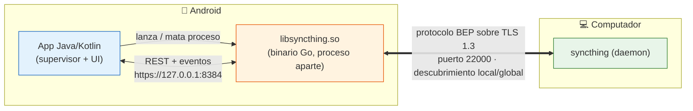
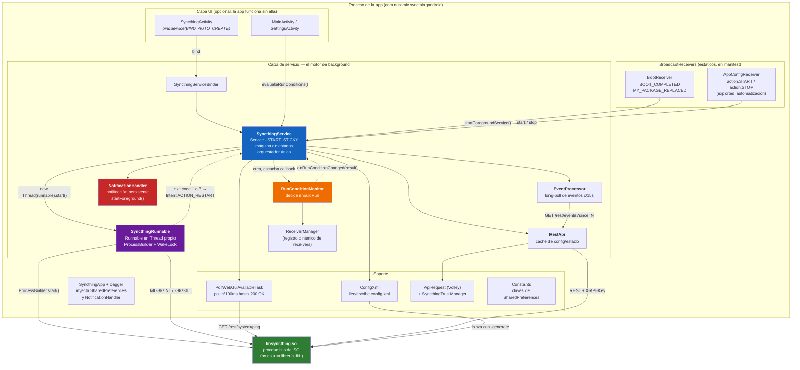
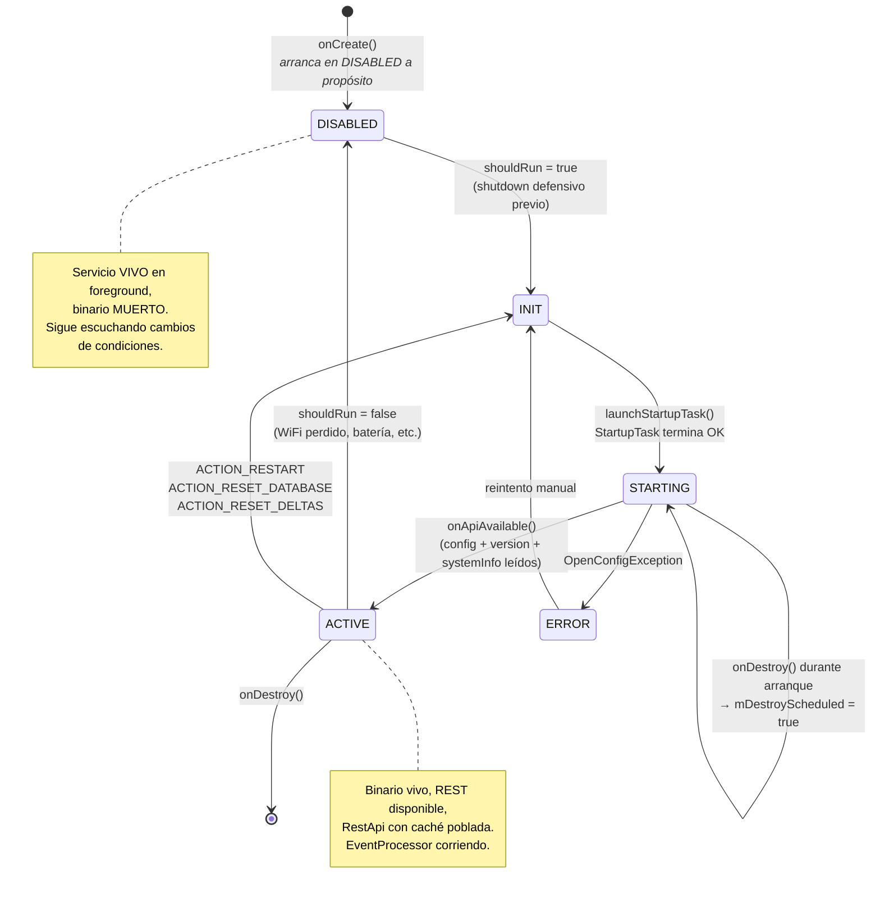
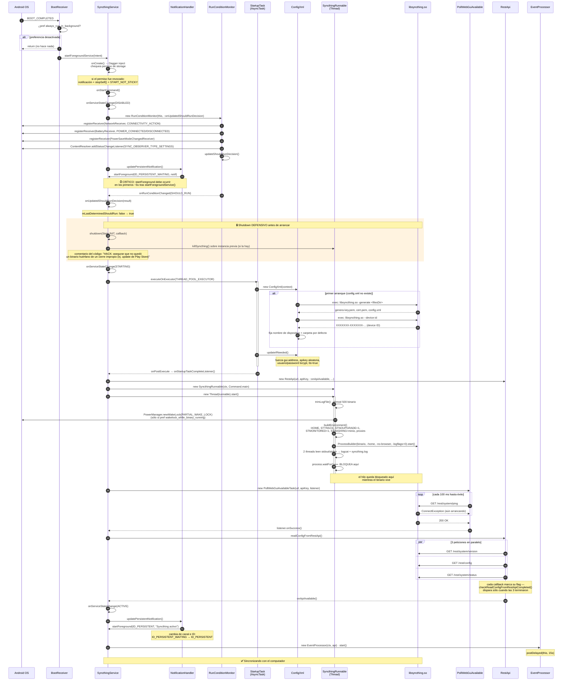
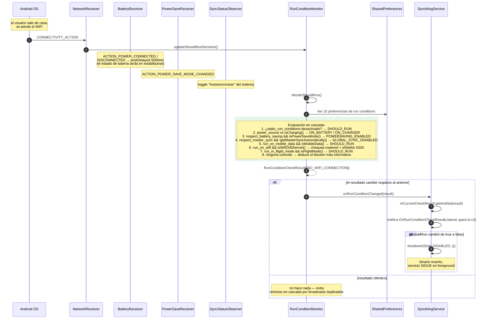
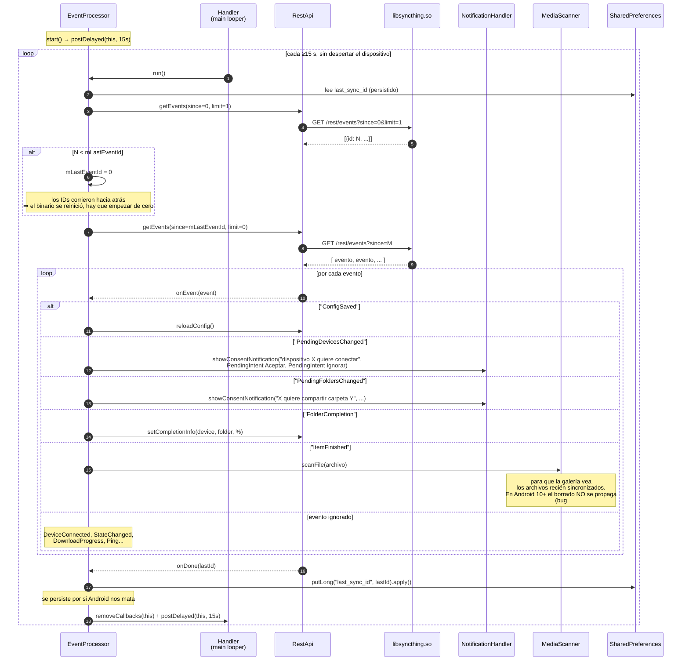
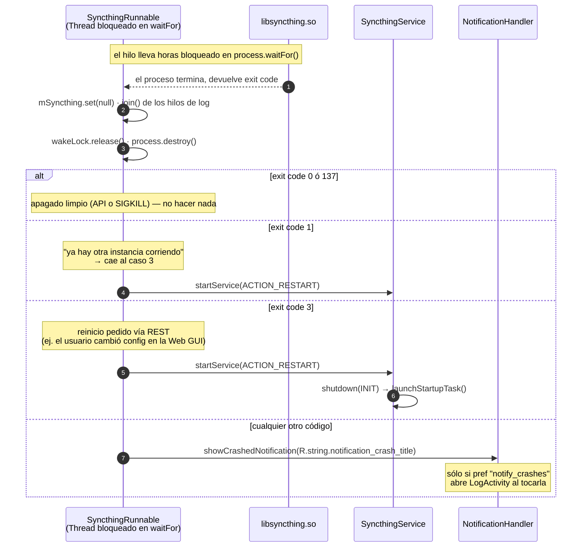
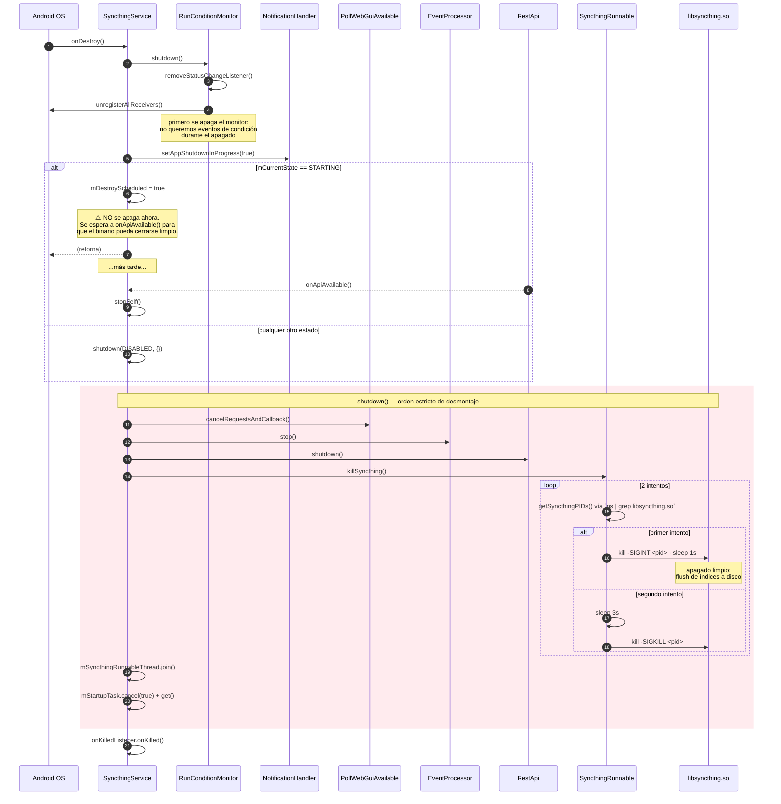
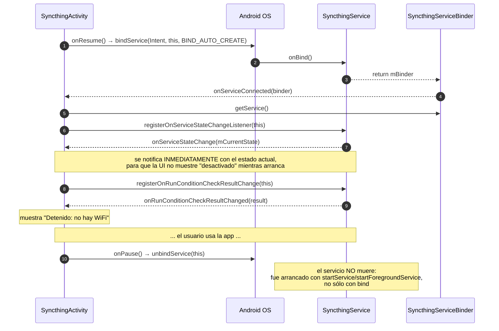
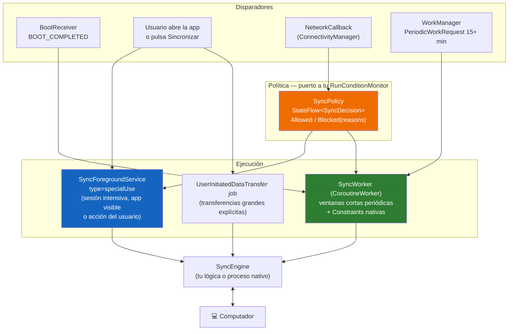

# Ingeniería inversa: motor de sincronización en background de `syncthing-android`

**Repositorio analizado:** [syncthing/syncthing-android](https://github.com/syncthing/syncthing-android) (archivado, último release v1.28.1 — `versionCode 4395`, `minSdk 21`, `targetSdk 33`)
**Alcance:** motor de ejecución en segundo plano (servicio, ciclo de vida, condiciones de ejecución, wake locks, notificaciones, arranque en boot, apagado ordenado).
**Objetivo:** replicar esta funcionalidad en una app Android propia.

---

## 0. La idea central en una frase

Syncthing-Android **no implementa la sincronización**. Es un *wrapper*: empaqueta el binario nativo de Syncthing (escrito en Go) dentro del APK, lo lanza como **proceso hijo del sistema operativo**, y usa un `Service` de Android en primer plano únicamente como **supervisor de ciclo de vida** de ese proceso. Toda la lógica de sincronización con el computador (descubrimiento, TLS, protocolo BEP, resolución de conflictos) vive en el binario Go; la app Android sólo decide **cuándo el proceso debe estar vivo** y habla con él por **REST sobre HTTP a localhost**.

Esta separación es la decisión arquitectónica más importante del proyecto, y de ella se derivan casi todas las demás.



> **Implicación para ti:** si vas a sincronizar con un computador, la pregunta previa a toda la arquitectura es *¿qué corre el trabajo real?* Un binario nativo empaquetado (como aquí), una librería Kotlin propia, o un cliente de un protocolo existente. El patrón de supervisión que documento abajo es reutilizable en los tres casos; sólo cambia qué hay al otro lado del "lanza / mata proceso".

---

## 1. Diagrama de componentes



### Responsabilidad de cada componente

| Componente | Responsabilidad única | Por qué está separado |
|---|---|---|
| `SyncthingService` | Orquestador. Es el **único** que cambia de estado y el único que decide arrancar/parar el binario. | Un solo punto de verdad evita carreras entre UI, receivers y monitor de condiciones. |
| `RunConditionMonitor` | Responde una sola pregunta: *¿debe correr ahora?* Devuelve `SHOULD_RUN` o una lista de `BlockerReason`. | Aísla toda la política (WiFi/datos/batería/ahorro de energía) del mecanismo. Testeable y sustituible. |
| `SyncthingRunnable` | Lanza, vigila y mata el proceso nativo. Mantiene el `WakeLock`. | Encapsula todo lo que es "sistema operativo", incluido el `su` opcional. |
| `NotificationHandler` | Es quien llama a `startForeground()` / `stopForeground()`. | La notificación **es** el mecanismo que mantiene vivo el servicio; centralizarlo evita el crash por `startForeground` tardío. |
| `EventProcessor` | Traduce eventos del núcleo Syncthing a acciones Android (notificaciones de consentimiento, MediaScanner). | Es el puente evento-núcleo → mundo Android. |
| `RestApi` | Cliente REST + caché de config y estado. | La UI nunca toca el binario directamente. |
| `PollWebGuiAvailableTask` | Detecta *cuándo* el binario terminó de arrancar. | El binario tarda un tiempo indeterminado; no hay callback, hay que sondear. |

---

## 2. Máquina de estados del servicio

Todo el motor gira alrededor de cinco estados (`SyncthingService.State`). El campo `mCurrentState` está protegido por `mStateLock`.



### El detalle que la mayoría de la gente pasa por alto

`DISABLED` **no significa "servicio muerto"**. Significa "servicio en primer plano, con notificación visible, binario apagado, escuchando cambios de red y batería para volver a encender". Esta es la clave de todo el diseño de background:

> El servicio Android vive **siempre**; lo que se enciende y apaga es el proceso de sincronización.

Si el servicio se muriera cuando no hay que sincronizar, nadie recibiría el broadcast de "volvió el WiFi" en Android 8+, y la sincronización nunca se reanudaría sola.

Por eso el estado inicial es `DISABLED` y no `INIT` — el comentario en el código lo explica: `mLastDeterminedShouldRun` arranca en `false`, así que si `RunConditionMonitor` no manda un `shouldRun = true` poco después de instanciarse, la UI debe ver `DISABLED` y no quedarse colgada en un spinner.

---

## 3. Diagramas de secuencia

### 3.1 Arranque completo — desde `BOOT_COMPLETED` hasta `ACTIVE`

Este es el flujo principal. Nota el **shutdown defensivo antes de arrancar** y el **doble asincronismo** (AsyncTask para config, Thread para el proceso, polling para detectar disponibilidad).



**Puntos de diseño que vale la pena robar:**

1. **`startForeground()` se llama antes de que exista nada que mostrar.** No espera a que el binario arranque. Android 8+ mata la app si `startForegroundService()` no va seguido de `startForeground()` en pocos segundos.
2. **Dos IDs de notificación distintos** (`ID_PERSISTENT` = 1 y `ID_PERSISTENT_WAITING` = 4) en dos canales distintos. El comentario del código explica el porqué: si el usuario oculta uno de los canales, `startForeground()` no actualizaría la notificación sino que reutilizaría la vieja. Usando IDs separados, siempre se muestra el correcto y se cancela el otro.
3. **El polling a 100 ms** es agresivo pero acotado: sólo dura lo que tarda el binario en levantar el servidor HTTP (~1-3 s). Es más simple y más rápido que un backoff exponencial para esta ventana.
4. **`checkReadConfigFromRestApiCompleted()`** es un contador de fan-in de 3 peticiones paralelas. El comentario dice explícitamente que se hizo así para no bloquear el hilo principal con peticiones REST síncronas.

---

### 3.2 Decisión de ejecución — el corazón del "background inteligente"



**El patrón clave: `RunConditionCheckResult` no es un booleano.** Es `shouldRun` **más la lista de razones por las que no**, y tiene `equals()` implementado sobre ambos campos. Esto permite dos cosas a la vez:

- **Deduplicación:** los broadcasts de conectividad llegan por docenas; sólo se actúa cuando la *decisión* cambia, no cuando llega el evento.
- **UI honesta:** la app puede mostrar *"Detenido: no hay WiFi"* en vez de un genérico "desactivado". Cada `BlockerReason` lleva su `@StringRes`.

```java
// El enum con su mensaje asociado — patrón muy limpio para replicar
public enum BlockerReason {
    ON_BATTERY(R.string.syncthing_disabled_reason_on_battery),
    ON_CHARGER(R.string.syncthing_disabled_reason_on_charger),
    POWERSAVING_ENABLED(R.string.syncthing_disabled_reason_powersaving),
    GLOBAL_SYNC_DISABLED(R.string.syncthing_disabled_reason_android_sync_disabled),
    WIFI_SSID_NOT_WHITELISTED(...), WIFI_WIFI_IS_METERED(...),
    NO_NETWORK_OR_FLIGHTMODE(...), NO_MOBILE_CONNECTION(...),
    NO_WIFI_CONNECTION(...), NO_ALLOWED_NETWORK(...);
}
```

---

### 3.3 Bucle de eventos — cómo la app se entera de lo que pasa



**Decisiones notables:**

- **`Handler.postDelayed`, no `AlarmManager`.** El comentario lo dice literalmente: *"Este intervalo no despertará el dispositivo para ahorrar batería"*. Si el teléfono está en Doze, el poll simplemente no ocurre — y no pasa nada, porque el binario Go sigue teniendo su propio estado. Los eventos no se pierden: se acumulan y se leen al siguiente ciclo gracias a `since=<lastEventId>`.
- **El `lastEventId` se persiste en `SharedPreferences`** en cada ciclo. Si Android mata el proceso, al volver no se reprocesan eventos viejos ni se pierden los nuevos.
- **`removeCallbacks` antes de cada `postDelayed`** garantiza que nunca haya dos pollers concurrentes.
- **El chequeo de "IDs hacia atrás"** es el detector de reinicio del binario. Elegante y barato.

---

### 3.4 Reinicio del binario y manejo de crashes



**El binario se auto-reinicia por intención propia.** Cuando cambias la configuración desde la Web GUI, el núcleo Syncthing sale con código 3 y espera que su supervisor lo relance. La app implementa exactamente ese contrato — y lo hace **mandándose un Intent a sí misma** (`ACTION_RESTART`), no llamando a un método. Eso serializa el reinicio en el mismo `onStartCommand` que atiende todo lo demás, evitando carreras.

---

### 3.5 Apagado ordenado (y el caso feo: apagar mientras arranca)



**Dos cosas que casi nadie hace bien y aquí sí:**

1. **`mDestroyScheduled`.** Si te matan mientras estás arrancando, no puedes apagar el binario limpiamente (aún no sabes ni su PID ni si terminó de escribir su base de datos). La solución es aplazar el `stopSelf()` hasta que el arranque complete. El comentario del código lo documenta explícitamente.
2. **SIGINT antes de SIGKILL, con espera.** Un `SIGKILL` directo sobre Syncthing corrompe los índices. El flujo es: SIGINT → 1 s → ¿sigue vivo? → 3 s → SIGKILL. Y todo esto identificando los PIDs por `ps`, no por el handle del `Process`, porque con `su` el proceso hijo real es otro.

---

### 3.6 Cómo se conecta la UI (y por qué la UI es opcional)



La combinación **`startForegroundService()` + `bindService(BIND_AUTO_CREATE)`** es deliberada: `startService` da la vida larga (el servicio sobrevive a que se cierre la UI) y `bind` da el canal de comunicación directo mientras hay UI. Los listeners se notifican inmediatamente al registrarse, para que la UI nunca parpadee con un estado obsoleto.

---

## 4. Cómo se mantiene vivo: el inventario completo de mecanismos

| Mecanismo | Dónde | Qué consigue |
|---|---|---|
| `startForeground()` **siempre** en Android 8+ | `NotificationHandler.updatePersistentNotification()` | Prioridad de proceso alta + **capacidad de recibir broadcasts implícitos**. Sin esto, en Android 8+ no llegaría `CONNECTIVITY_ACTION`. |
| `START_STICKY` | `SyncthingService.onStartCommand()` | Si el sistema mata el servicio por memoria, lo relanza con Intent nulo. |
| `START_NOT_STICKY` cuando falta permiso de storage | idem | No reintentar algo que va a fallar siempre. |
| `BootReceiver` con `BOOT_COMPLETED` + `MY_PACKAGE_REPLACED` | manifest | Rearranque tras reiniciar el teléfono **y tras actualizar la app**. |
| `PARTIAL_WAKE_LOCK` | `SyncthingRunnable.run()` | CPU despierta con la pantalla apagada. **Opt-in** (`wakelock_while_binary_running`), desactivado por defecto. |
| Diálogo de exención de optimización de batería | `MainActivity`, con `isIgnoringBatteryOptimizations()` | Pide al usuario salir de Doze. Es un permiso especial, no se puede conceder solo. |
| Receivers **dinámicos** para red/batería | `RunConditionMonitor` + `ReceiverManager` | Registrados sólo mientras el servicio vive; Android 8+ prohíbe estos broadcasts en receivers de manifest. |
| Notificación de prioridad `IMPORTANCE_MIN` | `NotificationHandler` | Cumple el requisito de FGS con la mínima molestia visual. |
| `AppConfigReceiver` exportado | manifest | Permite a Tasker/automatizaciones arrancar y parar el servicio. |
| `STNOUPGRADE=1` | `SyncthingRunnable.buildEnvironment()` | El binario no intenta auto-actualizarse (Play lo prohíbe). |
| `STHASHING=minio` | idem | Salta el benchmark de hashing al arrancar → arranque más rápido. |

---

## 5. Cómo se empaqueta el binario nativo (truco importante)

El binario Go se compila para cada ABI y se coloca en `app/src/main/jniLibs/<abi>/` con el nombre **`libsyncthing.so`**, aunque no sea una librería compartida sino un ejecutable.

```python
# syncthing/build-syncthing.py (resumido)
target_artifact = os.path.join(project_dir, 'app','src','main','jniLibs', jni_dir, 'libsyncthing.so')
os.rename(os.path.join(syncthing_dir, 'syncthing'), target_artifact)
```

```kotlin
// app/build.gradle.kts
packagingOptions {
    jniLibs { useLegacyPackaging = true }   // si no, el .so no queda extraído en instalaciones por App Bundle
}
```

Y en tiempo de ejecución:

```java
// Constants.java
static File getSyncthingBinary(Context context) {
    return new File(context.getApplicationInfo().nativeLibraryDir, "libsyncthing.so");
}
```

**Por qué este truco:** desde Android 10, `/data/data/<pkg>/files` está montado con `noexec`. El único directorio del que puedes ejecutar un binario propio es `nativeLibraryDir`, y para que el instalador lo coloque ahí tiene que llamarse `lib*.so` y estar en `jniLibs`. Con App Bundles hace falta además `useLegacyPackaging = true` para que quede extraído en disco y no comprimido dentro del APK.

> Aviso: en Android 14+ Google ha ido restringiendo la ejecución de código no incluido como librería del sistema. Si vas por esta ruta, valídala en dispositivos recientes antes de comprometerte.

---

## 6. Replicarlo hoy: qué cambia en Android 14/15/16

El código analizado apunta a `targetSdk 33` (Android 13). **Ese diseño ya no compila igual ni se comporta igual en las versiones actuales.** Estos son los cambios que te van a afectar, en orden de gravedad.

### 6.1 ⚠️ El bloqueante mayor: `dataSync` tiene límite de 6 horas

Desde Android 15, un foreground service de tipo `dataSync` sólo puede correr **6 horas por cada periodo de 24 h** (compartidas entre todos los servicios de ese tipo de tu app). Al agotarse:

- el sistema llama a `Service.onTimeout(int, int)`,
- tienes **unos pocos segundos** para llamar a `stopSelf()`,
- si no lo haces: `RemoteServiceException: "A foreground service of type dataSync did not stop within its timeout"` (crash),
- intentar arrancar otro después lanza `ForegroundServiceStartNotAllowedException`.

El contador **se reinicia cuando el usuario trae la app a primer plano**. Un modelo "siempre encendido" al estilo Syncthing es, literalmente, imposible con `dataSync`.

### 6.2 ⚠️ `dataSync` ya no puede arrancarse desde `BOOT_COMPLETED`

Apps que apuntan a Android 15+ no pueden lanzar un FGS de tipo `dataSync` desde un receiver de `BOOT_COMPLETED`. Tipos que **sí** pueden: `connectedDevice`, `health`, `location`, `shortService`, `specialUse`, `systemExempted`, `remoteMessaging`, `mediaProcessing`.

### 6.3 Opciones reales, comparadas

| Opción | Vida útil | Arranca en boot | Coste |
|---|---|---|---|
| FGS `dataSync` | 6 h / 24 h | ❌ | Inviable para always-on |
| FGS **`specialUse`** | Sin límite documentado | ✅ | Requiere `<property android:name="android.app.PROPERTY_SPECIAL_USE_FGS_SUBTYPE">` con justificación **revisada manualmente por Google Play**. Fuera de Play (F-Droid, sideload) no hay revisión. |
| FGS `connectedDevice` | Sin límite de 6 h | ✅ | Legítimo si sincronizas por Bluetooth/USB/NFC/conexión local. Con un PC en la misma LAN es defendible; con un servidor en internet, no. |
| **User-Initiated Data Transfer job** (`setUserInitiated(true)`, API 34+) | Larga, sin el límite de 6 h | ❌ (por definición lo inicia el usuario) | Debe originarse en una acción explícita del usuario y mostrar progreso. |
| **WorkManager periódico** con constraints | ≤10 min por ejecución, mínimo 15 min de intervalo | ✅ (se re-agenda solo) | No es tiempo real, pero es lo que Google recomienda y lo que sobrevive a Doze sin pelearse con el sistema. |

### 6.4 Arquitectura recomendada para una app nueva

La respuesta pragmática es **híbrida**: no elijas uno, combina el modo oportunista con el modo de fondo.



**Regla de reparto:**
- **WorkManager periódico** es la base que siempre corre: cada 15–30 min, con `Constraints` de red no medida y batería no baja. Sobrevive a reinicios, a Doze y a los límites de FGS porque nunca es un FGS.
- **FGS `specialUse`** se enciende para sesiones intensivas: cuando el usuario tiene la app abierta, o justo después de una acción suya. Se apaga cuando la cola de trabajo se vacía.
- **`NetworkCallback`** sustituye a `CONNECTIVITY_ACTION` (deprecado desde API 28) y es más preciso: te da `NetworkCapabilities` con `NOT_METERED`, `VALIDATED`, `TRANSPORT_WIFI` directamente, sin `NetworkInfo`.

### 6.5 Esqueleto en Kotlin — el `RunConditionMonitor` modernizado

```kotlin
sealed interface SyncDecision {
    data object Allowed : SyncDecision
    data class Blocked(val reasons: List<BlockerReason>) : SyncDecision
}

enum class BlockerReason(@StringRes val message: Int) {
    ON_BATTERY(R.string.blocked_on_battery),
    POWER_SAVING(R.string.blocked_power_saving),
    METERED_NETWORK(R.string.blocked_metered),
    SSID_NOT_ALLOWED(R.string.blocked_ssid),
    NO_NETWORK(R.string.blocked_no_network),
}

class SyncPolicy(
    private val context: Context,
    private val prefs: SyncPreferences,
    scope: CoroutineScope,
) {
    private val cm = context.getSystemService<ConnectivityManager>()!!
    private val pm = context.getSystemService<PowerManager>()!!

    // Reemplazo moderno de CONNECTIVITY_ACTION
    private val network: Flow<NetworkCapabilities?> = callbackFlow {
        val cb = object : ConnectivityManager.NetworkCallback() {
            override fun onCapabilitiesChanged(n: Network, caps: NetworkCapabilities) {
                trySend(caps)
            }
            override fun onLost(n: Network) { trySend(null) }
        }
        cm.registerDefaultNetworkCallback(cb)
        awaitClose { cm.unregisterNetworkCallback(cb) }
    }

    private val power: Flow<Intent?> = context.broadcastFlow(
        Intent.ACTION_POWER_CONNECTED,
        Intent.ACTION_POWER_DISCONNECTED,
        PowerManager.ACTION_POWER_SAVE_MODE_CHANGED,
    ).onEach { delay(5_000) }   // mismo settle de 5s que el original

    val decision: StateFlow<SyncDecision> =
        combine(network, power, prefs.flow) { caps, _, p -> evaluate(caps, p) }
            .distinctUntilChanged()          // ← el equals() de RunConditionCheckResult
            .stateIn(scope, SharingStarted.Eagerly, SyncDecision.Blocked(listOf(NO_NETWORK)))

    private fun evaluate(caps: NetworkCapabilities?, p: Prefs): SyncDecision {
        val blockers = buildList {
            if (caps == null || !caps.hasCapability(NET_CAPABILITY_VALIDATED)) add(NO_NETWORK)
            if (p.respectPowerSaving && pm.isPowerSaveMode) add(POWER_SAVING)
            if (p.wifiOnly && caps?.hasTransport(TRANSPORT_WIFI) != true) add(NO_NETWORK)
            if (!p.allowMetered && caps?.hasCapability(NET_CAPABILITY_NOT_METERED) != true) add(METERED_NETWORK)
            if (p.requireCharging && !isCharging()) add(ON_BATTERY)
        }
        return if (blockers.isEmpty()) SyncDecision.Allowed else SyncDecision.Blocked(blockers)
    }
}
```

`distinctUntilChanged()` sobre un `data class` te da gratis exactamente la deduplicación que en Java se conseguía implementando `equals()` a mano en `RunConditionCheckResult`.

### 6.6 Esqueleto del servicio con `onTimeout`

```kotlin
class SyncForegroundService : LifecycleService() {

    override fun onStartCommand(intent: Intent?, flags: Int, startId: Int): Int {
        // Debe ocurrir en los primeros segundos, igual que en el original
        ServiceCompat.startForeground(
            this, NOTIF_ID, buildNotification(SyncState.Starting),
            ServiceInfo.FOREGROUND_SERVICE_TYPE_SPECIAL_USE
        )

        lifecycleScope.launch {
            policy.decision.collect { decision ->
                when (decision) {
                    is SyncDecision.Allowed -> engine.start()
                    is SyncDecision.Blocked -> {
                        engine.stop()
                        updateNotification(decision.reasons)   // "Detenido: red de datos móviles"
                    }
                }
            }
        }
        return START_STICKY
    }

    // Android 15+: obligatorio si usas dataSync o mediaProcessing.
    // Con specialUse no aplica hoy, pero implementarlo es barato y te protege.
    override fun onTimeout(startId: Int, fgsType: Int) {
        engine.requestGracefulStop()      // equivalente al SIGINT del original
        WorkManager.getInstance(this).enqueue(     // continuar por la vía deferrable
            OneTimeWorkRequestBuilder<SyncWorker>()
                .setConstraints(Constraints(requiredNetworkType = NetworkType.UNMETERED))
                .build()
        )
        stopSelf()
    }
}
```

```xml
<service
    android:name=".sync.SyncForegroundService"
    android:foregroundServiceType="specialUse"
    android:exported="false">
    <property
        android:name="android.app.PROPERTY_SPECIAL_USE_FGS_SUBTYPE"
        android:value="Peer-to-peer file synchronization with the user's own computer on the local network. Requires a persistent connection to detect and transfer file changes in real time." />
</service>
```

```xml
<uses-permission android:name="android.permission.FOREGROUND_SERVICE" />
<uses-permission android:name="android.permission.FOREGROUND_SERVICE_SPECIAL_USE" />
<uses-permission android:name="android.permission.POST_NOTIFICATIONS" />
<uses-permission android:name="android.permission.RECEIVE_BOOT_COMPLETED" />
<uses-permission android:name="android.permission.ACCESS_NETWORK_STATE" />
```

### 6.7 Tabla de migración pieza por pieza

| syncthing-android (2024) | Equivalente hoy |
|---|---|
| `Service` + `START_STICKY` | Igual, pero con `foregroundServiceType` obligatorio |
| `dataSync` implícito (no había tipos) | `specialUse` con justificación, o `connectedDevice` si aplica |
| `CONNECTIVITY_ACTION` receiver | `ConnectivityManager.registerDefaultNetworkCallback()` |
| `NetworkInfo.getType()` / `isActiveNetworkMetered()` | `NetworkCapabilities.hasTransport()` / `NET_CAPABILITY_NOT_METERED` |
| `WifiManager.getConnectionInfo().getSSID()` | Requiere `ACCESS_FINE_LOCATION` en runtime; en API 31+ usa `NetworkCallback` + `WifiInfo` desde `TransportInfo` |
| `AsyncTask` (`StartupTask`) | `lifecycleScope.launch(Dispatchers.IO)` o `CoroutineWorker` |
| `Handler.postDelayed` para el poll de eventos | `flow { while(true) { emit(...); delay(15.seconds) } }` en `lifecycleScope` |
| Listeners `HashSet<OnServiceStateChangeListener>` | `StateFlow<SyncState>` expuesto desde un repositorio singleton |
| `bindService` + `Binder` | Igual, o mejor: un repositorio compartido por Hilt y nada de binder |
| Dagger 2 manual | Hilt |
| `WRITE_EXTERNAL_STORAGE` / `MANAGE_EXTERNAL_STORAGE` | SAF (`ACTION_OPEN_DOCUMENT_TREE`) + persistencia de permisos URI |
| `PARTIAL_WAKE_LOCK` opcional | Casi nunca necesario: el FGS ya mantiene la CPU mientras corre |
| Diálogo de exención de batería | Igual (`ACTION_REQUEST_IGNORE_BATTERY_OPTIMIZATIONS`), pero Play restringe su uso |

---

## 7. Lecciones transferibles (el resumen accionable)

1. **Separa política de mecanismo.** `RunConditionMonitor` no sabe arrancar nada; `SyncthingRunnable` no sabe decidir nada. Toda la complejidad de "cuándo" queda en una clase que devuelve un valor.
2. **La decisión es un valor con `equals()`, no un booleano.** Te da deduplicación de eventos y mensajes de UI honestos con el mismo código.
3. **El servicio vive siempre; el trabajo se enciende y apaga.** Si matas el servicio cuando no hay trabajo, pierdes la capacidad de detectar cuándo vuelve a haberlo.
4. **Un único orquestador con estado bloqueado.** `SyncthingService` es el único que muta `mCurrentState`, siempre bajo `mStateLock`, y siempre notifica desde el hilo principal vía `Handler`.
5. **Todo lo asíncrono tiene su detector de finalización.** Fan-in de 3 peticiones (`checkReadConfigFromRestApiCompleted`), polling hasta 200 OK, `join()` de hilos antes de dar por terminado el shutdown.
6. **Apagado en dos fases con espera.** SIGINT → esperar → SIGKILL. Aplicable a cualquier trabajo que escriba en disco.
7. **Shutdown defensivo antes de cada arranque.** Nunca asumas que el estado previo quedó limpio.
8. **Persiste el punto de continuación en cada ciclo.** El `lastEventId` en `SharedPreferences` hace que sobrevivir a un kill del sistema sea trivial.
9. **La UI es completamente opcional.** El motor arranca, sincroniza y se apaga sin que exista ninguna `Activity`.

---

## 8. Advertencias sobre el repositorio de origen

- El proyecto está **archivado** desde diciembre de 2024. El README lo atribuye a la dificultad de publicar en Google Play y a la falta de mantenimiento activo.
- Existe un fork mantenido, **Syncthing-Fork** de Catfriend1 (`com.github.catfriend1.syncthingandroid`), disponible en F-Droid y Google Play. Si tu objetivo fuera portar en lugar de reimplementar, es el punto de partida más actualizado.
- El código usa APIs deprecadas en varios sitios (`AsyncTask`, `NetworkInfo`, `CONNECTIVITY_ACTION`, `android.preference.PreferenceManager`) y `targetSdk 33`. Léelo como documento de arquitectura, no como plantilla de código.

---

## 9. Índice de archivos de referencia

| Archivo | Líneas | Qué buscar |
|---|---|---|
| `service/SyncthingService.java` | 710 | Máquina de estados, `onStartCommand`, `shutdown()`, `onUpdatedShouldRunDecision()` |
| `service/RunConditionMonitor.java` | 393 | `decideShouldRun()`, receivers dinámicos, detección de red/batería |
| `service/SyncthingRunnable.java` | 467 | `ProcessBuilder`, wake lock, `killSyncthing()`, códigos de salida, variables de entorno |
| `service/NotificationHandler.java` | 305 | `updatePersistentNotification()`, canales, doble ID |
| `service/EventProcessor.java` | 318 | Long-poll de eventos, `lastEventId`, notificaciones de consentimiento |
| `service/RestApi.java` | 730 | `readConfigFromRestApi()`, fan-in de 3 peticiones |
| `service/Constants.java` | 155 | Todas las claves de preferencias y rutas de archivos |
| `model/RunConditionCheckResult.java` | — | El patrón decisión-con-razones |
| `receiver/BootReceiver.java` | 46 | `startServiceCompat()` |
| `http/PollWebGuiAvailableTask.java` | — | Polling a 100 ms |
| `util/ConfigXml.java` | — | Generación de claves en primer arranque, API key |
| `syncthing/build-syncthing.py` | — | Compilación cruzada Go → `libsyncthing.so` |
| `app/src/main/AndroidManifest.xml` | — | Permisos y declaración del servicio |

---

*Documento generado por ingeniería inversa del código fuente en `syncthing/syncthing-android` @ HEAD (rama archivada), septiembre 2026.*
