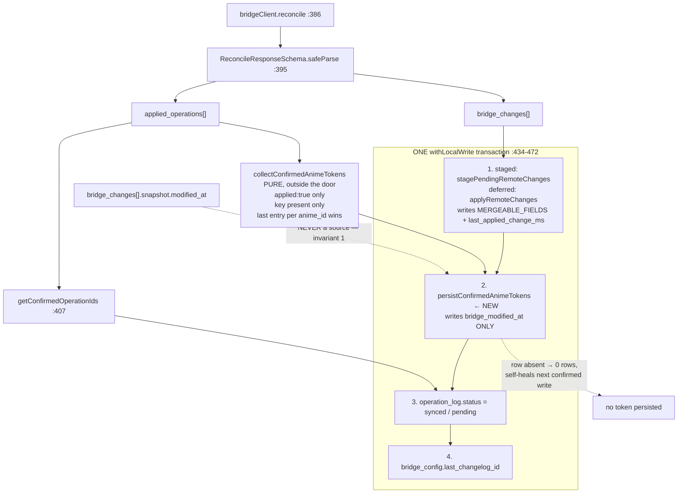
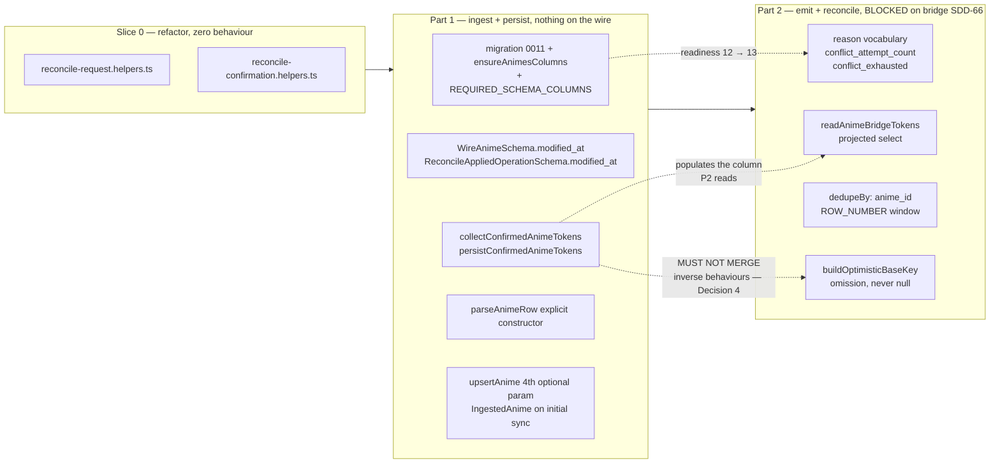

# Design: Anime OCC Token

## Technical Approach

The token is a **fourth channel** into the `animes` table, disjoint from the three that exist. It enters through parse boundaries that currently strip it, is persisted by a writer that touches exactly one column, and is read back only through a named projected query. Nothing on the domain side ever sees it.

The organising rule that resolves every placement question in this change:

> **State whose lifetime is the ANIME lives on `animes`. State whose lifetime is the OPERATION lives on `operation_log`.**

That single rule settles both storage decisions the proposal makes and shows they do not conflict: the token is one bridge-authored value per anime, valid for every operation targeting it (Decision 1); the retry counter is one client-authored value per queued row that must die with the row (Decision 2, §6 below).

The second organising rule is **column disjointness**, and it is what makes the new write-back safe to run next to the existing one:

| Writer | Columns it may write | Columns it may never write |
|---|---|---|
| `applyRemoteChanges` → `upsertAnime` / `applyAnimePartial` | `MERGEABLE_FIELDS` (`field-merge.helpers.ts:10-30`) + `last_applied_change_ms` | `bridge_modified_at` |
| `persistConfirmedAnimeTokens` (new) | `bridge_modified_at` | everything else |

Verified, not assumed: `MERGEABLE_FIELDS` is an explicit whitelist and `deriveChangedFields` (`field-merge.helpers.ts:120-138`) iterates **it**, not `Object.keys(row)`. A new physical column therefore cannot enter the merge path by inference. Its JSDoc must be extended to name `bridge_modified_at` as the second excluded sync-internal column.

## Architecture Decisions

### Decision 1 — The write-back runs LAST inside the EXISTING transaction, after the `bridge_changes` apply

**Choice**: append `persistConfirmedAnimeTokens(writeDb, confirmedTokens)` inside the `withLocalWrite` callback at `reconcile.helpers.ts:434-472`, immediately after the `staged`/`deferred` branch and before the op-log status flips. The token list is computed **outside** the door (pure function over the parsed response).

| Option | Tradeoff | Decision |
|---|---|---|
| Same transaction, after the apply | One extra statement inside a door already open | **Chosen** |
| Separate transaction after the cycle | Second door acquisition; a crash between the two leaves `synced` + stale token | Rejected — see below |
| Before `applyRemoteChanges` | `UPDATE` against a row `applyRemoteChanges` has not created yet silently matches 0 rows | Rejected |

**Why the same transaction is load-bearing.** The token and the `status = 'synced'` flip are two halves of one fact: *the bridge accepted this write, and this is the version it produced*. Split them, die in between, and the row is marked synced while the token is stale — so the very next operation for that anime sends a stale `base` and the bridge rejects **our own confirmed history**. That is the exact failure Decision 1 of the proposal exists to prevent, reintroduced by a transaction boundary instead of by a storage choice.

**Why after, not before.** `applyAcceptedChange` (`apply-remote-changes.helpers.ts:34-43`) may be the thing that *creates* the row: an `update` for a record the device has never seen falls through to `upsertAnime`. A token `UPDATE ... WHERE _id = ?` against a not-yet-existing row matches zero rows and is lost in silence. Running last maximises the chance the row exists. The `delete` branch (`:87`) argues the same way: writing a token onto a row that is about to be deleted is pointless work, and writing it after the delete correctly writes nothing.

### Decision 2 — Precedence when one anime appears in BOTH `applied_operations` and `bridge_changes`

**This is the rule a later reader will get wrong, so it is stated as a rule, not left to ordering.**

> `applied_operations` is authoritative for `bridge_modified_at` and for nothing else.
> `bridge_changes` is authoritative for every domain column and for `last_applied_change_ms`, and for nothing else.

They never contend, because the two writers address disjoint column sets (see the table above). The ordering in Decision 1 is a **row-existence** dependency, not a conflict resolution — and that distinction is why a future refactor may reorder nothing without re-reading both.

Consequence worth stating plainly: when our own confirmed write comes back as *both* an `applied_operations` entry and the `bridge_changes` entry it generated, the row gets its domain columns from the changelog and its token from the ack, in one transaction. Invariant 1 is upheld structurally — `normalizeBridgeChange` (`reconcile.helpers.ts:309-317`) builds an explicit `RemoteAnimeChange` and `mapWireAnimeToLegacyAnime` (`anime-wire.helpers.ts:8-19`) builds an explicit `Anime`, so `snapshot.modified_at` has no path to any writer even though `WireAnimeSchema` now parses it.

### Decision 3 — The write-back runs in BOTH apply modes, including `staged`

**Choice**: `persistConfirmedAnimeTokens` writes to `animes` directly even when `applyMode === 'staged'`.

The staged path exists because the headless connection has `enableChangeListener: false`, so a direct `animes` write would not notify foreground `useLiveQuery` consumers (`reconcile.helpers.ts:423-433`). That reason **does not apply to this column**: invariant 5 forbids any UI-facing consumer, so there is no observer to miss a notification. Staging the token instead would need its own staging surface and would let a background cycle run twice before a foreground drain, sending a stale `base` on the second run — the self-conflict the proposal's Decision 1 rules out.

Accepted consequence: in staged mode a brand-new anime whose `create` is still staged has no row yet, so its token write matches zero rows and is lost. It self-heals on that anime's next confirmed write — the same shape as invariant 3's transitional state, and strictly better than the alternative.

### Decision 4 — Two mirrored trap sites, in two modules, deliberately NOT merged

| | Read side (Part 1) | Write side (Part 2) |
|---|---|---|
| Module | `applied-operation-token.helpers.ts` | `reconcile-base-token.helpers.ts` |
| Unit | `collectConfirmedAnimeTokens` | `buildOptimisticBaseKey` |
| Must PRESERVE | a real `0` | — |
| Must ERASE | — | a `NULL` (produce no key) |
| Absence is | `modified_at` key absent → contribute nothing | token `NULL` → emit no `base` key |
| The bug | `?? null` / `\|\| undefined` **destroys** a real `0` | `?? null` **manufactures** `base: 0` |
| Return shape | `ConfirmedAnimeToken[]` — an entry exists or does not | `{ base: number } \| {}` — spread, never assigned |

**Why they are not one helper.** A unified "handles the optional token" helper needs one canonical in-memory representation of *no token*. Whichever it picks, one side gets the wrong default. Pick `undefined`: the read side is one `??` away from turning a real `0` into "no token". Pick `null`: the write side serialises `"base": null`, which `json.Unmarshal` into an `int64` accepts and leaves at zero — a *real* token, the exact bypass invariant 2 forbids. The two behaviours are inverse, so the correct shared abstraction does not exist. They are also delivered in different parts with different tests, which is what keeps them apart today — and Part 2's apply is precisely the moment someone notices they "both handle the optional token" and merges them.

Both files carry a JSDoc line naming the other and forbidding the merge. Both return types are chosen so the collapsing operator is not expressible on them: the read side returns a list of present entries (there is no `undefined` to `??`), and the write side returns an object to spread (there is no value to `??`).

### Decision 5 — Schema, migration, `ensure*` twin, column-level readiness

**Column**: `bridgeModifiedAt: integer('bridge_modified_at')` on `animes` (`database.schema.ts:11-33`), nullable, **no default** — invariant 4.

**Migration**: `0011_add_animes_bridge_modified_at.sql`, one statement, mirroring 0007 exactly:

```sql
ALTER TABLE `animes` ADD `bridge_modified_at` integer;
```

**Journal entry `when` — hard floor.** `clampPoisonedMigrationTimestamp` (`client.helpers.ts:282-292`) rewrites any stored `created_at` greater than `MIGRATION_0010_TIMESTAMP_MS = 1788546067501` down to that value. The migrator then compares each entry's `when` against that single maximum. So **0011's `when` must be strictly greater than `1788546067501`** or it never applies on an installed device. Use a real capture of `Date.now()` at authoring time; never hand-type a future date — that is the exact defect that poisoned 0006 (`client.constants.ts:109-121`).

**`MIGRATION_0010_TIMESTAMP_MS` must NOT be bumped to 0011's timestamp.** Its JSDoc explains why: deriving or advancing the clamp target makes the clamp poison the newest migration instead of un-poisoning the old ones. Leave the literal alone.

**`EXPECTED_SCHEMA_READINESS_VERSION` needs no edit.** It is `migrationJournal.entries.length` (`startup.constants.ts:16`), so adding the eleventh entry moves it from 11 to 12 automatically. A reader looking for a literal to bump will not find one, by design.

**`ensure*` twin.** `ensureAnimesGuardColumn` (`client.helpers.ts:201-210`) is a bespoke single-column check that already reads `PRAGMA table_info(animes)`. It becomes `ensureAnimesColumns`, reusing the shared `ensureMissingColumns` mechanism against a new `ANIMES_COLUMN_DEFINITIONS` in `client.constants.ts`, mirroring `BRIDGE_CONFIG_COLUMN_DEFINITIONS` (`:102-107`). One PRAGMA read, one mechanism, and the next `animes` column is a one-entry addition instead of another bespoke function. Its existing JSDoc about NULL semantics is kept and extended.

**Column-level readiness — and why it is forced, not defensive.** `REQUIRED_SCHEMA_COLUMNS.animes` (`startup.constants.ts:46-50`) gains `'bridge_modified_at'`, so `validateRequiredColumns` (`startup.helpers.ts:29-46`) fails startup rather than stamping readiness over a missing column.

This project's SQLite build runs `SQLITE_DQS=3`. On a device that skipped 0011, a projected `SELECT "bridge_modified_at"` does **not** error — it returns the string `'bridge_modified_at'` for every row. Part 2 would then emit `base: "bridge_modified_at"` on the wire for the entire batch. A missing column that returns a plausible-looking value for every row, instead of failing, is exactly the class of defect a table-existence check cannot see. This is the barrier.

### Decision 6 — Retry state on `operation_log`, and why that does not reopen Decision 1

Applying the organising rule from the top: the counter answers *"how many times has THIS ROW been rejected"*. Put it on `animes` and two queued operations for the same anime share one budget, so `op2` can be born already exhausted by `op1`'s failures. Put the token on `operation_log` and N rows carry N copies of one bridge fact that only the bridge may advance. Different lifetimes, different tables. No contradiction.

- `conflictAttemptCount: integer('conflict_attempt_count').notNull().default(0)` on `operation_log`, migration `0012_*` plus its own `ensure*` entry and its own `REQUIRED_SCHEMA_COLUMNS.operation_log` row (readiness → 13).
- `reason: 'conflict'` → persist that entry's own `modified_at` to `animes`, increment the counter, set `status = 'pending'` for the **next** cycle. No inner loop: the sync interval is the backoff.
- `reason: 'unsupported_operation'` → `status = 'dead_letter'` on the first response. No retry, no counter read.
- Counter reaches **3** → `status = 'conflict_exhausted'`.
- Unrecognised `reason` → surfaced, never bucketed (invariant 9).

**New terminal status, not `dead_letter`.** `'conflict_exhausted'` joins `OperationLogBacklogStatus` and `OperationLogTerminalStatus` (`operation-log-retention.types.ts:4,14`) with its own retention rule and its own counter in `OperationLogPruneResult`. That costs a third rule in `DEFAULT_OPERATION_LOG_RETENTION_POLICY` and a third field in the prune result — accepted, because folding it into `dead_letter` is the same mistake invariant 9 forbids on `reason`: collapsing two distinct causes into one value so nobody downstream can tell "the bridge rejected your request" from "your edit lost a race three times".

### Decision 7 — The projection boundary: an explicit constructor, not a type

Adding the column widens `AnimeRow`, and **a type alias cannot close the leak**. `Omit<AnimeRow, 'bridgeModifiedAt'>` still accepts a full `AnimeRow` — a wider object is assignable to a narrower one, and excess-property checking does not fire on a spread. The leak is a *runtime* leak, so the barrier must be runtime.

Measured, per site:

| Site | Today | Leaks? | Barrier |
|---|---|---|---|
| `use-anime-list.ts:36,52-66` | `db.select().from(animes)` → `parseAnimeRow(row)` → `{...row}` → `AnimeListItem` | **YES** — the token lands on every list item at runtime, and the compiler is silent | Fix `parseAnimeRow` |
| `anime-mutation.helpers.ts:33-42` | `AnimeSchema.parse(parseStoredAnimeRow(row))` | No — zod strip mode drops it | Pin with a test |
| `full-resync.helpers.ts:65` | row consumed only by `deriveChangedFields` | No — `MERGEABLE_FIELDS` whitelist | Pin with a test |

**Choice**: `parseAnimeRow` (`anime.helpers.ts:36-42`) stops spreading and constructs the domain object field by field, exactly as `mapWireAnimeToLegacyAnime` already does — the mapper invariant 5 names as the model. That makes the leak unreachable regardless of what any `select()` returns, at any site, forever.

The Part 2 read path is separately narrow: `readAnimeBridgeTokens` is the **only** query that names the column, projecting `{ _id, bridgeModifiedAt }` in the style of `loadGuardMap` (`merge-context.helpers.ts:19-24`). Two barriers, two jobs: the constructor stops the token reaching the domain; the projection stops any other query from having to think about it.

### Decision 8 — `reconcile.helpers.ts` is at 493/500 lines; the split is forced and lands FIRST

Measured: 493 lines. Constraint 5's ceiling is 500. Part 1 adds ~5; Part 2 adds ~40.

**Choice**: a mechanical, zero-behaviour extraction as its own commit **before** any OCC work.

| New module | Moved from `reconcile.helpers.ts` | ~lines |
|---|---|---|
| `reconcile-request.helpers.ts` | `buildReconcileRequestBody` `:62-79`, `normalizePendingOperationPayload` `:85-96`, `parseOperationPayload` `:169-181`, `normalizeLegacyAnimeUpdatePayloadAliases` `:189-214` | ~130 |
| `reconcile-confirmation.helpers.ts` | `getConfirmedOperationIds` `:102-116`, `isOperationConfirmed` `:126-161` | ~65 |

`syncPendingOperations` stays put — it has the widest import surface in the repo (`anime-mutation.helpers.ts:11`, `use-reconcile.ts:3`, `headless-sync-cycle.helpers.ts:9`, five test files). **No re-export barrel** from `reconcile.helpers.ts`; the three affected test files retarget their import paths (`reconcile-request-body.test.ts:1`, `reconcile-pending-operation-payload.helpers.test.ts:1-4`, `reconcile.helpers.test.ts:1-4`). Re-exporting would keep the diff smaller and leave a partial barrel that hides where the code actually lives.

After the split: ~290 lines, comfortable headroom for both parts. Cost: ~390 changed lines of pure movement. Keeping it a separate commit inside the Part 1 PR preserves the proposal's promised delivery shape while keeping each commit reviewable on its own.

### Decision 9 — Batch dedup SQL: window function, opt-in via `dedupeBy`

**Choice**: `ROW_NUMBER() OVER (PARTITION BY anime_id ORDER BY created_at ASC, id ASC)` in a subquery, filtered to rank 1, ordered and limited outside.

```sql
SELECT id, animeId, operation, payload, status, createdAt FROM (
  SELECT
    id,
    anime_id  AS animeId,
    operation,
    payload,
    status,
    created_at AS createdAt,
    ROW_NUMBER() OVER (
      PARTITION BY anime_id ORDER BY created_at ASC, id ASC
    ) AS animeRank
  FROM operation_log
  WHERE status IN (?, ?)
)
WHERE animeRank = 1
ORDER BY createdAt ASC, id ASC
LIMIT ?
```

| Option | Tradeoff | Decision |
|---|---|---|
| `ROW_NUMBER()` window | Needs SQLite ≥ 3.25 (2018; the vendored amalgamation is far newer); status params bound once | **Chosen** |
| Correlated `id = (SELECT … LIMIT 1)` | Works everywhere, but one subquery per candidate row and the status placeholders must be bound twice | Rejected |
| `GROUP BY anime_id` + `min(created_at)` bare columns | Relies on a SQLite-specific bare-column quirk, and the `id` tiebreak is **not** guaranteed — per-anime FIFO would be luck | Rejected |

Both hard requirements are structural: the `PARTITION BY` runs over the whole matching set **before** the outer `LIMIT`, and the `ORDER BY created_at ASC, id ASC` inside the partition is what keeps per-anime FIFO deterministic — `op3` can never precede `op1`, including at equal `created_at`.

**Opt-in, not a rewrite.** `OperationLogQueryParams` (`operation-log-retention.types.ts:19-23`) gains `readonly dedupeBy?: 'anime_id'`. Absent → today's flat query, byte-identical, so Part 1 ships with zero behaviour change. Present → the query above. The flag makes the semantic shift visible at the call site, where it matters.

**Two consequences the shift creates, both named:**
- `limit` now bounds **distinct animes**, not rows. `RECONCILE_BACKLOG_BATCH_LIMIT` keeps its value; its JSDoc must say which unit it counts.
- `hasMorePending` (`reconcile.helpers.ts:477-479`) currently infers "more work" from `pendingOps.length === RECONCILE_BACKLOG_BATCH_LIMIT`. Under dedup, 200 pending rows across 3 animes yield a batch of 3 and that test reports **false** while 197 rows remain. It must additionally account for rows the dedup suppressed. This changes a reported value only — `syncPendingOperations`'s loop is driven by `syncState.rerunRequested` (`:280-287`), not by `hasMorePending`, so reporting truthfully creates no inner retry loop and does not contradict Decision 2 of the proposal.
- `backlogReadCount` likewise shifts from rows read to animes batched. Same JSDoc treatment.

### Decision 10 — Part 1 token ingest for a `listAnimes` snapshot

`AnimeListSchema` transforms to the domain `Anime`, which by invariant 5 must not carry the token — so `fetchInitialSyncSnapshot` cannot simply return richer animes.

**Choice**: a transport-level pair type. `mapWireAnimeToLegacyAnime` stays a 1:1 mapper, untouched, exactly as invariant 5 requires; a new sibling composes it:

```ts
export interface IngestedAnime {
  readonly anime: Anime;
  readonly bridgeModifiedAt: number;
}
export function mapWireAnimeToIngestedAnime(wire: WireAnime): IngestedAnime;
```

`AnimeListSchema` transforms to `IngestedAnime[]`; `persistInitialSyncSnapshot` and `persistPairedBridgeConfiguration` (`initial-sync.helpers.ts:50-55,80-83`) pass `entry.bridgeModifiedAt` through to `upsertAnime`.

**Blast radius, verified**: `full-resync.helpers.ts:13-23,54` consumes `fetchInitialSyncSnapshot`'s element type, so the compiler catches it. Minimal fix: `remote.map((entry) => normalizeFetchedAnime(entry.anime))` — byte-identical behaviour.

**Drift recorded, not fixed**: `normalizeFetchedAnime` runs `WireAnimeSchema.safeParse` on a value that is already a domain `Anime` with Spanish keys, so the parse **always** fails and the function is a permanent identity no-op. Out of scope; recorded per CLAUDE.md.

### Decision 11 — `modified_at` required on the shared `WireAnimeSchema`

The proposal settles this as `z.number().int()` (required). The technical consequence it did not surface: `WireAnimeSchema` is shared by `listAnimes` **and** by `ReconcileAnimeChangeSchema.snapshot` (`reconcile.schema.ts:13`), so making it required couples every reconcile response's parse to the field's presence inside snapshots. The bridge hardcodes `0` there (invariant 1), so it is present — and the measured `listAnimes` capture has it on 143/143 records.

Building it as decided. The exposure is named because it is asymmetric: if wrong, `ReconcileResponseSchema.safeParse` fails and the cycle throws (`reconcile.helpers.ts:395-399`) — a total sync outage, not a degraded field. The rollback is one token (`.optional()`), and a test pins the coupling so it fails in CI rather than on a device.

## Data Flow

### The net-new write-back path (Part 1)



Step 2 must follow step 1 because step 1 may create the row (`apply-remote-changes.helpers.ts:41`). Steps 1 and 2 never contend because their column sets are disjoint (Decision 2). Steps 2 and 3 must share a transaction because a `synced` row with a stale token self-conflicts on its next write (Decision 1).

### Part 1 / Part 2 seam



Part 2 adds; it rewrites nothing Part 1 built. `collectConfirmedAnimeTokens` gains no branch for `reason` — the conflict re-base is a **separate** classifier (`reconcile-conflict.helpers.ts`) that feeds the same writer. The only Part 1 signature Part 2 touches is `OperationLogQueryParams`, and only by supplying an optional flag Part 1 already defined.

## File Changes

| File | Action | Description | ~lines |
|---|---|---|---|
| **Slice 0 — refactor, zero behaviour** | | | |
| `src/features/sync/reconcile-request.helpers.ts` | Create | Moved request-side helpers (Decision 8) | 130 |
| `src/features/sync/reconcile-confirmation.helpers.ts` | Create | Moved confirmation helpers | 65 |
| `src/features/sync/reconcile.helpers.ts` | Modify | Remove the moved bodies; 493 → ~290 | 195 |
| 3 test files | Modify | Import path retarget only | 6 |
| **Slice 0 subtotal** | | | **~390** |
| **Part 1 — ingest and persist** | | | |
| `src/infrastructure/db/schema/database.schema.ts` | Modify | `bridgeModifiedAt` + JSDoc | 4 |
| `src/infrastructure/db/migrations/0011_add_animes_bridge_modified_at.sql` | Create | One `ALTER TABLE` | 1 |
| `src/infrastructure/db/migrations/meta/_journal.json` | Modify | idx 11, `when` > `1788546067501` | 7 |
| `src/infrastructure/db/client/client.constants.ts` | Modify | `ANIMES_COLUMN_DEFINITIONS` | 12 |
| `src/infrastructure/db/client/client.helpers.ts` | Modify | `ensureAnimesGuardColumn` → `ensureAnimesColumns` | 12 |
| `src/infrastructure/db/startup/startup.constants.ts` | Modify | `REQUIRED_SCHEMA_COLUMNS.animes` += token | 2 |
| `src/infrastructure/validation/anime-schema/anime.schema.ts` | Modify | `modified_at` on `WireAnimeSchema` only | 4 |
| `src/infrastructure/validation/anime-schema/anime-wire.helpers.ts` | Modify | `IngestedAnime`, `mapWireAnimeToIngestedAnime` | 20 |
| `src/infrastructure/db/anime-repository.ts` | Modify | 4th optional param; `applyAnimeBridgeToken`; `persistConfirmedAnimeTokens` | 40 |
| `src/features/animes/anime.helpers.ts` | Modify | `parseAnimeRow` explicit constructor (Decision 7) | 28 |
| `src/features/sync/reconcile.schema.ts` | Modify | `modified_at: z.number().int().optional()` | 4 |
| `src/features/sync/applied-operation-token.helpers.ts` | Create | `collectConfirmedAnimeTokens` + anti-merge JSDoc | 50 |
| `src/features/sync/initial-sync.schema.ts` / `.helpers.ts` | Modify | `IngestedAnime[]` through the ingest path | 18 |
| `src/features/sync/full-resync.helpers.ts` | Modify | Unwrap `entry.anime` | 3 |
| `src/features/sync/reconcile.helpers.ts` | Modify | Compute tokens; one call inside the door | 6 |
| `src/features/sync/merge/field-merge.helpers.ts` | Modify | JSDoc: name the second excluded column | 2 |
| `tests/**` (7 files) | New/Modify | Below | 380 |
| **Part 1 subtotal** | | | **~590** |
| **Part 2 — emit and reconcile (BLOCKED)** | | | |
| `src/features/sync/reconcile-base-token.helpers.ts` | Create | `buildOptimisticBaseKey` + anti-merge JSDoc | 45 |
| `src/features/sync/reconcile-conflict.helpers.ts` | Create | `reason` classifier; bounded retry; terminal state | 85 |
| `src/features/sync/operation-log-retention.{helpers,types,constants}.ts` | Modify | `dedupeBy`; `conflict_exhausted`; third rule | 55 |
| `src/infrastructure/db/anime-repository.ts` | Modify | `readAnimeBridgeTokens` projected select | 20 |
| `database.schema.ts` + migration `0012` + journal + `ensure*` + readiness | Modify/Create | `conflict_attempt_count`; readiness → 13 | 30 |
| `reconcile.schema.ts`, `reconcile-request.helpers.ts`, `reconcile.helpers.ts` | Modify | `reason`; `base` emission; wiring | 60 |
| `tests/**` | New/Modify | | 340 |
| **Part 2 subtotal** | | | **~635** |

## Interfaces / Contracts

```ts
// src/features/sync/applied-operation-token.helpers.ts  (Part 1 — READ side)
/** One confirmed bridge token ready to persist onto its `animes` row. */
export interface ConfirmedAnimeToken {
  readonly animeId: string;
  readonly bridgeModifiedAt: number;
}

/**
 * PRESENCE, not truthiness. An entry whose `modified_at` key is ABSENT contributes nothing;
 * an entry carrying `0` contributes a real token (invariant 3/7). Only `applied: true`
 * entries are read here -- a rejection's token belongs to the Part 2 conflict re-base.
 * When one anime appears more than once, the LAST entry wins: the bridge applies in order,
 * so the last entry carries the final state.
 *
 * DO NOT merge with `buildOptimisticBaseKey`. Its correct behaviour is the INVERSE of this
 * one's (see design.md Decision 4); a shared helper reintroduces both bugs at once.
 */
export function collectConfirmedAnimeTokens(
  appliedOperations: readonly ReconcileAppliedOperation[],
): ConfirmedAnimeToken[];

// src/infrastructure/db/anime-repository.ts  (Part 1)
/** Writes ONLY `bridge_modified_at`. Never touches a domain column or the staleness guard. */
export async function applyAnimeBridgeToken(
  db: AppDatabase, recordId: string, bridgeModifiedAt: number,
): Promise<void>;

/** Persists a whole confirmed batch inside the caller's already-open write door. */
export async function persistConfirmedAnimeTokens(
  db: AppDatabase, tokens: readonly ConfirmedAnimeToken[],
): Promise<void>;

/** `guardMs` stays third for source compatibility; the token is the second optional slot. */
export async function upsertAnime(
  db: AppDatabase, anime: Anime, guardMs?: number, bridgeModifiedAt?: number,
): Promise<void>;

// src/features/sync/reconcile-base-token.helpers.ts  (Part 2 — WRITE side)
/**
 * OMISSION, not null. Returns `{}` for a NULL token so the spread emits NO `base` key
 * (invariant 2: `"base": null` unmarshals into Go's int64 zero -- a REAL token, not a bypass).
 * Returns `{ base: 0 }` for a stored `0`, which is a legitimate token (invariant 3).
 *
 * DO NOT merge with `collectConfirmedAnimeTokens`. See design.md Decision 4.
 */
export function buildOptimisticBaseKey(
  bridgeModifiedAt: number | null,
): { readonly base: number } | Record<string, never>;

/** Only query in the codebase that names `bridge_modified_at` on the read path. */
export async function readAnimeBridgeTokens(
  db: AppDatabase, recordIds: readonly string[],
): Promise<Map<string, number | null>>;

// src/features/sync/operation-log-retention.types.ts  (Part 2)
export interface OperationLogQueryParams {
  readonly status: readonly OperationLogBacklogStatus[];
  readonly limit: number;            // with dedupeBy: bounds DISTINCT ANIMES, not rows
  readonly orderBy: OperationLogBacklogOrder;
  readonly dedupeBy?: 'anime_id';    // absent => today's flat query, byte-identical
}
```

## Testing Strategy

All unit/integration, no device. Tests live under `tests/`, mirroring the src path (constraint 3).

| Area | Test | Approach |
|---|---|---|
| Read side | `modified_at: 0` and an absent key produce **distinguishable** results; neither normalises into the other | one array with both entries; assert one `ConfirmedAnimeToken` with `bridgeModifiedAt: 0` and no entry for the other |
| Read side | `applied: false` contributes no token in Part 1 | direct assertion |
| Read side | two entries for one `anime_id` → the **last** wins | ordered array |
| Write-back | the token write runs **after** `applyRemoteChanges` and inside the same door | spy on both mocks; assert call order and that both ran inside one `withLocalWrite` |
| Write-back | an `applied_operations` anime absent from `animes` writes nothing and throws nothing | integration against a real in-memory DB |
| Write-back | a `bridge_changes` snapshot carrying `modified_at` is **never** a token source | integration: response with a snapshot token only; assert the column stays NULL |
| Write-back | staged mode still writes the token | assert on the `animes` row after a staged cycle |
| Projection | `Anime`, `AnimeListItem`, and `parseAnimeRow`'s output are shape-identical to before | `Object.keys(parseAnimeRow(rowWithToken)).sort()` against the frozen domain key list |
| Projection | `AnimeSchema.parse` path still strips it | direct assertion, pins `anime-mutation.helpers.ts:42` |
| Schema | readiness is 12; a DB missing the column fails `validateRequiredColumns` | integration: drop the column, assert `SchemaValidationError` |
| Schema | `ensureAnimesColumns` adds the column on a pre-0011 database and is a no-op on a current one | integration, run twice |
| Schema | 0011's journal `when` > `MIGRATION_0010_TIMESTAMP_MS` | pure constant assertion — cheap, and it is the whole silent-skip failure mode |
| Coupling | a `bridge_changes` snapshot without `modified_at` fails `ReconcileResponseSchema` | pins Decision 11's exposure in CI |
| **P2** Emit | serialized JSON **omits** `base` for a NULL token — asserted on `JSON.stringify` output, not on the object | `expect(JSON.stringify(body)).not.toContain('"base"')` |
| **P2** Emit | `base: 0` is emitted for a stored `0` | same, positive |
| **P2** Emit | no batch contains two operations for the same `anime_id` | assert on the built body |
| **P2** Emit | no operation omits `base` while a token is known (invariant 8) | property assertion over a mixed batch |
| **P2** Dedup | oldest row per anime survives; equal `created_at` breaks on `id`; dedup precedes `LIMIT` | integration: 5 animes × 3 ops, `limit: 3` → 3 rows, all oldest |
| **P2** Conflict | `conflict` re-bases from its own entry, retries ≤ 3, then `conflict_exhausted` | fake-clock cycles |
| **P2** Conflict | `unsupported_operation` is terminal on the first response | direct |
| **P2** Conflict | a third, unrecognised `reason` is surfaced, not bucketed | direct |

### Mutation cycle (constraint 9 — stage first, then mutate)

`git add` while green → delete the guard → run only that test → confirm RED → `git checkout -- <file>`. Never `git add` after mutating; never `git checkout HEAD --` while the feature is uncommitted.

| # | Guard to delete | Test that must go RED |
|---|---|---|
| 1 | `entry.modified_at !== undefined` → `if (entry.modified_at)` | the `0`-vs-absent test — **the single most important mutation in Part 1** |
| 2 | the `applied === true` filter | `applied: false` contributes no token |
| 3 | last-wins overwrite → first-wins | duplicate-`anime_id` test |
| 4 | move `persistConfirmedAnimeTokens` before the apply branch | ordering test |
| 5 | one field removed from the explicit `parseAnimeRow` map | domain-shape test |
| 6 | `'bridge_modified_at'` removed from `REQUIRED_SCHEMA_COLUMNS.animes` | missing-column readiness test |
| 7 | **P2** `{}` → `{ base: null }` in `buildOptimisticBaseKey` | serialized-bytes omission test |
| 8 | **P2** `WHERE animeRank = 1` removed | oldest-per-anime dedup test |
| 9 | **P2** attempt cap `3` → unbounded | exhaustion test |

## Threat Matrix

`N/A — no routing, shell, subprocess, VCS/PR automation, executable-file classification, or process-integration boundary.` The change is a database column, two parse boundaries, and one write path.

The one genuinely dangerous row is **persistence integrity**, and it is not a threat-matrix row: a migration silently skipped on an installed device leaves a column that `SQLITE_DQS=3` resolves to its own name as a string instead of erroring. It is covered by Decision 5 (column-level readiness), by the `ensure*` twin, and by the readiness and journal-`when` tests above, not by a threat task.

## Migration / Rollout

Two forward-only migrations, both additive and nullable, both with idempotent `ensure*` twins and column-level readiness entries:

| | Migration | Column | Readiness |
|---|---|---|---|
| Part 1 | `0011_add_animes_bridge_modified_at` | `animes.bridge_modified_at` INTEGER NULL | 11 → 12 |
| Part 2 | `0012_add_operation_log_conflict_attempt_count` | `operation_log.conflict_attempt_count` INTEGER NOT NULL DEFAULT 0 | 12 → 13 |

No backfill. Existing rows stay `NULL` = "no token known" → `base` omitted (invariant 4), and populate on their first confirmed write. **Recommended, flagged as beyond the proposal's literal wording**: `resyncFromBridgeSnapshot` already pulls a full `listAnimes` snapshot through the same ingest path, so passing the token at `full-resync.helpers.ts:78` and next to the `applyAnimePartial` heal branch converts the proposal's "rows migrated to NULL never receive a token" Medium risk into a one-tap heal, for ~4 lines. Drop it if the reviewer prefers the proposal's exact scope.

Rollback per the proposal: revert the commit, **leave the column**. It is nullable, defaultless, and after a revert has no reader.

**Review budget forecast**: Slice 0 ~390, Part 1 ~590, Part 2 ~635. `400-line budget risk: High` for Part 1 and Part 2 against the default 400-line guard. Slice 0 is a self-contained zero-behaviour commit; Part 1 splits cleanly at the schema/persistence seam if further slicing is chosen:
- **P1-a** (~250) — schema, migration, `ensure*`, readiness, `WireAnimeSchema`, `parseAnimeRow` + tests. Ships alone; nothing reads the column yet.
- **P1-b** (~340) — `ReconcileAppliedOperationSchema`, `collectConfirmedAnimeTokens`, the write-back, initial-sync ingest + tests. Depends on P1-a.

## Open Questions

- [ ] Not blocking. Apply-time verification: does drizzle's awaited `.update()` on `expo-sqlite` surface `changes`? The raw API does (`operation-log-retention.helpers.ts:37-50` reads `result.changes`), but `applyAnimePartial` never reads it, so it is unverified on the drizzle path. If it does, promote `applyAnimeBridgeToken` from `Promise<void>` to affected-row counts so the "row absent" case becomes observable rather than merely accepted.
- [ ] Not blocking. Confirm against a real captured reconcile response that `bridge_changes[].snapshot` carries `modified_at` before `WireAnimeSchema` makes it required (Decision 11). If it does not, the fix is `.optional()` and the pinned coupling test flips.
- [ ] Scope call for the tasks phase: include the `full-resync` token heal (Migration / Rollout above) or hold to the proposal's exact wording.
- [ ] Every file staged inherits its standing `dharness/require-jsdoc` and `require-variable-jsdoc` debt (constraint 12). JSDoc is written as part of each edit and is included in the line estimates.
